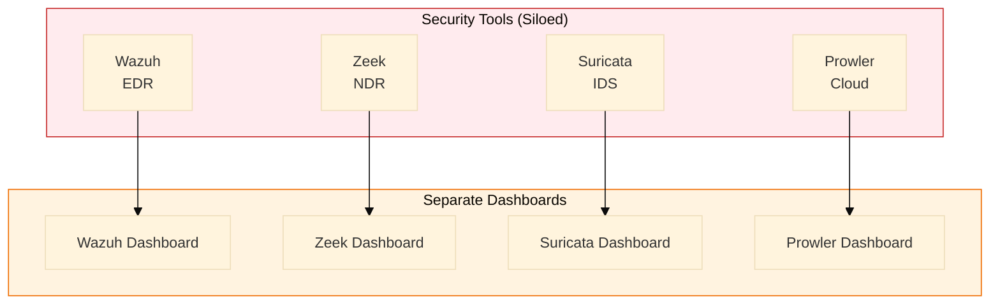
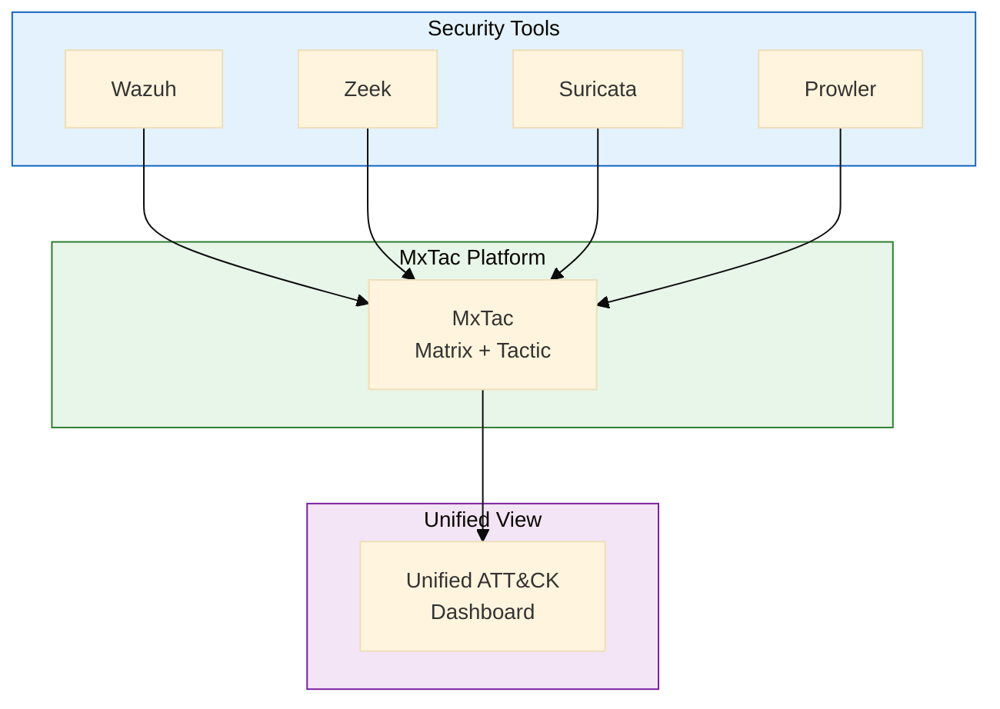

# MxTac

> **Matrix + Tactic = MxTac**  
> An open-source, ATT&CK-native security platform that integrates best-of-breed OSS tools to provide unified threat detection and response capabilities.

## Project Documents

| Document | Description |
|----------|-------------|
| [PRODUCT-SPECIFICATION.md](./PRODUCT-SPECIFICATION.md) | Complete product specification with features and requirements |
| [ARCHITECTURE.md](./ARCHITECTURE.md) | Technical architecture and component design |
| [INTEGRATION-GUIDE.md](./INTEGRATION-GUIDE.md) | Guide for integrating OSS security tools |
| [ROADMAP.md](./ROADMAP.md) | Development phases and milestones |

## Development Tools

| Component | Description |
|-----------|-------------|
| [agent-scheduler/](./agent-scheduler/README.md) | AI-driven task scheduler — runs Claude Code autonomously to implement MxTac features (FastAPI + Next.js + SQLite) |

## Quick Overview

### What is MxTac?

**MxTac** (Matrix + Tactic) is an **integration platform** that unifies existing open-source security tools under a single ATT&CK-native interface, providing:

- **Unified ATT&CK Coverage Dashboard** - See your detection coverage across all 14 tactics
- **Native Sigma Rule Engine** - Run Sigma rules without conversion
- **OCSF Data Normalization** - Consistent schema across all data sources
- **Cross-Tool Correlation** - Detect attack chains spanning multiple tools
- **Integrated Response** - Orchestrated playbooks across tools

### Why "MxTac"?

```
Mx   = Matrix (ATT&CK Matrix)
Tac  = Tactic (14 ATT&CK Tactics)
─────────────────────────────────
MxTac = Full ATT&CK Coverage
```

### Why Not Just Use Existing Tools?

**Current State (Fragmented):**



**Problems:** No unified ATT&CK view | No cross-tool correlation | Different data formats | Manual rule conversion

**Future State (Unified with MxTac):**



**Benefits:** Single ATT&CK coverage view | Cross-tool attack chain detection | OCSF normalized data | Native Sigma execution

### Core Principles

1. **Don't Reinvent** - Integrate existing mature OSS tools, don't rebuild them
2. **ATT&CK-Native** - Every feature maps to ATT&CK framework
3. **Open Standards** - Sigma for detection, OCSF for data, STIX for intel
4. **Community-Driven** - Open governance, community contributions
5. **Production-Ready** - Enterprise-grade reliability and scalability

## Integrated Components

| Category | Primary Tool | Backup Option | Coverage |
|----------|-------------|---------------|----------|
| **EDR/HIDS** | Wazuh | osquery + Velociraptor | Endpoint visibility |
| **NDR** | Zeek | Arkime | Network metadata |
| **IDS/IPS** | Suricata | Snort | Network signatures |
| **Cloud Security** | Prowler | ScoutSuite | AWS/Azure/GCP |
| **Threat Intel** | OpenCTI | MISP | IOC management |
| **SOAR** | Shuffle | n8n | Response automation |
| **Forensics** | Velociraptor | GRR | Deep investigation |

## Expected ATT&CK Coverage

| Integration Level | Coverage | Components |
|------------------|----------|------------|
| Phase 1 (MVP) | 50-60% | Wazuh + Zeek + Suricata |
| Phase 2 | 65-75% | + Prowler + OpenCTI |
| Phase 3 | 70-80% | + Correlation + Response |
| Full Platform | 75-85% | All integrations + tuning |

## Getting Started

*Coming Soon* - Platform is currently in specification phase.

### Planned Installation

```bash
# Clone repository
git clone https://github.com/mxtac/mxtac.git

# Run installer
cd mxtac
./install.sh

# Access dashboard
open https://localhost:8443
```

### CLI Preview

```bash
# Hunt for specific technique
$ mxtac hunt --technique T1059

# Check ATT&CK coverage
$ mxtac coverage --report

# Scan with Sigma rules
$ mxtac scan --sigma-rules ./rules

# Analyze attack chain
$ mxtac analyze --chain

# Real-time detection
$ mxtac detect --live
```

## Project Status

| Phase | Status | Timeline |
|-------|--------|----------|
| Specification | **In Progress** | Q1 2026 |
| Architecture Design | Planned | Q1 2026 |
| MVP Development | Planned | Q2-Q3 2026 |
| Beta Release | Planned | Q4 2026 |
| GA Release | Planned | Q1 2027 |

## Contributing

We welcome contributions! See [CONTRIBUTING.md](./CONTRIBUTING.md) for guidelines.

### Areas Needing Help

- Integration connectors for OSS tools
- Sigma rule development
- OCSF schema mapping
- Dashboard UI/UX
- Documentation

## License

Apache 2.0 (Planned)

---

## Technical Feasibility Analysis

> **Analyst**: Claude (Senior AI Research Scientist)
> **Date**: 2026-01-18
> **Analysis Type**: Technical Feasibility, Architecture Review, Coverage Validation
> **Documents Reviewed**: 11 core specifications (392 KB total)

### Key Findings

| Dimension | Assessment | Score | Rationale |
|-----------|------------|-------|-----------|
| **Technical Feasibility** | ✅ **Highly Feasible** | 9/10 | Leverages proven OSS stack, realistic scope |
| **Architecture Quality** | ✅ **Production-Ready** | 9/10 | Modern microservices, well-documented |
| **ATT&CK Coverage Claims** | ✅ **Realistic** | 8/10 | 75-85% achievable with full deployment |
| **Technology Stack** | ✅ **Solid** | 9/10 | Python/FastAPI, React/TS, OpenSearch |
| **Integration Strategy** | ✅ **Sound** | 8/10 | Clear connector model, OCSF normalization |
| **Documentation Quality** | ✅ **Excellent** | 10/10 | PhD-level specifications, production-ready |
| **Development Readiness** | ✅ **Ready for MVP** | 8/10 | Well-scoped P0 requirements |

### Summary Assessment

**MxTac is a well-designed, technically sound platform with realistic goals and production-grade specifications.** The project demonstrates:

- **Clear Problem Definition**: Addresses real gaps in OSS security tool integration
- **Realistic Scope**: Focused on integration rather than reinvention
- **Proven Technologies**: Leverages mature OSS ecosystem
- **Strong Architecture**: Modern microservices with clear separation of concerns
- **Comprehensive Documentation**: Production-ready specifications across all domains

### Recommendations

**1. PROCEED TO MVP DEVELOPMENT** ✅

The technical foundation is solid. Recommended approach:
- Start with Sprint 0 (foundation setup)
- Focus on OCSF normalization + Sigma engine first
- Aim for 50-60% ATT&CK coverage in MVP
- Iterate based on user feedback

**2. Risk Mitigation**

| Risk | Probability | Impact | Mitigation |
|------|-------------|--------|------------|
| Sigma rule performance at scale | Medium | High | Implement Bloom filters, rule indexing |
| OCSF schema evolution | Medium | Medium | Version schema parsers, automated testing |
| Integration connector maintenance | High | Medium | Modular design, comprehensive tests |
| Coverage accuracy claims | Medium | High | Validation framework, continuous testing |

**3. Success Metrics for MVP**

- **Coverage**: 50-60% of ATT&CK techniques detectable
- **Accuracy**: >90% true positive rate, <5% false positive rate
- **Performance**: <5 second latency for alert generation
- **Scalability**: 10,000 events/second throughput
- **Availability**: 99.9% uptime

### Technical Strengths

**1. Integration Architecture**
- Clean separation between connectors and core platform
- OCSF normalization provides vendor-agnostic data model
- Redis Streams for reliable, scalable event pipeline

**2. Sigma Engine Design**
- Native Python implementation via pySigma
- Rule compilation at load time (not runtime)
- Bloom filter pre-checks for performance

**3. ATT&CK Integration**
- Every alert mapped to specific technique(s)
- Coverage calculator provides real-time visibility
- MITRE Navigator integration for visualization

**4. Developer Experience**
- Comprehensive API documentation (OpenAPI/Swagger)
- Docker Compose for local development
- Clear testing strategy with example code

### Areas for Improvement

**1. Scalability Testing**
- Need load testing scenarios for 100K+ events/second
- OpenSearch cluster sizing calculator
- Horizontal scaling validation

**2. Security Hardening**
- Rate limiting thresholds need tuning
- JWT token rotation strategy
- mTLS for inter-service communication

**3. Operational Tooling**
- Automated backup/restore procedures
- Disaster recovery runbooks
- Performance monitoring dashboards

**4. Documentation Gaps**
- Installation guide for air-gapped environments
- Troubleshooting playbooks
- Migration guide from existing SIEM

### Conclusion

MxTac represents a **well-engineered, production-viable security platform** that fills a genuine gap in the open-source security ecosystem. The specifications demonstrate deep technical expertise and realistic understanding of the problem space.

**Recommendation: PROCEED with development. Begin with MVP focused on core integration and Sigma detection capabilities.**

---

*Feasibility analysis conducted: 2026-01-18*
*This is a conceptual project specification. Development has not yet begun.*

---

## API Versioning

MxTac uses URL path versioning for all API endpoints (e.g., `/api/v1/`). This
makes the active version explicit in every request and allows older clients to
continue working while a new version is developed in parallel. When a new major
version is released, the previous version will be supported for a transition
period before being retired.
