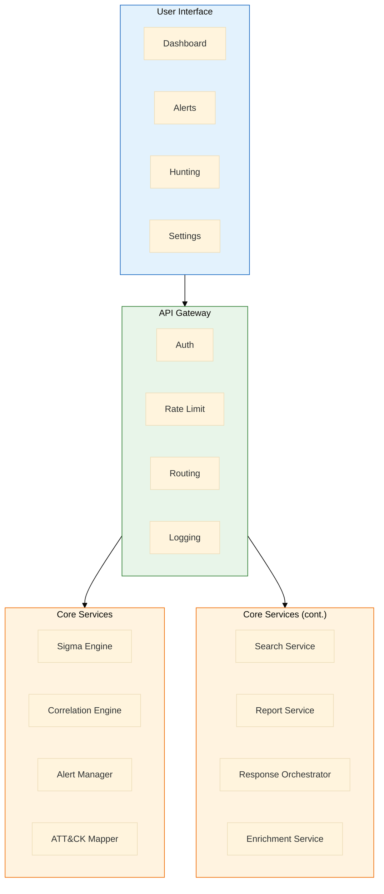
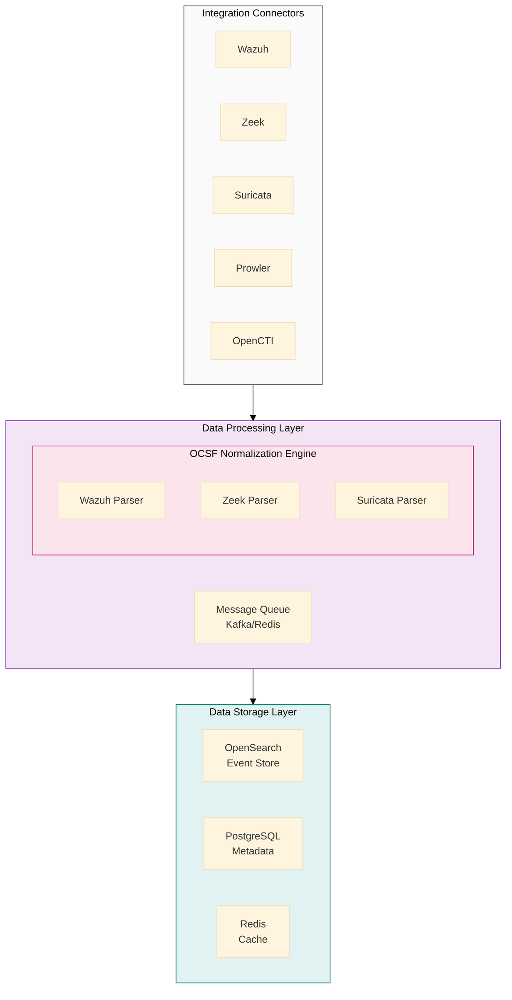
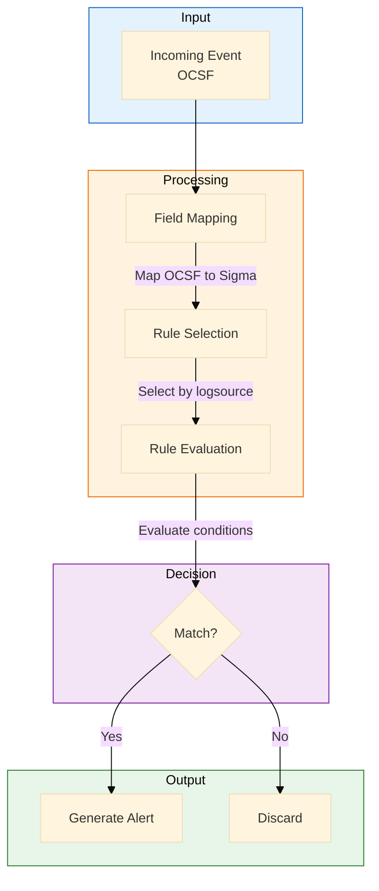
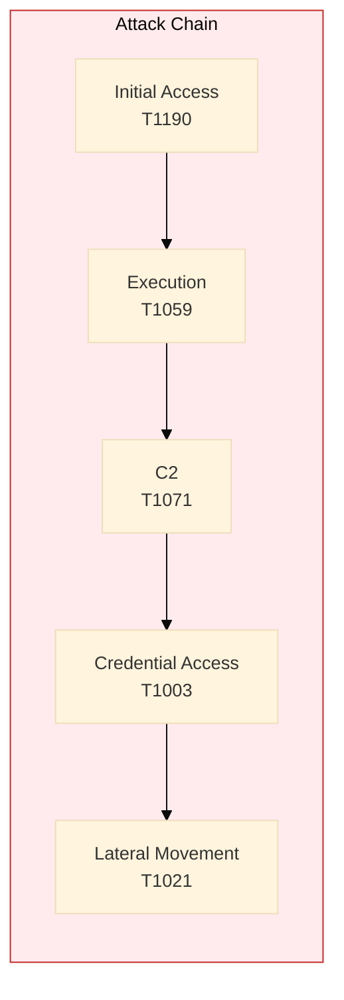
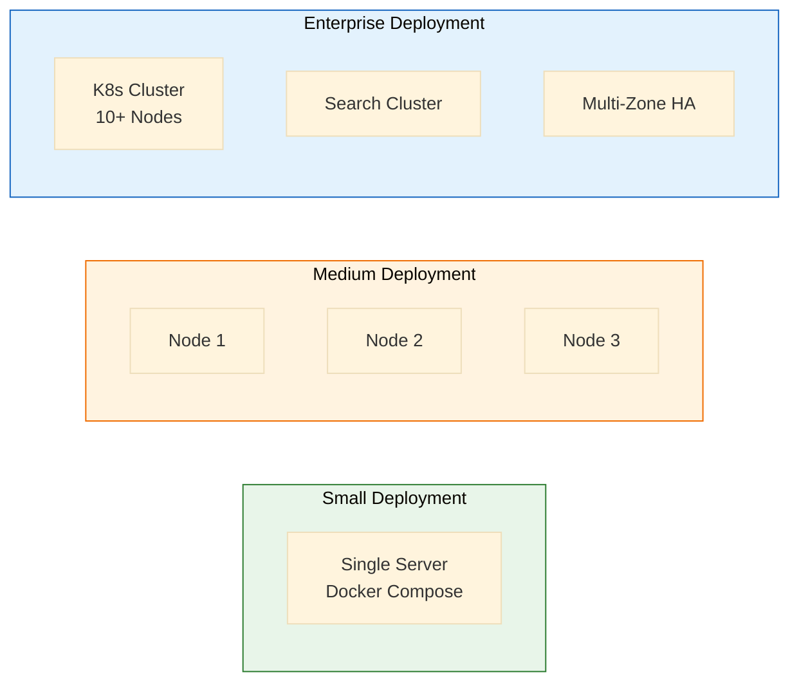

# MxTac - Product Specification

> **Document Type**: Product Specification  
> **Version**: 1.0  
> **Date**: January 2026  
> **Status**: Draft  
> **Project**: MxTac (Matrix + Tactic)

---

## Executive Summary

### Vision Statement

**MxTac** (Matrix + Tactic) is an open-source security integration platform that provides unified ATT&CK-based threat detection and response by orchestrating best-of-breed open-source security tools.

### Problem Statement

Organizations using open-source security tools face significant challenges:

| Problem | Impact |
|---------|--------|
| **Fragmented Visibility** | No unified view of security posture |
| **No ATT&CK Mapping** | Cannot measure detection coverage |
| **Data Silos** | Each tool has different data formats |
| **Manual Correlation** | Analysts must pivot between tools |
| **Rule Conversion** | Sigma rules require manual conversion |
| **Limited Response** | No unified response orchestration |

### Solution

MxTac addresses these problems by providing:

1. **Unified ATT&CK Dashboard** - Single view of coverage across all tools
2. **OCSF Data Layer** - Normalized schema for all data sources
3. **Native Sigma Engine** - Execute Sigma rules directly
4. **Cross-Tool Correlation** - Detect multi-stage attacks
5. **Integrated Response** - Orchestrated playbooks

### Target Users

| Persona | Use Case | Value Proposition |
|---------|----------|-------------------|
| **SOC Analyst** | Alert investigation | Single console, faster triage |
| **Detection Engineer** | Rule development | Sigma-native, instant deployment |
| **Threat Hunter** | Proactive hunting | Cross-tool queries, ATT&CK mapping |
| **Security Architect** | Coverage planning | Gap analysis, tool optimization |
| **CISO** | Risk reporting | ATT&CK coverage metrics |

---

## Product Requirements

### Functional Requirements

#### FR-1: ATT&CK Coverage Dashboard

| ID | Requirement | Priority |
|----|-------------|----------|
| FR-1.1 | Display ATT&CK Navigator heatmap showing detection coverage | P0 |
| FR-1.2 | Calculate coverage per tactic, technique, sub-technique | P0 |
| FR-1.3 | Show coverage by data source (EDR, NDR, Cloud, etc.) | P0 |
| FR-1.4 | Drill-down from technique to specific detection rules | P1 |
| FR-1.5 | Compare coverage over time (trend analysis) | P2 |
| FR-1.6 | Export coverage reports (PDF, JSON, Navigator layer) | P1 |
| FR-1.7 | Set coverage targets and alert on gaps | P2 |

#### FR-2: Data Normalization (OCSF)

| ID | Requirement | Priority |
|----|-------------|----------|
| FR-2.1 | Normalize Wazuh alerts to OCSF schema | P0 |
| FR-2.2 | Normalize Zeek logs to OCSF schema | P0 |
| FR-2.3 | Normalize Suricata EVE JSON to OCSF schema | P0 |
| FR-2.4 | Normalize Prowler findings to OCSF schema | P1 |
| FR-2.5 | Normalize osquery results to OCSF schema | P1 |
| FR-2.6 | Support custom field mappings | P1 |
| FR-2.7 | Validate incoming data against OCSF schema | P2 |
| FR-2.8 | Handle schema version upgrades | P2 |

#### FR-3: Sigma Rule Engine

| ID | Requirement | Priority |
|----|-------------|----------|
| FR-3.1 | Execute Sigma rules natively without conversion | P0 |
| FR-3.2 | Import rules from SigmaHQ repository | P0 |
| FR-3.3 | Support all Sigma modifiers (contains, startswith, etc.) | P0 |
| FR-3.4 | Support Sigma correlations and aggregations | P1 |
| FR-3.5 | Provide Sigma rule editor with syntax validation | P1 |
| FR-3.6 | Test rules against historical data | P1 |
| FR-3.7 | Track rule performance (hits, FP rate) | P2 |
| FR-3.8 | Auto-map rules to ATT&CK techniques | P1 |

#### FR-4: Integration Connectors

| ID | Requirement | Priority |
|----|-------------|----------|
| FR-4.1 | Wazuh integration (alerts, agent data) | P0 |
| FR-4.2 | Zeek integration (conn, dns, http, ssl, etc.) | P0 |
| FR-4.3 | Suricata integration (EVE JSON alerts) | P0 |
| FR-4.4 | Prowler integration (AWS/Azure/GCP findings) | P1 |
| FR-4.5 | OpenCTI integration (threat intel) | P1 |
| FR-4.6 | Velociraptor integration (forensics) | P2 |
| FR-4.7 | Shuffle integration (SOAR playbooks) | P2 |
| FR-4.8 | Generic webhook/syslog connector | P1 |

#### FR-5: Correlation Engine

| ID | Requirement | Priority |
|----|-------------|----------|
| FR-5.1 | Correlate events across data sources by entity | P0 |
| FR-5.2 | Support correlation by IP, hostname, user, hash | P0 |
| FR-5.3 | Define correlation rules (event A + event B = alert) | P1 |
| FR-5.4 | Detect ATT&CK attack chains (technique sequences) | P1 |
| FR-5.5 | Time-window based correlation | P1 |
| FR-5.6 | Statistical anomaly correlation | P2 |
| FR-5.7 | ML-based correlation suggestions | P3 |

#### FR-6: Alert Management

| ID | Requirement | Priority |
|----|-------------|----------|
| FR-6.1 | Unified alert queue from all sources | P0 |
| FR-6.2 | Alert enrichment with threat intel | P1 |
| FR-6.3 | Alert grouping and deduplication | P1 |
| FR-6.4 | Risk-based alert scoring | P1 |
| FR-6.5 | Alert assignment and workflow | P2 |
| FR-6.6 | SLA tracking and escalation | P2 |
| FR-6.7 | Alert suppression rules | P1 |

#### FR-7: Investigation & Hunting

| ID | Requirement | Priority |
|----|-------------|----------|
| FR-7.1 | Unified search across all normalized data | P0 |
| FR-7.2 | Entity timeline (all events for IP/host/user) | P1 |
| FR-7.3 | Pivot from any field to related events | P1 |
| FR-7.4 | Save and share hunt queries | P1 |
| FR-7.5 | ATT&CK-guided hunting suggestions | P2 |
| FR-7.6 | Notebook-style investigation (markdown + queries) | P2 |

#### FR-8: Response & Automation

| ID | Requirement | Priority |
|----|-------------|----------|
| FR-8.1 | Manual response actions (isolate, block, etc.) | P1 |
| FR-8.2 | Playbook templates for common responses | P1 |
| FR-8.3 | Automated response triggers based on rules | P2 |
| FR-8.4 | Integration with Shuffle for advanced playbooks | P2 |
| FR-8.5 | Response action audit logging | P1 |
| FR-8.6 | Approval workflows for high-impact actions | P2 |

#### FR-9: Reporting & Compliance

| ID | Requirement | Priority |
|----|-------------|----------|
| FR-9.1 | ATT&CK coverage reports | P1 |
| FR-9.2 | Alert volume and trend reports | P1 |
| FR-9.3 | MTTR/MTTD metrics | P2 |
| FR-9.4 | Analyst productivity reports | P2 |
| FR-9.5 | Scheduled report delivery | P2 |
| FR-9.6 | Custom report builder | P3 |

### Non-Functional Requirements

#### NFR-1: Performance

| ID | Requirement | Target |
|----|-------------|--------|
| NFR-1.1 | Event ingestion rate | 50,000 EPS minimum |
| NFR-1.2 | Search query response | < 5 seconds for 7-day range |
| NFR-1.3 | Dashboard load time | < 3 seconds |
| NFR-1.4 | Alert processing latency | < 30 seconds end-to-end |
| NFR-1.5 | Correlation processing | < 10 seconds |

#### NFR-2: Scalability

| ID | Requirement | Target |
|----|-------------|--------|
| NFR-2.1 | Horizontal scaling | Add nodes without downtime |
| NFR-2.2 | Data retention | Configurable, minimum 90 days |
| NFR-2.3 | Concurrent users | 100+ simultaneous analysts |
| NFR-2.4 | Endpoint scale | 10,000+ endpoints |
| NFR-2.5 | Rule count | 5,000+ active rules |

#### NFR-3: Availability

| ID | Requirement | Target |
|----|-------------|--------|
| NFR-3.1 | Uptime | 99.9% availability |
| NFR-3.2 | Failover | Automatic failover < 60 seconds |
| NFR-3.3 | Data durability | No data loss on node failure |
| NFR-3.4 | Backup/restore | Full restore < 4 hours |

#### NFR-4: Security

| ID | Requirement | Target |
|----|-------------|--------|
| NFR-4.1 | Authentication | SSO (SAML, OIDC), MFA |
| NFR-4.2 | Authorization | RBAC with granular permissions |
| NFR-4.3 | Encryption at rest | AES-256 |
| NFR-4.4 | Encryption in transit | TLS 1.3 |
| NFR-4.5 | Audit logging | All administrative actions |
| NFR-4.6 | Secret management | Integration with Vault/KMS |

#### NFR-5: Usability

| ID | Requirement | Target |
|----|-------------|--------|
| NFR-5.1 | Initial setup | < 1 hour for basic deployment |
| NFR-5.2 | Learning curve | Productive within 1 day |
| NFR-5.3 | Documentation | Complete user and admin guides |
| NFR-5.4 | Accessibility | WCAG 2.1 AA compliance |

---

## Technical Architecture Overview

### High-Level Architecture





### Technology Stack

| Layer | Technology | Rationale |
|-------|------------|-----------|
| **Frontend** | React + TypeScript | Modern, maintainable, large ecosystem |
| **API** | FastAPI (Python) | Async, fast, OpenAPI support |
| **Message Queue** | Apache Kafka | High throughput, durability |
| **Event Storage** | OpenSearch | Scalable search, log analytics |
| **Metadata DB** | PostgreSQL | Reliable, feature-rich RDBMS |
| **Cache** | Redis | Fast caching, pub/sub |
| **Containers** | Docker + Kubernetes | Scalable deployment |

---

## Integration Specifications

### Wazuh Integration

```yaml
connector: wazuh
type: pull + push
data_sources:
  - alerts (Wazuh alerts API)
  - agent_info (agent inventory)
  - fim (file integrity monitoring)
  - sca (security configuration assessment)
  - syscollector (system inventory)
  
authentication:
  method: api_key
  location: wazuh_manager
  
data_format:
  input: wazuh_json
  output: ocsf_security_finding
  
attck_mapping:
  source: wazuh_rule_mitre field
  coverage: ~200 techniques

response_actions:
  - agent_restart
  - active_response (block IP, kill process)
  - agent_upgrade
```

### Zeek Integration

```yaml
connector: zeek
type: file/kafka
data_sources:
  - conn.log (connections)
  - dns.log (DNS queries)
  - http.log (HTTP requests)
  - ssl.log (TLS connections)
  - files.log (file transfers)
  - notice.log (Zeek notices)
  - x509.log (certificates)
  
data_format:
  input: zeek_json
  output: ocsf_network_activity
  
attck_mapping:
  source: derived from traffic patterns
  coverage: ~50 techniques (C2, Exfil, Discovery)
  
correlation_keys:
  - uid (unique connection ID)
  - src_ip, dst_ip
  - community_id
```

### Suricata Integration

```yaml
connector: suricata
type: file/kafka
data_sources:
  - eve.json (unified event format)
    - alert (IDS alerts)
    - flow (network flows)
    - dns (DNS events)
    - http (HTTP events)
    - tls (TLS events)
    - fileinfo (file events)
    
data_format:
  input: suricata_eve_json
  output: ocsf_detection_finding
  
attck_mapping:
  source: suricata rule metadata
  coverage: ~100 techniques (signatures)
  
response_actions:
  - drop (via IPS mode)
  - reject
```

### Prowler Integration

```yaml
connector: prowler
type: scheduled_pull
data_sources:
  - aws_findings
  - azure_findings
  - gcp_findings
  - kubernetes_findings
  
data_format:
  input: prowler_json
  output: ocsf_compliance_finding
  
attck_mapping:
  source: prowler check metadata
  coverage: ~80 cloud techniques
  
scheduling:
  frequency: daily
  scope: configurable accounts/subscriptions
```

### OpenCTI Integration

```yaml
connector: opencti
type: bidirectional
data_sources:
  - indicators (IOCs)
  - observables
  - threat_actors
  - malware
  - attack_patterns (ATT&CK)
  - reports
  
data_format:
  input: stix_2.1
  output: ocsf_enrichment
  
use_cases:
  - alert enrichment
  - IOC matching
  - threat context
  - ATT&CK mapping validation
```

---

## OCSF Schema Mapping

### Event Categories

| OCSF Category | Source Tools | Use Case |
|---------------|--------------|----------|
| `Security Finding` | Wazuh, Suricata, Prowler | Detection alerts |
| `Network Activity` | Zeek, Suricata | Network telemetry |
| `System Activity` | Wazuh (syscollector) | Endpoint telemetry |
| `Identity & Access` | Wazuh (auth logs) | Authentication events |
| `Application Activity` | Wazuh (application logs) | App-specific events |
| `Discovery` | osquery, Velociraptor | Asset inventory |

### Field Mapping Example (Wazuh → OCSF)

```json
{
  "wazuh_alert": {
    "rule.id": "550",
    "rule.description": "User login failed",
    "rule.mitre.id": ["T1078"],
    "agent.name": "web-server-01",
    "data.srcip": "192.168.1.100",
    "data.dstuser": "admin",
    "timestamp": "2026-01-11T10:30:00Z"
  },
  
  "ocsf_security_finding": {
    "class_uid": 2001,
    "class_name": "Security Finding",
    "category_uid": 2,
    "category_name": "Findings",
    "severity_id": 3,
    "severity": "Medium",
    "activity_id": 1,
    "activity_name": "Create",
    "finding_info": {
      "uid": "wazuh-550-1704969000",
      "title": "User login failed",
      "analytic": {
        "uid": "550",
        "name": "User login failed",
        "type": "Rule"
      },
      "attacks": [{
        "technique": {
          "uid": "T1078",
          "name": "Valid Accounts"
        },
        "tactic": {
          "uid": "TA0001",
          "name": "Initial Access"
        }
      }]
    },
    "src_endpoint": {
      "ip": "192.168.1.100"
    },
    "dst_endpoint": {
      "hostname": "web-server-01"
    },
    "user": {
      "name": "admin"
    },
    "time": 1704969000000
  }
}
```

---

## Sigma Rule Engine Specification

### Engine Requirements

| Requirement | Specification |
|-------------|---------------|
| **Sigma Version** | 2.0 (pySigma compatible) |
| **Supported Backends** | OCSF-native (no conversion needed) |
| **Rule Format** | YAML (standard Sigma) |
| **Modifiers Supported** | All standard (contains, startswith, endswith, base64, re, etc.) |
| **Correlations** | Sigma correlations (count, temporal) |
| **Performance** | 10,000+ rules, < 100ms evaluation per event |

### Execution Flow



### Example: Sigma to OCSF Mapping

```yaml
# Sigma Rule (input)
title: Mimikatz Detection
logsource:
    category: process_creation
    product: windows
detection:
    selection:
        CommandLine|contains:
            - 'sekurlsa'
            - 'lsadump'
    condition: selection
tags:
    - attack.credential_access
    - attack.t1003
```

```yaml
# OCSF Logsource Mapping
logsource_mappings:
  process_creation:
    windows:
      ocsf_class: "Process Activity"
      ocsf_class_uid: 1007
      field_mappings:
        CommandLine: process.cmd_line
        Image: process.file.path
        User: actor.user.name
        ParentImage: parent_process.file.path
```

---

## User Interface Specifications

### Dashboard Views

#### 1. ATT&CK Coverage Dashboard

**Layout:** Header with export/edit buttons, main content area with coverage metrics

**Components:**
- Overall coverage progress bar (72%)
- ATT&CK Navigator heatmap (14 tactics)
- Coverage by data source breakdown
- Top coverage gaps list

| Tactic | Coverage |
|--------|----------|
| Reconnaissance | 20% |
| Resource Dev | 10% |
| Initial Access | 85% |
| Execution | 90% |
| Persistence | 80% |
| Privilege Esc | 75% |
| Defense Evasion | 65% |
| Credential Access | 70% |
| Discovery | 80% |
| Lateral Movement | 75% |
| Collection | 60% |
| C2 | 70% |

**Coverage by Source:** Wazuh (45%) | Zeek (15%) | Prowler (12%)

#### 2. Unified Alert Queue

**Layout:** Filter bar, data table with pagination

| Severity | Time | Title | Source | ATT&CK | Status |
|----------|------|-------|--------|--------|--------|
| CRITICAL | 10:30:22 | Mimikatz detected | Wazuh | T1003 | New |
| HIGH | 10:28:15 | C2 beacon detected | Zeek | T1071 | New |
| HIGH | 10:25:00 | Lateral movement | Wazuh | T1021 | Assigned |
| MEDIUM | 10:20:33 | Port scan detected | Suricata | T1046 | Closed |
| MEDIUM | 10:15:00 | S3 bucket public | Prowler | T1530 | New |

**Pagination:** Page 1 of 24 | Total: 472 alerts

#### 3. Investigation Timeline

**Entity:** 192.168.1.50 (web-server-01) | **Time Range:** 2026-01-11 09:00 - 11:00

| Time | Source | Event | Technique |
|------|--------|-------|-----------|
| 09:15 | Suricata | Exploit attempt - CVE-2024-XXXX | T1190 |
| 09:16 | Wazuh | New process: /tmp/shell.sh | T1059.004 |
| 09:17 | Zeek | Outbound to 45.33.x.x:443 (C2) | T1071.001 |
| 09:20 | Wazuh | Credential dump attempt | T1003 |
| 09:25 | Zeek | DNS query: evil-domain.com (DGA) | T1568.002 |
| 09:30 | Wazuh | Lateral movement via SSH | T1021.002 |

**ATT&CK Chain Detected:**



---

## Deployment Models

| Model | Infrastructure | Scale | Endpoints | Resources |
|-------|---------------|-------|-----------|-----------|
| **Small (All-in-One)** | Docker Compose | 5,000 EPS | 500 | 16 CPU, 64GB RAM, 1TB SSD |
| **Medium (Distributed)** | Kubernetes (3+ nodes) | 25,000 EPS | 5,000 | 3x (8 CPU, 32GB RAM, 500GB SSD) |
| **Large (Enterprise)** | Kubernetes (10+ nodes) | 100,000+ EPS | 50,000+ | Custom sizing |



---

## Roadmap

### Phase 1: Foundation (Q2 2026)

| Milestone | Deliverables |
|-----------|--------------|
| M1.1 | Core platform architecture |
| M1.2 | OCSF normalization engine |
| M1.3 | Wazuh integration |
| M1.4 | Basic Sigma engine |
| M1.5 | Simple dashboard UI |

### Phase 2: Detection (Q3 2026)

| Milestone | Deliverables |
|-----------|--------------|
| M2.1 | Zeek integration |
| M2.2 | Suricata integration |
| M2.3 | Full Sigma engine |
| M2.4 | ATT&CK coverage dashboard |
| M2.5 | Alert management |

### Phase 3: Expansion (Q4 2026)

| Milestone | Deliverables |
|-----------|--------------|
| M3.1 | Prowler integration |
| M3.2 | OpenCTI integration |
| M3.3 | Correlation engine |
| M3.4 | Investigation UI |
| M3.5 | Beta release |

### Phase 4: Production (Q1 2027)

| Milestone | Deliverables |
|-----------|--------------|
| M4.1 | Response orchestration |
| M4.2 | Enterprise features (RBAC, SSO) |
| M4.3 | Performance optimization |
| M4.4 | Documentation complete |
| M4.5 | GA release |

---

## Success Metrics

| Metric | Target | Measurement |
|--------|--------|-------------|
| ATT&CK Coverage | > 75% | Navigator calculation |
| Deployment Time | < 4 hours | Time to first dashboard |
| Alert Latency | < 60 seconds | End-to-end measurement |
| Community Stars | > 5,000 | GitHub stars in Year 1 |
| Deployments | > 1,000 | Telemetry (opt-in) |
| Contributors | > 100 | GitHub contributors |

---

## Appendix

### A. Competitive Analysis

| Feature | OAP | Wazuh Alone | Elastic SIEM | Commercial XDR |
|---------|-----|-------------|--------------|----------------|
| ATT&CK Dashboard | Native | Limited | Plugin | Native |
| Sigma Native | Yes | Conversion | Conversion | No |
| OCSF Schema | Yes | No | Partial | Vendor-specific |
| NDR Integration | Yes | No | Separate | Native |
| Cloud Security | Yes | No | Separate | Native |
| Cost | Free | Free | Freemium | $$$$ |

### B. Risk Assessment

| Risk | Probability | Impact | Mitigation |
|------|-------------|--------|------------|
| Scope creep | High | High | Strict MVP definition |
| Community adoption | Medium | High | Marketing, documentation |
| Maintainer burnout | Medium | High | Foundation governance |
| Commercial fork | Medium | Medium | Strong community, license |
| Tool compatibility | Medium | Medium | Version pinning, testing |

### C. License Recommendation

**Apache 2.0** - Permissive, enterprise-friendly, allows commercial use while requiring attribution.

---

*Document maintained by MxTac Project*
