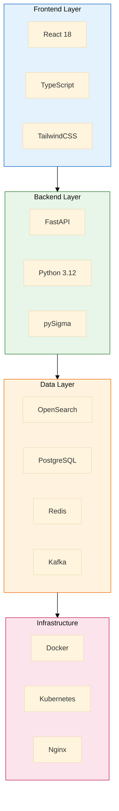

# MxTac - Technology Stack

> **Version**: 1.0  
> **Last Updated**: 2026-01-12  
> **Status**: Draft

---

## Table of Contents

1. [Overview](#overview)
2. [Core Technologies](#core-technologies)
3. [Backend Stack](#backend-stack)
4. [Frontend Stack](#frontend-stack)
5. [Data Layer](#data-layer)
6. [Infrastructure](#infrastructure)
7. [Security Tools Integration](#security-tools-integration)
8. [Development Tools](#development-tools)
9. [Version Matrix](#version-matrix)

---

## Overview

### Technology Selection Principles

| Principle | Description |
|-----------|-------------|
| **Open Source First** | Prefer OSS with active communities |
| **Production Proven** | Choose battle-tested technologies |
| **Scalability** | Horizontal scaling capability |
| **Developer Experience** | Modern tooling, good documentation |
| **Security** | Security-focused design and updates |

### Architecture Summary



---

## Core Technologies

### Language & Runtime

| Component | Technology | Version | Rationale |
|-----------|------------|---------|-----------|
| Backend Language | **Python** | 3.12+ | pySigma ecosystem, fast development |
| Frontend Language | **TypeScript** | 5.x | Type safety, better DX |
| Runtime | **Node.js** | 20 LTS | Frontend build tooling |

### Why Python for Backend?

| Factor | Benefit |
|--------|---------|
| **pySigma** | Native Sigma rule processing library |
| **Security Libraries** | Rich ecosystem (STIX, OCSF, etc.) |
| **FastAPI** | Modern async framework with OpenAPI |
| **Data Processing** | Excellent pandas, numpy support |
| **Community** | Large security-focused community |
| **Rapid Development** | Quick iteration for OSS project |

### Why TypeScript for Frontend?

| Factor | Benefit |
|--------|---------|
| **Type Safety** | Catch errors at compile time |
| **IDE Support** | Excellent autocomplete, refactoring |
| **React Ecosystem** | First-class TS support |
| **Documentation** | Types serve as documentation |
| **Maintainability** | Easier for OSS contributors |

---

## Backend Stack

### Web Framework

| Technology | Version | Purpose |
|------------|---------|---------|
| **FastAPI** | 0.109+ | REST API framework |
| **Uvicorn** | 0.27+ | ASGI server |
| **Starlette** | 0.35+ | ASGI toolkit (FastAPI dependency) |

**FastAPI Features Used:**
- Async/await for high concurrency
- Automatic OpenAPI documentation
- Pydantic for data validation
- Dependency injection
- Background tasks

### Core Libraries

| Library | Version | Purpose |
|---------|---------|---------|
| **pySigma** | 0.10+ | Sigma rule processing |
| **pydantic** | 2.5+ | Data validation |
| **SQLAlchemy** | 2.0+ | Database ORM |
| **asyncpg** | 0.29+ | Async PostgreSQL driver |
| **redis-py** | 5.0+ | Redis client |
| **aiokafka** | 0.10+ | Async Kafka client |
| **opensearch-py** | 2.4+ | OpenSearch client |
| **httpx** | 0.26+ | Async HTTP client |
| **celery** | 5.3+ | Task queue (optional) |

### Security Libraries

| Library | Version | Purpose |
|---------|---------|---------|
| **python-jose** | 3.3+ | JWT handling |
| **passlib** | 1.7+ | Password hashing |
| **python-multipart** | 0.0.6+ | Form data parsing |
| **stix2** | 3.0+ | STIX 2.1 support |
| **taxii2-client** | 2.3+ | TAXII client |

### API Structure

```
backend/
├── app/
│   ├── __init__.py
│   ├── main.py                 # FastAPI application
│   ├── config.py               # Configuration
│   ├── dependencies.py         # Dependency injection
│   │
│   ├── api/                    # API routes
│   │   ├── v1/
│   │   │   ├── alerts.py
│   │   │   ├── events.py
│   │   │   ├── rules.py
│   │   │   ├── coverage.py
│   │   │   ├── connectors.py
│   │   │   └── response.py
│   │   └── router.py
│   │
│   ├── core/                   # Core business logic
│   │   ├── sigma_engine/
│   │   ├── correlation_engine/
│   │   ├── ocsf_normalizer/
│   │   └── attck_mapper/
│   │
│   ├── connectors/             # Integration connectors
│   │   ├── wazuh/
│   │   ├── zeek/
│   │   ├── suricata/
│   │   └── prowler/
│   │
│   ├── models/                 # Database models
│   │   ├── user.py
│   │   ├── rule.py
│   │   └── alert.py
│   │
│   ├── schemas/                # Pydantic schemas
│   │   ├── alert.py
│   │   ├── event.py
│   │   └── ocsf.py
│   │
│   └── services/               # Business services
│       ├── alert_service.py
│       ├── search_service.py
│       └── enrichment_service.py
│
├── tests/
├── alembic/                    # Database migrations
├── requirements.txt
├── pyproject.toml
└── Dockerfile
```

---

## Frontend Stack

### Core Framework

| Technology | Version | Purpose |
|------------|---------|---------|
| **React** | 18.x | UI framework |
| **TypeScript** | 5.x | Type-safe JavaScript |
| **Vite** | 5.x | Build tool |

### UI Components

| Library | Version | Purpose |
|---------|---------|---------|
| **TailwindCSS** | 3.4+ | Utility-first CSS |
| **Headless UI** | 2.x | Unstyled accessible components |
| **Radix UI** | 1.x | Low-level UI primitives |
| **Lucide React** | 0.300+ | Icon library |

### State Management

| Library | Version | Purpose |
|---------|---------|---------|
| **Zustand** | 4.x | Global state management |
| **TanStack Query** | 5.x | Server state management |
| **React Hook Form** | 7.x | Form handling |
| **Zod** | 3.x | Schema validation |

### Data Visualization

| Library | Version | Purpose |
|---------|---------|---------|
| **Recharts** | 2.x | Charts and graphs |
| **React Flow** | 11.x | Node-based diagrams |
| **D3.js** | 7.x | Custom visualizations |
| **ATT&CK Navigator** | Custom | Technique heatmap |

### Utilities

| Library | Version | Purpose |
|---------|---------|---------|
| **date-fns** | 3.x | Date manipulation |
| **axios** | 1.x | HTTP client |
| **lodash-es** | 4.x | Utility functions |
| **clsx** | 2.x | Class name utility |

### Frontend Structure

```
frontend/
├── src/
│   ├── main.tsx                # Entry point
│   ├── App.tsx                 # Root component
│   ├── vite-env.d.ts
│   │
│   ├── components/             # Reusable components
│   │   ├── ui/                 # Base UI components
│   │   │   ├── Button.tsx
│   │   │   ├── Card.tsx
│   │   │   ├── Table.tsx
│   │   │   └── Modal.tsx
│   │   ├── layout/             # Layout components
│   │   │   ├── Sidebar.tsx
│   │   │   ├── Header.tsx
│   │   │   └── Layout.tsx
│   │   └── features/           # Feature components
│   │       ├── alerts/
│   │       ├── dashboard/
│   │       └── hunting/
│   │
│   ├── pages/                  # Page components
│   │   ├── Dashboard.tsx
│   │   ├── Alerts.tsx
│   │   ├── Hunting.tsx
│   │   ├── Rules.tsx
│   │   └── Settings.tsx
│   │
│   ├── hooks/                  # Custom hooks
│   │   ├── useAlerts.ts
│   │   ├── useSearch.ts
│   │   └── useAuth.ts
│   │
│   ├── services/               # API services
│   │   ├── api.ts
│   │   ├── alertService.ts
│   │   └── eventService.ts
│   │
│   ├── stores/                 # Zustand stores
│   │   ├── authStore.ts
│   │   ├── alertStore.ts
│   │   └── settingsStore.ts
│   │
│   ├── types/                  # TypeScript types
│   │   ├── alert.ts
│   │   ├── event.ts
│   │   └── ocsf.ts
│   │
│   ├── utils/                  # Utility functions
│   │   ├── formatters.ts
│   │   ├── validators.ts
│   │   └── constants.ts
│   │
│   └── styles/                 # Global styles
│       └── globals.css
│
├── public/
├── index.html
├── tailwind.config.js
├── vite.config.ts
├── tsconfig.json
├── package.json
└── Dockerfile
```

---

## Data Layer

### Primary Data Stores

| Store | Technology | Version | Purpose |
|-------|------------|---------|---------|
| **Event Store** | OpenSearch | 2.x | Log/event storage & search |
| **Metadata DB** | PostgreSQL | 16.x | Relational data (users, rules, config) |
| **Cache** | Redis | 7.x | Caching, sessions, pub/sub |
| **Message Queue** | Apache Kafka | 3.6+ | Event streaming |

### OpenSearch Configuration

```yaml
# Index templates for OCSF events
index_templates:
  - name: mxtac-events
    index_patterns: ["mxtac-events-*"]
    settings:
      number_of_shards: 3
      number_of_replicas: 1
      refresh_interval: "5s"
    mappings:
      properties:
        time:
          type: date
        class_uid:
          type: integer
        category_uid:
          type: integer
        severity_id:
          type: integer
        src_endpoint:
          type: object
          properties:
            ip:
              type: ip
            hostname:
              type: keyword
        dst_endpoint:
          type: object
          properties:
            ip:
              type: ip
            hostname:
              type: keyword
```

### PostgreSQL Schema

```sql
-- Core tables
CREATE TABLE users (
    id UUID PRIMARY KEY DEFAULT gen_random_uuid(),
    email VARCHAR(255) UNIQUE NOT NULL,
    password_hash VARCHAR(255),
    role_id UUID REFERENCES roles(id),
    created_at TIMESTAMP DEFAULT NOW(),
    updated_at TIMESTAMP DEFAULT NOW()
);

CREATE TABLE rules (
    id UUID PRIMARY KEY DEFAULT gen_random_uuid(),
    name VARCHAR(255) NOT NULL,
    type VARCHAR(50) NOT NULL, -- sigma, correlation
    content TEXT NOT NULL,
    enabled BOOLEAN DEFAULT true,
    attck_techniques TEXT[], -- Array of technique IDs
    created_by UUID REFERENCES users(id),
    created_at TIMESTAMP DEFAULT NOW()
);

CREATE TABLE connectors (
    id UUID PRIMARY KEY DEFAULT gen_random_uuid(),
    name VARCHAR(255) NOT NULL,
    type VARCHAR(50) NOT NULL, -- wazuh, zeek, etc.
    config JSONB NOT NULL,
    status VARCHAR(20) DEFAULT 'inactive',
    last_sync TIMESTAMP
);
```

### Kafka Topics

| Topic | Purpose | Partitions | Retention |
|-------|---------|------------|-----------|
| `mxtac.raw.wazuh` | Raw Wazuh events | 6 | 24h |
| `mxtac.raw.zeek` | Raw Zeek logs | 6 | 24h |
| `mxtac.raw.suricata` | Raw Suricata EVE | 6 | 24h |
| `mxtac.normalized` | OCSF events | 12 | 72h |
| `mxtac.alerts` | Detection alerts | 6 | 7d |
| `mxtac.enriched` | Enriched alerts | 6 | 7d |

### Redis Usage

| Use Case | Data Structure | TTL |
|----------|----------------|-----|
| Session cache | Hash | 8h |
| API rate limiting | Sorted Set | 1m |
| Rule cache | String | 1h |
| Entity correlation | Sorted Set | 24h |
| Real-time metrics | Stream | 1h |

---

## Infrastructure

### Containerization

| Technology | Version | Purpose |
|------------|---------|---------|
| **Docker** | 24.x | Container runtime |
| **Docker Compose** | 2.x | Local development |
| **Podman** | 4.x | Alternative runtime (optional) |

### Orchestration

| Technology | Version | Purpose |
|------------|---------|---------|
| **Kubernetes** | 1.29+ | Production orchestration |
| **Helm** | 3.x | K8s package management |
| **ArgoCD** | 2.x | GitOps deployment (optional) |

### Load Balancing & Proxy

| Technology | Version | Purpose |
|------------|---------|---------|
| **Nginx** | 1.25+ | Reverse proxy, static files |
| **Traefik** | 3.x | K8s ingress (alternative) |

### Monitoring & Observability

| Technology | Version | Purpose |
|------------|---------|---------|
| **Prometheus** | 2.x | Metrics collection |
| **Grafana** | 10.x | Metrics visualization |
| **Loki** | 2.x | Log aggregation |
| **Jaeger** | 1.x | Distributed tracing |

### CI/CD

| Technology | Purpose |
|------------|---------|
| **GitHub Actions** | CI/CD pipelines |
| **GitLab CI** | Alternative CI/CD |
| **Trivy** | Container scanning |
| **SonarQube** | Code quality (optional) |

---

## Security Tools Integration

### Primary Integrations

| Tool | Version | Protocol | Data Format |
|------|---------|----------|-------------|
| **Wazuh** | 4.7+ | REST API, Filebeat | Wazuh JSON |
| **Zeek** | 6.x | File, Kafka | Zeek JSON |
| **Suricata** | 7.x | File, Kafka | EVE JSON |
| **Prowler** | 4.x | REST API | Prowler JSON |
| **OpenCTI** | 6.x | GraphQL, TAXII | STIX 2.1 |

### Extended Integrations

| Tool | Version | Protocol | Data Format |
|------|---------|----------|-------------|
| **Velociraptor** | 0.7+ | gRPC, WebSocket | VQL JSON |
| **MISP** | 2.4+ | REST API | MISP JSON |
| **Shuffle** | 1.x | REST API | Shuffle JSON |
| **osquery** | 5.x | TLS API | osquery JSON |

### Integration Libraries

| Library | Purpose |
|---------|---------|
| **wazuh-api-client** | Wazuh API wrapper |
| **pymisp** | MISP integration |
| **stix2** | STIX object handling |
| **taxii2-client** | TAXII feed consumption |

---

## Development Tools

### Code Quality

| Tool | Purpose |
|------|---------|
| **Ruff** | Python linter (fast) |
| **Black** | Python formatter |
| **mypy** | Python type checking |
| **ESLint** | TypeScript linter |
| **Prettier** | TypeScript/CSS formatter |

### Testing

| Tool | Purpose |
|------|---------|
| **pytest** | Python testing |
| **pytest-asyncio** | Async test support |
| **pytest-cov** | Coverage reporting |
| **Vitest** | Frontend testing |
| **Playwright** | E2E testing |

### Documentation

| Tool | Purpose |
|------|---------|
| **MkDocs** | Documentation site |
| **Material for MkDocs** | Documentation theme |
| **Swagger UI** | API documentation |
| **Storybook** | Component documentation |

### Development Environment

| Tool | Purpose |
|------|---------|
| **VS Code** | Recommended IDE |
| **DevContainers** | Consistent dev environment |
| **pre-commit** | Git hooks |

---

## Version Matrix

### Production Versions (Recommended)

| Component | Minimum | Recommended | Notes |
|-----------|---------|-------------|-------|
| Python | 3.11 | 3.12 | LTS preferred |
| Node.js | 18 LTS | 20 LTS | Even versions only |
| PostgreSQL | 15 | 16 | Latest stable |
| OpenSearch | 2.11 | 2.12 | Latest 2.x |
| Redis | 7.0 | 7.2 | Latest 7.x |
| Kafka | 3.5 | 3.6 | Latest stable |
| Docker | 24.0 | 25.0 | Latest stable |
| Kubernetes | 1.28 | 1.29 | N-2 support |

### Development Versions

| Tool | Version |
|------|---------|
| Ruff | 0.1.x |
| Black | 24.x |
| mypy | 1.8+ |
| pytest | 8.x |
| ESLint | 8.x |
| Prettier | 3.x |

---

## Appendix

### A. Alternative Technologies Considered

| Category | Selected | Alternatives | Reason for Selection |
|----------|----------|--------------|---------------------|
| Backend | FastAPI | Django, Flask | Async, OpenAPI native |
| Frontend | React | Vue, Svelte | Larger ecosystem |
| Event Store | OpenSearch | Elasticsearch | Truly open source |
| Message Queue | Kafka | RabbitMQ, Redis Streams | Durability, scale |
| Cache | Redis | Memcached | Pub/sub, data structures |

### B. Technology Roadmap

| Phase | New Technologies |
|-------|------------------|
| Phase 1 | Core stack (FastAPI, React, OpenSearch) |
| Phase 2 | Kafka, enhanced connectors |
| Phase 3 | ML libraries (scikit-learn, PyTorch) |
| Phase 4 | Advanced analytics, ClickHouse (optional) |

---

*Document maintained by MxTac Project*
