# MxTac - System Architecture

> **Version**: 1.0  
> **Last Updated**: 2026-01-12  
> **Status**: Draft

---

## Table of Contents

1. [Architecture Overview](#architecture-overview)
2. [Design Principles](#design-principles)
3. [System Components](#system-components)
4. [Data Flow](#data-flow)
5. [Core Services](#core-services)
6. [Integration Layer](#integration-layer)
7. [Deployment Architecture](#deployment-architecture)
8. [Security Architecture](#security-architecture)
9. [Scalability Patterns](#scalability-patterns)

---

## Architecture Overview

### High-Level Architecture

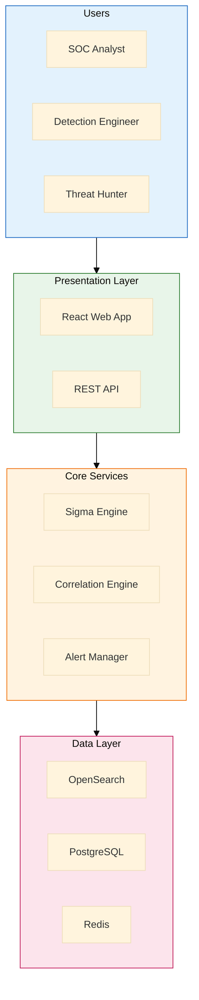

### System Context

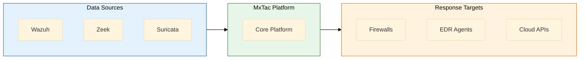

---

## Design Principles

### Core Principles

| Principle | Description | Implementation |
|-----------|-------------|----------------|
| **Integration over Invention** | Use existing OSS tools | Connectors, not replacements |
| **ATT&CK-Native** | Everything maps to ATT&CK | Technique tags on all detections |
| **Open Standards** | Use industry standards | OCSF, Sigma, STIX |
| **Microservices** | Loosely coupled services | Independent deployment |
| **Scalability First** | Horizontal scaling | Stateless services |
| **Security by Design** | Zero trust model | Encryption, RBAC |

### Architectural Patterns

| Pattern | Purpose | Usage |
|---------|---------|-------|
| **Event-Driven** | Decoupled processing | Kafka message passing |
| **CQRS** | Separate read/write | OpenSearch for reads, PostgreSQL for writes |
| **API Gateway** | Unified entry point | Authentication, routing, rate limiting |
| **Sidecar** | Cross-cutting concerns | Logging, monitoring |
| **Circuit Breaker** | Fault tolerance | External service calls |

---

## System Components

### Component Diagram

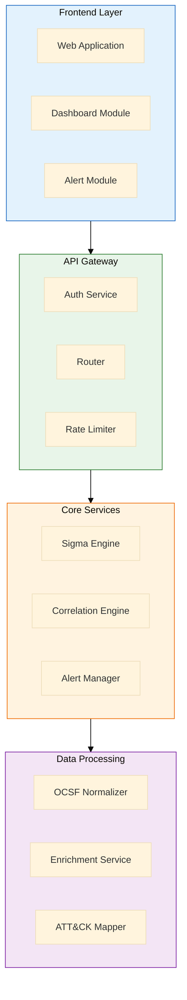

### Component Responsibilities

| Component | Responsibility | Key Functions |
|-----------|---------------|---------------|
| **Web Application** | User interface | Dashboard, alerts, hunting |
| **API Gateway** | Request handling | Auth, routing, rate limiting |
| **Sigma Engine** | Rule execution | Parse, match, alert |
| **Correlation Engine** | Attack chain detection | Entity linking, sequence detection |
| **Alert Manager** | Alert lifecycle | Dedup, enrich, workflow |
| **OCSF Normalizer** | Data normalization | Field mapping, validation |
| **Enrichment Service** | Context addition | Threat intel, GeoIP, asset |
| **ATT&CK Mapper** | Technique mapping | Coverage calculation |

---

## Data Flow

### Event Processing Pipeline

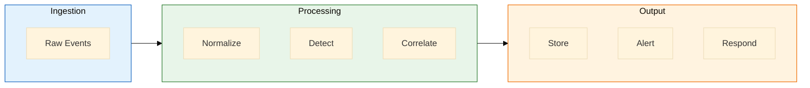

### Detailed Data Flow

```
┌─────────────────────────────────────────────────────────────────────────┐
│                         EVENT PROCESSING FLOW                           │
├─────────────────────────────────────────────────────────────────────────┤
│                                                                         │
│  1. INGESTION                                                          │
│     ┌─────────┐    ┌─────────┐    ┌─────────┐                         │
│     │  Wazuh  │    │  Zeek   │    │Suricata │                         │
│     └────┬────┘    └────┬────┘    └────┬────┘                         │
│          │              │              │                               │
│          └──────────────┼──────────────┘                               │
│                         ▼                                               │
│              ┌─────────────────────┐                                   │
│              │  Kafka (Raw Topics) │                                   │
│              │  mxtac.raw.*        │                                   │
│              └──────────┬──────────┘                                   │
│                         │                                               │
│  2. NORMALIZATION       │                                               │
│                         ▼                                               │
│              ┌─────────────────────┐                                   │
│              │   OCSF Normalizer   │                                   │
│              │  - Field mapping    │                                   │
│              │  - Type coercion    │                                   │
│              │  - Validation       │                                   │
│              └──────────┬──────────┘                                   │
│                         │                                               │
│                         ▼                                               │
│              ┌─────────────────────┐                                   │
│              │  Kafka (Normalized) │                                   │
│              │  mxtac.normalized   │                                   │
│              └──────────┬──────────┘                                   │
│                         │                                               │
│  3. DETECTION           │                                               │
│                         ▼                                               │
│              ┌─────────────────────┐                                   │
│              │    Sigma Engine     │                                   │
│              │  - Rule matching    │                                   │
│              │  - ATT&CK tagging   │                                   │
│              └──────────┬──────────┘                                   │
│                         │                                               │
│          ┌──────────────┼──────────────┐                               │
│          │              │              │                               │
│          ▼              ▼              ▼                               │
│     ┌─────────┐   ┌─────────────┐  ┌─────────┐                        │
│     │ OpenSearch│   │Correlation │  │  Kafka  │                        │
│     │ (Storage) │   │  Engine    │  │(Alerts) │                        │
│     └─────────┘   └──────┬──────┘  └────┬────┘                        │
│                          │              │                               │
│  4. ENRICHMENT           │              │                               │
│                          ▼              ▼                               │
│              ┌─────────────────────────────────┐                       │
│              │      Alert Manager              │                       │
│              │  - Deduplication                │                       │
│              │  - Enrichment (TI, GeoIP)       │                       │
│              │  - Scoring                      │                       │
│              └──────────────┬──────────────────┘                       │
│                             │                                           │
│  5. OUTPUT                  ▼                                           │
│              ┌─────────────────────────────────┐                       │
│              │  ┌─────────┐  ┌─────────────┐  │                       │
│              │  │   UI    │  │  Response   │  │                       │
│              │  │ (Alerts)│  │ Orchestrator│  │                       │
│              │  └─────────┘  └─────────────┘  │                       │
│              └─────────────────────────────────┘                       │
│                                                                         │
└─────────────────────────────────────────────────────────────────────────┘
```

### Message Flow

| Stage | Kafka Topic | Producer | Consumer |
|-------|-------------|----------|----------|
| Raw Ingestion | `mxtac.raw.{source}` | Connectors | Normalizer |
| Normalized | `mxtac.normalized` | Normalizer | Sigma Engine, Storage |
| Alerts | `mxtac.alerts` | Sigma Engine | Alert Manager |
| Enriched | `mxtac.enriched` | Alert Manager | UI, Response |
| Correlation | `mxtac.correlation` | Correlation Engine | Alert Manager |

---

## Core Services

### Sigma Engine Service

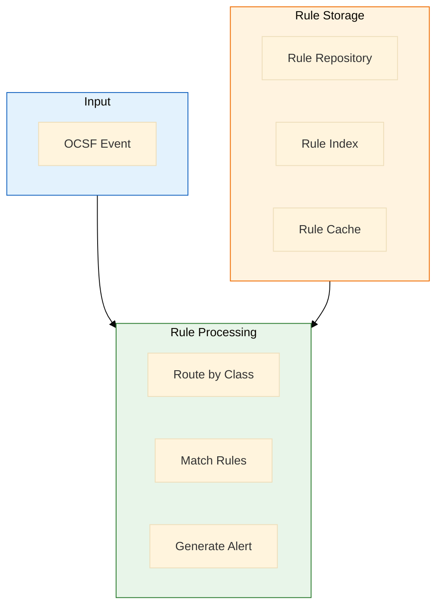

**Service Specification:**

```yaml
service: sigma-engine
replicas: 3-5 (auto-scaled)
resources:
  cpu: 2-4 cores
  memory: 4-8 GB
dependencies:
  - kafka
  - redis
  - postgresql
endpoints:
  internal:
    - grpc://sigma-engine:50051
  health:
    - http://sigma-engine:8080/health
```

### Correlation Engine Service

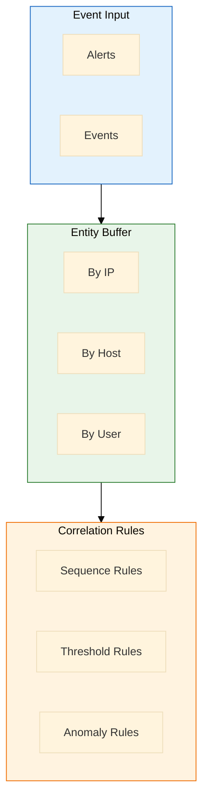

**Correlation Types:**

| Type | Description | Example |
|------|-------------|---------|
| **Sequence** | Events in order | A → B → C within 1 hour |
| **Threshold** | Count exceeds limit | 10+ failed logins in 5 min |
| **Aggregation** | Unique values | 50+ unique destinations |
| **Temporal** | Time-based patterns | Activity outside hours |
| **Statistical** | Deviation from baseline | 3x normal traffic |

### Alert Manager Service

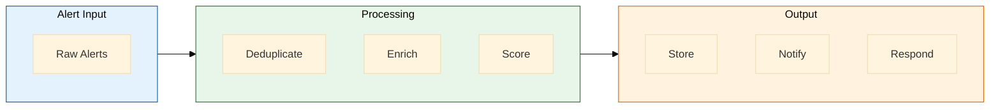

**Alert Lifecycle:**

```
New Alert → Deduplicate → Enrich → Score → Store → Notify
                                              ↓
                                    Assign → Investigate → Close
```

---

## Integration Layer

### Connector Architecture

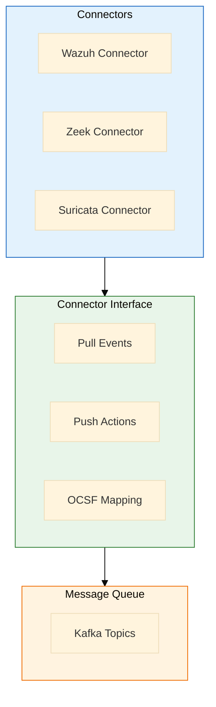

### Connector Interface

```python
# Abstract connector interface
class BaseConnector(ABC):
    """Base class for all MxTac connectors."""
    
    @abstractmethod
    async def connect(self) -> bool:
        """Establish connection to data source."""
        pass
    
    @abstractmethod
    async def pull_events(self, since: datetime) -> AsyncIterator[RawEvent]:
        """Pull events from data source."""
        pass
    
    @abstractmethod
    async def push_action(self, action: ResponseAction) -> ActionResult:
        """Execute response action on target."""
        pass
    
    @abstractmethod
    def get_ocsf_mapping(self) -> OCSFMapping:
        """Return field mapping configuration."""
        pass
    
    @abstractmethod
    async def health_check(self) -> HealthStatus:
        """Check connector health."""
        pass
```

### Wazuh Connector

| Feature | Method | Endpoint |
|---------|--------|----------|
| Alert ingestion | API Pull | `GET /alerts` |
| Agent inventory | API Pull | `GET /agents` |
| FIM events | Filebeat | Wazuh archives |
| Active response | API Push | `PUT /active-response` |

### Zeek Connector

| Feature | Method | Source |
|---------|--------|--------|
| Connection logs | File/Kafka | conn.log |
| DNS logs | File/Kafka | dns.log |
| HTTP logs | File/Kafka | http.log |
| SSL logs | File/Kafka | ssl.log |
| File logs | File/Kafka | files.log |

### Suricata Connector

| Feature | Method | Source |
|---------|--------|--------|
| Alert events | File/Kafka | eve.json (alert) |
| Flow events | File/Kafka | eve.json (flow) |
| DNS events | File/Kafka | eve.json (dns) |
| HTTP events | File/Kafka | eve.json (http) |

---

## Deployment Architecture

### Development (Docker Compose)

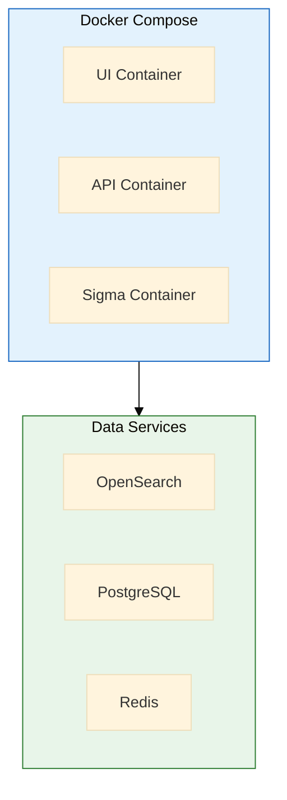

```yaml
# docker-compose.yml (simplified)
version: '3.8'

services:
  ui:
    image: mxtac/ui:latest
    ports: ["443:443"]
    depends_on: [api]

  api:
    image: mxtac/api:latest
    ports: ["8080:8080"]
    depends_on: [opensearch, postgres, redis]

  sigma-engine:
    image: mxtac/sigma-engine:latest
    depends_on: [kafka, redis]

  correlation-engine:
    image: mxtac/correlation-engine:latest
    depends_on: [kafka, redis]

  normalizer:
    image: mxtac/normalizer:latest
    depends_on: [kafka]

  opensearch:
    image: opensearchproject/opensearch:2
    volumes: [opensearch-data:/usr/share/opensearch/data]

  postgres:
    image: postgres:16
    volumes: [postgres-data:/var/lib/postgresql/data]

  redis:
    image: redis:7

  kafka:
    image: bitnami/kafka:3.6
```

### Production (Kubernetes)

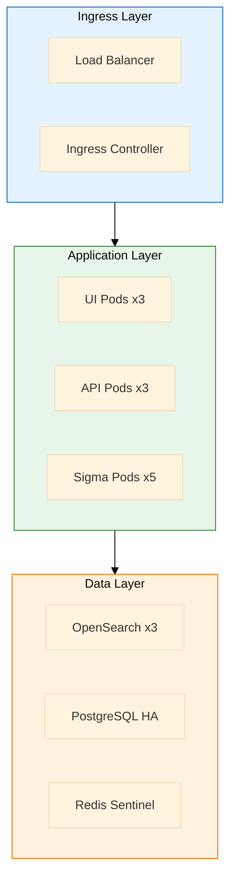

### Deployment Tiers

| Tier | Resources | Scale | Use Case |
|------|-----------|-------|----------|
| **Small** | 16 CPU, 64GB RAM | 5K EPS | Lab/POC |
| **Medium** | 48 CPU, 192GB RAM | 25K EPS | SMB |
| **Large** | 96+ CPU, 384GB+ RAM | 100K+ EPS | Enterprise |

---

## Security Architecture

### Authentication Flow

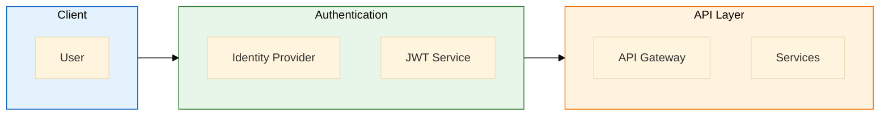

### Security Layers

| Layer | Protection | Implementation |
|-------|------------|----------------|
| **Network** | Encryption | TLS 1.3 everywhere |
| **Application** | Authentication | JWT + OIDC/SAML |
| **Authorization** | Access control | RBAC with permissions |
| **Data** | Encryption at rest | AES-256 |
| **Audit** | Logging | Immutable audit logs |

### RBAC Model

| Role | Permissions |
|------|-------------|
| **Viewer** | Read alerts, events, dashboards |
| **Analyst** | Viewer + manage alerts, investigations |
| **Hunter** | Analyst + run queries, create hunts |
| **Engineer** | Hunter + manage rules, connectors |
| **Admin** | Full access + user management |

---

## Scalability Patterns

### Horizontal Scaling

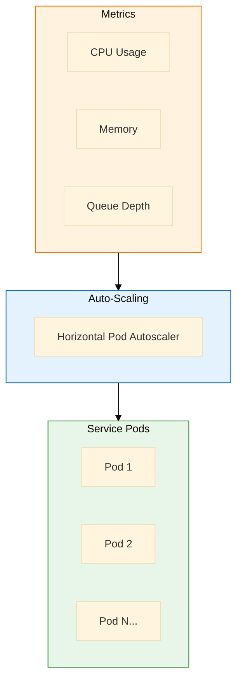

### Scaling Triggers

| Service | Scale Metric | Threshold |
|---------|--------------|-----------|
| API Gateway | CPU | 70% |
| Sigma Engine | Queue depth | 1000 messages |
| Normalizer | CPU | 70% |
| Correlation Engine | Memory | 80% |

### Data Partitioning

| Data Type | Partition Strategy | Retention |
|-----------|-------------------|-----------|
| Events | Daily indices | 90 days (hot) + archive |
| Alerts | Weekly indices | 365 days |
| Metadata | Single table | Permanent |
| Cache | In-memory | TTL-based |

---

## Appendix

### A. Service Communication Matrix

| From | To | Protocol | Port |
|------|-----|----------|------|
| UI | API Gateway | HTTPS | 443 |
| API Gateway | Services | gRPC | 50051 |
| Services | Kafka | TCP | 9092 |
| Services | OpenSearch | HTTPS | 9200 |
| Services | PostgreSQL | TCP | 5432 |
| Services | Redis | TCP | 6379 |

### B. Configuration Management

| Config Type | Storage | Update Method |
|-------------|---------|---------------|
| Application | ConfigMaps | Rolling update |
| Secrets | K8s Secrets / Vault | Sealed secrets |
| Rules | PostgreSQL | API update |
| Connectors | PostgreSQL | API update |

### C. Monitoring Endpoints

| Service | Health | Metrics | Readiness |
|---------|--------|---------|-----------|
| API | `/health` | `/metrics` | `/ready` |
| Sigma Engine | `/health` | `/metrics` | `/ready` |
| Correlation | `/health` | `/metrics` | `/ready` |
| Normalizer | `/health` | `/metrics` | `/ready` |

---

*Document maintained by MxTac Project*
