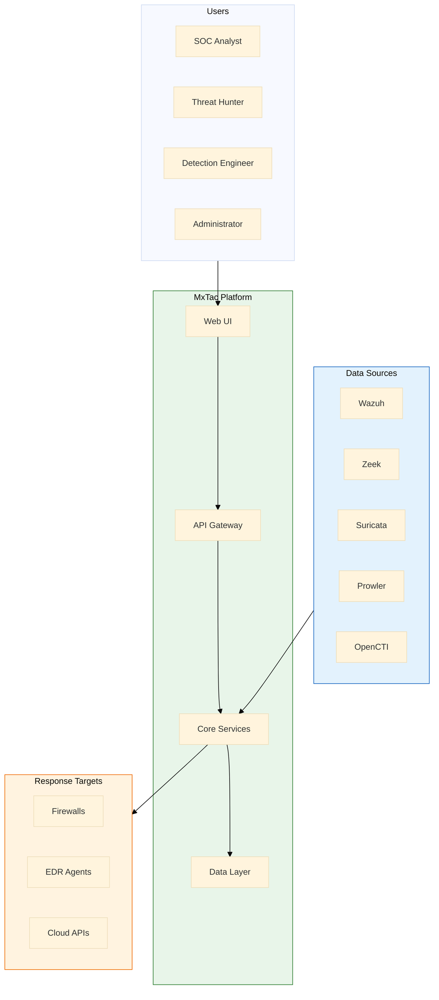

# MxTac - Technical Architecture

> **Document Type**: Technical Architecture  
> **Version**: 1.0  
> **Date**: January 2026  
> **Status**: Draft  
> **Project**: MxTac (Matrix + Tactic)

---

## Architecture Overview

### Design Principles

| Principle | Description |
|-----------|-------------|
| **Integration over Invention** | Leverage existing OSS tools, don't rebuild |
| **ATT&CK-Native** | Every component maps to ATT&CK |
| **Open Standards** | OCSF for data, Sigma for detection, STIX for intel |
| **Microservices** | Loosely coupled, independently deployable |
| **Scalability First** | Horizontal scaling from day one |
| **Security by Design** | Zero trust, encryption everywhere |

### System Context



---

## Component Architecture

### Layer 1: Presentation Layer

```
┌─────────────────────────────────────────────────────────────────────────┐
│                         PRESENTATION LAYER                              │
├─────────────────────────────────────────────────────────────────────────┤
│                                                                         │
│  ┌─────────────────────────────────────────────────────────────────┐   │
│  │                      Web Application (React)                     │   │
│  │  ┌───────────┐ ┌───────────┐ ┌───────────┐ ┌───────────┐       │   │
│  │  │ Dashboard │ │  Alerts   │ │  Hunting  │ │  Config   │       │   │
│  │  │   Module  │ │  Module   │ │  Module   │ │  Module   │       │   │
│  │  └───────────┘ └───────────┘ └───────────┘ └───────────┘       │   │
│  │  ┌───────────┐ ┌───────────┐ ┌───────────┐ ┌───────────┐       │   │
│  │  │  ATT&CK   │ │  Reports  │ │ Response  │ │  Admin    │       │   │
│  │  │ Navigator │ │  Module   │ │  Module   │ │  Module   │       │   │
│  │  └───────────┘ └───────────┘ └───────────┘ └───────────┘       │   │
│  └─────────────────────────────────────────────────────────────────┘   │
│                                                                         │
│  Technology: React 18+, TypeScript, TailwindCSS, Recharts              │
│  State Management: Zustand or Redux Toolkit                            │
│  API Client: React Query + Axios                                        │
│                                                                         │
└─────────────────────────────────────────────────────────────────────────┘
```

### Layer 2: API Gateway

```
┌─────────────────────────────────────────────────────────────────────────┐
│                           API GATEWAY                                   │
├─────────────────────────────────────────────────────────────────────────┤
│                                                                         │
│  ┌─────────────────────────────────────────────────────────────────┐   │
│  │                    Kong / Traefik / Custom                       │   │
│  │                                                                   │   │
│  │  ┌─────────────┐  ┌─────────────┐  ┌─────────────┐              │   │
│  │  │   Auth &    │  │    Rate     │  │   Request   │              │   │
│  │  │   AuthZ     │  │  Limiting   │  │   Routing   │              │   │
│  │  │  (JWT/OIDC) │  │             │  │             │              │   │
│  │  └─────────────┘  └─────────────┘  └─────────────┘              │   │
│  │                                                                   │   │
│  │  ┌─────────────┐  ┌─────────────┐  ┌─────────────┐              │   │
│  │  │   Audit     │  │   Circuit   │  │    SSL      │              │   │
│  │  │  Logging    │  │   Breaker   │  │ Termination │              │   │
│  │  └─────────────┘  └─────────────┘  └─────────────┘              │   │
│  │                                                                   │   │
│  └─────────────────────────────────────────────────────────────────┘   │
│                                                                         │
│  Endpoints:                                                             │
│  - /api/v1/alerts      - Alert management                              │
│  - /api/v1/events      - Event search                                  │
│  - /api/v1/rules       - Sigma rule management                         │
│  - /api/v1/coverage    - ATT&CK coverage                               │
│  - /api/v1/connectors  - Integration management                        │
│  - /api/v1/response    - Response actions                              │
│                                                                         │
└─────────────────────────────────────────────────────────────────────────┘
```

### Layer 3: Core Services

```
┌─────────────────────────────────────────────────────────────────────────┐
│                          CORE SERVICES                                  │
├─────────────────────────────────────────────────────────────────────────┤
│                                                                         │
│  ┌──────────────────────┐  ┌──────────────────────┐                    │
│  │    Sigma Engine      │  │  Correlation Engine  │                    │
│  │  ┌────────────────┐  │  │  ┌────────────────┐  │                    │
│  │  │  Rule Parser   │  │  │  │  Event Buffer  │  │                    │
│  │  │  Rule Matcher  │  │  │  │  Rule Engine   │  │                    │
│  │  │  Alert Creator │  │  │  │  Chain Detect  │  │                    │
│  │  └────────────────┘  │  │  └────────────────┘  │                    │
│  └──────────────────────┘  └──────────────────────┘                    │
│                                                                         │
│  ┌──────────────────────┐  ┌──────────────────────┐                    │
│  │    Alert Manager     │  │    ATT&CK Mapper     │                    │
│  │  ┌────────────────┐  │  │  ┌────────────────┐  │                    │
│  │  │  Deduplication │  │  │  │ Technique Map  │  │                    │
│  │  │  Enrichment    │  │  │  │ Coverage Calc  │  │                    │
│  │  │  Scoring       │  │  │  │ Gap Analysis   │  │                    │
│  │  └────────────────┘  │  │  └────────────────┘  │                    │
│  └──────────────────────┘  └──────────────────────┘                    │
│                                                                         │
│  ┌──────────────────────┐  ┌──────────────────────┐                    │
│  │   Search Service     │  │  Enrichment Service  │                    │
│  │  ┌────────────────┐  │  │  ┌────────────────┐  │                    │
│  │  │ Query Builder  │  │  │  │  Threat Intel  │  │                    │
│  │  │ Aggregations   │  │  │  │  GeoIP         │  │                    │
│  │  │ Pagination     │  │  │  │  Asset Context │  │                    │
│  │  └────────────────┘  │  │  └────────────────┘  │                    │
│  └──────────────────────┘  └──────────────────────┘                    │
│                                                                         │
│  ┌──────────────────────┐  ┌──────────────────────┐                    │
│  │  Response Service    │  │   Report Service     │                    │
│  │  ┌────────────────┐  │  │  ┌────────────────┐  │                    │
│  │  │ Action Execute │  │  │  │ Report Builder │  │                    │
│  │  │ Playbook Run   │  │  │  │ Scheduler      │  │                    │
│  │  │ Audit Log      │  │  │  │ Export         │  │                    │
│  │  └────────────────┘  │  │  └────────────────┘  │                    │
│  └──────────────────────┘  └──────────────────────┘                    │
│                                                                         │
│  Technology: Python 3.11+, FastAPI, asyncio                            │
│  Communication: gRPC (internal), REST (external)                        │
│                                                                         │
└─────────────────────────────────────────────────────────────────────────┘
```

### Layer 4: Data Processing

```
┌─────────────────────────────────────────────────────────────────────────┐
│                       DATA PROCESSING LAYER                             │
├─────────────────────────────────────────────────────────────────────────┤
│                                                                         │
│  ┌─────────────────────────────────────────────────────────────────┐   │
│  │                 OCSF Normalization Engine                        │   │
│  │                                                                   │   │
│  │  Input Parsers:                                                   │   │
│  │  ┌─────────┐ ┌─────────┐ ┌─────────┐ ┌─────────┐ ┌─────────┐   │   │
│  │  │  Wazuh  │ │  Zeek   │ │Suricata │ │ Prowler │ │ Generic │   │   │
│  │  │ Parser  │ │ Parser  │ │ Parser  │ │ Parser  │ │ Parser  │   │   │
│  │  └────┬────┘ └────┬────┘ └────┬────┘ └────┬────┘ └────┬────┘   │   │
│  │       │           │           │           │           │         │   │
│  │       └───────────┴─────┬─────┴───────────┴───────────┘         │   │
│  │                         │                                        │   │
│  │                         ▼                                        │   │
│  │              ┌─────────────────────┐                            │   │
│  │              │  OCSF Transformer   │                            │   │
│  │              │  - Field Mapping    │                            │   │
│  │              │  - Type Coercion    │                            │   │
│  │              │  - Validation       │                            │   │
│  │              │  - Enrichment       │                            │   │
│  │              └──────────┬──────────┘                            │   │
│  │                         │                                        │   │
│  │                         ▼                                        │   │
│  │              ┌─────────────────────┐                            │   │
│  │              │   OCSF Events       │                            │   │
│  │              │   (Normalized)      │                            │   │
│  │              └─────────────────────┘                            │   │
│  │                                                                   │   │
│  └─────────────────────────────────────────────────────────────────┘   │
│                                                                         │
│  ┌─────────────────────────────────────────────────────────────────┐   │
│  │                    Message Queue (Kafka)                         │   │
│  │                                                                   │   │
│  │  Topics:                                                          │   │
│  │  - oap.raw.wazuh         (raw events from Wazuh)                 │   │
│  │  - oap.raw.zeek          (raw events from Zeek)                  │   │
│  │  - oap.raw.suricata      (raw events from Suricata)              │   │
│  │  - oap.normalized        (OCSF normalized events)                │   │
│  │  - oap.alerts            (detection alerts)                      │   │
│  │  - oap.enriched          (enriched alerts)                       │   │
│  │                                                                   │   │
│  └─────────────────────────────────────────────────────────────────┘   │
│                                                                         │
│  Technology: Kafka (or Redis Streams for smaller deployments)          │
│                                                                         │
└─────────────────────────────────────────────────────────────────────────┘
```

### Layer 5: Data Storage

```
┌─────────────────────────────────────────────────────────────────────────┐
│                         DATA STORAGE LAYER                              │
├─────────────────────────────────────────────────────────────────────────┤
│                                                                         │
│  ┌───────────────────────────────┐  ┌───────────────────────────────┐  │
│  │        OpenSearch             │  │         PostgreSQL            │  │
│  │       (Event Store)           │  │        (Metadata DB)          │  │
│  │                               │  │                               │  │
│  │  Indices:                     │  │  Tables:                      │  │
│  │  - oap-events-YYYY.MM.DD     │  │  - users                      │  │
│  │  - oap-alerts-YYYY.MM.DD     │  │  - roles                      │  │
│  │  - oap-investigations        │  │  - rules                      │  │
│  │                               │  │  - connectors                 │  │
│  │  Retention: Configurable      │  │  - investigations            │  │
│  │  (Default: 90 days events,    │  │  - playbooks                 │  │
│  │   365 days alerts)            │  │  - settings                  │  │
│  │                               │  │  - audit_logs                │  │
│  └───────────────────────────────┘  └───────────────────────────────┘  │
│                                                                         │
│  ┌───────────────────────────────┐  ┌───────────────────────────────┐  │
│  │           Redis               │  │        Object Storage         │  │
│  │          (Cache)              │  │        (MinIO / S3)           │  │
│  │                               │  │                               │  │
│  │  Use Cases:                   │  │  Use Cases:                   │  │
│  │  - Session cache              │  │  - Report exports             │  │
│  │  - Rate limiting              │  │  - PCAP storage               │  │
│  │  - Real-time metrics          │  │  - Long-term archives         │  │
│  │  - Pub/sub (alerts)           │  │  - Backup storage             │  │
│  │                               │  │                               │  │
│  └───────────────────────────────┘  └───────────────────────────────┘  │
│                                                                         │
└─────────────────────────────────────────────────────────────────────────┘
```

### Layer 6: Integration Connectors

```
┌─────────────────────────────────────────────────────────────────────────┐
│                      INTEGRATION CONNECTORS                             │
├─────────────────────────────────────────────────────────────────────────┤
│                                                                         │
│  Data Source Connectors (Inbound):                                      │
│  ┌──────────────┐ ┌──────────────┐ ┌──────────────┐ ┌──────────────┐   │
│  │    Wazuh     │ │    Zeek      │ │  Suricata    │ │   Prowler    │   │
│  │  Connector   │ │  Connector   │ │  Connector   │ │  Connector   │   │
│  │              │ │              │ │              │ │              │   │
│  │ - API Pull   │ │ - File Watch │ │ - File Watch │ │ - API Pull   │   │
│  │ - Filebeat   │ │ - Kafka      │ │ - Kafka      │ │ - Scheduled  │   │
│  │ - Webhook    │ │ - Redis      │ │ - Redis      │ │              │   │
│  └──────────────┘ └──────────────┘ └──────────────┘ └──────────────┘   │
│                                                                         │
│  ┌──────────────┐ ┌──────────────┐ ┌──────────────┐ ┌──────────────┐   │
│  │   OpenCTI    │ │    MISP      │ │  Velociraptor│ │   osquery    │   │
│  │  Connector   │ │  Connector   │ │  Connector   │ │  Connector   │   │
│  │              │ │              │ │              │ │              │   │
│  │ - GraphQL    │ │ - REST API   │ │ - gRPC       │ │ - TLS API    │   │
│  │ - STIX/TAXII │ │ - PyMISP     │ │ - Websocket  │ │              │   │
│  └──────────────┘ └──────────────┘ └──────────────┘ └──────────────┘   │
│                                                                         │
│  Response Connectors (Outbound):                                        │
│  ┌──────────────┐ ┌──────────────┐ ┌──────────────┐ ┌──────────────┐   │
│  │   Wazuh      │ │   Firewall   │ │    Cloud     │ │   Shuffle    │   │
│  │  Response    │ │  Response    │ │  Response    │ │    SOAR      │   │
│  │              │ │              │ │              │ │              │   │
│  │ - Isolate    │ │ - Block IP   │ │ - Disable    │ │ - Playbooks  │   │
│  │ - Kill proc  │ │ - Block Port │ │ - Revoke     │ │ - Workflows  │   │
│  │ - Restart    │ │ - Allowlist  │ │ - Quarantine │ │              │   │
│  └──────────────┘ └──────────────┘ └──────────────┘ └──────────────┘   │
│                                                                         │
│  Connector Interface (Abstract):                                        │
│  ┌─────────────────────────────────────────────────────────────────┐   │
│  │  class Connector(ABC):                                           │   │
│  │      @abstractmethod                                             │   │
│  │      async def connect(self) -> bool                             │   │
│  │      @abstractmethod                                             │   │
│  │      async def pull_events(self) -> List[RawEvent]               │   │
│  │      @abstractmethod                                             │   │
│  │      async def push_action(self, action: Action) -> Result       │   │
│  │      @abstractmethod                                             │   │
│  │      def get_ocsf_mapping(self) -> OCSFMapping                   │   │
│  └─────────────────────────────────────────────────────────────────┘   │
│                                                                         │
└─────────────────────────────────────────────────────────────────────────┘
```

---

## Sigma Engine Architecture

### Engine Design

```
┌─────────────────────────────────────────────────────────────────────────┐
│                        SIGMA ENGINE                                     │
├─────────────────────────────────────────────────────────────────────────┤
│                                                                         │
│  ┌─────────────────────────────────────────────────────────────────┐   │
│  │                      Rule Repository                             │   │
│  │  ┌───────────────┐  ┌───────────────┐  ┌───────────────┐        │   │
│  │  │    SigmaHQ    │  │    Custom     │  │   Imported    │        │   │
│  │  │    (Git Sync) │  │    Rules      │  │    Rules      │        │   │
│  │  └───────────────┘  └───────────────┘  └───────────────┘        │   │
│  └─────────────────────────────────────────────────────────────────┘   │
│                                    │                                    │
│                                    ▼                                    │
│  ┌─────────────────────────────────────────────────────────────────┐   │
│  │                      Rule Compiler                               │   │
│  │                                                                   │   │
│  │  1. Parse YAML ─────────────────────────────────────────────────│   │
│  │  2. Validate structure ─────────────────────────────────────────│   │
│  │  3. Compile detection logic ────────────────────────────────────│   │
│  │  4. Map to OCSF fields ─────────────────────────────────────────│   │
│  │  5. Generate optimized matcher ─────────────────────────────────│   │
│  │  6. Cache compiled rule ────────────────────────────────────────│   │
│  │                                                                   │   │
│  └─────────────────────────────────────────────────────────────────┘   │
│                                    │                                    │
│                                    ▼                                    │
│  ┌─────────────────────────────────────────────────────────────────┐   │
│  │                     Rule Index                                   │   │
│  │                                                                   │   │
│  │  Indexed by:                                                      │   │
│  │  - logsource.category (process_creation, network_connection)     │   │
│  │  - logsource.product (windows, linux, aws)                       │   │
│  │  - ATT&CK technique (T1059, T1003, etc.)                         │   │
│  │  - Severity (critical, high, medium, low)                        │   │
│  │                                                                   │   │
│  └─────────────────────────────────────────────────────────────────┘   │
│                                    │                                    │
│                                    ▼                                    │
│  ┌─────────────────────────────────────────────────────────────────┐   │
│  │                    Detection Pipeline                            │   │
│  │                                                                   │   │
│  │     OCSF Event                                                    │   │
│  │         │                                                         │   │
│  │         ▼                                                         │   │
│  │  ┌─────────────┐     ┌─────────────┐     ┌─────────────┐        │   │
│  │  │   Route     │ ──► │   Match     │ ──► │  Generate   │        │   │
│  │  │  (by class) │     │  (parallel) │     │   Alert     │        │   │
│  │  └─────────────┘     └─────────────┘     └─────────────┘        │   │
│  │                                                                   │   │
│  │  Optimization:                                                    │   │
│  │  - Rules grouped by logsource for O(1) routing                   │   │
│  │  - Parallel evaluation within groups                              │   │
│  │  - Short-circuit on first match (configurable)                   │   │
│  │  - Bloom filter pre-check for keyword rules                      │   │
│  │                                                                   │   │
│  └─────────────────────────────────────────────────────────────────┘   │
│                                                                         │
└─────────────────────────────────────────────────────────────────────────┘
```

### Sigma to OCSF Field Mapping

```yaml
# Logsource to OCSF Class Mapping
logsource_mappings:
  
  process_creation:
    windows:
      ocsf_class_uid: 1007  # Process Activity
      field_map:
        Image: process.file.path
        CommandLine: process.cmd_line
        User: actor.user.name
        ParentImage: parent_process.file.path
        ParentCommandLine: parent_process.cmd_line
        Hashes: process.file.hashes
        ProcessId: process.pid
        ParentProcessId: parent_process.pid
        CurrentDirectory: process.cwd
        IntegrityLevel: process.integrity
        
    linux:
      ocsf_class_uid: 1007
      field_map:
        Image: process.file.path
        CommandLine: process.cmd_line
        User: actor.user.name
        ParentImage: parent_process.file.path
        
  network_connection:
    any:
      ocsf_class_uid: 4001  # Network Activity
      field_map:
        SourceIp: src_endpoint.ip
        SourcePort: src_endpoint.port
        DestinationIp: dst_endpoint.ip
        DestinationPort: dst_endpoint.port
        Protocol: connection_info.protocol_name
        
  file_event:
    windows:
      ocsf_class_uid: 1001  # File Activity
      field_map:
        TargetFilename: file.path
        Image: actor.process.file.path
        User: actor.user.name
```

---

## Correlation Engine Architecture

### Attack Chain Detection

```
┌─────────────────────────────────────────────────────────────────────────┐
│                     CORRELATION ENGINE                                  │
├─────────────────────────────────────────────────────────────────────────┤
│                                                                         │
│  ┌─────────────────────────────────────────────────────────────────┐   │
│  │                    Event Buffer (Redis)                          │   │
│  │                                                                   │   │
│  │  Key Structure:                                                   │   │
│  │  - entity:{type}:{value}:events → Sorted Set (by timestamp)      │   │
│  │  - entity:ip:192.168.1.50:events                                 │   │
│  │  - entity:host:web-server-01:events                              │   │
│  │  - entity:user:admin:events                                       │   │
│  │                                                                   │   │
│  │  TTL: Configurable (default 24 hours)                            │   │
│  │                                                                   │   │
│  └─────────────────────────────────────────────────────────────────┘   │
│                                    │                                    │
│                                    ▼                                    │
│  ┌─────────────────────────────────────────────────────────────────┐   │
│  │                  Correlation Rule Engine                         │   │
│  │                                                                   │   │
│  │  Rule Types:                                                      │   │
│  │                                                                   │   │
│  │  1. Sequence Detection (A then B then C)                         │   │
│  │     ┌─────────────────────────────────────────────────────┐     │   │
│  │     │  name: "Initial Access to C2"                        │     │   │
│  │     │  sequence:                                           │     │   │
│  │     │    - technique: T1190    # Exploit                   │     │   │
│  │     │    - technique: T1059    # Execution                 │     │   │
│  │     │    - technique: T1071    # C2                        │     │   │
│  │     │  within: 1h                                          │     │   │
│  │     │  group_by: [dst_endpoint.hostname]                   │     │   │
│  │     └─────────────────────────────────────────────────────┘     │   │
│  │                                                                   │   │
│  │  2. Threshold Detection (N events in time window)                │   │
│  │     ┌─────────────────────────────────────────────────────┐     │   │
│  │     │  name: "Brute Force Detection"                       │     │   │
│  │     │  condition:                                          │     │   │
│  │     │    event: authentication_failure                     │     │   │
│  │     │    count: ">= 10"                                    │     │   │
│  │     │    within: 5m                                        │     │   │
│  │     │    group_by: [src_endpoint.ip, dst_endpoint.user]   │     │   │
│  │     └─────────────────────────────────────────────────────┘     │   │
│  │                                                                   │   │
│  │  3. Statistical Anomaly (deviation from baseline)                │   │
│  │     ┌─────────────────────────────────────────────────────┐     │   │
│  │     │  name: "Unusual Outbound Data"                       │     │   │
│  │     │  condition:                                          │     │   │
│  │     │    metric: bytes_out                                 │     │   │
│  │     │    baseline: 7d_average                              │     │   │
│  │     │    threshold: "> 3 * stddev"                         │     │   │
│  │     │    group_by: [src_endpoint.hostname]                │     │   │
│  │     └─────────────────────────────────────────────────────┘     │   │
│  │                                                                   │   │
│  └─────────────────────────────────────────────────────────────────┘   │
│                                    │                                    │
│                                    ▼                                    │
│  ┌─────────────────────────────────────────────────────────────────┐   │
│  │                 ATT&CK Chain Detector                            │   │
│  │                                                                   │   │
│  │  Pre-defined Attack Patterns:                                     │   │
│  │                                                                   │   │
│  │  ┌─────────────────────────────────────────────────────────────┐│   │
│  │  │  Ransomware Pattern:                                        ││   │
│  │  │  T1566 → T1204 → T1059 → T1486                              ││   │
│  │  │  (Phishing → User Exec → Script → Encrypt)                  ││   │
│  │  └─────────────────────────────────────────────────────────────┘│   │
│  │                                                                   │   │
│  │  ┌─────────────────────────────────────────────────────────────┐│   │
│  │  │  APT Lateral Movement:                                      ││   │
│  │  │  T1078 → T1003 → T1021 → T1071                              ││   │
│  │  │  (Valid Acct → Cred Dump → Remote Svc → C2)                 ││   │
│  │  └─────────────────────────────────────────────────────────────┘│   │
│  │                                                                   │   │
│  │  ┌─────────────────────────────────────────────────────────────┐│   │
│  │  │  Data Exfiltration:                                         ││   │
│  │  │  T1083 → T1560 → T1048                                      ││   │
│  │  │  (File Discovery → Archive → Exfil Alt Protocol)            ││   │
│  │  └─────────────────────────────────────────────────────────────┘│   │
│  │                                                                   │   │
│  └─────────────────────────────────────────────────────────────────┘   │
│                                                                         │
└─────────────────────────────────────────────────────────────────────────┘
```

---

## Deployment Architecture

### Docker Compose (Development/Small)

```yaml
# docker-compose.yml
version: '3.8'

services:
  # Frontend
  ui:
    image: oap/ui:latest
    ports:
      - "443:443"
    depends_on:
      - api
      
  # API Gateway
  api:
    image: oap/api:latest
    ports:
      - "8080:8080"
    depends_on:
      - sigma-engine
      - correlation-engine
      - opensearch
      
  # Core Services
  sigma-engine:
    image: oap/sigma-engine:latest
    depends_on:
      - kafka
      - redis
      
  correlation-engine:
    image: oap/correlation-engine:latest
    depends_on:
      - kafka
      - redis
      
  normalizer:
    image: oap/normalizer:latest
    depends_on:
      - kafka
      
  # Data Processing
  kafka:
    image: bitnami/kafka:latest
    ports:
      - "9092:9092"
      
  # Data Storage
  opensearch:
    image: opensearchproject/opensearch:2
    ports:
      - "9200:9200"
    volumes:
      - opensearch-data:/usr/share/opensearch/data
      
  postgres:
    image: postgres:15
    volumes:
      - postgres-data:/var/lib/postgresql/data
      
  redis:
    image: redis:7
    
volumes:
  opensearch-data:
  postgres-data:
```

### Kubernetes (Production)

```yaml
# Simplified Kubernetes architecture
apiVersion: v1
kind: Namespace
metadata:
  name: open-attck-platform
---
# StatefulSets for stateful components
# - OpenSearch cluster (3 nodes)
# - Kafka cluster (3 brokers)
# - PostgreSQL (primary + replica)
# - Redis (sentinel mode)

# Deployments for stateless components
# - API Gateway (3 replicas, HPA)
# - Sigma Engine (5 replicas, HPA)
# - Correlation Engine (3 replicas)
# - Normalizer (5 replicas, HPA)
# - UI (3 replicas)

# Services
# - LoadBalancer for UI
# - ClusterIP for internal services
# - Headless for StatefulSets

# ConfigMaps & Secrets
# - Application configuration
# - TLS certificates
# - Database credentials
# - API keys
```

---

## Security Architecture

### Authentication & Authorization

```
┌─────────────────────────────────────────────────────────────────────────┐
│                    SECURITY ARCHITECTURE                                │
├─────────────────────────────────────────────────────────────────────────┤
│                                                                         │
│  Authentication:                                                        │
│  ┌─────────────────────────────────────────────────────────────────┐   │
│  │                                                                   │   │
│  │  ┌─────────────┐  ┌─────────────┐  ┌─────────────┐              │   │
│  │  │   Local     │  │    OIDC     │  │    SAML     │              │   │
│  │  │  (bcrypt)   │  │  (Keycloak) │  │   (Okta)    │              │   │
│  │  └──────┬──────┘  └──────┬──────┘  └──────┬──────┘              │   │
│  │         │                │                │                       │   │
│  │         └────────────────┼────────────────┘                       │   │
│  │                          ▼                                        │   │
│  │                 ┌─────────────────┐                               │   │
│  │                 │   JWT Issuer    │                               │   │
│  │                 │  (RS256 signed) │                               │   │
│  │                 └─────────────────┘                               │   │
│  │                                                                   │   │
│  └─────────────────────────────────────────────────────────────────┘   │
│                                                                         │
│  Authorization (RBAC):                                                  │
│  ┌─────────────────────────────────────────────────────────────────┐   │
│  │                                                                   │   │
│  │  Roles:                                                           │   │
│  │  ┌────────────┬──────────────────────────────────────────────┐  │   │
│  │  │ Role       │ Permissions                                   │  │   │
│  │  ├────────────┼──────────────────────────────────────────────┤  │   │
│  │  │ Viewer     │ Read alerts, events, dashboards              │  │   │
│  │  │ Analyst    │ + Manage alerts, create investigations       │  │   │
│  │  │ Hunter     │ + Run queries, create rules                  │  │   │
│  │  │ Engineer   │ + Manage rules, connectors                   │  │   │
│  │  │ Admin      │ + Manage users, settings, all                │  │   │
│  │  └────────────┴──────────────────────────────────────────────┘  │   │
│  │                                                                   │   │
│  └─────────────────────────────────────────────────────────────────┘   │
│                                                                         │
│  Data Protection:                                                       │
│  ┌─────────────────────────────────────────────────────────────────┐   │
│  │                                                                   │   │
│  │  - Encryption at rest: AES-256 (OpenSearch, PostgreSQL)          │   │
│  │  - Encryption in transit: TLS 1.3 (all connections)              │   │
│  │  - Secret management: HashiCorp Vault or K8s Secrets             │   │
│  │  - Audit logging: All admin actions logged to immutable store    │   │
│  │                                                                   │   │
│  └─────────────────────────────────────────────────────────────────┘   │
│                                                                         │
└─────────────────────────────────────────────────────────────────────────┘
```

---

## API Specification

### Core Endpoints

```yaml
openapi: 3.0.0
info:
  title: Open ATT&CK Platform API
  version: 1.0.0

paths:
  # Alerts
  /api/v1/alerts:
    get:
      summary: List alerts
      parameters:
        - name: severity
        - name: status
        - name: technique
        - name: time_range
    post:
      summary: Create manual alert
      
  /api/v1/alerts/{id}:
    get:
      summary: Get alert details
    patch:
      summary: Update alert (status, assignment)
      
  # Events
  /api/v1/events/search:
    post:
      summary: Search events
      requestBody:
        content:
          application/json:
            schema:
              type: object
              properties:
                query: string
                time_range: object
                filters: array
                
  # Rules
  /api/v1/rules:
    get:
      summary: List Sigma rules
    post:
      summary: Create new rule
      
  /api/v1/rules/import:
    post:
      summary: Import rules from SigmaHQ
      
  /api/v1/rules/{id}/test:
    post:
      summary: Test rule against historical data
      
  # ATT&CK Coverage
  /api/v1/coverage:
    get:
      summary: Get ATT&CK coverage metrics
      
  /api/v1/coverage/gaps:
    get:
      summary: Get coverage gaps
      
  /api/v1/coverage/navigator:
    get:
      summary: Export ATT&CK Navigator layer
      
  # Connectors
  /api/v1/connectors:
    get:
      summary: List connectors
    post:
      summary: Add new connector
      
  /api/v1/connectors/{id}/test:
    post:
      summary: Test connector connectivity
      
  # Response
  /api/v1/response/actions:
    get:
      summary: List available actions
    post:
      summary: Execute response action
```

---

## Performance Specifications

### Benchmarks

| Metric | Target | Test Methodology |
|--------|--------|------------------|
| Event Ingestion | 50,000 EPS | Sustained load test, 1 hour |
| Sigma Evaluation | < 10ms per event | 5,000 rules active |
| Search Latency | < 3 seconds | 7-day range, complex query |
| Alert Generation | < 30 seconds E2E | From event to UI |
| Dashboard Load | < 2 seconds | Cold cache |
| API Response | < 200ms P95 | Under load |

### Optimization Strategies

```
┌─────────────────────────────────────────────────────────────────────────┐
│                    PERFORMANCE OPTIMIZATIONS                            │
├─────────────────────────────────────────────────────────────────────────┤
│                                                                         │
│  1. Sigma Engine                                                        │
│     - Rule compilation at load time (not runtime)                       │
│     - Bloom filter pre-check for keyword matches                        │
│     - Rule indexing by logsource for O(1) routing                      │
│     - Parallel evaluation across rule groups                            │
│                                                                         │
│  2. Data Pipeline                                                       │
│     - Kafka partitioning by entity hash (locality)                     │
│     - Batch normalization (100 events per batch)                       │
│     - Async I/O throughout                                              │
│                                                                         │
│  3. Storage                                                             │
│     - OpenSearch index templates optimized for time-series             │
│     - Hot-warm-cold architecture for retention                         │
│     - Query result caching in Redis                                    │
│                                                                         │
│  4. API                                                                 │
│     - Connection pooling                                                │
│     - Response compression (gzip)                                       │
│     - Pagination with cursors (not offset)                             │
│                                                                         │
└─────────────────────────────────────────────────────────────────────────┘
```

---

## Appendix: Technology Decisions

### Decision Log

| Decision | Choice | Rationale | Alternatives Considered |
|----------|--------|-----------|------------------------|
| Backend Language | Python | Fast development, pySigma ecosystem | Go, Rust |
| Frontend Framework | React | Large ecosystem, team familiarity | Vue, Svelte |
| Event Storage | OpenSearch | Open source, scalable, query flexibility | Elasticsearch, ClickHouse |
| Message Queue | Kafka | Durability, high throughput | Redis Streams, RabbitMQ |
| Cache | Redis | Versatile, pub/sub support | Memcached |
| Metadata DB | PostgreSQL | Reliable, feature-rich | MySQL, CockroachDB |

---

*Document maintained by MxTac Project*
