# MxTac - Technical Architecture

> **Document Type**: Technical Architecture  
> **Version**: 1.0  
> **Date**: January 2026  
> **Status**: Draft  
> **Project**: MxTac (Matrix + Tactic)

---

## Architecture Overview

### Design Principles

| Principle | Description |
|-----------|-------------|
| **Integration over Invention** | Leverage existing OSS tools, don't rebuild |
| **ATT&CK-Native** | Every component maps to ATT&CK |
| **Open Standards** | OCSF for data, Sigma for detection, STIX for intel |
| **Microservices** | Loosely coupled, independently deployable |
| **Scalability First** | Horizontal scaling from day one |
| **Security by Design** | Zero trust, encryption everywhere |

### System Context

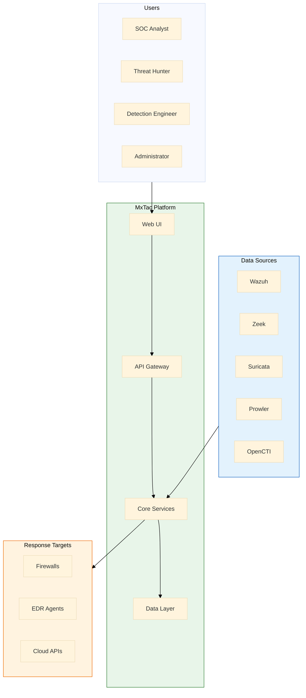

---

## Component Architecture

### Layer 1: Presentation Layer

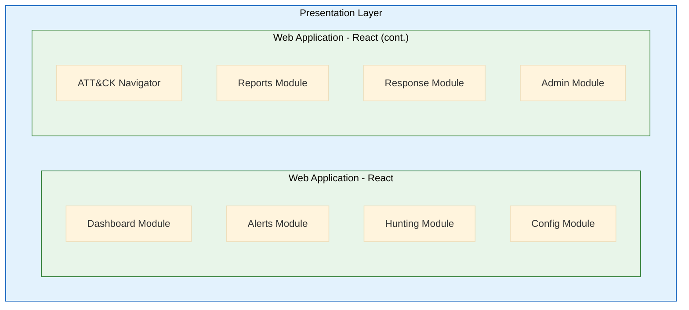

**Technology:** React 18+, TypeScript, TailwindCSS, Recharts  
**State Management:** Zustand or Redux Toolkit  
**API Client:** React Query + Axios

### Layer 2: API Gateway

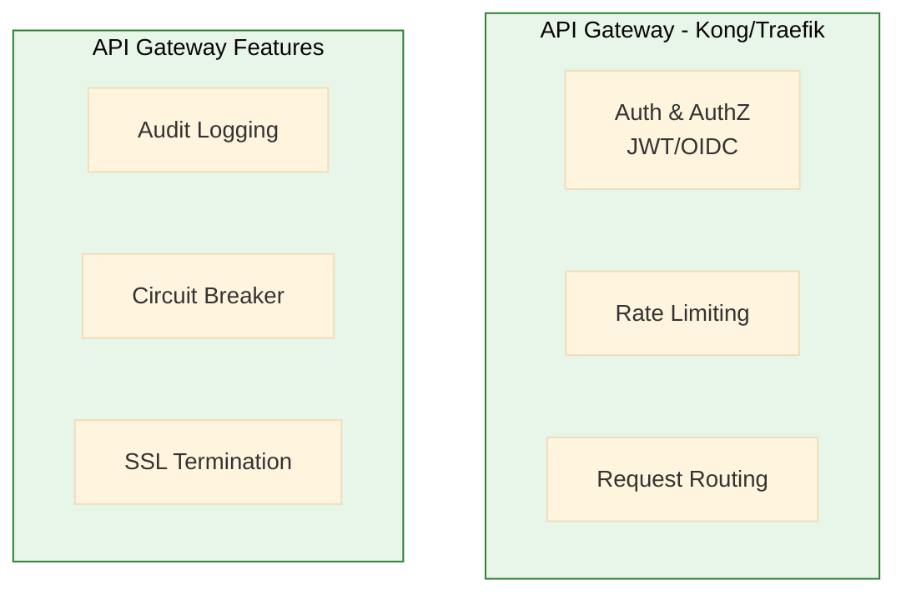

**Endpoints:**
| Endpoint | Purpose |
|----------|---------|
| `/api/v1/alerts` | Alert management |
| `/api/v1/events` | Event search |
| `/api/v1/rules` | Sigma rule management |
| `/api/v1/coverage` | ATT&CK coverage |
| `/api/v1/connectors` | Integration management |
| `/api/v1/response` | Response actions |

### Layer 3: Core Services

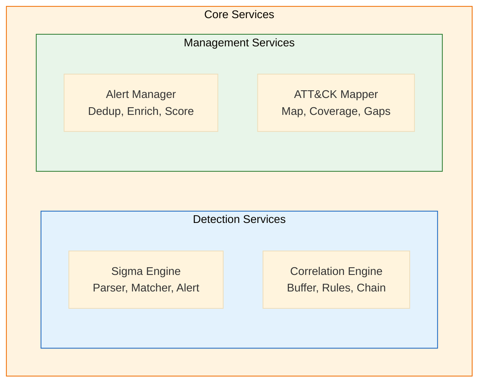

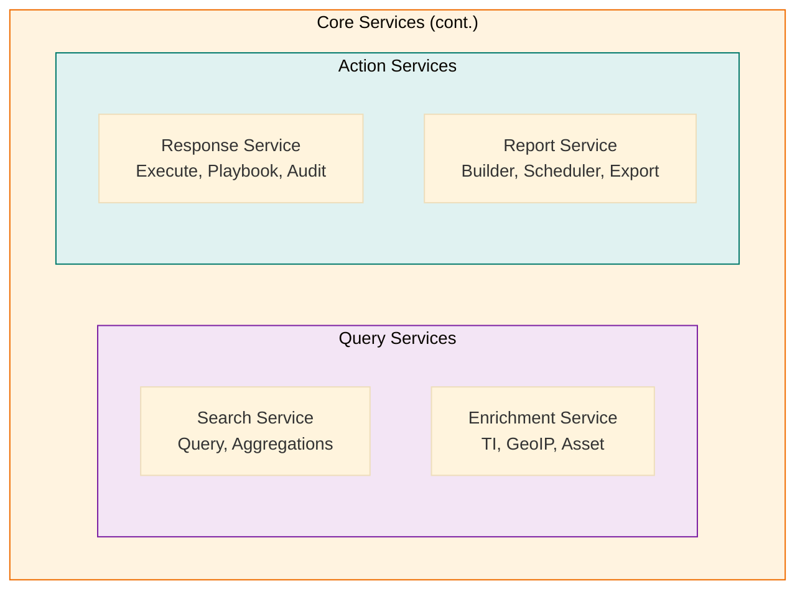

**Technology:** Python 3.11+, FastAPI, asyncio  
**Communication:** gRPC (internal), REST (external)

### Layer 4: Data Processing

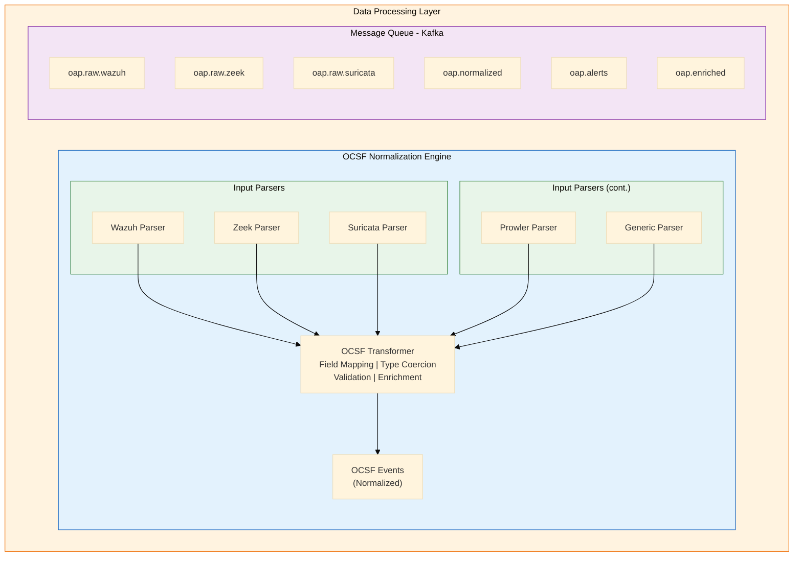

**Technology:** Kafka (or Redis Streams for smaller deployments)

### Layer 5: Data Storage

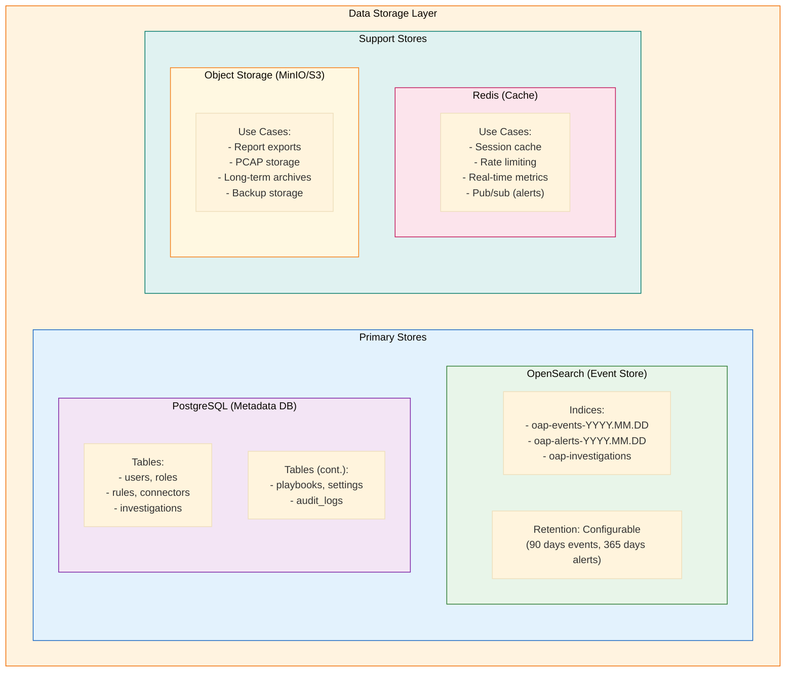

### Layer 6: Integration Connectors

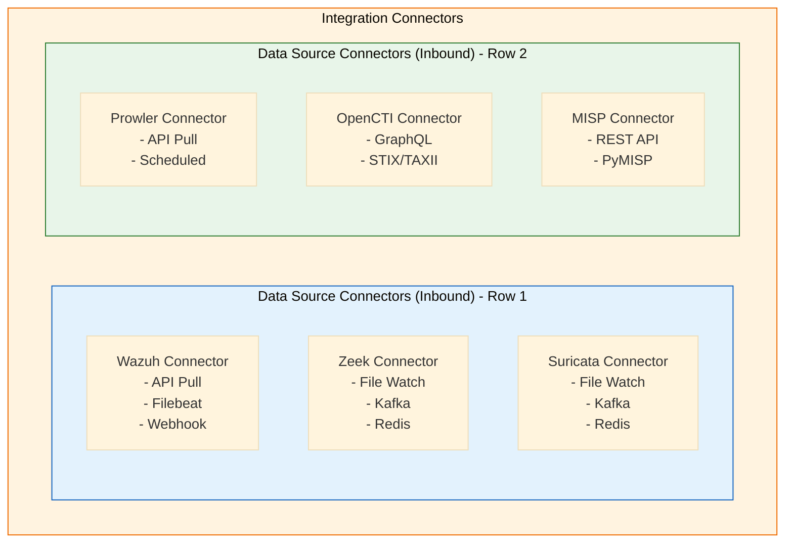

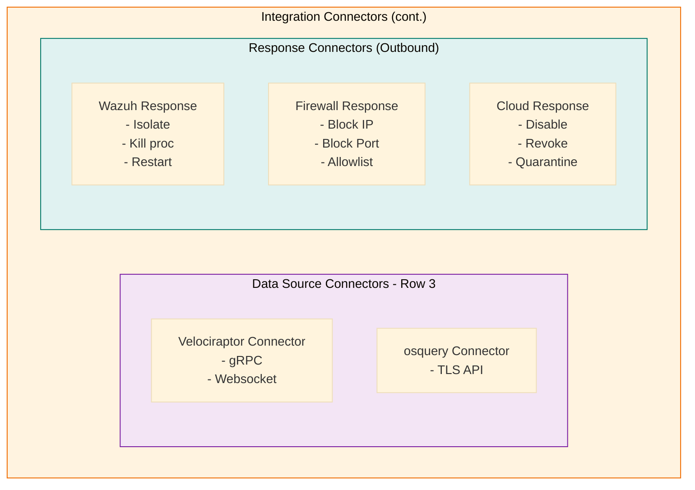

**Connector Interface (Abstract):**

```python
class Connector(ABC):
    @abstractmethod
    async def connect(self) -> bool
    @abstractmethod
    async def pull_events(self) -> List[RawEvent]
    @abstractmethod
    async def push_action(self, action: Action) -> Result
    @abstractmethod
    def get_ocsf_mapping(self) -> OCSFMapping
```

---

## Sigma Engine Architecture

### Engine Design

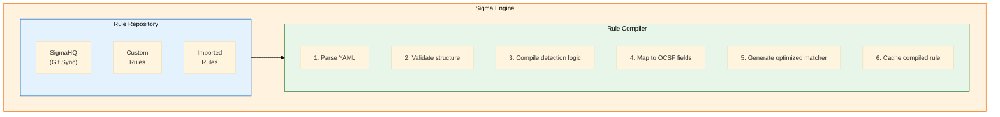

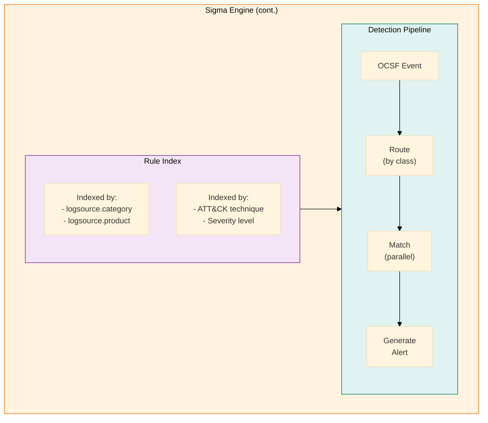

**Optimization Strategies:**
- Rules grouped by logsource for O(1) routing
- Parallel evaluation within groups
- Short-circuit on first match (configurable)
- Bloom filter pre-check for keyword rules

### Sigma to OCSF Field Mapping

```yaml
# Logsource to OCSF Class Mapping
logsource_mappings:
  
  process_creation:
    windows:
      ocsf_class_uid: 1007  # Process Activity
      field_map:
        Image: process.file.path
        CommandLine: process.cmd_line
        User: actor.user.name
        ParentImage: parent_process.file.path
        ParentCommandLine: parent_process.cmd_line
        Hashes: process.file.hashes
        ProcessId: process.pid
        ParentProcessId: parent_process.pid
        CurrentDirectory: process.cwd
        IntegrityLevel: process.integrity
        
    linux:
      ocsf_class_uid: 1007
      field_map:
        Image: process.file.path
        CommandLine: process.cmd_line
        User: actor.user.name
        ParentImage: parent_process.file.path
        
  network_connection:
    any:
      ocsf_class_uid: 4001  # Network Activity
      field_map:
        SourceIp: src_endpoint.ip
        SourcePort: src_endpoint.port
        DestinationIp: dst_endpoint.ip
        DestinationPort: dst_endpoint.port
        Protocol: connection_info.protocol_name
        
  file_event:
    windows:
      ocsf_class_uid: 1001  # File Activity
      field_map:
        TargetFilename: file.path
        Image: actor.process.file.path
        User: actor.user.name
```

---

## Correlation Engine Architecture

### Attack Chain Detection

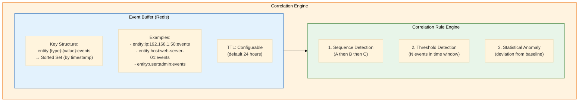

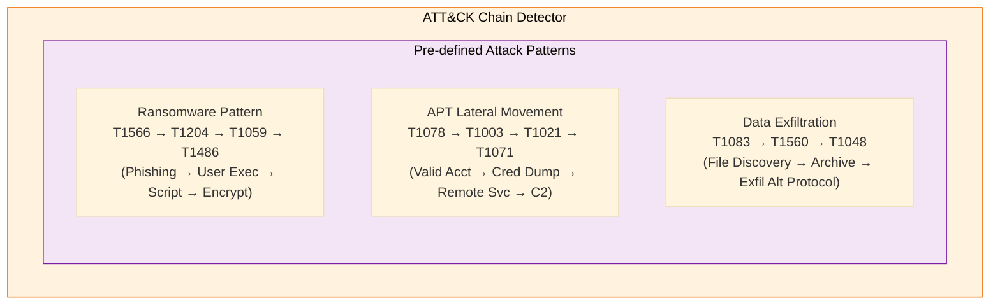

**Correlation Rule Examples:**

| Rule Type | Example | Parameters |
|-----------|---------|------------|
| Sequence | Initial Access to C2 | T1190 → T1059 → T1071 within 1h |
| Threshold | Brute Force Detection | 10+ auth failures in 5m by IP/user |
| Statistical | Unusual Outbound Data | bytes_out > 3x stddev from 7d baseline |

---

## Deployment Architecture

### Docker Compose (Development/Small)

```yaml
# docker-compose.yml
version: '3.8'

services:
  # Frontend
  ui:
    image: oap/ui:latest
    ports:
      - "443:443"
    depends_on:
      - api
      
  # API Gateway
  api:
    image: oap/api:latest
    ports:
      - "8080:8080"
    depends_on:
      - sigma-engine
      - correlation-engine
      - opensearch
      
  # Core Services
  sigma-engine:
    image: oap/sigma-engine:latest
    depends_on:
      - kafka
      - redis
      
  correlation-engine:
    image: oap/correlation-engine:latest
    depends_on:
      - kafka
      - redis
      
  normalizer:
    image: oap/normalizer:latest
    depends_on:
      - kafka
      
  # Data Processing
  kafka:
    image: bitnami/kafka:latest
    ports:
      - "9092:9092"
      
  # Data Storage
  opensearch:
    image: opensearchproject/opensearch:2
    ports:
      - "9200:9200"
    volumes:
      - opensearch-data:/usr/share/opensearch/data
      
  postgres:
    image: postgres:15
    volumes:
      - postgres-data:/var/lib/postgresql/data
      
  redis:
    image: redis:7
    
volumes:
  opensearch-data:
  postgres-data:
```

### Kubernetes (Production)

```yaml
# Simplified Kubernetes architecture
apiVersion: v1
kind: Namespace
metadata:
  name: open-attck-platform
---
# StatefulSets for stateful components
# - OpenSearch cluster (3 nodes)
# - Kafka cluster (3 brokers)
# - PostgreSQL (primary + replica)
# - Redis (sentinel mode)

# Deployments for stateless components
# - API Gateway (3 replicas, HPA)
# - Sigma Engine (5 replicas, HPA)
# - Correlation Engine (3 replicas)
# - Normalizer (5 replicas, HPA)
# - UI (3 replicas)

# Services
# - LoadBalancer for UI
# - ClusterIP for internal services
# - Headless for StatefulSets

# ConfigMaps & Secrets
# - Application configuration
# - TLS certificates
# - Database credentials
# - API keys
```

---

## Security Architecture

### Authentication & Authorization

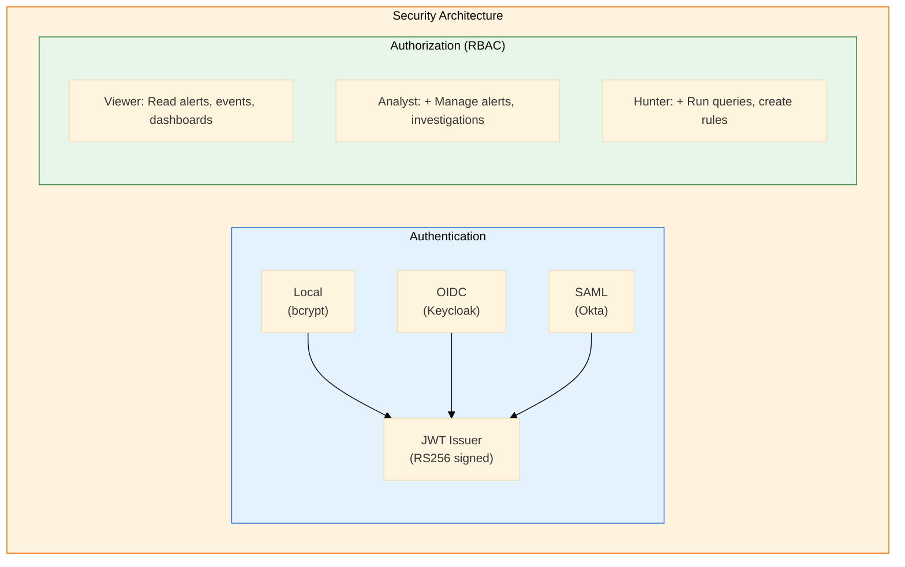

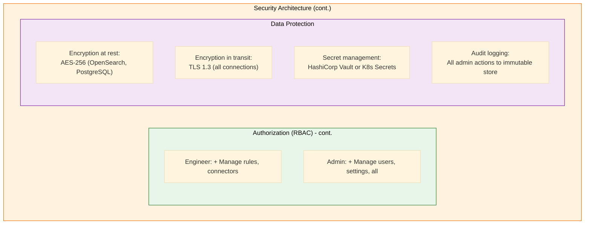

---

## API Specification

### Core Endpoints

```yaml
openapi: 3.0.0
info:
  title: Open ATT&CK Platform API
  version: 1.0.0

paths:
  # Alerts
  /api/v1/alerts:
    get:
      summary: List alerts
      parameters:
        - name: severity
        - name: status
        - name: technique
        - name: time_range
    post:
      summary: Create manual alert
      
  /api/v1/alerts/{id}:
    get:
      summary: Get alert details
    patch:
      summary: Update alert (status, assignment)
      
  # Events
  /api/v1/events/search:
    post:
      summary: Search events
      requestBody:
        content:
          application/json:
            schema:
              type: object
              properties:
                query: string
                time_range: object
                filters: array
                
  # Rules
  /api/v1/rules:
    get:
      summary: List Sigma rules
    post:
      summary: Create new rule
      
  /api/v1/rules/import:
    post:
      summary: Import rules from SigmaHQ
      
  /api/v1/rules/{id}/test:
    post:
      summary: Test rule against historical data
      
  # ATT&CK Coverage
  /api/v1/coverage:
    get:
      summary: Get ATT&CK coverage metrics
      
  /api/v1/coverage/gaps:
    get:
      summary: Get coverage gaps
      
  /api/v1/coverage/navigator:
    get:
      summary: Export ATT&CK Navigator layer
      
  # Connectors
  /api/v1/connectors:
    get:
      summary: List connectors
    post:
      summary: Add new connector
      
  /api/v1/connectors/{id}/test:
    post:
      summary: Test connector connectivity
      
  # Response
  /api/v1/response/actions:
    get:
      summary: List available actions
    post:
      summary: Execute response action
```

---

## Performance Specifications

### Benchmarks

| Metric | Target | Test Methodology |
|--------|--------|------------------|
| Event Ingestion | 50,000 EPS | Sustained load test, 1 hour |
| Sigma Evaluation | < 10ms per event | 5,000 rules active |
| Search Latency | < 3 seconds | 7-day range, complex query |
| Alert Generation | < 30 seconds E2E | From event to UI |
| Dashboard Load | < 2 seconds | Cold cache |
| API Response | < 200ms P95 | Under load |

### Optimization Strategies

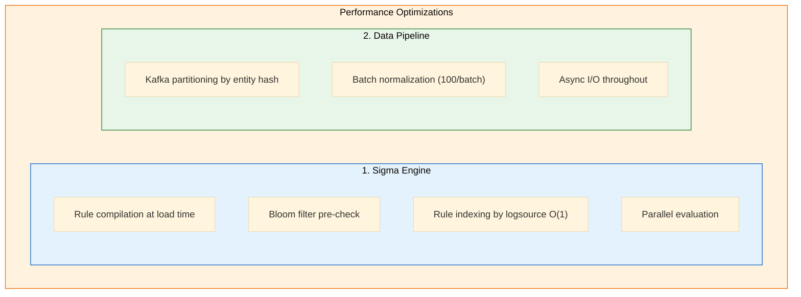

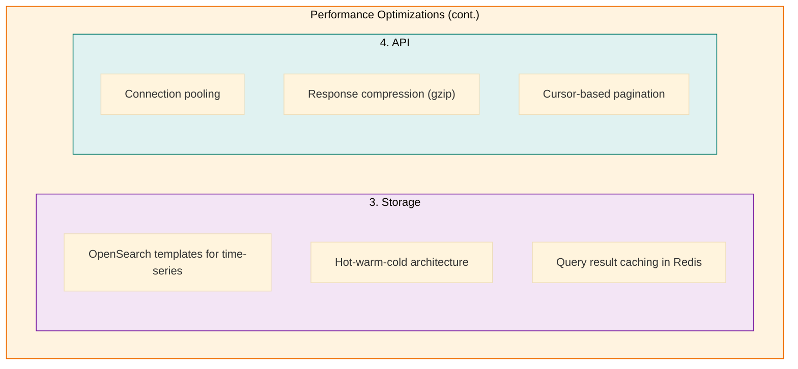

---

## Appendix: Technology Decisions

### Decision Log

| Decision | Choice | Rationale | Alternatives Considered |
|----------|--------|-----------|------------------------|
| Backend Language | Python | Fast development, pySigma ecosystem | Go, Rust |
| Frontend Framework | React | Large ecosystem, team familiarity | Vue, Svelte |
| Event Storage | OpenSearch | Open source, scalable, query flexibility | Elasticsearch, ClickHouse |
| Message Queue | Kafka | Durability, high throughput | Redis Streams, RabbitMQ |
| Cache | Redis | Versatile, pub/sub support | Memcached |
| Metadata DB | PostgreSQL | Reliable, feature-rich | MySQL, CockroachDB |

---

## Additional Architecture Diagrams

> **Note**: This section contains detailed visual architecture references merged from ARCHITECTURE-DIAGRAMS.md

### Complete System Overview

#### High-Level Architecture

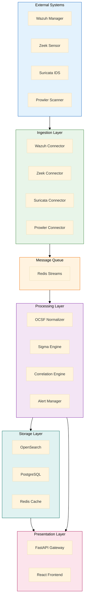

### Data Flow Diagrams

#### Event Ingestion to Alert Flow

```mermaid
%%{init: {'theme': 'base', 'themeVariables': { 'fontSize': '14px' }, 'flowchart': { 'useMaxWidth': true }}}%%
flowchart LR
    subgraph Source["Source"]
        style Source fill:#e3f2fd,stroke:#1565c0
        W[Wazuh Alert]
    end

    subgraph Conn["Connector"]
        style Conn fill:#e8f5e9,stroke:#2e7d32
        WC[Wazuh Connector<br/>Pull API]
    end

    subgraph Q1["Raw Queue"]
        style Q1 fill:#fff3e0,stroke:#ef6c00
        RAW[mxtac:raw:wazuh]
    end

    subgraph Norm["Normalize"]
        style Norm fill:#f3e5f5,stroke:#7b1fa2
        PARSE[Parse Wazuh]
        TRANS[Transform OCSF]
        VALID[Validate Schema]
    end

    subgraph Q2["Normalized Queue"]
        style Q2 fill:#fff3e0,stroke:#ef6c00
        NORM_Q[mxtac:normalized]
    end

    subgraph Detect["Detection"]
        style Detect fill:#ffebee,stroke:#c62828
        ROUTE[Route by Class]
        MATCH[Match Rules]
        GEN[Generate Alert]
    end

    subgraph Q3["Alert Queue"]
        style Q3 fill:#fff3e0,stroke:#ef6c00
        ALERT_Q[mxtac:alerts]
    end

    subgraph Store["Storage"]
        style Store fill:#e0f2f1,stroke:#00695c
        OS[OpenSearch]
        PG[PostgreSQL]
    end

    Source --> Conn --> Q1
    Q1 --> Norm
    Norm --> Q2
    Q2 --> Detect
    Q2 --> Store
    Detect --> Q3
    Q3 --> Store
```

### Sequence Diagrams

#### Alert Detection Sequence

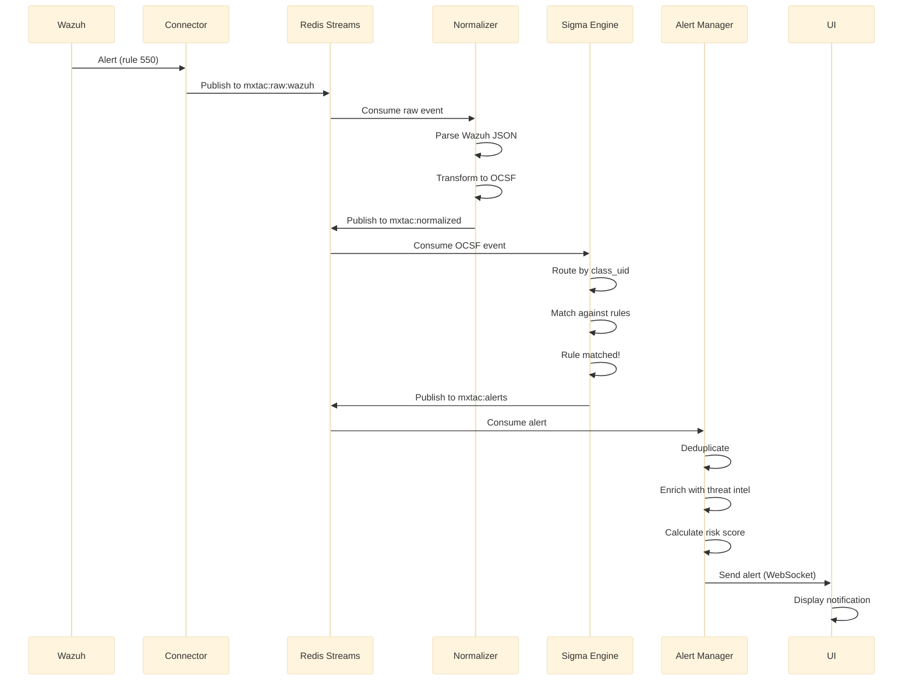

#### User Search Sequence

```mermaid
%%{init: {'theme': 'base', 'themeVariables': { 'fontSize': '14px' }, 'flowchart': { 'useMaxWidth': true }}}%%
sequenceDiagram
    participant U as User
    participant UI as React UI
    participant API as API Gateway
    participant S as Search Service
    participant OS as OpenSearch

    U->>UI: Enter search query
    UI->>UI: Build query DSL
    UI->>API: POST /api/v1/events/search
    API->>API: Validate JWT
    API->>API: Check rate limit
    API->>S: Forward request
    S->>S: Parse query
    S->>OS: Execute search
    OS->>S: Return results (50 events)
    S->>S: Format response
    S->>API: Return formatted results
    API->>UI: JSON response
    UI->>UI: Render results table
    UI->>U: Display results
```

### Deployment Architectures

#### Production Kubernetes

```mermaid
%%{init: {'theme': 'base', 'themeVariables': { 'fontSize': '14px' }, 'flowchart': { 'useMaxWidth': true }}}%%
flowchart TB
    subgraph Internet["Internet"]
        style Internet fill:#e3f2fd,stroke:#1565c0
        USER[Users]
    end

    subgraph K8s["Kubernetes Cluster"]
        style K8s fill:#e8f5e9,stroke:#2e7d32

        subgraph Ingress["Ingress"]
            LB[Cloud LB]
            NGINX[Nginx Ingress]
        end

        subgraph UI_NS["ui namespace"]
            UI1[ui-pod-1]
            UI2[ui-pod-2]
            UI3[ui-pod-3]
        end

        subgraph API_NS["api namespace"]
            API1[api-pod-1]
            API2[api-pod-2]
            API3[api-pod-3]
        end

        subgraph Engine_NS["engine namespace"]
            SIG1[sigma-pod-1]
            SIG2[sigma-pod-2]
            SIG3[sigma-pod-3]
            CORR1[corr-pod-1]
            NORM1[norm-pod-1]
        end

        subgraph Data_NS["data namespace"]
            OS1[opensearch-1]
            OS2[opensearch-2]
            OS3[opensearch-3]
            PG1[postgres-primary]
            PG2[postgres-replica]
            RD1[redis-master]
            RD2[redis-replica]
        end

        subgraph Storage["Persistent Storage"]
            PV1[PV: opensearch-data]
            PV2[PV: postgres-data]
        end
    end

    USER --> LB
    LB --> NGINX
    NGINX --> UI_NS
    UI_NS --> API_NS
    API_NS --> Engine_NS
    Engine_NS --> Data_NS
    Data_NS --> Storage
```

---

*Document maintained by MxTac Project*
*Architecture diagrams updated: 2026-01-19*
