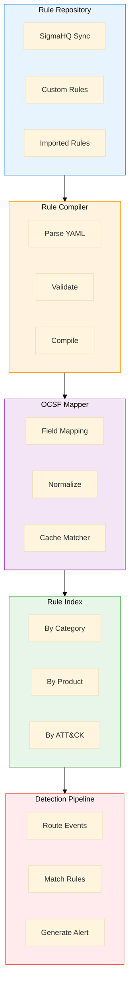
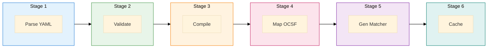
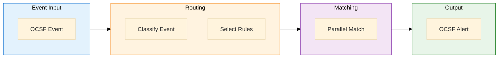
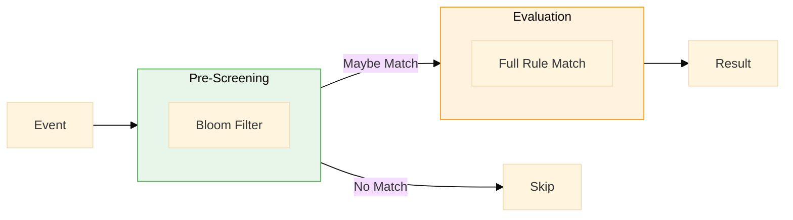

# Sigma Engine Specification

> **Version**: 1.0  
> **Last Updated**: 2025-01-12  
> **Status**: Draft  

## Overview

The Sigma Engine is a **core native component** of MxTac that executes Sigma detection rules directly without converting them to other query languages (like Splunk SPL or Elasticsearch DSL). This native execution approach eliminates vendor lock-in and enables consistent detection across all integrated security tools.

---

## Functional Requirements

| ID | Requirement | Priority | Status |
|----|-------------|----------|--------|
| FR-3.1 | Execute Sigma rules natively without conversion | P0 | Planned |
| FR-3.2 | Import rules from SigmaHQ repository | P0 | Planned |
| FR-3.3 | Support all Sigma modifiers (contains, startswith, etc.) | P0 | Planned |
| FR-3.4 | Support Sigma correlations and aggregations | P1 | Planned |
| FR-3.5 | Custom rule authoring interface | P1 | Planned |
| FR-3.6 | Rule testing and validation sandbox | P2 | Planned |

---

## Technical Specifications

| Metric | Target | Notes |
|--------|--------|-------|
| Sigma Version | 2.0 | Using pySigma library |
| Rule Capacity | 10,000+ | Concurrent active rules |
| Processing Speed | <100ms | Per event evaluation |
| Update Frequency | 6 hours | SigmaHQ sync interval |
| Memory Footprint | <2GB | For full rule set |

---

## Architecture

### High-Level Design



### Component Details

#### 1. Rule Repository

Manages three distinct rule sources:

| Source | Description | Sync Method |
|--------|-------------|-------------|
| **SigmaHQ Git Sync** | Official community rules (~3,000+) | Git pull every 6 hours |
| **Custom Rules** | Organization-specific detections | Manual upload / API |
| **Imported Rules** | Converted from other formats | Import wizard |

**Repository Structure:**
```
/rules
├── /sigmahq          # Synced from SigmaHQ
│   ├── /windows
│   ├── /linux
│   ├── /cloud
│   └── /network
├── /custom           # Organization rules
│   ├── /approved
│   ├── /testing
│   └── /disabled
└── /imported         # Converted rules
```

#### 2. Rule Compiler

Six-stage compilation pipeline:



| Stage | Function | Output |
|-------|----------|--------|
| 1. Parse YAML | Load Sigma rule file | AST representation |
| 2. Validate | Check syntax & semantics | Validation result |
| 3. Compile | Build detection logic | Compiled rule object |
| 4. Map OCSF | Translate field names | OCSF-mapped rule |
| 5. Gen Matcher | Create optimized matcher | Matcher function |
| 6. Cache | Store for fast access | Cache entry |

#### 3. Rule Index

Multi-dimensional indexing for O(1) rule lookup:

| Index Dimension | Example Values | Purpose |
|-----------------|----------------|---------|
| `logsource.category` | process_creation, network_connection, file_event | Primary routing |
| `logsource.product` | windows, linux, aws, azure, gcp | Platform filtering |
| `logsource.service` | sysmon, auditd, cloudtrail | Service-specific |
| ATT&CK Technique | T1059.001, T1003.001 | Threat mapping |
| Severity | critical, high, medium, low | Alert prioritization |

**Index Structure:**
```python
# Pseudo-code representation
rule_index = {
    "category": {
        "process_creation": [rule1, rule2, ...],
        "network_connection": [rule3, rule4, ...],
    },
    "product": {
        "windows": [rule1, rule3, ...],
        "linux": [rule2, rule5, ...],
    },
    "technique": {
        "T1059.001": [rule1, rule7, ...],
        "T1003.001": [rule2, rule8, ...],
    }
}
```

#### 4. Detection Pipeline

Real-time event processing flow:



| Stage | Operation | Performance |
|-------|-----------|-------------|
| Route | Classify by OCSF class_uid | O(1) lookup |
| Select | Get applicable rules from index | O(1) lookup |
| Match | Evaluate rules in parallel | Concurrent |
| Alert | Generate OCSF Detection Finding | <10ms |

---

## Sigma to OCSF Field Mapping

### Process Events (OCSF Class 1007)

| Sigma Field | OCSF Field | Description |
|-------------|------------|-------------|
| `ProcessId` | `process.pid` | Process ID |
| `Image` | `process.file.path` | Executable path |
| `CommandLine` | `process.cmd_line` | Command line |
| `CurrentDirectory` | `process.file.parent_folder` | Working directory |
| `User` | `actor.user.name` | User name |
| `ParentProcessId` | `process.parent_process.pid` | Parent PID |
| `ParentImage` | `process.parent_process.file.path` | Parent executable |
| `ParentCommandLine` | `process.parent_process.cmd_line` | Parent command |
| `Hashes` | `process.file.hashes` | File hashes |
| `IntegrityLevel` | `process.integrity` | Process integrity |

### Network Events (OCSF Class 4001)

| Sigma Field | OCSF Field | Description |
|-------------|------------|-------------|
| `DestinationIp` | `dst_endpoint.ip` | Destination IP |
| `DestinationPort` | `dst_endpoint.port` | Destination port |
| `DestinationHostname` | `dst_endpoint.hostname` | Destination host |
| `SourceIp` | `src_endpoint.ip` | Source IP |
| `SourcePort` | `src_endpoint.port` | Source port |
| `Protocol` | `connection_info.protocol_name` | Protocol |

### File Events (OCSF Class 1001)

| Sigma Field | OCSF Field | Description |
|-------------|------------|-------------|
| `TargetFilename` | `file.path` | File path |
| `TargetFileHash` | `file.hashes` | File hashes |
| `CreationUtcTime` | `file.created_time` | Creation time |

### Authentication Events (OCSF Class 3002)

| Sigma Field | OCSF Field | Description |
|-------------|------------|-------------|
| `TargetUserName` | `user.name` | Target user |
| `TargetDomainName` | `user.domain` | Target domain |
| `LogonType` | `logon_type` | Logon type |
| `IpAddress` | `src_endpoint.ip` | Source IP |
| `WorkstationName` | `src_endpoint.hostname` | Source host |

---

## Performance Optimizations

### 1. Bloom Filter Pre-screening



- **Purpose**: Quickly eliminate events that cannot match any rule
- **False Positive Rate**: <1%
- **Performance Gain**: 10x reduction in full evaluations

### 2. Compiled Matchers

| Approach | Performance | Memory |
|----------|-------------|--------|
| Interpreted | ~500ms/event | Low |
| **Compiled** | **<100ms/event** | Medium |
| JIT Compiled | <50ms/event | High |

### 3. Parallel Rule Evaluation

```python
# Pseudo-code for parallel matching
async def evaluate_event(event, applicable_rules):
    tasks = [
        match_rule(event, rule) 
        for rule in applicable_rules
    ]
    results = await asyncio.gather(*tasks)
    return [r for r in results if r.matched]
```

### 4. Rule Caching Strategy

| Cache Level | Contents | TTL |
|-------------|----------|-----|
| L1 (Memory) | Hot rules | 1 hour |
| L2 (Redis) | All compiled | 24 hours |
| L3 (Disk) | Source YAML | Persistent |

---

## Sigma Modifier Support

Full support for all Sigma 2.0 modifiers:

### String Modifiers

| Modifier | Description | Example |
|----------|-------------|---------|
| `contains` | Substring match | `*malware*` |
| `startswith` | Prefix match | `C:\Windows\*` |
| `endswith` | Suffix match | `*.exe` |
| `base64` | Base64 decode | Encoded commands |
| `base64offset` | Base64 with offset | Obfuscated strings |
| `wide` | UTF-16LE encoding | Unicode strings |
| `re` | Regular expression | Complex patterns |

### Numeric Modifiers

| Modifier | Description | Example |
|----------|-------------|---------|
| `gt` | Greater than | `> 1000` |
| `gte` | Greater or equal | `>= 1000` |
| `lt` | Less than | `< 100` |
| `lte` | Less or equal | `<= 100` |

### Logical Modifiers

| Modifier | Description | Example |
|----------|-------------|---------|
| `all` | All values match | AND logic |
| `any` | Any value matches | OR logic (default) |

---

## Correlation Engine Integration

The Sigma Engine integrates with MxTac's Correlation Engine for:

### Supported Correlation Types

| Type | Description | Use Case |
|------|-------------|----------|
| `event_count` | Count events in window | Brute force detection |
| `value_count` | Count unique values | Spray attacks |
| `temporal` | Time-based sequence | Kill chain detection |

### Example Correlation Rule

```yaml
title: Multiple Failed Logins Followed by Success
name: brute_force_success
type: event_count
rules:
    failed_login:
        - failed_login_sigma_rule
    successful_login:
        - successful_login_sigma_rule
group-by:
    - src_endpoint.ip
    - user.name
timespan: 5m
condition: failed_login >= 5 and successful_login >= 1
action: alert
```

---

## API Specification

### Rule Management

| Endpoint | Method | Description |
|----------|--------|-------------|
| `/api/v1/sigma/rules` | GET | List all rules |
| `/api/v1/sigma/rules` | POST | Create rule |
| `/api/v1/sigma/rules/{id}` | GET | Get rule |
| `/api/v1/sigma/rules/{id}` | PUT | Update rule |
| `/api/v1/sigma/rules/{id}` | DELETE | Delete rule |
| `/api/v1/sigma/rules/{id}/test` | POST | Test rule |

### Sync Management

| Endpoint | Method | Description |
|----------|--------|-------------|
| `/api/v1/sigma/sync/status` | GET | Sync status |
| `/api/v1/sigma/sync/trigger` | POST | Manual sync |
| `/api/v1/sigma/sync/history` | GET | Sync history |

### Detection

| Endpoint | Method | Description |
|----------|--------|-------------|
| `/api/v1/sigma/detect` | POST | Evaluate event |
| `/api/v1/sigma/stats` | GET | Detection stats |

---

## Deployment Configuration

### Environment Variables

```bash
# Sigma Engine Configuration
SIGMA_RULE_PATH=/data/rules
SIGMA_CACHE_SIZE=10000
SIGMA_PARALLEL_WORKERS=8
SIGMA_SYNC_INTERVAL=21600  # 6 hours in seconds

# SigmaHQ Sync
SIGMAHQ_REPO_URL=https://github.com/SigmaHQ/sigma.git
SIGMAHQ_BRANCH=master
SIGMAHQ_ENABLED=true

# Performance Tuning
SIGMA_BLOOM_FILTER_SIZE=1000000
SIGMA_BLOOM_FP_RATE=0.01
SIGMA_MATCHER_CACHE_TTL=3600
```

### Docker Compose Service

```yaml
sigma-engine:
  image: mxtac/sigma-engine:latest
  environment:
    - SIGMA_RULE_PATH=/data/rules
    - SIGMA_CACHE_SIZE=10000
    - SIGMA_PARALLEL_WORKERS=8
  volumes:
    - sigma-rules:/data/rules
    - sigma-cache:/data/cache
  depends_on:
    - redis
    - kafka
  deploy:
    resources:
      limits:
        memory: 4G
        cpus: '4'
```

---

## Metrics & Monitoring

### Key Metrics

| Metric | Type | Description |
|--------|------|-------------|
| `sigma_rules_total` | Gauge | Total loaded rules |
| `sigma_rules_active` | Gauge | Active rules |
| `sigma_events_processed` | Counter | Events evaluated |
| `sigma_detections_total` | Counter | Total detections |
| `sigma_evaluation_duration_ms` | Histogram | Evaluation time |
| `sigma_cache_hit_ratio` | Gauge | Cache effectiveness |

### Health Checks

| Check | Endpoint | Healthy Response |
|-------|----------|------------------|
| Liveness | `/health/live` | 200 OK |
| Readiness | `/health/ready` | 200 OK (rules loaded) |
| Rules | `/health/rules` | Rule count > 0 |

---

## References

- [Sigma Specification](https://github.com/SigmaHQ/sigma-specification)
- [pySigma Documentation](https://sigmahq-pysigma.readthedocs.io/)
- [SigmaHQ Rule Repository](https://github.com/SigmaHQ/sigma)
- [OCSF Schema](https://schema.ocsf.io/)
- [MITRE ATT&CK Framework](https://attack.mitre.org/)
