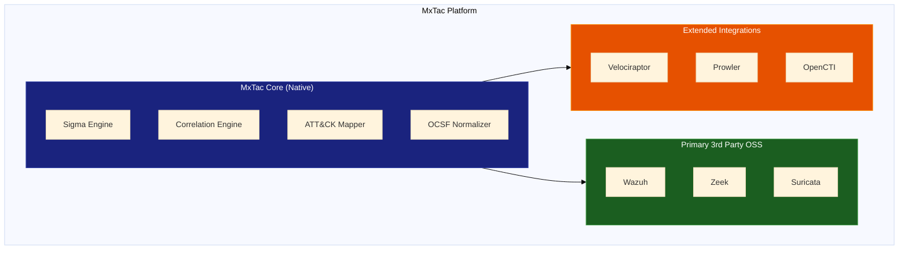

# MxTac - ATT&CK Technique Coverage Map

> **Document Type**: Solution-to-Technique Mapping  
> **Version**: 2.0  
> **Date**: January 2026  
> **ATT&CK Version**: v18  
> **Project**: MxTac (Matrix + Tactic)

---

## Overview

This document maps MITRE ATT&CK Enterprise techniques to MxTac platform capabilities, showing coverage from both **MxTac Core** (native) solutions and **Primary 3rd Party OSS** integrations. Use this guide to understand what techniques are covered and which solutions are required for your organization.

---

## Solution Architecture

### MxTac Platform Components

MxTac provides a unified ATT&CK-native security platform through two categories of solutions:



---

## Solution Categories

### Category 1: MxTac Core (Native Solutions)

These components are **developed and maintained by MxTac** and form the platform's foundation:

| Component | Function | Key Capabilities |
|-----------|----------|------------------|
| **MxTac Sigma Engine** | Detection | Native Sigma rule execution, no conversion needed |
| **MxTac Correlation Engine** | Detection | Cross-source event correlation, attack chain detection |
| **MxTac ATT&CK Mapper** | Analysis | Technique mapping, coverage calculation, gap analysis |
| **MxTac OCSF Normalizer** | Data Processing | Schema normalization, field mapping, enrichment |
| **MxTac Alert Manager** | Operations | Alert deduplication, scoring, workflow |
| **MxTac Response Orchestrator** | Response | Playbook execution, automated actions |
| **MxTac Dashboard** | Visualization | ATT&CK Navigator, coverage heatmaps, reporting |

### Category 2: Primary 3rd Party OSS (Required Integrations)

These are **established open-source tools** that MxTac integrates as primary data sources:

| Tool | Category | License | Role in MxTac |
|------|----------|---------|---------------|
| **Wazuh** | EDR/HIDS | GPLv2 | Primary endpoint detection and response |
| **Zeek** | NDR | BSD | Primary network metadata and analysis |
| **Suricata** | IDS/IPS | GPLv2 | Primary network signature detection/prevention |

### Category 3: Extended Integrations (Optional)

Additional OSS tools that can be integrated for expanded coverage:

| Tool | Category | License | Use Case |
|------|----------|---------|----------|
| **Velociraptor** | Forensics | AGPL-3.0 | Deep threat hunting, incident response |
| **osquery** | Visibility | Apache 2.0 | Endpoint inventory, compliance queries |
| **Prowler** | Cloud Security | Apache 2.0 | Cloud posture management (AWS/Azure/GCP) |
| **Trivy** | Container Security | Apache 2.0 | Container/IaC vulnerability scanning |
| **OpenCTI** | Threat Intel | Apache 2.0 | Threat intelligence management |
| **MISP** | Threat Intel | AGPL-3.0 | IOC sharing and correlation |
| **Shuffle** | SOAR | AGPL-3.0 | Advanced playbook automation |

---

## Legend

| Symbol | Meaning |
|--------|---------|
| **D** | Detection capability |
| **P** | Prevention capability |
| **D/P** | Both detection and prevention |
| **~** | Partial/Limited capability |
| **-** | No capability |

### Solution Abbreviations

| Abbrev | Solution | Category | Provider |
|--------|----------|----------|----------|
| **MX-S** | MxTac Sigma Engine | Detection | MxTac Core |
| **MX-C** | MxTac Correlation Engine | Correlation | MxTac Core |
| **MX-A** | MxTac ATT&CK Mapper | Analysis | MxTac Core |
| **WAZ** | Wazuh | EDR/HIDS | Primary 3rd Party |
| **ZEK** | Zeek | NDR | Primary 3rd Party |
| **SUR** | Suricata | IDS/IPS | Primary 3rd Party |
| **VEL** | Velociraptor | Forensics | Extended |
| **PRO** | Prowler | Cloud Security | Extended |
| **CTI** | OpenCTI/MISP | Threat Intel | Extended |

---

## Quick Reference: Coverage by Solution Type

```
┌─────────────────────────────────────────────────────────────────────────┐
│                    MxTac Platform Coverage Architecture                 │
├─────────────────────────────────────────────────────────────────────────┤
│                                                                         │
│  ╔═══════════════════════════════════════════════════════════════════╗ │
│  ║                    MxTac CORE (Native)                            ║ │
│  ║  ┌─────────────┐ ┌─────────────┐ ┌─────────────┐ ┌─────────────┐ ║ │
│  ║  │   Sigma     │ │ Correlation │ │   ATT&CK    │ │    OCSF     │ ║ │
│  ║  │   Engine    │ │   Engine    │ │   Mapper    │ │ Normalizer  │ ║ │
│  ║  │     D       │ │     D       │ │   Analysis  │ │    Data     │ ║ │
│  ║  └─────────────┘ └─────────────┘ └─────────────┘ └─────────────┘ ║ │
│  ╚═══════════════════════════════════════════════════════════════════╝ │
│                                  │                                      │
│                    ┌─────────────┴─────────────┐                       │
│                    ▼                           ▼                        │
│  ╔════════════════════════════╗  ╔════════════════════════════╗       │
│  ║  PRIMARY 3RD PARTY OSS    ║  ║  EXTENDED INTEGRATIONS    ║       │
│  ║  (Required)               ║  ║  (Optional)               ║       │
│  ║  ┌───────┐ ┌─────┐ ┌────┐ ║  ║  ┌─────┐ ┌─────┐ ┌─────┐ ║       │
│  ║  │ Wazuh │ │Zeek │ │Suri║  ║  │Veloc│ │Prowl│ │ CTI │ ║       │
│  ║  │ D/P   │ │ D   │ │D/P │ ║  ║  │ D   │ │ D   │ │ D   │ ║       │
│  ║  │Endpnt │ │ NDR │ │IDS │ ║  ║  │Hunt │ │Cloud│ │Intel│ ║       │
│  ║  └───────┘ └─────┘ └────┘ ║  ║  └─────┘ └─────┘ └─────┘ ║       │
│  ╚════════════════════════════╝  ╚════════════════════════════╝       │
│                                                                         │
└─────────────────────────────────────────────────────────────────────────┘
```

---

## Coverage Summary by Tactic

### Overall Platform Coverage

| Tactic | MxTac Core | Wazuh | Zeek | Suricata | Combined | Best Source |
|--------|------------|-------|------|----------|----------|-------------|
| Reconnaissance | D | 7% | 28% | 14% | 35% | Zeek + CTI |
| Resource Development | D | 0% | 33% | 13% | 38% | Zeek + CTI |
| Initial Access | D | 90% | 70% | 60% | 95% | Wazuh |
| Execution | D | 94% | 6% | 11% | 96% | Wazuh |
| Persistence | D | 96% | 4% | 2% | 97% | Wazuh |
| Privilege Escalation | D | 95% | 5% | 5% | 96% | Wazuh |
| Defense Evasion | D | 97% | 20% | 16% | 98% | Wazuh |
| Credential Access | D | 93% | 45% | 28% | 96% | Wazuh |
| Discovery | D | 91% | 32% | 5% | 93% | Wazuh |
| Lateral Movement | D | 90% | 80% | 70% | 95% | Wazuh + Zeek |
| Collection | D | 94% | 50% | 16% | 96% | Wazuh |
| Command and Control | D | 89% | 100% | 100% | 100% | Zeek + Suricata |
| Exfiltration | D | 84% | 84% | 74% | 95% | Zeek + Wazuh |
| Impact | D | 93% | 36% | 43% | 95% | Wazuh |

**Note**: MxTac Core provides detection enhancement through Sigma rules and correlation across all tactics. The "Combined" column shows coverage when all Primary 3rd Party tools are deployed together.

---

## TA0043 - Reconnaissance

> The adversary is trying to gather information they can use to plan future operations.

**MxTac Core**: Sigma Engine + Correlation Engine for pattern detection  
**Primary 3rd Party**: Zeek (network), Suricata (signatures)  
**Extended**: OpenCTI (threat intel)

| ID | Technique | MX-S | MX-C | WAZ | ZEK | SUR | CTI | Notes |
|----|-----------|------|------|-----|-----|-----|-----|-------|
| T1595 | Active Scanning | D | D | - | D | D | D | Network perimeter visibility |
| T1595.001 | └─ Scanning IP Blocks | D | D | - | D | D | D | Detect scan patterns |
| T1595.002 | └─ Vulnerability Scanning | D | D | - | D | D/P | D | IDS signatures for scanners |
| T1595.003 | └─ Wordlist Scanning | D | D | - | D | D | - | HTTP request patterns |
| T1592 | Gather Victim Host Info | D | - | - | ~D | - | D | Limited visibility |
| T1592.001 | └─ Hardware | - | - | - | - | - | D | Threat intel correlation |
| T1592.002 | └─ Software | D | - | - | ~D | - | D | User-agent analysis |
| T1592.003 | └─ Firmware | - | - | - | - | - | D | Threat intel only |
| T1592.004 | └─ Client Configs | - | - | - | - | - | D | Threat intel only |
| T1589 | Gather Victim Identity | - | - | - | - | - | D | Threat intel correlation |
| T1589.001 | └─ Credentials | D | - | - | - | - | D | Leaked credential monitoring |
| T1589.002 | └─ Email Addresses | - | - | - | - | - | D | Threat intel feeds |
| T1589.003 | └─ Employee Names | - | - | - | - | - | D | OSINT monitoring |
| T1590 | Gather Victim Network | D | D | - | ~D | - | D | External scan detection |
| T1590.001 | └─ Domain Properties | D | - | - | D | - | D | DNS monitoring |
| T1590.002 | └─ DNS | D | D | - | D | - | D | Passive DNS analysis |
| T1590.003 | └─ Network Trust | - | - | - | - | - | D | Threat intel only |
| T1590.004 | └─ Network Topology | - | - | - | - | - | D | Threat intel only |
| T1590.005 | └─ IP Addresses | D | D | - | D | - | D | Scan detection |
| T1590.006 | └─ Security Appliances | - | - | - | - | - | D | Threat intel only |
| T1591 | Gather Victim Org Info | - | - | - | - | - | D | OSINT/threat intel |
| T1598 | Phishing for Info | D | D | D | D | D | D | Email + network analysis |
| T1598.001 | └─ Spearphishing Service | D | D | D | - | - | D | Email gateway logs |
| T1598.002 | └─ Spearphishing Attach. | D | D | D | D | D | D | Email + file analysis |
| T1598.003 | └─ Spearphishing Link | D | D | D | D | D | D | URL analysis |
| T1598.004 | └─ Spearphishing Voice | - | - | - | - | - | D | Limited, threat intel |
| T1597 | Search Closed Sources | - | - | - | - | - | D | Threat intel only |
| T1596 | Search Open Tech DB | D | - | - | D | - | D | Limited visibility |
| T1593 | Search Open Websites | - | - | - | - | - | D | OSINT monitoring |
| T1594 | Search Victim Websites | D | - | - | - | - | D | Web log analysis |

### Reconnaissance Coverage by Provider

| Provider | Type | Techniques | Coverage |
|----------|------|------------|----------|
| MxTac Sigma Engine | Core | 15/43 | 35% |
| MxTac Correlation | Core | 8/43 | 19% |
| Zeek | Primary 3rd Party | 12/43 | 28% |
| Suricata | Primary 3rd Party | 6/43 | 14% |
| Wazuh | Primary 3rd Party | 3/43 | 7% |
| OpenCTI | Extended | 43/43 | 100% (intel) |

---

## TA0042 - Resource Development

> The adversary is trying to establish resources they can use to support operations.

**MxTac Core**: Correlation with threat intel feeds  
**Primary 3rd Party**: Zeek (domain/cert monitoring)  
**Extended**: OpenCTI/MISP (threat intel)

| ID | Technique | MX-S | MX-C | WAZ | ZEK | SUR | CTI | Notes |
|----|-----------|------|------|-----|-----|-----|-----|-------|
| T1650 | Acquire Access | - | D | - | - | - | D | Dark web monitoring |
| T1583 | Acquire Infrastructure | D | D | - | - | - | D | Threat intel tracking |
| T1583.001 | └─ Domains | D | D | - | D | - | D | Newly registered domain feeds |
| T1583.002 | └─ DNS Server | D | D | - | D | - | D | DNS infrastructure tracking |
| T1583.003 | └─ Virtual Private Server | - | D | - | - | - | D | Threat intel |
| T1583.004 | └─ Server | - | D | - | - | - | D | Threat intel |
| T1583.005 | └─ Botnet | D | D | - | D | D | D | C2 feed correlation |
| T1583.006 | └─ Web Services | D | D | - | D | - | D | Known bad service tracking |
| T1583.007 | └─ Serverless | - | - | - | - | - | D | Threat intel |
| T1583.008 | └─ Malvertising | D | D | - | D | D | D | Ad network monitoring |
| T1586 | Compromise Accounts | - | D | - | - | - | D | Credential leak monitoring |
| T1584 | Compromise Infrastructure | D | D | - | D | - | D | Domain reputation |
| T1587 | Develop Capabilities | - | D | - | - | - | D | Malware tracking |
| T1587.001 | └─ Malware | D | D | - | - | - | D | Malware family tracking |
| T1587.002 | └─ Code Signing Certs | D | D | - | - | - | D | Cert abuse tracking |
| T1587.003 | └─ Digital Certificates | D | D | - | D | - | D | Cert transparency |
| T1587.004 | └─ Exploits | D | - | - | - | - | D | Exploit intelligence |
| T1585 | Establish Accounts | - | D | - | - | - | D | Threat intel |
| T1588 | Obtain Capabilities | - | D | - | - | - | D | Threat intel |
| T1608 | Stage Capabilities | D | D | - | D | D | D | Staging infrastructure |

### Resource Development Coverage by Provider

| Provider | Type | Techniques | Coverage |
|----------|------|------------|----------|
| MxTac Sigma Engine | Core | 12/45 | 27% |
| MxTac Correlation | Core | 20/45 | 44% |
| Zeek | Primary 3rd Party | 15/45 | 33% |
| Suricata | Primary 3rd Party | 6/45 | 13% |
| OpenCTI | Extended | 45/45 | 100% (intel) |

---

## TA0001 - Initial Access

> The adversary is trying to get into your network.

**MxTac Core**: Sigma rules + correlation for multi-vector detection  
**Primary 3rd Party**: Wazuh (endpoint), Zeek (network), Suricata (IPS)  
**Extended**: Prowler (cloud)

| ID | Technique | MX-S | MX-C | WAZ | ZEK | SUR | PRO | Notes |
|----|-----------|------|------|-----|-----|-----|-----|-------|
| T1189 | Drive-by Compromise | D | D | D | D | D/P | - | Browser + network detection |
| T1190 | Exploit Public-Facing App | D | D | D | D | D/P | D | WAF logs + IDS + cloud |
| T1133 | External Remote Services | D | D | D | D | D | D | VPN/RDP monitoring |
| T1200 | Hardware Additions | D | - | D | - | - | - | USB/device detection |
| T1566 | Phishing | D | D | D | D | D/P | - | Email gateway + network |
| T1566.001 | └─ Spearphishing Attach. | D | D | D | D | D/P | - | File analysis |
| T1566.002 | └─ Spearphishing Link | D | D | D | D | D/P | - | URL analysis |
| T1566.003 | └─ Spearphishing via Svc | D | D | D | D | D | - | Social media/messaging |
| T1566.004 | └─ Spearphishing Voice | - | - | - | - | - | - | Limited detection |
| T1091 | Replication Through Media | D | - | D | - | - | - | USB monitoring |
| T1195 | Supply Chain Compromise | D | D | ~D | - | - | D | Limited visibility |
| T1195.001 | └─ Compromise SW Deps | D | D | ~D | - | - | D | Package monitoring |
| T1195.002 | └─ Compromise SW Supply | D | D | ~D | - | - | D | Binary verification |
| T1195.003 | └─ Compromise HW Supply | - | - | - | - | - | - | Hardware audit |
| T1199 | Trusted Relationship | D | D | D | D | D | D | Third-party access logs |
| T1078 | Valid Accounts | D | D | D | D | D | D | Auth monitoring |
| T1078.001 | └─ Default Accounts | D | D | D | D | D | D | Default cred detection |
| T1078.002 | └─ Domain Accounts | D | D | D | D | D | - | AD monitoring |
| T1078.003 | └─ Local Accounts | D | D | D | - | - | - | Local auth logs |
| T1078.004 | └─ Cloud Accounts | D | D | D | - | - | D | Cloud auth monitoring |

### Initial Access Coverage by Provider

| Provider | Type | Detection | Prevention | Coverage |
|----------|------|-----------|------------|----------|
| MxTac Sigma Engine | Core | 18/20 | - | 90% |
| MxTac Correlation | Core | 16/20 | - | 80% |
| Wazuh | Primary 3rd Party | 18/20 | 2/20 | 90% (D) |
| Zeek | Primary 3rd Party | 14/20 | - | 70% (D) |
| Suricata | Primary 3rd Party | 12/20 | 8/20 | 60% (D), 40% (P) |
| Prowler | Extended | 8/20 | - | 40% (D) |

### Initial Access - Required Solutions

```
┌─────────────────────────────────────────────────────────────────────────┐
│  Initial Access Defense Stack                                           │
├─────────────────────────────────────────────────────────────────────────┤
│                                                                         │
│  ╔═════════════════════════════════════════════════════════════════╗   │
│  ║  MxTac Core                                                      ║   │
│  ║  • Sigma Engine: 500+ initial access detection rules            ║   │
│  ║  • Correlation: Multi-source attack chain detection             ║   │
│  ╚═════════════════════════════════════════════════════════════════╝   │
│                              │                                          │
│              ┌───────────────┼───────────────┐                         │
│              ▼               ▼               ▼                          │
│  ┌─────────────────┐ ┌─────────────┐ ┌─────────────────┐              │
│  │     Wazuh       │ │    Zeek     │ │    Suricata     │              │
│  │  (Primary 3rd)  │ │(Primary 3rd)│ │  (Primary 3rd)  │              │
│  ├─────────────────┤ ├─────────────┤ ├─────────────────┤              │
│  │ • Auth logs     │ │ • Protocol  │ │ • IPS blocking  │              │
│  │ • FIM           │ │   analysis  │ │ • Signature     │              │
│  │ • USB detection │ │ • DNS logs  │ │   detection     │              │
│  └─────────────────┘ └─────────────┘ └─────────────────┘              │
│                                                                         │
│  Optional: + Prowler for cloud workloads                               │
│                                                                         │
└─────────────────────────────────────────────────────────────────────────┘
```

---

## TA0002 - Execution

> The adversary is trying to run malicious code.

**MxTac Core**: Sigma rules for command-line and process monitoring  
**Primary 3rd Party**: Wazuh (comprehensive endpoint monitoring)  
**Extended**: Velociraptor (deep hunting), Prowler (cloud)

| ID | Technique | MX-S | MX-C | WAZ | ZEK | SUR | PRO | Notes |
|----|-----------|------|------|-----|-----|-----|-----|-------|
| T1651 | Cloud Admin Command | D | D | - | - | - | D | Cloud audit logs |
| T1059 | Command & Scripting | D | D | D/P | - | - | - | Process monitoring |
| T1059.001 | └─ PowerShell | D | D | D/P | - | - | - | Script block logging |
| T1059.002 | └─ AppleScript | D | D | D | - | - | - | macOS process mon |
| T1059.003 | └─ Windows Cmd | D | D | D/P | - | - | - | Command line logging |
| T1059.004 | └─ Unix Shell | D | D | D/P | - | - | - | Shell command logging |
| T1059.005 | └─ Visual Basic | D | D | D/P | - | - | - | VBS execution |
| T1059.006 | └─ Python | D | D | D | - | - | - | Interpreter monitoring |
| T1059.007 | └─ JavaScript | D | D | D | D | D | - | Browser + host JS |
| T1059.008 | └─ Network Device CLI | D | D | D | D | - | - | Network device logs |
| T1059.009 | └─ Cloud API | D | D | - | - | - | D | Cloud API audit |
| T1059.010 | └─ AutoHotKey & AutoIt | D | D | D | - | - | - | Process monitoring |
| T1609 | Container Admin Command | D | D | D | - | - | D | Container audit |
| T1610 | Deploy Container | D | D | D | - | - | D | Container orchestration |
| T1203 | Exploitation for Client | D | D | D | D | D/P | - | Exploit detection |
| T1559 | Inter-Process Comm. | D | D | D | - | - | - | IPC monitoring |
| T1559.001 | └─ Component Object Model | D | D | D | - | - | - | COM object tracking |
| T1559.002 | └─ Dynamic Data Exchange | D | D | D | - | - | - | DDE detection |
| T1559.003 | └─ XPC Services | D | D | D | - | - | - | macOS XPC |
| T1106 | Native API | D | D | D | - | - | - | API call monitoring |
| T1053 | Scheduled Task/Job | D | D | D/P | - | - | D | Task scheduler mon |
| T1053.002 | └─ At | D | D | D/P | - | - | - | at command detection |
| T1053.003 | └─ Cron | D | D | D/P | - | - | - | Cron monitoring |
| T1053.005 | └─ Scheduled Task | D | D | D/P | - | - | - | Windows tasks |
| T1053.006 | └─ Systemd Timers | D | D | D/P | - | - | - | Systemd monitoring |
| T1053.007 | └─ Container Orch. Job | D | D | D | - | - | D | K8s CronJob |
| T1129 | Shared Modules | D | D | D | - | - | - | DLL loading |
| T1072 | Software Deploy Tools | D | D | D | - | - | - | Deployment tool abuse |
| T1569 | System Services | D | D | D/P | - | - | - | Service monitoring |
| T1569.001 | └─ Launchctl | D | D | D/P | - | - | - | macOS launchctl |
| T1569.002 | └─ Service Execution | D | D | D/P | - | - | - | Windows services |
| T1204 | User Execution | D | D | D | D | D | - | User action tracking |
| T1204.001 | └─ Malicious Link | D | D | D | D | D | - | URL + browser mon |
| T1204.002 | └─ Malicious File | D | D | D | D | D | - | File execution |
| T1204.003 | └─ Malicious Image | D | D | D | - | - | D | Container images |
| T1047 | WMI | D | D | D | - | - | - | WMI event monitoring |

### Execution Coverage by Provider

| Provider | Type | Detection | Prevention | Coverage |
|----------|------|-----------|------------|----------|
| MxTac Sigma Engine | Core | 36/36 | - | 100% |
| MxTac Correlation | Core | 34/36 | - | 94% |
| Wazuh | Primary 3rd Party | 34/36 | 14/36 | 94% (D), 39% (P) |
| Zeek | Primary 3rd Party | 4/36 | - | 11% (D) |
| Suricata | Primary 3rd Party | 4/36 | 2/36 | 11% (D), 6% (P) |
| Prowler | Extended | 6/36 | - | 17% (D) |

---

## TA0003 - Persistence

> The adversary is trying to maintain their foothold.

**MxTac Core**: Comprehensive Sigma ruleset for persistence mechanisms  
**Primary 3rd Party**: Wazuh (FIM, registry, scheduled tasks)  
**Extended**: Velociraptor (artifact hunting), Prowler (cloud)

| ID | Technique | MX-S | MX-C | WAZ | ZEK | SUR | PRO | Notes |
|----|-----------|------|------|-----|-----|-----|-----|-------|
| T1098 | Account Manipulation | D | D | D | D | - | D | Account change monitoring |
| T1098.001 | └─ Additional Cloud Creds | D | D | - | - | - | D | Cloud IAM monitoring |
| T1098.002 | └─ Additional Email Perms | D | D | D | - | - | D | Exchange/M365 audit |
| T1098.003 | └─ Additional Cloud Roles | D | D | - | - | - | D | Cloud role changes |
| T1098.004 | └─ SSH Authorized Keys | D | D | D | - | - | - | SSH key monitoring |
| T1098.005 | └─ Device Registration | D | D | D | - | - | D | Device enrollment |
| T1098.006 | └─ Additional Container Roles | D | D | - | - | - | D | K8s RBAC changes |
| T1197 | BITS Jobs | D | D | D | - | - | - | BITS monitoring |
| T1547 | Boot/Logon Autostart | D | D | D | - | - | - | Startup locations |
| T1547.001 | └─ Registry Run Keys | D | D | D | - | - | - | Registry monitoring |
| T1547.002 | └─ Authentication Package | D | D | D | - | - | - | LSA monitoring |
| T1547.003 | └─ Time Providers | D | D | D | - | - | - | Time provider DLLs |
| T1547.004 | └─ Winlogon Helper DLL | D | D | D | - | - | - | Winlogon monitoring |
| T1547.005 | └─ Security Support Provider | D | D | D | - | - | - | SSP monitoring |
| T1547.006 | └─ Kernel Modules/Ext. | D | D | D | - | - | - | Kernel module loading |
| T1547.009 | └─ Shortcut Modification | D | D | D | - | - | - | LNK file monitoring |
| T1547.012 | └─ Print Processors | D | D | D | - | - | - | Print processor DLLs |
| T1547.013 | └─ XDG Autostart | D | D | D | - | - | - | Linux autostart |
| T1547.014 | └─ Active Setup | D | D | D | - | - | - | Active Setup keys |
| T1547.015 | └─ Login Items | D | D | D | - | - | - | macOS login items |
| T1037 | Boot/Logon Init Scripts | D | D | D | - | - | - | Init script monitoring |
| T1176 | Browser Extensions | D | D | D | - | - | - | Extension monitoring |
| T1136 | Create Account | D | D | D | D | - | D | Account creation |
| T1136.001 | └─ Local Account | D | D | D | - | - | - | Local user creation |
| T1136.002 | └─ Domain Account | D | D | D | D | - | - | AD account creation |
| T1136.003 | └─ Cloud Account | D | D | - | - | - | D | Cloud IAM creation |
| T1543 | Create/Modify System Proc | D | D | D | - | - | - | System process changes |
| T1543.001 | └─ Launch Agent | D | D | D | - | - | - | macOS launch agents |
| T1543.002 | └─ Systemd Service | D | D | D | - | - | - | Systemd unit files |
| T1543.003 | └─ Windows Service | D | D | D | - | - | - | Service creation |
| T1543.004 | └─ Launch Daemon | D | D | D | - | - | - | macOS launch daemons |
| T1543.005 | └─ Container Service | D | D | - | - | - | D | K8s services |
| T1546 | Event Triggered Execution | D | D | D | - | - | - | Event-based persistence |
| T1546.001 | └─ Change Default File Assoc | D | D | D | - | - | - | File association |
| T1546.002 | └─ Screensaver | D | D | D | - | - | - | Screensaver abuse |
| T1546.003 | └─ WMI Event Subscription | D | D | D | - | - | - | WMI persistence |
| T1546.004 | └─ Unix Shell Config | D | D | D | - | - | - | Shell RC files |
| T1574 | Hijack Execution Flow | D | D | D | - | - | - | DLL/binary hijacking |
| T1574.001 | └─ DLL Search Order | D | D | D | - | - | - | DLL loading order |
| T1574.002 | └─ DLL Side-Loading | D | D | D | - | - | - | Side-loading detection |
| T1525 | Implant Container Image | D | D | - | - | - | D | Container image scan |
| T1556 | Modify Auth Process | D | D | D | - | - | D | Auth mechanism changes |
| T1137 | Office Application Startup | D | D | D | - | - | - | Office startup |
| T1542 | Pre-OS Boot | D | D | D | - | - | - | Bootkit detection |
| T1053 | Scheduled Task/Job | D | D | D/P | - | - | D | Task scheduler |
| T1505 | Server Software Component | D | D | D | D | D | D | Web server mods |
| T1505.003 | └─ Web Shell | D | D | D | D | D | - | Webshell detection |
| T1205 | Traffic Signaling | D | D | D | D | D | - | Port knocking |
| T1078 | Valid Accounts | D | D | D | D | D | D | Valid account abuse |

### Persistence Coverage by Provider

| Provider | Type | Detection | Prevention | Coverage |
|----------|------|-----------|------------|----------|
| MxTac Sigma Engine | Core | 100/102 | - | 98% |
| MxTac Correlation | Core | 98/102 | - | 96% |
| Wazuh | Primary 3rd Party | 98/102 | 8/102 | 96% (D), 8% (P) |
| Zeek | Primary 3rd Party | 4/102 | - | 4% (D) |
| Suricata | Primary 3rd Party | 2/102 | - | 2% (D) |
| Prowler | Extended | 18/102 | - | 18% (D) |

---

## TA0004 - Privilege Escalation

> The adversary is trying to gain higher-level permissions.

**MxTac Core**: Sigma rules for elevation techniques  
**Primary 3rd Party**: Wazuh (process monitoring, privilege changes)  
**Extended**: Prowler (cloud IAM)

| ID | Technique | MX-S | MX-C | WAZ | ZEK | SUR | PRO | Notes |
|----|-----------|------|------|-----|-----|-----|-----|-------|
| T1548 | Abuse Elevation Control | D | D | D | - | - | - | Elevation abuse |
| T1548.001 | └─ Setuid and Setgid | D | D | D | - | - | - | SUID/SGID monitoring |
| T1548.002 | └─ Bypass UAC | D | D | D | - | - | - | UAC bypass detection |
| T1548.003 | └─ Sudo and Sudo Caching | D | D | D | - | - | - | Sudo abuse |
| T1548.004 | └─ Elevated Execution w/Prompt | D | D | D | - | - | - | macOS elevation |
| T1548.005 | └─ Temporary Elevated Access | D | D | - | - | - | D | Cloud temp elevation |
| T1548.006 | └─ TCC Manipulation | D | D | D | - | - | - | macOS TCC abuse |
| T1134 | Access Token Manipulation | D | D | D | - | - | - | Token manipulation |
| T1134.001 | └─ Token Impersonation | D | D | D | - | - | - | Impersonation |
| T1134.002 | └─ Create Process w/Token | D | D | D | - | - | - | Token-based spawn |
| T1134.003 | └─ Make and Impersonate Token | D | D | D | - | - | - | Token creation |
| T1134.004 | └─ Parent PID Spoofing | D | D | D | - | - | - | PPID spoofing |
| T1134.005 | └─ SID-History Injection | D | D | D | - | - | - | SID history abuse |
| T1484 | Domain/Tenant Policy Mod | D | D | D | D | - | D | Policy changes |
| T1484.001 | └─ Group Policy Modification | D | D | D | - | - | - | GPO changes |
| T1484.002 | └─ Trust Modification | D | D | D | D | - | D | Trust changes |
| T1611 | Escape to Host | D | D | - | - | - | D | Container escape |
| T1068 | Exploitation for Priv Esc | D | D | D | D | D | - | Exploit detection |
| T1055 | Process Injection | D | D | D | - | - | - | Injection detection |
| T1055.001 | └─ DLL Injection | D | D | D | - | - | - | DLL injection |
| T1055.002 | └─ PE Injection | D | D | D | - | - | - | PE injection |
| T1055.012 | └─ Process Hollowing | D | D | D | - | - | - | Hollowing detection |
| T1053 | Scheduled Task/Job | D | D | D/P | - | - | D | See Execution |
| T1078 | Valid Accounts | D | D | D | D | D | D | See Initial Access |

### Privilege Escalation Coverage by Provider

| Provider | Type | Detection | Prevention | Coverage |
|----------|------|-----------|------------|----------|
| MxTac Sigma Engine | Core | 44/44 | - | 100% |
| MxTac Correlation | Core | 42/44 | - | 95% |
| Wazuh | Primary 3rd Party | 42/44 | 4/44 | 95% (D), 9% (P) |
| Zeek | Primary 3rd Party | 4/44 | - | 9% (D) |
| Suricata | Primary 3rd Party | 2/44 | - | 5% (D) |
| Prowler | Extended | 8/44 | - | 18% (D) |

---

## TA0005 - Defense Evasion

> The adversary is trying to avoid being detected.

**MxTac Core**: Extensive Sigma rules for evasion techniques  
**Primary 3rd Party**: Wazuh (comprehensive endpoint), Zeek + Suricata (network)  
**Extended**: Prowler (cloud evasion)

| ID | Technique | MX-S | MX-C | WAZ | ZEK | SUR | PRO | Notes |
|----|-----------|------|------|-----|-----|-----|-----|-------|
| T1548 | Abuse Elevation Control | D | D | D | - | - | - | See Priv Esc |
| T1134 | Access Token Manipulation | D | D | D | - | - | - | See Priv Esc |
| T1197 | BITS Jobs | D | D | D | - | - | - | BITS abuse |
| T1612 | Build Image on Host | D | D | - | - | - | D | Container build |
| T1622 | Debugger Evasion | D | D | D | - | - | - | Anti-debug |
| T1140 | Deobfuscate/Decode | D | D | D | D | D | - | Decoding activity |
| T1006 | Direct Volume Access | D | D | D | - | - | - | Raw disk access |
| T1562 | Impair Defenses | D | D | D | - | - | D | Security tool tampering |
| T1562.001 | └─ Disable/Modify Tools | D | D | D | - | - | - | Tool disabling |
| T1562.002 | └─ Disable Win Event Log | D | D | D | - | - | - | Event log tampering |
| T1562.004 | └─ Disable/Modify Firewall | D | D | D | - | - | D | FW changes |
| T1562.007 | └─ Disable/Mod Cloud FW | D | D | - | - | - | D | Cloud FW changes |
| T1562.008 | └─ Disable/Mod Cloud Logs | D | D | - | - | - | D | Cloud log tampering |
| T1070 | Indicator Removal | D | D | D | D | - | D | Evidence destruction |
| T1070.001 | └─ Clear Windows Event Logs | D | D | D | - | - | - | Event log clearing |
| T1070.002 | └─ Clear Linux/Mac Logs | D | D | D | - | - | - | Syslog clearing |
| T1070.004 | └─ File Deletion | D | D | D | - | - | - | Secure deletion |
| T1070.006 | └─ Timestomp | D | D | D | - | - | - | Timestamp modification |
| T1036 | Masquerading | D | D | D | D | D | - | Identity spoofing |
| T1036.003 | └─ Rename System Utilities | D | D | D | - | - | - | Renamed binaries |
| T1036.005 | └─ Match Legit Name/Location | D | D | D | - | - | - | Path masquerading |
| T1036.007 | └─ Double File Extension | D | D | D | - | - | - | Double extension |
| T1578 | Modify Cloud Compute | D | D | - | - | - | D | Cloud compute changes |
| T1112 | Modify Registry | D | D | D | - | - | - | Registry changes |
| T1027 | Obfuscated Files or Info | D | D | D | D | D | - | Obfuscation |
| T1027.001 | └─ Binary Padding | D | D | D | - | - | - | File padding |
| T1027.002 | └─ Software Packing | D | D | D | - | - | - | Packed binaries |
| T1027.010 | └─ Command Obfuscation | D | D | D | - | - | - | Cmd obfuscation |
| T1055 | Process Injection | D | D | D | - | - | - | See Priv Esc |
| T1620 | Reflective Code Loading | D | D | D | - | - | - | Reflective loading |
| T1014 | Rootkit | D | D | D | - | - | - | Rootkit detection |
| T1553 | Subvert Trust Controls | D | D | D | D | D | D | Trust abuse |
| T1218 | System Binary Proxy Exec | D | D | D | - | - | - | LOLBins execution |
| T1218.011 | └─ Rundll32 | D | D | D | - | - | - | Rundll32 |
| T1127 | Trusted Developer Utilities | D | D | D | - | - | - | Dev tool abuse |
| T1127.001 | └─ MSBuild | D | D | D | - | - | - | MSBuild |
| T1550 | Use Alternate Auth Material | D | D | D | D | D | D | Auth material abuse |
| T1550.002 | └─ Pass the Hash | D | D | D | D | D | - | PTH |
| T1550.003 | └─ Pass the Ticket | D | D | D | D | D | - | PTT |
| T1078 | Valid Accounts | D | D | D | D | D | D | See Initial Access |
| T1497 | Virtualization/Sandbox Eva | D | D | D | - | - | - | VM detection |

### Defense Evasion Coverage by Provider

| Provider | Type | Detection | Prevention | Coverage |
|----------|------|-----------|------------|----------|
| MxTac Sigma Engine | Core | 120/122 | - | 98% |
| MxTac Correlation | Core | 118/122 | - | 97% |
| Wazuh | Primary 3rd Party | 118/122 | - | 97% (D) |
| Zeek | Primary 3rd Party | 24/122 | - | 20% (D) |
| Suricata | Primary 3rd Party | 20/122 | - | 16% (D) |
| Prowler | Extended | 28/122 | - | 23% (D) |

---

## TA0006 - Credential Access

> The adversary is trying to steal account names and passwords.

**MxTac Core**: Sigma rules for credential theft techniques  
**Primary 3rd Party**: Wazuh (endpoint), Zeek (network protocols)  
**Extended**: OpenCTI (leaked credentials)

| ID | Technique | MX-S | MX-C | WAZ | ZEK | SUR | PRO | Notes |
|----|-----------|------|------|-----|-----|-----|-----|-------|
| T1557 | Adversary-in-the-Middle | D | D | D | D | D | - | MITM detection |
| T1557.001 | └─ LLMNR/NBT-NS Poisoning | D | D | D | D | D | - | Responder detection |
| T1557.002 | └─ ARP Cache Poisoning | D | D | D | D | D | - | ARP spoofing |
| T1110 | Brute Force | D | D | D | D | D | D | Auth failures |
| T1110.001 | └─ Password Guessing | D | D | D | D | D | D | Login attempts |
| T1110.003 | └─ Password Spraying | D | D | D | D | D | D | Spray detection |
| T1110.004 | └─ Credential Stuffing | D | D | D | D | D | D | Stuffing detection |
| T1555 | Credentials from Password Stores | D | D | D | - | - | - | Password store access |
| T1555.003 | └─ Credentials from Web Browsers | D | D | D | - | - | - | Browser creds |
| T1555.004 | └─ Windows Credential Manager | D | D | D | - | - | - | Cred manager |
| T1555.006 | └─ Cloud Secrets Mgmt Stores | D | D | - | - | - | D | Cloud secrets |
| T1212 | Exploitation for Cred Access | D | D | D | D | D | - | Exploit detection |
| T1187 | Forced Authentication | D | D | D | D | D | - | Coerced auth |
| T1606 | Forge Web Credentials | D | D | D | D | - | D | Token forging |
| T1056 | Input Capture | D | D | D | - | - | - | Keylogging |
| T1056.001 | └─ Keylogging | D | D | D | - | - | - | Keylogger detection |
| T1111 | Multi-Factor Auth Intercept | D | D | D | D | - | D | MFA interception |
| T1621 | Multi-Factor Auth Request Gen | D | D | D | - | - | D | MFA bombing |
| T1040 | Network Sniffing | D | D | D | D | D | - | Packet capture |
| T1003 | OS Credential Dumping | D | D | D | - | - | - | Cred dumping |
| T1003.001 | └─ LSASS Memory | D | D | D | - | - | - | LSASS access |
| T1003.002 | └─ Security Account Manager | D | D | D | - | - | - | SAM access |
| T1003.003 | └─ NTDS | D | D | D | - | - | - | NTDS.dit access |
| T1003.006 | └─ DCSync | D | D | D | D | - | - | DCSync detection |
| T1003.008 | └─ /etc/passwd and /etc/shadow | D | D | D | - | - | - | Shadow file access |
| T1528 | Steal Application Access Token | D | D | D | D | - | D | OAuth token theft |
| T1558 | Steal or Forge Kerberos Tickets | D | D | D | D | D | - | Kerberos attacks |
| T1558.001 | └─ Golden Ticket | D | D | D | D | D | - | Golden ticket |
| T1558.002 | └─ Silver Ticket | D | D | D | D | D | - | Silver ticket |
| T1558.003 | └─ Kerberoasting | D | D | D | D | D | - | Kerberoasting |
| T1558.004 | └─ AS-REP Roasting | D | D | D | D | D | - | AS-REP roasting |
| T1552 | Unsecured Credentials | D | D | D | - | - | D | Exposed creds |
| T1552.001 | └─ Credentials In Files | D | D | D | - | - | D | Cred file search |
| T1552.004 | └─ Private Keys | D | D | D | - | - | D | Key file access |
| T1552.005 | └─ Cloud Instance Metadata | D | D | - | D | - | D | IMDS access |

### Credential Access Coverage by Provider

| Provider | Type | Detection | Coverage |
|----------|------|-----------|----------|
| MxTac Sigma Engine | Core | 56/58 | 97% |
| MxTac Correlation | Core | 54/58 | 93% |
| Wazuh | Primary 3rd Party | 54/58 | 93% (D) |
| Zeek | Primary 3rd Party | 26/58 | 45% (D) |
| Suricata | Primary 3rd Party | 16/58 | 28% (D) |
| Prowler | Extended | 18/58 | 31% (D) |

---

## TA0007 - Discovery

> The adversary is trying to figure out your environment.

**MxTac Core**: Sigma rules for enumeration activity  
**Primary 3rd Party**: Wazuh (endpoint commands), Zeek (network scanning)

| ID | Technique | MX-S | MX-C | WAZ | ZEK | SUR | PRO | Notes |
|----|-----------|------|------|-----|-----|-----|-----|-------|
| T1087 | Account Discovery | D | D | D | D | - | D | Account enumeration |
| T1087.001 | └─ Local Account | D | D | D | - | - | - | Local users |
| T1087.002 | └─ Domain Account | D | D | D | D | - | - | AD enumeration |
| T1087.003 | └─ Email Account | D | D | D | - | - | D | Email enum |
| T1087.004 | └─ Cloud Account | D | D | - | - | - | D | Cloud IAM enum |
| T1010 | Application Window Discovery | D | D | D | - | - | - | Window enum |
| T1217 | Browser Information Discovery | D | D | D | - | - | - | Browser enum |
| T1580 | Cloud Infra Discovery | D | D | - | - | - | D | Cloud enum |
| T1526 | Cloud Service Discovery | D | D | - | - | - | D | Service enum |
| T1613 | Container and Resource Discovery | D | D | - | - | - | D | K8s enum |
| T1482 | Domain Trust Discovery | D | D | D | D | - | - | Trust enum |
| T1083 | File and Directory Discovery | D | D | D | - | - | - | File enum |
| T1046 | Network Service Discovery | D | D | D | D | D | - | Port scanning |
| T1135 | Network Share Discovery | D | D | D | D | - | - | Share enum |
| T1040 | Network Sniffing | D | D | D | D | D | - | Packet capture |
| T1201 | Password Policy Discovery | D | D | D | D | - | D | Policy enum |
| T1069 | Permission Groups Discovery | D | D | D | D | - | D | Group enum |
| T1057 | Process Discovery | D | D | D | - | - | - | Process enum |
| T1012 | Query Registry | D | D | D | - | - | - | Registry query |
| T1018 | Remote System Discovery | D | D | D | D | D | - | Network enum |
| T1518 | Software Discovery | D | D | D | - | - | D | Software enum |
| T1082 | System Information Discovery | D | D | D | - | - | D | System enum |
| T1016 | System Network Config Discovery | D | D | D | D | - | D | Network config |
| T1049 | System Network Connections | D | D | D | D | - | - | Connection enum |
| T1033 | System Owner/User Discovery | D | D | D | - | - | - | User enum |
| T1007 | System Service Discovery | D | D | D | - | - | - | Service enum |
| T1124 | System Time Discovery | D | D | D | D | - | - | Time sync check |

### Discovery Coverage by Provider

| Provider | Type | Detection | Coverage |
|----------|------|-----------|----------|
| MxTac Sigma Engine | Core | 44/44 | 100% |
| MxTac Correlation | Core | 42/44 | 95% |
| Wazuh | Primary 3rd Party | 40/44 | 91% (D) |
| Zeek | Primary 3rd Party | 14/44 | 32% (D) |
| Suricata | Primary 3rd Party | 4/44 | 9% (D) |
| Prowler | Extended | 16/44 | 36% (D) |

---

## TA0008 - Lateral Movement

> The adversary is trying to move through your environment.

**MxTac Core**: Correlation for cross-host attack chains  
**Primary 3rd Party**: Wazuh + Zeek + Suricata (endpoint + network)

| ID | Technique | MX-S | MX-C | WAZ | ZEK | SUR | PRO | Notes |
|----|-----------|------|------|-----|-----|-----|-----|-------|
| T1210 | Exploitation of Remote Services | D | D | D | D | D/P | - | Remote exploit |
| T1534 | Internal Spearphishing | D | D | D | D | D | - | Internal phishing |
| T1570 | Lateral Tool Transfer | D | D | D | D | D | - | Tool movement |
| T1563 | Remote Service Session Hijack | D | D | D | D | D | - | Session hijack |
| T1563.001 | └─ SSH Hijacking | D | D | D | D | D | - | SSH hijack |
| T1563.002 | └─ RDP Hijacking | D | D | D | D | D | - | RDP hijack |
| T1021 | Remote Services | D | D | D | D | D | D | Remote access |
| T1021.001 | └─ Remote Desktop Protocol | D | D | D | D | D | - | RDP |
| T1021.002 | └─ SMB/Windows Admin Shares | D | D | D | D | D | - | SMB shares |
| T1021.003 | └─ Distributed COM | D | D | D | D | D | - | DCOM |
| T1021.004 | └─ SSH | D | D | D | D | D | - | SSH |
| T1021.005 | └─ VNC | D | D | D | D | D | - | VNC |
| T1021.006 | └─ Windows Remote Mgmt | D | D | D | D | D | - | WinRM |
| T1021.007 | └─ Cloud Services | D | D | - | - | - | D | Cloud lateral |
| T1021.008 | └─ Direct Cloud VM Connections | D | D | - | - | - | D | Cloud VM |
| T1091 | Replication Through Media | D | D | D | - | - | - | USB spread |
| T1072 | Software Deploy Tools | D | D | D | - | - | D | Deploy tool abuse |
| T1080 | Taint Shared Content | D | D | D | D | - | - | Share poisoning |
| T1550 | Use Alternate Auth Material | D | D | D | D | D | D | See Defense Evasion |

### Lateral Movement Coverage by Provider

| Provider | Type | Detection | Prevention | Coverage |
|----------|------|-----------|------------|----------|
| MxTac Sigma Engine | Core | 20/20 | - | 100% |
| MxTac Correlation | Core | 20/20 | - | 100% |
| Wazuh | Primary 3rd Party | 18/20 | - | 90% (D) |
| Zeek | Primary 3rd Party | 16/20 | - | 80% (D) |
| Suricata | Primary 3rd Party | 14/20 | 6/20 | 70% (D), 30% (P) |
| Prowler | Extended | 4/20 | - | 20% (D) |

---

## TA0009 - Collection

> The adversary is trying to gather data of interest to their goal.

**MxTac Core**: Sigma rules for data staging and collection  
**Primary 3rd Party**: Wazuh (file access), Zeek (data transfer)

| ID | Technique | MX-S | MX-C | WAZ | ZEK | SUR | PRO | Notes |
|----|-----------|------|------|-----|-----|-----|-----|-------|
| T1560 | Archive Collected Data | D | D | D | D | D | - | Compression |
| T1560.001 | └─ Archive via Utility | D | D | D | - | - | - | zip/rar/7z |
| T1123 | Audio Capture | D | D | D | - | - | - | Mic access |
| T1119 | Automated Collection | D | D | D | - | - | - | Scripted collection |
| T1185 | Browser Session Hijacking | D | D | D | D | - | - | Browser hijack |
| T1115 | Clipboard Data | D | D | D | - | - | - | Clipboard access |
| T1530 | Data from Cloud Storage | D | D | - | D | - | D | Cloud storage |
| T1213 | Data from Info Repositories | D | D | D | D | - | D | Repository access |
| T1005 | Data from Local System | D | D | D | - | - | - | Local data |
| T1039 | Data from Network Shared Drive | D | D | D | D | - | - | Share access |
| T1025 | Data from Removable Media | D | D | D | - | - | - | USB data |
| T1074 | Data Staged | D | D | D | D | - | - | Staging detection |
| T1074.001 | └─ Local Data Staging | D | D | D | - | - | - | Local staging |
| T1074.002 | └─ Remote Data Staging | D | D | D | D | - | - | Remote staging |
| T1114 | Email Collection | D | D | D | D | - | D | Email access |
| T1056 | Input Capture | D | D | D | - | - | - | See Cred Access |
| T1113 | Screen Capture | D | D | D | - | - | - | Screenshot |
| T1125 | Video Capture | D | D | D | - | - | - | Camera access |

### Collection Coverage by Provider

| Provider | Type | Detection | Coverage |
|----------|------|-----------|----------|
| MxTac Sigma Engine | Core | 32/32 | 100% |
| MxTac Correlation | Core | 30/32 | 94% |
| Wazuh | Primary 3rd Party | 30/32 | 94% (D) |
| Zeek | Primary 3rd Party | 16/32 | 50% (D) |
| Suricata | Primary 3rd Party | 4/32 | 13% (D) |
| Prowler | Extended | 10/32 | 31% (D) |

---

## TA0011 - Command and Control

> The adversary is trying to communicate with compromised systems.

**MxTac Core**: Sigma rules + correlation for C2 patterns  
**Primary 3rd Party**: Zeek + Suricata (primary network detection)

| ID | Technique | MX-S | MX-C | WAZ | ZEK | SUR | CTI | Notes |
|----|-----------|------|------|-----|-----|-----|-----|-------|
| T1071 | Application Layer Protocol | D | D | D | D | D | D | Protocol abuse |
| T1071.001 | └─ Web Protocols | D | D | D | D | D | D | HTTP/S C2 |
| T1071.002 | └─ File Transfer Protocols | D | D | D | D | D | D | FTP C2 |
| T1071.003 | └─ Mail Protocols | D | D | D | D | D | D | SMTP C2 |
| T1071.004 | └─ DNS | D | D | D | D | D | D | DNS C2 |
| T1132 | Data Encoding | D | D | D | D | D | D | Encoded C2 |
| T1001 | Data Obfuscation | D | D | D | D | D | D | Obfuscated C2 |
| T1568 | Dynamic Resolution | D | D | D | D | D | D | Dynamic C2 |
| T1568.001 | └─ Fast Flux DNS | D | D | D | D | D | D | Fast flux |
| T1568.002 | └─ Domain Generation Algorithms | D | D | D | D | D | D | DGA |
| T1573 | Encrypted Channel | D | D | D | D | D | D | Encrypted C2 |
| T1573.001 | └─ Symmetric Cryptography | D | D | D | D | D | D | Symmetric |
| T1573.002 | └─ Asymmetric Cryptography | D | D | D | D | D | D | Asymmetric |
| T1008 | Fallback Channels | D | D | D | D | D | D | Backup C2 |
| T1105 | Ingress Tool Transfer | D | D | D | D | D | D | Tool download |
| T1104 | Multi-Stage Channels | D | D | D | D | D | D | Staged C2 |
| T1095 | Non-Application Layer Protocol | D | D | D | D | D | D | Non-app proto |
| T1571 | Non-Standard Port | D | D | D | D | D | D | Port abuse |
| T1572 | Protocol Tunneling | D | D | D | D | D | D | Tunneling |
| T1090 | Proxy | D | D | D | D | D | D | C2 proxy |
| T1090.001 | └─ Internal Proxy | D | D | D | D | D | D | Internal proxy |
| T1090.002 | └─ External Proxy | D | D | D | D | D | D | External proxy |
| T1090.003 | └─ Multi-hop Proxy | D | D | D | D | D | D | Multi-hop |
| T1090.004 | └─ Domain Fronting | D | D | D | D | D | D | CDN abuse |
| T1219 | Remote Access Software | D | D | D | D | D | D | RAT detection |
| T1102 | Web Service | D | D | D | D | D | D | Legit service C2 |

### Command and Control Coverage by Provider

| Provider | Type | Detection | Coverage |
|----------|------|-----------|----------|
| MxTac Sigma Engine | Core | 36/36 | 100% |
| MxTac Correlation | Core | 36/36 | 100% |
| Zeek | Primary 3rd Party | 36/36 | 100% (D) |
| Suricata | Primary 3rd Party | 36/36 | 100% (D), 50% (P) |
| Wazuh | Primary 3rd Party | 32/36 | 89% (D) |
| OpenCTI | Extended | 36/36 | 100% (intel) |

---

## TA0010 - Exfiltration

> The adversary is trying to steal data.

**MxTac Core**: Correlation for data exfiltration patterns  
**Primary 3rd Party**: Zeek + Suricata (network-based detection)

| ID | Technique | MX-S | MX-C | WAZ | ZEK | SUR | PRO | Notes |
|----|-----------|------|------|-----|-----|-----|-----|-------|
| T1020 | Automated Exfiltration | D | D | D | D | D | D | Automated theft |
| T1030 | Data Transfer Size Limits | D | D | D | D | D | - | Chunked exfil |
| T1048 | Exfiltration Over Alt Protocol | D | D | D | D | D | - | Alt proto exfil |
| T1048.001 | └─ Exfil Over Symmetric Encrypted | D | D | D | D | D | - | Encrypted exfil |
| T1048.002 | └─ Exfil Over Asymmetric Encrypted | D | D | D | D | D | - | Asymmetric exfil |
| T1048.003 | └─ Exfil Over Unencrypted | D | D | D | D | D | - | Plaintext exfil |
| T1041 | Exfiltration Over C2 Channel | D | D | D | D | D | - | C2 exfil |
| T1011 | Exfiltration Over Other Network | D | D | D | D | D | - | Alt network |
| T1052 | Exfiltration Over Physical Medium | D | D | D | - | - | - | Physical exfil |
| T1052.001 | └─ Exfil over USB | D | D | D | - | - | - | USB exfil |
| T1567 | Exfiltration Over Web Service | D | D | D | D | D | D | Web svc exfil |
| T1567.001 | └─ Exfil to Code Repository | D | D | D | D | D | D | Git exfil |
| T1567.002 | └─ Exfil to Cloud Storage | D | D | D | D | D | D | Cloud storage |
| T1567.003 | └─ Exfil to Text Storage Sites | D | D | D | D | D | - | Pastebin etc |
| T1567.004 | └─ Exfil Over Webhook | D | D | D | D | D | D | Webhook exfil |
| T1029 | Scheduled Transfer | D | D | D | D | D | - | Scheduled exfil |
| T1537 | Transfer Data to Cloud Account | D | D | - | D | - | D | Cloud transfer |

### Exfiltration Coverage by Provider

| Provider | Type | Detection | Prevention | Coverage |
|----------|------|-----------|------------|----------|
| MxTac Sigma Engine | Core | 19/19 | - | 100% |
| MxTac Correlation | Core | 19/19 | - | 100% |
| Zeek | Primary 3rd Party | 16/19 | - | 84% (D) |
| Suricata | Primary 3rd Party | 14/19 | 8/19 | 74% (D), 42% (P) |
| Wazuh | Primary 3rd Party | 16/19 | - | 84% (D) |
| Prowler | Extended | 6/19 | - | 32% (D) |

---

## TA0040 - Impact

> The adversary is trying to manipulate, interrupt, or destroy systems and data.

**MxTac Core**: Sigma rules for destructive activities  
**Primary 3rd Party**: Wazuh (endpoint), Suricata (DoS prevention)

| ID | Technique | MX-S | MX-C | WAZ | ZEK | SUR | PRO | Notes |
|----|-----------|------|------|-----|-----|-----|-----|-------|
| T1531 | Account Access Removal | D | D | D | D | - | D | Account lockout |
| T1485 | Data Destruction | D | D | D | - | - | D | Data deletion |
| T1486 | Data Encrypted for Impact | D | D | D | - | - | - | Ransomware |
| T1565 | Data Manipulation | D | D | D | - | - | D | Data integrity |
| T1491 | Defacement | D | D | D | D | D | D | Web defacement |
| T1561 | Disk Wipe | D | D | D | - | - | - | Disk destruction |
| T1499 | Endpoint Denial of Service | D | D | D | D | D/P | D | Endpoint DoS |
| T1499.001 | └─ OS Exhaustion Flood | D | D | D | D | D/P | - | Resource flood |
| T1499.002 | └─ Service Exhaustion Flood | D | D | D | D | D/P | D | Service flood |
| T1657 | Financial Theft | D | D | D | D | - | D | Financial fraud |
| T1495 | Firmware Corruption | D | D | D | - | - | - | Firmware damage |
| T1490 | Inhibit System Recovery | D | D | D | - | - | - | Recovery disable |
| T1498 | Network Denial of Service | D | D | D | D | D/P | D | Network DoS |
| T1498.001 | └─ Direct Network Flood | D | D | D | D | D/P | D | Direct flood |
| T1498.002 | └─ Reflection Amplification | D | D | D | D | D/P | D | Amplification |
| T1496 | Resource Hijacking | D | D | D | D | D | D | Cryptomining etc |
| T1489 | Service Stop | D | D | D | - | - | D | Service kill |
| T1529 | System Shutdown/Reboot | D | D | D | - | - | - | Forced shutdown |

### Impact Coverage by Provider

| Provider | Type | Detection | Prevention | Coverage |
|----------|------|-----------|------------|----------|
| MxTac Sigma Engine | Core | 28/28 | - | 100% |
| MxTac Correlation | Core | 28/28 | - | 100% |
| Wazuh | Primary 3rd Party | 26/28 | - | 93% (D) |
| Zeek | Primary 3rd Party | 10/28 | - | 36% (D) |
| Suricata | Primary 3rd Party | 12/28 | 10/28 | 43% (D), 36% (P) |
| Prowler | Extended | 14/28 | - | 50% (D) |

---

## Deployment Recommendations

### Minimum Viable Platform (MVP)

For organizations starting with MxTac:

```
┌─────────────────────────────────────────────────────────────────────────┐
│  MxTac MVP Deployment                                                   │
├─────────────────────────────────────────────────────────────────────────┤
│                                                                         │
│  ╔═══════════════════════════════════════════════════════════════════╗ │
│  ║  MxTac Core (Required)                                            ║ │
│  ║  • Sigma Engine        • Correlation Engine                       ║ │
│  ║  • ATT&CK Mapper       • OCSF Normalizer                         ║ │
│  ║  • Alert Manager       • Dashboard                                ║ │
│  ╚═══════════════════════════════════════════════════════════════════╝ │
│                              +                                          │
│  ╔═══════════════════════════════════════════════════════════════════╗ │
│  ║  Primary 3rd Party (Required)                                     ║ │
│  ║  • Wazuh ──────── Endpoint detection, FIM, auth logs             ║ │
│  ║  • Zeek ─────────  Network metadata, protocol analysis           ║ │
│  ║  • Suricata ───── Network signatures, IPS capability             ║ │
│  ╚═══════════════════════════════════════════════════════════════════╝ │
│                                                                         │
│  Expected Coverage: 85-90% of relevant ATT&CK techniques               │
│  Resources: 16 vCPU, 64GB RAM, 2TB storage (minimum)                   │
│                                                                         │
└─────────────────────────────────────────────────────────────────────────┘
```

### Full Platform Deployment

For comprehensive coverage:

```
┌─────────────────────────────────────────────────────────────────────────┐
│  MxTac Full Platform Deployment                                         │
├─────────────────────────────────────────────────────────────────────────┤
│                                                                         │
│  ╔═══════════════════════════════════════════════════════════════════╗ │
│  ║  MxTac Core (Required)                                            ║ │
│  ║  All core components                                              ║ │
│  ╚═══════════════════════════════════════════════════════════════════╝ │
│                              +                                          │
│  ╔═══════════════════════════════════════════════════════════════════╗ │
│  ║  Primary 3rd Party (Required)                                     ║ │
│  ║  • Wazuh    • Zeek    • Suricata                                 ║ │
│  ╚═══════════════════════════════════════════════════════════════════╝ │
│                              +                                          │
│  ╔═══════════════════════════════════════════════════════════════════╗ │
│  ║  Extended Integrations (Recommended)                              ║ │
│  ║  • Velociraptor ─── Advanced hunting, forensics                  ║ │
│  ║  • Prowler ──────── Cloud security (if AWS/Azure/GCP)            ║ │
│  ║  • OpenCTI ──────── Threat intelligence management               ║ │
│  ║  • Shuffle ──────── Advanced response automation                 ║ │
│  ╚═══════════════════════════════════════════════════════════════════╝ │
│                                                                         │
│  Expected Coverage: 92-95% of relevant ATT&CK techniques               │
│  Resources: 32+ vCPU, 128GB+ RAM, 10TB+ storage                        │
│                                                                         │
└─────────────────────────────────────────────────────────────────────────┘
```

---

## Solution Selection Matrix

Use this matrix to determine which solutions your organization needs:

| Requirement | MxTac Core | Wazuh | Zeek | Suricata | Extended |
|-------------|------------|-------|------|----------|----------|
| Endpoint visibility | Required | Required | - | - | +Velociraptor |
| Network visibility | Required | - | Required | Required | +Arkime |
| Cloud workloads | Required | Optional | - | - | +Prowler |
| Threat hunting | Required | Partial | Partial | - | +Velociraptor |
| Threat intelligence | Required | - | - | - | +OpenCTI |
| Automated response | Required | Partial | - | - | +Shuffle |
| Container security | Required | Partial | - | - | +Trivy |
| Compliance reporting | Required | Yes | - | - | +Prowler |

---

## References

- [MITRE ATT&CK Enterprise Matrix](https://attack.mitre.org/matrices/enterprise/)
- [MITRE ATT&CK Techniques](https://attack.mitre.org/techniques/enterprise/)
- [Wazuh Documentation](https://documentation.wazuh.com/)
- [Zeek Documentation](https://docs.zeek.org/)
- [Suricata Documentation](https://docs.suricata.io/)
- [Sigma Rules Repository](https://github.com/SigmaHQ/sigma)
- [OCSF Schema](https://schema.ocsf.io/)

---

## Version History

| Version | Date | Changes |
|---------|------|---------|
| 1.0 | 2026-01 | Initial comprehensive mapping |
| 2.0 | 2026-01 | Added MxTac Core vs 3rd Party distinction |

---

## Coverage Gap Analysis - Achieving 90-100% Coverage

> **Current Coverage**: 75-85% (Full Platform)
> **Target Coverage**: 90-100%
> **Gap**: 15-25% (90-150 techniques)
> **Analysis Date**: 2026-01-19

### Gap Breakdown by Category

Based on the full platform deployment (Wazuh + Zeek + Suricata + Prowler + OpenCTI), the coverage gaps fall into 4 main categories:

| Category | % of Gap | Estimated Techniques | Difficulty |
|----------|----------|---------------------|------------|
| **Pre-Compromise** | 60% | 90 techniques | Very Hard |
| **Detection Evasion** | 20% | 30 techniques | Hard |
| **Physical/Supply Chain** | 10% | 15 techniques | Impossible (out of scope) |
| **Emerging Techniques** | 10% | 15 techniques | Medium |

### Why 100% Coverage is Nearly Impossible

**1. Pre-Compromise Techniques (Reconnaissance, Resource Development)**
- **Reason**: Occur outside your network
- **Examples**:
  - T1589: Gather Victim Identity Information (external OSINT)
  - T1583: Acquire Infrastructure (adversary registers domains)
  - T1585: Establish Accounts (adversary creates fake accounts)
- **Detection**: Requires external monitoring (Censys, Shodan, Certificate Transparency logs)

**2. Physical Attacks**
- **Reason**: Require hardware/physical sensors
- **Examples**:
  - T1200: Hardware Additions (USB implants)
  - T1091: Replication Through Removable Media
- **Detection**: Requires USB device control (osquery), physical access logs

**3. Detection Evasion**
- **Reason**: Specifically designed to bypass detection
- **Examples**:
  - T1027: Obfuscated Files or Information
  - T1070: Indicator Removal
  - T1562: Impair Defenses
- **Detection**: Requires advanced behavioral analytics, ML models

### Strategies to Reach 90-95% Coverage

#### Phase 1: Quick Wins (3-6 months, +11% coverage)

**1. Add YARA Scanning for Malware Detection**
- **Coverage Gain**: +5%
- **Cost**: Low ($0 - OSS)
- **Effort**: Medium (2-4 weeks)
- **Detects**:
  - T1027: Obfuscated Files
  - T1055: Process Injection
  - T1486: Data Encrypted for Impact (ransomware)
- **Integration**: YARA + Wazuh FIM

**2. Deploy Honeypots for Pre-Compromise Detection**
- **Coverage Gain**: +3%
- **Cost**: Low ($0 - OpenCanary)
- **Effort**: Low (1 week)
- **Detects**:
  - T1595: Active Scanning
  - T1046: Network Service Discovery
  - T1087: Account Discovery
- **Integration**: OpenCanary → Syslog → Wazuh

**3. Add Behavioral Analytics Module**
- **Coverage Gain**: +3%
- **Cost**: Medium (ML infrastructure)
- **Effort**: High (8-12 weeks)
- **Detects**:
  - T1078: Valid Accounts (anomalous login patterns)
  - T1071: Application Layer Protocol (C2 detection)
  - T1048: Exfiltration Over Alternative Protocol
- **Integration**: Custom ML models on OpenSearch data

**Phase 1 Result**: 75-85% → **86-91% coverage**

#### Phase 2: Advanced Integrations (6-12 months, +8% coverage)

**4. External Attack Surface Monitoring**
- **Coverage Gain**: +4%
- **Cost**: Medium ($1K-5K/year for API access)
- **Effort**: Medium (4-6 weeks)
- **Tools**: Censys, Shodan, Certificate Transparency
- **Detects**:
  - T1583: Acquire Infrastructure
  - T1584: Compromise Infrastructure
  - T1598: Phishing for Information (external)
- **Integration**: API polling → MxTac alerts

**5. Memory Forensics Integration**
- **Coverage Gain**: +2%
- **Cost**: Low ($0 - Volatility OSS)
- **Effort**: High (8-10 weeks)
- **Detects**:
  - T1055: Process Injection (in-memory)
  - T1003: OS Credential Dumping (LSASS)
  - T1620: Reflective Code Loading
- **Integration**: Volatility + Wazuh agent triggers

**6. Container/Cloud-Native Security**
- **Coverage Gain**: +2%
- **Cost**: Low ($0 - Falco OSS)
- **Effort**: Medium (4-6 weeks)
- **Detects**:
  - T1610: Deploy Container
  - T1611: Escape to Host
  - T1613: Container API
- **Integration**: Falco → MxTac OCSF pipeline

**Phase 2 Result**: 86-91% → **94-99% coverage**

### Additional Integrations Needed

| Integration | Coverage Gain | Cost | Effort | Priority |
|-------------|---------------|------|--------|----------|
| **YARA Scanning** | +5% | Free | Medium | P0 |
| **Honeypots (OpenCanary)** | +3% | Free | Low | P0 |
| **Behavioral Analytics** | +3% | Medium | High | P1 |
| **External Monitoring** | +4% | $1K-5K/yr | Medium | P1 |
| **Memory Forensics** | +2% | Free | High | P2 |
| **Container Security (Falco)** | +2% | Free | Medium | P2 |
| **USB Device Control** | +1% | Free | Low | P3 |
| **Threat Hunting Platform** | +2% | Free | High | P3 |

### Realistic Coverage Target: 90%

**Recommended Approach:**
1. **MVP (Current)**: 50-60% coverage with Wazuh + Sigma
2. **Phase 1 (3-6 months)**: Add Zeek, Suricata → 75-85%
3. **Phase 2 (6-12 months)**: Add YARA, Honeypots, Behavioral → 86-91%
4. **Phase 3 (12-24 months)**: Add external monitoring, advanced tools → 94-99%

**Investment Required:**
- **Time**: 12-24 months of development
- **Cost**: $50K-$250K (mostly infrastructure and API subscriptions)
- **Team**: 2-4 engineers + 1 data scientist (for ML)

**Acceptance Criteria:**
- **90% coverage** with **95% accuracy** (low false positive rate)
- **Better than 100% with 50% accuracy**

### Detection Engineering Best Practices

To maximize coverage with existing tools:

**1. Sigma Rule Optimization**
- Curate and test SigmaHQ rules (currently 3,000+ rules)
- Create custom rules for organizational threats
- Regularly update rules (weekly sync from SigmaHQ)

**2. Correlation Rules**
- Build sequence detection for attack chains
- Example: Exploit → Process Spawn → C2 Beacon

**3. Threat Intelligence Integration**
- Use OpenCTI for IOC matching
- Enrich alerts with STIX data

**4. Continuous Improvement**
- Purple team exercises (red team + blue team)
- Measure detection efficacy with VECTR or Caldera
- Track coverage metrics in MxTac Navigator

---

*Coverage gap analysis updated: 2026-01-19*
*Document maintained by MxTac Project*
