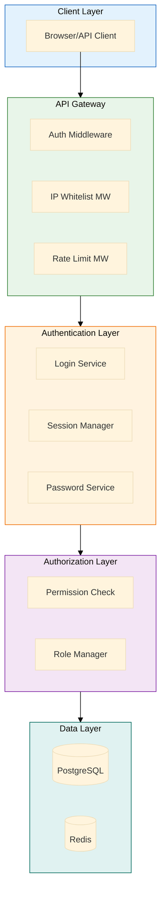

# MxTac - Backend Security Implementation

> **Version**: 2.0
> **Last Updated**: 2026-01-19
> **Status**: Implementation Ready
> **Compliance**: Korean Enterprise Security Audit

---

## Table of Contents

1. [Architecture Overview](#1-architecture-overview)
2. [Database Schema](#2-database-schema)
3. [Authentication System](#3-authentication-system)
4. [Password Management](#4-password-management)
5. [Authorization & RBAC](#5-authorization--rbac)
6. [Session Management](#6-session-management)
7. [Audit Logging](#7-audit-logging)
8. [API Endpoints](#8-api-endpoints)
9. [Background Tasks](#9-background-tasks)
10. [Testing Strategy](#10-testing-strategy)

---

## 1. Architecture Overview

### 1.1 Security Architecture



### 1.2 Technology Stack

| Component | Technology | Version | Purpose |
|-----------|------------|---------|---------|
| **Framework** | FastAPI | 0.109+ | Async REST API |
| **Server** | Uvicorn | 0.27+ | ASGI server |
| **Database** | PostgreSQL | 16+ | Primary data store |
| **Cache** | Redis | 7+ | Session & rate limiting |
| **ORM** | SQLAlchemy | 2.0+ | Database ORM |
| **Password** | passlib[bcrypt] | 1.7+ | Password hashing |
| **JWT** | python-jose | 3.3+ | Token generation |
| **Validation** | Pydantic | 2.5+ | Request/response validation |

---

## 2. Database Schema

### 2.1 Complete Schema

```sql
-- ============================================================================
-- USERS & AUTHENTICATION
-- ============================================================================

CREATE EXTENSION IF NOT EXISTS "uuid-ossp";
CREATE EXTENSION IF NOT EXISTS "pgcrypto";

-- Users table with enhanced security fields
CREATE TABLE users (
    id UUID PRIMARY KEY DEFAULT gen_random_uuid(),
    email VARCHAR(255) UNIQUE NOT NULL,
    email_verified BOOLEAN DEFAULT FALSE,
    full_name VARCHAR(255) NOT NULL,
    employee_id VARCHAR(50) UNIQUE,

    -- Password fields
    password_hash VARCHAR(255) NOT NULL,
    password_changed_at TIMESTAMP DEFAULT NOW(),
    password_expires_at TIMESTAMP DEFAULT NOW() + INTERVAL '90 days',
    must_change_password BOOLEAN DEFAULT TRUE,  -- Force change on first login

    -- Account status
    is_active BOOLEAN DEFAULT TRUE,
    is_locked BOOLEAN DEFAULT FALSE,
    locked_until TIMESTAMP,
    locked_reason VARCHAR(255),
    locked_at TIMESTAMP,

    -- Login tracking
    failed_login_attempts INTEGER DEFAULT 0,
    last_login TIMESTAMP,
    last_login_ip VARCHAR(45),
    last_failed_login TIMESTAMP,

    -- Access control
    role_id UUID REFERENCES roles(id),
    allowed_ip_ranges TEXT[],  -- ['192.168.1.0/24', '10.0.0.5']

    -- Metadata
    created_at TIMESTAMP DEFAULT NOW(),
    created_by UUID REFERENCES users(id),
    updated_at TIMESTAMP DEFAULT NOW(),
    updated_by UUID REFERENCES users(id),
    deleted_at TIMESTAMP,  -- Soft delete

    CONSTRAINT chk_email_format CHECK (email ~* '^[A-Za-z0-9._%+-]+@[A-Za-z0-9.-]+\.[A-Za-z]{2,}$'),
    CONSTRAINT chk_employee_id_format CHECK (employee_id IS NULL OR length(employee_id) >= 3)
);

CREATE INDEX idx_users_email ON users(email) WHERE deleted_at IS NULL;
CREATE INDEX idx_users_employee_id ON users(employee_id) WHERE deleted_at IS NULL;
CREATE INDEX idx_users_role ON users(role_id);
CREATE INDEX idx_users_active ON users(is_active, is_locked) WHERE deleted_at IS NULL;

-- Password history (prevent reuse)
CREATE TABLE password_history (
    id UUID PRIMARY KEY DEFAULT gen_random_uuid(),
    user_id UUID NOT NULL REFERENCES users(id) ON DELETE CASCADE,
    password_hash VARCHAR(255) NOT NULL,
    created_at TIMESTAMP DEFAULT NOW(),

    CONSTRAINT fk_password_history_user FOREIGN KEY (user_id) REFERENCES users(id)
);

CREATE INDEX idx_password_history_user ON password_history(user_id, created_at DESC);

-- ============================================================================
-- ROLE-BASED ACCESS CONTROL (RBAC)
-- ============================================================================

CREATE TABLE roles (
    id UUID PRIMARY KEY DEFAULT gen_random_uuid(),
    name VARCHAR(100) UNIQUE NOT NULL,
    display_name VARCHAR(255) NOT NULL,
    description TEXT,
    is_system BOOLEAN DEFAULT FALSE,  -- System roles cannot be deleted
    created_at TIMESTAMP DEFAULT NOW(),
    updated_at TIMESTAMP DEFAULT NOW(),

    CONSTRAINT chk_role_name CHECK (name ~ '^[a-z][a-z0-9_]*$')
);

CREATE TABLE permissions (
    id UUID PRIMARY KEY DEFAULT gen_random_uuid(),
    resource VARCHAR(100) NOT NULL,  -- alerts, rules, users, etc.
    action VARCHAR(50) NOT NULL,     -- read, write, delete, execute
    description TEXT,

    CONSTRAINT uq_resource_action UNIQUE(resource, action),
    CONSTRAINT chk_resource_format CHECK (resource ~ '^[a-z][a-z0-9_]*$'),
    CONSTRAINT chk_action_format CHECK (action ~ '^[a-z][a-z0-9_]*$')
);

CREATE TABLE role_permissions (
    role_id UUID NOT NULL REFERENCES roles(id) ON DELETE CASCADE,
    permission_id UUID NOT NULL REFERENCES permissions(id) ON DELETE CASCADE,
    granted_at TIMESTAMP DEFAULT NOW(),
    granted_by UUID REFERENCES users(id),

    PRIMARY KEY (role_id, permission_id)
);

CREATE INDEX idx_role_permissions_role ON role_permissions(role_id);
CREATE INDEX idx_role_permissions_permission ON role_permissions(permission_id);

-- ============================================================================
-- AUDIT LOGGING
-- ============================================================================

CREATE TABLE audit_logs (
    id UUID PRIMARY KEY DEFAULT gen_random_uuid(),
    timestamp TIMESTAMP DEFAULT NOW() NOT NULL,

    -- Who
    user_id UUID REFERENCES users(id),
    user_email VARCHAR(255),  -- Denormalized for deleted users

    -- What
    action VARCHAR(100) NOT NULL,
    resource_type VARCHAR(100),
    resource_id UUID,

    -- How
    status VARCHAR(20) NOT NULL,  -- SUCCESS, FAILURE, ERROR
    reason VARCHAR(255),

    -- Where
    ip_address VARCHAR(45),
    user_agent TEXT,
    request_id UUID,

    -- Context
    metadata JSONB,

    -- Indexes for common queries
    CONSTRAINT chk_status CHECK (status IN ('SUCCESS', 'FAILURE', 'ERROR'))
) PARTITION BY RANGE (timestamp);

-- Create partitions for 3-year retention
CREATE TABLE audit_logs_2026 PARTITION OF audit_logs
    FOR VALUES FROM ('2026-01-01') TO ('2027-01-01');

CREATE TABLE audit_logs_2027 PARTITION OF audit_logs
    FOR VALUES FROM ('2027-01-01') TO ('2028-01-01');

CREATE TABLE audit_logs_2028 PARTITION OF audit_logs
    FOR VALUES FROM ('2028-01-01') TO ('2029-01-01');

CREATE INDEX idx_audit_logs_timestamp ON audit_logs(timestamp DESC);
CREATE INDEX idx_audit_logs_user ON audit_logs(user_id, timestamp DESC);
CREATE INDEX idx_audit_logs_action ON audit_logs(action, timestamp DESC);
CREATE INDEX idx_audit_logs_resource ON audit_logs(resource_type, resource_id, timestamp DESC);
CREATE INDEX idx_audit_logs_status ON audit_logs(status, timestamp DESC);

-- ============================================================================
-- HELPER FUNCTIONS
-- ============================================================================

-- Function to automatically update updated_at timestamp
CREATE OR REPLACE FUNCTION update_updated_at_column()
RETURNS TRIGGER AS $$
BEGIN
    NEW.updated_at = NOW();
    RETURN NEW;
END;
$$ LANGUAGE plpgsql;

-- Trigger for users table
CREATE TRIGGER update_users_updated_at BEFORE UPDATE ON users
    FOR EACH ROW EXECUTE FUNCTION update_updated_at_column();

-- Trigger for roles table
CREATE TRIGGER update_roles_updated_at BEFORE UPDATE ON roles
    FOR EACH ROW EXECUTE FUNCTION update_updated_at_column();

-- ============================================================================
-- SEED DATA
-- ============================================================================

-- Insert system roles
INSERT INTO roles (id, name, display_name, description, is_system) VALUES
    (gen_random_uuid(), 'admin', 'Administrator', 'Full system access', true),
    (gen_random_uuid(), 'engineer', 'Detection Engineer', 'Manage rules and connectors', true),
    (gen_random_uuid(), 'hunter', 'Threat Hunter', 'Run queries and hunts', true),
    (gen_random_uuid(), 'analyst', 'SOC Analyst', 'View and manage alerts', true),
    (gen_random_uuid(), 'viewer', 'Viewer', 'Read-only access', true);

-- Insert permissions
INSERT INTO permissions (resource, action, description) VALUES
    -- Alert permissions
    ('alerts', 'read', 'View alerts'),
    ('alerts', 'write', 'Create and update alerts'),
    ('alerts', 'delete', 'Delete alerts'),
    ('alerts', 'assign', 'Assign alerts to users'),

    -- Event permissions
    ('events', 'read', 'View events'),
    ('events', 'search', 'Search events'),
    ('events', 'export', 'Export events'),

    -- Rule permissions
    ('rules', 'read', 'View rules'),
    ('rules', 'write', 'Create and update rules'),
    ('rules', 'delete', 'Delete rules'),
    ('rules', 'execute', 'Execute rules'),

    -- User permissions
    ('users', 'read', 'View users'),
    ('users', 'write', 'Create and update users'),
    ('users', 'delete', 'Delete users'),

    -- Role permissions
    ('roles', 'read', 'View roles'),
    ('roles', 'write', 'Manage roles'),

    -- Connector permissions
    ('connectors', 'read', 'View connectors'),
    ('connectors', 'write', 'Manage connectors'),

    -- Dashboard permissions
    ('dashboards', 'read', 'View dashboards'),
    ('dashboards', 'write', 'Create dashboards'),

    -- Hunt permissions
    ('hunts', 'read', 'View hunts'),
    ('hunts', 'write', 'Create and run hunts'),

    -- Response permissions
    ('response', 'execute', 'Execute response actions'),

    -- Audit permissions
    ('audit', 'read', 'View audit logs');

-- Assign permissions to roles
-- Admin: all permissions
INSERT INTO role_permissions (role_id, permission_id)
SELECT r.id, p.id
FROM roles r
CROSS JOIN permissions p
WHERE r.name = 'admin';

-- Engineer: rules, connectors, alerts, events
INSERT INTO role_permissions (role_id, permission_id)
SELECT r.id, p.id
FROM roles r
CROSS JOIN permissions p
WHERE r.name = 'engineer'
  AND p.resource IN ('rules', 'connectors', 'alerts', 'events', 'dashboards')
  AND p.action != 'delete';

-- Hunter: hunts, events, alerts (read-only on rules)
INSERT INTO role_permissions (role_id, permission_id)
SELECT r.id, p.id
FROM roles r
CROSS JOIN permissions p
WHERE r.name = 'hunter'
  AND ((p.resource IN ('hunts', 'events') AND p.action IN ('read', 'write', 'search', 'export'))
    OR (p.resource = 'alerts' AND p.action IN ('read', 'write'))
    OR (p.resource = 'rules' AND p.action = 'read')
    OR (p.resource = 'dashboards' AND p.action IN ('read', 'write')));

-- Analyst: alerts, events (read), dashboards
INSERT INTO role_permissions (role_id, permission_id)
SELECT r.id, p.id
FROM roles r
CROSS JOIN permissions p
WHERE r.name = 'analyst'
  AND ((p.resource = 'alerts' AND p.action IN ('read', 'write', 'assign'))
    OR (p.resource = 'events' AND p.action IN ('read', 'search'))
    OR (p.resource = 'dashboards' AND p.action = 'read'));

-- Viewer: read-only
INSERT INTO role_permissions (role_id, permission_id)
SELECT r.id, p.id
FROM roles r
CROSS JOIN permissions p
WHERE r.name = 'viewer'
  AND p.action = 'read';
```

### 2.2 Migration Scripts

```python
# backend/alembic/versions/001_security_enhancements.py
"""Add enterprise security requirements

Revision ID: 001_security_enhancements
Revises: base
Create Date: 2026-01-19

"""
from alembic import op
import sqlalchemy as sa
from sqlalchemy.dialects import postgresql

revision = '001_security_enhancements'
down_revision = None
branch_labels = None
depends_on = None

def upgrade():
    # Add new columns to users table
    op.add_column('users', sa.Column('password_changed_at', sa.DateTime(), server_default=sa.func.now()))
    op.add_column('users', sa.Column('password_expires_at', sa.DateTime()))
    op.add_column('users', sa.Column('must_change_password', sa.Boolean(), server_default='true'))
    op.add_column('users', sa.Column('is_locked', sa.Boolean(), server_default='false'))
    op.add_column('users', sa.Column('locked_until', sa.DateTime(), nullable=True))
    op.add_column('users', sa.Column('locked_reason', sa.String(255), nullable=True))
    op.add_column('users', sa.Column('failed_login_attempts', sa.Integer(), server_default='0'))
    op.add_column('users', sa.Column('last_login', sa.DateTime(), nullable=True))
    op.add_column('users', sa.Column('last_login_ip', sa.String(45), nullable=True))
    op.add_column('users', sa.Column('allowed_ip_ranges', postgresql.ARRAY(sa.Text()), nullable=True))

    # Set password_expires_at for existing users
    op.execute("""
        UPDATE users
        SET password_expires_at = password_changed_at + INTERVAL '90 days'
        WHERE password_expires_at IS NULL
    """)

    # Create password_history table
    op.create_table('password_history',
        sa.Column('id', postgresql.UUID(), server_default=sa.text('gen_random_uuid()'), nullable=False),
        sa.Column('user_id', postgresql.UUID(), nullable=False),
        sa.Column('password_hash', sa.String(255), nullable=False),
        sa.Column('created_at', sa.DateTime(), server_default=sa.func.now()),
        sa.ForeignKeyConstraint(['user_id'], ['users.id'], ondelete='CASCADE'),
        sa.PrimaryKeyConstraint('id')
    )
    op.create_index('idx_password_history_user', 'password_history', ['user_id', 'created_at'])

def downgrade():
    op.drop_table('password_history')
    op.drop_column('users', 'allowed_ip_ranges')
    op.drop_column('users', 'last_login_ip')
    op.drop_column('users', 'last_login')
    op.drop_column('users', 'failed_login_attempts')
    op.drop_column('users', 'locked_reason')
    op.drop_column('users', 'locked_until')
    op.drop_column('users', 'is_locked')
    op.drop_column('users', 'must_change_password')
    op.drop_column('users', 'password_expires_at')
    op.drop_column('users', 'password_changed_at')
```

---

## 3. Authentication System

### 3.1 Models

```python
# backend/app/models/user.py
from sqlalchemy import Column, String, Boolean, DateTime, Integer, ARRAY, Text
from sqlalchemy.dialects.postgresql import UUID
from sqlalchemy.orm import relationship
from sqlalchemy.sql import func
from datetime import datetime, timedelta
import uuid

from app.db.base_class import Base

class User(Base):
    __tablename__ = "users"

    id = Column(UUID(as_uuid=True), primary_key=True, default=uuid.uuid4)
    email = Column(String(255), unique=True, nullable=False, index=True)
    email_verified = Column(Boolean, default=False)
    full_name = Column(String(255), nullable=False)
    employee_id = Column(String(50), unique=True, index=True)

    # Password fields
    password_hash = Column(String(255), nullable=False)
    password_changed_at = Column(DateTime, default=datetime.utcnow)
    password_expires_at = Column(DateTime)
    must_change_password = Column(Boolean, default=True)

    # Account status
    is_active = Column(Boolean, default=True)
    is_locked = Column(Boolean, default=False)
    locked_until = Column(DateTime)
    locked_reason = Column(String(255))
    locked_at = Column(DateTime)

    # Login tracking
    failed_login_attempts = Column(Integer, default=0)
    last_login = Column(DateTime)
    last_login_ip = Column(String(45))
    last_failed_login = Column(DateTime)

    # Access control
    role_id = Column(UUID(as_uuid=True), ForeignKey('roles.id'))
    allowed_ip_ranges = Column(ARRAY(Text))

    # Metadata
    created_at = Column(DateTime, default=datetime.utcnow)
    updated_at = Column(DateTime, default=datetime.utcnow, onupdate=datetime.utcnow)
    deleted_at = Column(DateTime)

    # Relationships
    role = relationship("Role", back_populates="users")
    password_history = relationship("PasswordHistory", back_populates="user", cascade="all, delete-orphan")
    audit_logs = relationship("AuditLog", back_populates="user")

    def __repr__(self):
        return f"<User {self.email}>"

    @property
    def is_password_expired(self) -> bool:
        """Check if password has expired"""
        if not self.password_expires_at:
            return False
        return self.password_expires_at < datetime.utcnow()

    @property
    def is_account_locked(self) -> bool:
        """Check if account is locked"""
        if not self.is_locked:
            return False
        if self.locked_until and self.locked_until < datetime.utcnow():
            return False
        return True


class PasswordHistory(Base):
    __tablename__ = "password_history"

    id = Column(UUID(as_uuid=True), primary_key=True, default=uuid.uuid4)
    user_id = Column(UUID(as_uuid=True), ForeignKey('users.id', ondelete='CASCADE'), nullable=False)
    password_hash = Column(String(255), nullable=False)
    created_at = Column(DateTime, default=datetime.utcnow)

    # Relationship
    user = relationship("User", back_populates="password_history")
```

### 3.2 Password Service

```python
# backend/app/core/security/password.py
from passlib.context import CryptContext
from datetime import datetime, timedelta
from sqlalchemy.ext.asyncio import AsyncSession
from sqlalchemy import select
from typing import Tuple
import re

from app.models.user import User, PasswordHistory
from app.core.config import settings

# Use bcrypt with 12 rounds (secure and performant)
pwd_context = CryptContext(
    schemes=["bcrypt"],
    deprecated="auto",
    bcrypt__rounds=12
)

class PasswordPolicy:
    """Enterprise password policy implementation"""

    MIN_LENGTH_3_TYPES = 8
    MIN_LENGTH_2_TYPES = 10
    MAX_CONSECUTIVE_CHARS = 3
    PASSWORD_EXPIRY_DAYS = 90
    PASSWORD_HISTORY_COUNT = 2

    @classmethod
    def validate_password(cls, password: str) -> Tuple[bool, str]:
        """
        Validate password against enterprise policy:
        - 3 char types + 8 chars OR 2 char types + 10 chars
        - No more than 3 consecutive identical characters
        """
        if not password:
            return False, "Password is required"

        # Check character types
        has_lowercase = bool(re.search(r'[a-z]', password))
        has_uppercase = bool(re.search(r'[A-Z]', password))
        has_digit = bool(re.search(r'[0-9]', password))
        has_special = bool(re.search(r'[!@#$%^&*(),.?":{}|<>_\-+=\[\]\\\/;\'`~]', password))

        char_types = sum([has_lowercase, has_uppercase, has_digit, has_special])

        # Rule 1: 3 types + 8 chars
        if char_types >= 3 and len(password) >= cls.MIN_LENGTH_3_TYPES:
            pass
        # Rule 2: 2 types + 10 chars
        elif char_types >= 2 and len(password) >= cls.MIN_LENGTH_2_TYPES:
            pass
        else:
            return False, (
                f"Password must contain either:\n"
                f"- 3 character types (lowercase, uppercase, numbers, special) + {cls.MIN_LENGTH_3_TYPES} characters, OR\n"
                f"- 2 character types + {cls.MIN_LENGTH_2_TYPES} characters"
            )

        # Check for excessive consecutive identical characters
        if re.search(rf'(.)\1{{{cls.MAX_CONSECUTIVE_CHARS},}}', password):
            return False, f"Password cannot have more than {cls.MAX_CONSECUTIVE_CHARS} consecutive identical characters"

        return True, "Password meets requirements"

    @classmethod
    def validate_not_common(cls, password: str) -> Tuple[bool, str]:
        """Check against common passwords list"""
        # In production, load from file or database
        COMMON_PASSWORDS = {
            'password', 'Password1', '12345678', 'qwerty',
            'abc123', 'password123', 'admin123', 'letmein'
        }

        if password.lower() in COMMON_PASSWORDS:
            return False, "Password is too common. Please choose a more unique password."

        return True, "Password is not common"


class PasswordService:
    """Password management service"""

    def __init__(self, db: AsyncSession):
        self.db = db

    def hash_password(self, password: str) -> str:
        """Hash password using bcrypt"""
        return pwd_context.hash(password)

    def verify_password(self, plain_password: str, hashed_password: str) -> bool:
        """Verify password against hash"""
        return pwd_context.verify(plain_password, hashed_password)

    async def validate_password_strength(self, password: str) -> Tuple[bool, str]:
        """Validate password against all policies"""
        # Check complexity
        valid, message = PasswordPolicy.validate_password(password)
        if not valid:
            return False, message

        # Check if common
        valid, message = PasswordPolicy.validate_not_common(password)
        if not valid:
            return False, message

        return True, "Password is valid"

    async def check_password_history(self, user: User, new_password: str) -> Tuple[bool, str]:
        """Check if password was used recently"""
        # Get recent password history
        query = select(PasswordHistory)\
            .where(PasswordHistory.user_id == user.id)\
            .order_by(PasswordHistory.created_at.desc())\
            .limit(PasswordPolicy.PASSWORD_HISTORY_COUNT)

        result = await self.db.execute(query)
        recent_passwords = result.scalars().all()

        # Check against history
        for old_pwd in recent_passwords:
            if self.verify_password(new_password, old_pwd.password_hash):
                return False, f"Cannot reuse last {PasswordPolicy.PASSWORD_HISTORY_COUNT} passwords"

        return True, "Password not in history"

    async def change_password(
        self,
        user: User,
        new_password: str,
        force: bool = False
    ) -> Tuple[bool, str]:
        """
        Change user password with validation

        Args:
            user: User object
            new_password: New password
            force: Skip history check (for admin resets)

        Returns:
            Tuple of (success, message)
        """
        # Validate password strength
        valid, message = await self.validate_password_strength(new_password)
        if not valid:
            return False, message

        # Check password history (unless forced)
        if not force:
            valid, message = await self.check_password_history(user, new_password)
            if not valid:
                return False, message

        # Save current password to history
        if user.password_hash:
            history_entry = PasswordHistory(
                user_id=user.id,
                password_hash=user.password_hash
            )
            self.db.add(history_entry)

        # Update user password
        user.password_hash = self.hash_password(new_password)
        user.password_changed_at = datetime.utcnow()
        user.password_expires_at = datetime.utcnow() + timedelta(
            days=PasswordPolicy.PASSWORD_EXPIRY_DAYS
        )
        user.must_change_password = False

        await self.db.commit()

        return True, "Password changed successfully"

    async def generate_temp_password(self) -> str:
        """Generate secure temporary password"""
        import secrets
        import string

        # Generate 12-char password with all types
        chars = string.ascii_letters + string.digits + "!@#$%^&*"
        password = ''.join(secrets.choice(chars) for _ in range(12))

        # Ensure it meets policy (should always pass)
        valid, _ = PasswordPolicy.validate_password(password)
        if not valid:
            return await self.generate_temp_password()  # Retry

        return password
```

### 3.3 Login Service

```python
# backend/app/services/auth/login.py
from datetime import datetime, timedelta
from fastapi import HTTPException, status
from sqlalchemy.ext.asyncio import AsyncSession
from sqlalchemy import select
from typing import Optional
import uuid

from app.models.user import User
from app.core.security.password import PasswordService
from app.services.audit import AuditService
from app.services.session import SessionManager
from app.core.security.jwt import create_access_token, create_temp_token

class LoginService:
    """Authentication and login service"""

    MAX_FAILED_ATTEMPTS = 5
    LOCKOUT_DURATION_MINUTES = 30

    def __init__(self, db: AsyncSession):
        self.db = db
        self.password_service = PasswordService(db)
        self.audit_service = AuditService(db)
        self.session_manager = SessionManager()

    async def get_user_by_email(self, email: str) -> Optional[User]:
        """Get user by email"""
        query = select(User).where(
            User.email == email,
            User.deleted_at.is_(None)
        )
        result = await self.db.execute(query)
        return result.scalar_one_or_none()

    async def authenticate(
        self,
        email: str,
        password: str,
        ip_address: str,
        user_agent: str,
        request_id: Optional[uuid.UUID] = None
    ) -> User:
        """
        Authenticate user with comprehensive security checks

        Raises:
            HTTPException: If authentication fails

        Returns:
            User object if successful
        """
        user = await self.get_user_by_email(email)

        if not user:
            # Log failed attempt (don't reveal user doesn't exist)
            await self.audit_service.log_login_attempt(
                user_id=None,
                email=email,
                ip_address=ip_address,
                user_agent=user_agent,
                success=False,
                reason="INVALID_CREDENTIALS",
                request_id=request_id
            )
            raise HTTPException(
                status_code=status.HTTP_401_UNAUTHORIZED,
                detail="Invalid credentials"
            )

        # Check if account is active
        if not user.is_active:
            await self.audit_service.log_login_attempt(
                user_id=user.id,
                email=email,
                ip_address=ip_address,
                user_agent=user_agent,
                success=False,
                reason="ACCOUNT_INACTIVE",
                request_id=request_id
            )
            raise HTTPException(
                status_code=status.HTTP_403_FORBIDDEN,
                detail="Account is inactive. Contact administrator."
            )

        # Check if account is locked
        if user.is_account_locked:
            remaining_minutes = 0
            if user.locked_until:
                remaining = (user.locked_until - datetime.utcnow()).total_seconds() / 60
                remaining_minutes = max(0, int(remaining))

            await self.audit_service.log_login_attempt(
                user_id=user.id,
                email=email,
                ip_address=ip_address,
                user_agent=user_agent,
                success=False,
                reason="ACCOUNT_LOCKED",
                request_id=request_id
            )

            raise HTTPException(
                status_code=status.HTTP_403_FORBIDDEN,
                detail=f"Account is locked. Try again in {remaining_minutes} minutes."
            )

        # Verify password
        if not self.password_service.verify_password(password, user.password_hash):
            # Increment failed attempts
            user.failed_login_attempts += 1
            user.last_failed_login = datetime.utcnow()

            if user.failed_login_attempts >= self.MAX_FAILED_ATTEMPTS:
                # Lock account
                user.is_locked = True
                user.locked_until = datetime.utcnow() + timedelta(
                    minutes=self.LOCKOUT_DURATION_MINUTES
                )
                user.locked_reason = "MAX_FAILED_LOGIN_ATTEMPTS"
                user.locked_at = datetime.utcnow()

                await self.db.commit()

                await self.audit_service.log_login_attempt(
                    user_id=user.id,
                    email=email,
                    ip_address=ip_address,
                    user_agent=user_agent,
                    success=False,
                    reason="ACCOUNT_LOCKED_MAX_ATTEMPTS",
                    request_id=request_id,
                    metadata={
                        "failed_attempts": user.failed_login_attempts,
                        "lockout_duration_minutes": self.LOCKOUT_DURATION_MINUTES
                    }
                )

                raise HTTPException(
                    status_code=status.HTTP_403_FORBIDDEN,
                    detail=f"Account locked for {self.LOCKOUT_DURATION_MINUTES} minutes due to {self.MAX_FAILED_ATTEMPTS} failed login attempts"
                )

            await self.db.commit()

            await self.audit_service.log_login_attempt(
                user_id=user.id,
                email=email,
                ip_address=ip_address,
                user_agent=user_agent,
                success=False,
                reason="INVALID_PASSWORD",
                request_id=request_id,
                metadata={
                    "failed_attempts": user.failed_login_attempts,
                    "attempts_remaining": self.MAX_FAILED_ATTEMPTS - user.failed_login_attempts
                }
            )

            raise HTTPException(
                status_code=status.HTTP_401_UNAUTHORIZED,
                detail=f"Invalid credentials ({self.MAX_FAILED_ATTEMPTS - user.failed_login_attempts} attempts remaining)"
            )

        # Password correct - check if password expired
        if user.is_password_expired:
            # Force password change
            user.must_change_password = True
            await self.db.commit()

            # Return temp token that only allows password change
            temp_token = create_temp_token(data={"sub": user.email})

            await self.audit_service.log_login_attempt(
                user_id=user.id,
                email=email,
                ip_address=ip_address,
                user_agent=user_agent,
                success=True,
                reason="PASSWORD_EXPIRED",
                request_id=request_id
            )

            raise HTTPException(
                status_code=status.HTTP_403_FORBIDDEN,
                detail="Password expired. Please change your password.",
                headers={"X-Temp-Token": temp_token}
            )

        # Check if initial password change required
        if user.must_change_password:
            # Return temp token
            temp_token = create_temp_token(data={"sub": user.email})

            await self.audit_service.log_login_attempt(
                user_id=user.id,
                email=email,
                ip_address=ip_address,
                user_agent=user_agent,
                success=True,
                reason="MUST_CHANGE_PASSWORD",
                request_id=request_id
            )

            raise HTTPException(
                status_code=status.HTTP_403_FORBIDDEN,
                detail="Password change required.",
                headers={"X-Temp-Token": temp_token}
            )

        # Successful login - reset failed attempts and update login info
        if user.locked_until and user.locked_until < datetime.utcnow():
            user.is_locked = False
            user.locked_until = None
            user.locked_reason = None

        user.failed_login_attempts = 0
        user.last_login = datetime.utcnow()
        user.last_login_ip = ip_address

        await self.db.commit()

        # Log successful login
        await self.audit_service.log_login_attempt(
            user_id=user.id,
            email=email,
            ip_address=ip_address,
            user_agent=user_agent,
            success=True,
            reason="SUCCESS",
            request_id=request_id
        )

        return user
```

---

## 4. Password Management

### 4.1 Password Change Endpoint

```python
# backend/app/api/v1/endpoints/auth.py
from fastapi import APIRouter, Depends, HTTPException, status, Request
from sqlalchemy.ext.asyncio import AsyncSession
from pydantic import BaseModel, EmailStr

from app.api.deps import get_current_user, get_db, get_temp_user
from app.models.user import User
from app.core.security.password import PasswordService
from app.services.audit import AuditService

router = APIRouter()

class ChangePasswordRequest(BaseModel):
    current_password: str
    new_password: str

class ChangePasswordResponse(BaseModel):
    message: str

@router.post("/auth/change-password", response_model=ChangePasswordResponse)
async def change_password(
    request: Request,
    data: ChangePasswordRequest,
    current_user: User = Depends(get_current_user),
    db: AsyncSession = Depends(get_db)
):
    """
    Change current user's password

    Requirements:
    - Verify current password
    - Validate new password strength
    - Check password history (no reuse of last 2)
    """
    password_service = PasswordService(db)
    audit_service = AuditService(db)

    # Verify current password
    if not password_service.verify_password(data.current_password, current_user.password_hash):
        await audit_service.log_action(
            user_id=current_user.id,
            action="PASSWORD_CHANGE_FAILED",
            status="FAILURE",
            reason="INVALID_CURRENT_PASSWORD",
            ip_address=request.client.host,
            user_agent=request.headers.get("user-agent")
        )
        raise HTTPException(
            status_code=status.HTTP_400_BAD_REQUEST,
            detail="Current password is incorrect"
        )

    # Change password
    success, message = await password_service.change_password(
        user=current_user,
        new_password=data.new_password
    )

    if not success:
        await audit_service.log_action(
            user_id=current_user.id,
            action="PASSWORD_CHANGE_FAILED",
            status="FAILURE",
            reason="POLICY_VIOLATION",
            ip_address=request.client.host,
            user_agent=request.headers.get("user-agent"),
            metadata={"error": message}
        )
        raise HTTPException(
            status_code=status.HTTP_400_BAD_REQUEST,
            detail=message
        )

    # Log success
    await audit_service.log_action(
        user_id=current_user.id,
        action="PASSWORD_CHANGED",
        status="SUCCESS",
        ip_address=request.client.host,
        user_agent=request.headers.get("user-agent")
    )

    return ChangePasswordResponse(message="Password changed successfully")


@router.post("/auth/force-change-password", response_model=ChangePasswordResponse)
async def force_change_password(
    request: Request,
    data: BaseModel,
    temp_user: User = Depends(get_temp_user),  # Special dependency for temp token
    db: AsyncSession = Depends(get_db)
):
    """
    Force password change (for expired/temp passwords)

    Uses temp token from X-Temp-Token header
    """
    class ForceChangePasswordRequest(BaseModel):
        new_password: str

    request_data = ForceChangePasswordRequest(**data.dict())
    password_service = PasswordService(db)
    audit_service = AuditService(db)

    # Change password (skip history check for forced changes)
    success, message = await password_service.change_password(
        user=temp_user,
        new_password=request_data.new_password,
        force=True
    )

    if not success:
        raise HTTPException(
            status_code=status.HTTP_400_BAD_REQUEST,
            detail=message
        )

    await audit_service.log_action(
        user_id=temp_user.id,
        action="FORCED_PASSWORD_CHANGED",
        status="SUCCESS",
        ip_address=request.client.host,
        user_agent=request.headers.get("user-agent")
    )

    return ChangePasswordResponse(message="Password changed successfully. Please login with your new password.")
```

### 4.2 Admin Password Reset

```python
# backend/app/api/v1/endpoints/admin/users.py
from fastapi import APIRouter, Depends, HTTPException, status, Request
from sqlalchemy.ext.asyncio import AsyncSession
from pydantic import BaseModel, UUID4

from app.api.deps import get_current_admin_user, get_db
from app.models.user import User
from app.core.security.password import PasswordService
from app.services.audit import AuditService
from app.services.notifications import NotificationService

router = APIRouter()

class ResetPasswordRequest(BaseModel):
    user_id: UUID4
    send_email: bool = True

class ResetPasswordResponse(BaseModel):
    message: str
    temporary_password: str | None = None

@router.post("/admin/users/reset-password", response_model=ResetPasswordResponse)
async def admin_reset_password(
    request: Request,
    data: ResetPasswordRequest,
    current_admin: User = Depends(get_current_admin_user),
    db: AsyncSession = Depends(get_db)
):
    """
    Admin: Reset user password to temporary password

    Requirements:
    - Admin permission required
    - Generate secure temp password
    - Force password change on next login
    - Send email notification
    """
    from sqlalchemy import select

    password_service = PasswordService(db)
    audit_service = AuditService(db)
    notification_service = NotificationService()

    # Get target user
    query = select(User).where(User.id == data.user_id)
    result = await db.execute(query)
    target_user = result.scalar_one_or_none()

    if not target_user:
        raise HTTPException(
            status_code=status.HTTP_404_NOT_FOUND,
            detail="User not found"
        )

    # Generate temporary password
    temp_password = await password_service.generate_temp_password()

    # Change password (force=True to skip history)
    success, message = await password_service.change_password(
        user=target_user,
        new_password=temp_password,
        force=True
    )

    if not success:
        raise HTTPException(
            status_code=status.HTTP_500_INTERNAL_SERVER_ERROR,
            detail="Failed to reset password"
        )

    # Force password change on next login
    target_user.must_change_password = True

    # Unlock account if locked
    if target_user.is_locked:
        target_user.is_locked = False
        target_user.locked_until = None
        target_user.locked_reason = None
        target_user.failed_login_attempts = 0

    await db.commit()

    # Send email notification
    if data.send_email:
        await notification_service.send_password_reset_email(
            user_email=target_user.email,
            temporary_password=temp_password
        )

    # Log action
    await audit_service.log_action(
        user_id=current_admin.id,
        action="ADMIN_PASSWORD_RESET",
        status="SUCCESS",
        resource_type="users",
        resource_id=target_user.id,
        ip_address=request.client.host,
        user_agent=request.headers.get("user-agent"),
        metadata={
            "target_user_email": target_user.email,
            "email_sent": data.send_email
        }
    )

    return ResetPasswordResponse(
        message="Password reset successfully",
        temporary_password=temp_password if not data.send_email else None
    )
```

---

## 5. Authorization & RBAC

### 5.1 Permission Service

```python
# backend/app/services/auth/permissions.py
from sqlalchemy.ext.asyncio import AsyncSession
from sqlalchemy import select
from typing import Set
import uuid

from app.models.user import User
from app.models.rbac import Role, Permission, RolePermission

class PermissionService:
    """Check user permissions for RBAC"""

    def __init__(self, db: AsyncSession):
        self.db = db

    async def get_user_permissions(self, user: User) -> Set[str]:
        """
        Get all permissions for a user

        Returns:
            Set of permission strings like "alerts:read", "rules:write"
        """
        if not user.role_id:
            return set()

        # Query permissions via role
        query = select(Permission)\
            .join(RolePermission, RolePermission.permission_id == Permission.id)\
            .where(RolePermission.role_id == user.role_id)

        result = await self.db.execute(query)
        permissions = result.scalars().all()

        # Convert to set of "resource:action" strings
        return {f"{p.resource}:{p.action}" for p in permissions}

    async def has_permission(
        self,
        user: User,
        resource: str,
        action: str
    ) -> bool:
        """
        Check if user has specific permission

        Args:
            user: User object
            resource: Resource name (e.g., "alerts", "rules")
            action: Action name (e.g., "read", "write")

        Returns:
            True if user has permission
        """
        permissions = await self.get_user_permissions(user)
        required = f"{resource}:{action}"

        return required in permissions

    async def require_permission(
        self,
        user: User,
        resource: str,
        action: str
    ):
        """
        Require permission or raise exception

        Raises:
            HTTPException: If user lacks permission
        """
        from fastapi import HTTPException, status

        if not await self.has_permission(user, resource, action):
            raise HTTPException(
                status_code=status.HTTP_403_FORBIDDEN,
                detail=f"Permission denied: {resource}:{action}"
            )

    async def check_ip_whitelist(self, user: User, ip_address: str) -> bool:
        """
        Check if user IP is whitelisted (for admin access)

        Returns:
            True if IP is allowed or no whitelist configured
        """
        import ipaddress

        if not user.allowed_ip_ranges:
            return True  # No restriction

        try:
            user_ip = ipaddress.ip_address(ip_address)

            for ip_range in user.allowed_ip_ranges:
                if '/' in ip_range:
                    # CIDR notation
                    network = ipaddress.ip_network(ip_range, strict=False)
                    if user_ip in network:
                        return True
                else:
                    # Single IP
                    if str(user_ip) == ip_range:
                        return True

            return False

        except ValueError:
            return False  # Invalid IP format
```

### 5.2 RBAC Dependency

```python
# backend/app/api/deps.py
from fastapi import Depends, HTTPException, status, Request
from fastapi.security import HTTPBearer, HTTPAuthorizationCredentials
from sqlalchemy.ext.asyncio import AsyncSession
from typing import Callable

from app.db.session import get_db
from app.core.security.jwt import decode_access_token
from app.models.user import User
from app.services.auth.permissions import PermissionService

security = HTTPBearer()

async def get_current_user(
    request: Request,
    credentials: HTTPAuthorizationCredentials = Depends(security),
    db: AsyncSession = Depends(get_db)
) -> User:
    """
    Get current authenticated user from JWT token

    Validates:
    - Token is valid and not expired
    - User exists and is active
    - Session is valid (not logged out)
    """
    from sqlalchemy import select
    from app.services.session import SessionManager

    token = credentials.credentials

    # Decode token
    payload = decode_access_token(token)
    if not payload:
        raise HTTPException(
            status_code=status.HTTP_401_UNAUTHORIZED,
            detail="Invalid authentication token"
        )

    email = payload.get("sub")
    if not email:
        raise HTTPException(
            status_code=status.HTTP_401_UNAUTHORIZED,
            detail="Invalid token payload"
        )

    # Get user from database
    query = select(User).where(
        User.email == email,
        User.deleted_at.is_(None)
    )
    result = await db.execute(query)
    user = result.scalar_one_or_none()

    if not user:
        raise HTTPException(
            status_code=status.HTTP_401_UNAUTHORIZED,
            detail="User not found"
        )

    if not user.is_active:
        raise HTTPException(
            status_code=status.HTTP_403_FORBIDDEN,
            detail="Account is inactive"
        )

    # Check if session is valid (not blacklisted)
    session_manager = SessionManager()
    if not await session_manager.is_session_valid(user.id, token):
        raise HTTPException(
            status_code=status.HTTP_401_UNAUTHORIZED,
            detail="Session expired or invalidated"
        )

    return user


def require_permission(resource: str, action: str):
    """
    Dependency factory for permission checking

    Usage:
        @router.get("/alerts", dependencies=[Depends(require_permission("alerts", "read"))])
        async def get_alerts(...):
            ...
    """
    async def permission_checker(
        current_user: User = Depends(get_current_user),
        db: AsyncSession = Depends(get_db)
    ):
        permission_service = PermissionService(db)
        await permission_service.require_permission(current_user, resource, action)
        return current_user

    return permission_checker


async def get_current_admin_user(
    request: Request,
    current_user: User = Depends(get_current_user),
    db: AsyncSession = Depends(get_db)
) -> User:
    """
    Get current user with admin role

    Additional checks:
    - User has admin role
    - IP is whitelisted (if configured)
    """
    from sqlalchemy import select
    from app.models.rbac import Role

    # Check if user has admin role
    query = select(Role).where(Role.id == current_user.role_id)
    result = await db.execute(query)
    role = result.scalar_one_or_none()

    if not role or role.name != 'admin':
        raise HTTPException(
            status_code=status.HTTP_403_FORBIDDEN,
            detail="Admin access required"
        )

    # Check IP whitelist
    permission_service = PermissionService(db)
    ip_address = request.client.host

    if not await permission_service.check_ip_whitelist(current_user, ip_address):
        raise HTTPException(
            status_code=status.HTTP_403_FORBIDDEN,
            detail="IP address not whitelisted for admin access"
        )

    return current_user
```

### 5.3 Example Protected Endpoints

```python
# backend/app/api/v1/endpoints/alerts.py
from fastapi import APIRouter, Depends, Query
from sqlalchemy.ext.asyncio import AsyncSession

from app.api.deps import get_current_user, require_permission, get_db
from app.models.user import User

router = APIRouter()

@router.get(
    "/alerts",
    dependencies=[Depends(require_permission("alerts", "read"))]
)
async def list_alerts(
    current_user: User = Depends(get_current_user),
    db: AsyncSession = Depends(get_db),
    limit: int = Query(100, le=1000)
):
    """List alerts (requires alerts:read permission)"""
    # Implementation
    pass

@router.post(
    "/alerts",
    dependencies=[Depends(require_permission("alerts", "write"))]
)
async def create_alert(
    current_user: User = Depends(get_current_user),
    db: AsyncSession = Depends(get_db)
):
    """Create alert (requires alerts:write permission)"""
    # Implementation
    pass

@router.delete(
    "/alerts/{alert_id}",
    dependencies=[Depends(require_permission("alerts", "delete"))]
)
async def delete_alert(
    alert_id: str,
    current_user: User = Depends(get_current_user),
    db: AsyncSession = Depends(get_db)
):
    """Delete alert (requires alerts:delete permission)"""
    # Implementation
    pass
```

---

## 6. Session Management

### 6.1 Session Manager (Redis)

```python
# backend/app/services/session.py
from redis.asyncio import Redis
from datetime import timedelta
from typing import Optional
import uuid
import json

from app.core.config import settings

class SessionManager:
    """Redis-based session management"""

    SESSION_TIMEOUT_MINUTES = 30
    SESSION_PREFIX = "session:"
    USER_SESSION_PREFIX = "user_sessions:"
    BLACKLIST_PREFIX = "blacklist:"

    def __init__(self):
        self.redis: Optional[Redis] = None

    async def connect(self):
        """Connect to Redis"""
        self.redis = await Redis.from_url(
            settings.REDIS_URL,
            encoding="utf-8",
            decode_responses=True
        )

    async def disconnect(self):
        """Disconnect from Redis"""
        if self.redis:
            await self.redis.close()

    async def create_session(
        self,
        user_id: uuid.UUID,
        token: str,
        ip_address: str,
        user_agent: str
    ) -> bool:
        """
        Create new session

        Enforces single concurrent session per user
        """
        if not self.redis:
            await self.connect()

        # Invalidate existing sessions for this user
        await self.invalidate_user_sessions(user_id)

        session_key = f"{self.SESSION_PREFIX}{token}"
        user_sessions_key = f"{self.USER_SESSION_PREFIX}{user_id}"

        session_data = {
            "user_id": str(user_id),
            "ip_address": ip_address,
            "user_agent": user_agent,
            "created_at": str(datetime.utcnow())
        }

        # Store session with timeout
        await self.redis.setex(
            session_key,
            timedelta(minutes=self.SESSION_TIMEOUT_MINUTES),
            json.dumps(session_data)
        )

        # Track user's active session
        await self.redis.setex(
            user_sessions_key,
            timedelta(minutes=self.SESSION_TIMEOUT_MINUTES),
            token
        )

        return True

    async def is_session_valid(self, user_id: uuid.UUID, token: str) -> bool:
        """
        Check if session is valid

        Validates:
        - Session exists in Redis
        - Token not blacklisted
        - Session belongs to this user
        """
        if not self.redis:
            await self.connect()

        # Check blacklist
        blacklist_key = f"{self.BLACKLIST_PREFIX}{token}"
        if await self.redis.exists(blacklist_key):
            return False

        # Check session exists
        session_key = f"{self.SESSION_PREFIX}{token}"
        session_data = await self.redis.get(session_key)

        if not session_data:
            return False

        # Validate user
        data = json.loads(session_data)
        if data.get("user_id") != str(user_id):
            return False

        return True

    async def refresh_session(self, token: str):
        """Refresh session timeout"""
        if not self.redis:
            await self.connect()

        session_key = f"{self.SESSION_PREFIX}{token}"

        # Reset expiration
        await self.redis.expire(
            session_key,
            timedelta(minutes=self.SESSION_TIMEOUT_MINUTES)
        )

    async def invalidate_session(self, token: str):
        """Invalidate specific session (logout)"""
        if not self.redis:
            await self.connect()

        session_key = f"{self.SESSION_PREFIX}{token}"
        blacklist_key = f"{self.BLACKLIST_PREFIX}{token}"

        # Get session data to find user
        session_data = await self.redis.get(session_key)
        if session_data:
            data = json.loads(session_data)
            user_id = data.get("user_id")

            # Remove from user sessions
            if user_id:
                user_sessions_key = f"{self.USER_SESSION_PREFIX}{user_id}"
                await self.redis.delete(user_sessions_key)

        # Delete session
        await self.redis.delete(session_key)

        # Add to blacklist (until token would expire)
        await self.redis.setex(
            blacklist_key,
            timedelta(minutes=self.SESSION_TIMEOUT_MINUTES),
            "1"
        )

    async def invalidate_user_sessions(self, user_id: uuid.UUID):
        """Invalidate all sessions for a user (enforce single session)"""
        if not self.redis:
            await self.connect()

        user_sessions_key = f"{self.USER_SESSION_PREFIX}{user_id}"

        # Get current token
        current_token = await self.redis.get(user_sessions_key)

        if current_token:
            # Blacklist old token
            await self.invalidate_session(current_token)

        # Clear user sessions
        await self.redis.delete(user_sessions_key)
```

### 6.2 Session Middleware

```python
# backend/app/core/middleware/session.py
from fastapi import Request
from starlette.middleware.base import BaseHTTPMiddleware
from starlette.responses import JSONResponse

from app.services.session import SessionManager
from app.core.security.jwt import decode_access_token

class SessionMiddleware(BaseHTTPMiddleware):
    """
    Middleware to refresh sessions on each request
    """

    async def dispatch(self, request: Request, call_next):
        # Skip for public endpoints
        if request.url.path in ["/api/v1/auth/login", "/api/v1/health", "/docs"]:
            return await call_next(request)

        # Get token from Authorization header
        auth_header = request.headers.get("Authorization")
        if not auth_header or not auth_header.startswith("Bearer "):
            return await call_next(request)

        token = auth_header.split(" ")[1]

        # Refresh session timeout
        session_manager = SessionManager()
        try:
            await session_manager.refresh_session(token)
        except Exception:
            pass  # Let auth dependency handle invalid sessions

        return await call_next(request)
```

---

## 7. Audit Logging

### 7.1 Audit Service

```python
# backend/app/services/audit.py
from sqlalchemy.ext.asyncio import AsyncSession
from datetime import datetime
from typing import Optional, Dict, Any
import uuid

from app.models.audit import AuditLog
from app.models.user import User

class AuditService:
    """Service for audit logging"""

    def __init__(self, db: AsyncSession):
        self.db = db

    async def log_action(
        self,
        user_id: Optional[uuid.UUID],
        action: str,
        status: str,
        resource_type: Optional[str] = None,
        resource_id: Optional[uuid.UUID] = None,
        reason: Optional[str] = None,
        ip_address: Optional[str] = None,
        user_agent: Optional[str] = None,
        request_id: Optional[uuid.UUID] = None,
        metadata: Optional[Dict[str, Any]] = None
    ):
        """
        Log an action to audit trail

        Args:
            user_id: User who performed action
            action: Action performed (LOGIN, PASSWORD_CHANGED, etc.)
            status: SUCCESS, FAILURE, ERROR
            resource_type: Type of resource (users, alerts, rules)
            resource_id: ID of resource
            reason: Reason for failure (if applicable)
            ip_address: Client IP
            user_agent: Client user agent
            request_id: Request tracking ID
            metadata: Additional context
        """
        from sqlalchemy import select

        # Get user email if user_id provided
        user_email = None
        if user_id:
            query = select(User.email).where(User.id == user_id)
            result = await self.db.execute(query)
            user_email = result.scalar_one_or_none()

        log_entry = AuditLog(
            timestamp=datetime.utcnow(),
            user_id=user_id,
            user_email=user_email,
            action=action,
            resource_type=resource_type,
            resource_id=resource_id,
            status=status,
            reason=reason,
            ip_address=ip_address,
            user_agent=user_agent,
            request_id=request_id,
            metadata=metadata
        )

        self.db.add(log_entry)
        await self.db.commit()

    async def log_login_attempt(
        self,
        user_id: Optional[uuid.UUID],
        email: str,
        ip_address: str,
        user_agent: str,
        success: bool,
        reason: str,
        request_id: Optional[uuid.UUID] = None
    ):
        """Convenience method for logging login attempts"""
        await self.log_action(
            user_id=user_id,
            action="LOGIN_ATTEMPT",
            status="SUCCESS" if success else "FAILURE",
            reason=reason,
            ip_address=ip_address,
            user_agent=user_agent,
            request_id=request_id,
            metadata={"email": email}
        )

    async def log_permission_change(
        self,
        admin_user_id: uuid.UUID,
        target_user_id: uuid.UUID,
        old_role: str,
        new_role: str,
        ip_address: str,
        user_agent: str
    ):
        """Log permission/role changes (3-year retention requirement)"""
        await self.log_action(
            user_id=admin_user_id,
            action="PERMISSION_CHANGED",
            status="SUCCESS",
            resource_type="users",
            resource_id=target_user_id,
            ip_address=ip_address,
            user_agent=user_agent,
            metadata={
                "old_role": old_role,
                "new_role": new_role
            }
        )
```

### 7.2 Audit Log Model

```python
# backend/app/models/audit.py
from sqlalchemy import Column, String, DateTime, Text
from sqlalchemy.dialects.postgresql import UUID, JSONB
from sqlalchemy.orm import relationship
from datetime import datetime
import uuid

from app.db.base_class import Base

class AuditLog(Base):
    __tablename__ = "audit_logs"

    id = Column(UUID(as_uuid=True), primary_key=True, default=uuid.uuid4)
    timestamp = Column(DateTime, default=datetime.utcnow, nullable=False, index=True)

    # Who
    user_id = Column(UUID(as_uuid=True), ForeignKey('users.id'), index=True)
    user_email = Column(String(255))  # Denormalized

    # What
    action = Column(String(100), nullable=False, index=True)
    resource_type = Column(String(100), index=True)
    resource_id = Column(UUID(as_uuid=True), index=True)

    # How
    status = Column(String(20), nullable=False, index=True)
    reason = Column(String(255))

    # Where
    ip_address = Column(String(45))
    user_agent = Column(Text)
    request_id = Column(UUID(as_uuid=True))

    # Context
    metadata = Column(JSONB)

    # Relationship
    user = relationship("User", back_populates="audit_logs")
```

### 7.3 Activity Logging Decorator

```python
# backend/app/core/decorators/audit.py
from functools import wraps
from typing import Callable
from fastapi import Request

def log_activity(action: str, resource_type: str = None):
    """
    Decorator to automatically log activities

    Usage:
        @router.delete("/alerts/{alert_id}")
        @log_activity(action="ALERT_DELETED", resource_type="alerts")
        async def delete_alert(alert_id: str, ...):
            ...
    """
    def decorator(func: Callable):
        @wraps(func)
        async def wrapper(*args, **kwargs):
            from app.services.audit import AuditService
            from app.api.deps import get_db

            # Extract request and current_user from kwargs
            request: Request = kwargs.get('request')
            current_user = kwargs.get('current_user')
            db = kwargs.get('db')

            # Get resource_id from path params
            resource_id = kwargs.get('alert_id') or kwargs.get('rule_id') or kwargs.get('user_id')

            try:
                # Execute the function
                result = await func(*args, **kwargs)

                # Log success
                if db and current_user:
                    audit_service = AuditService(db)
                    await audit_service.log_action(
                        user_id=current_user.id,
                        action=action,
                        status="SUCCESS",
                        resource_type=resource_type,
                        resource_id=resource_id,
                        ip_address=request.client.host if request else None,
                        user_agent=request.headers.get("user-agent") if request else None
                    )

                return result

            except Exception as e:
                # Log failure
                if db and current_user:
                    audit_service = AuditService(db)
                    await audit_service.log_action(
                        user_id=current_user.id,
                        action=action,
                        status="ERROR",
                        resource_type=resource_type,
                        resource_id=resource_id,
                        reason=str(e),
                        ip_address=request.client.host if request else None,
                        user_agent=request.headers.get("user-agent") if request else None
                    )

                raise

        return wrapper
    return decorator
```

---

## 8. API Endpoints

### 8.1 Authentication Endpoints

```python
# backend/app/api/v1/endpoints/auth.py (complete)
from fastapi import APIRouter, Depends, HTTPException, status, Request
from sqlalchemy.ext.asyncio import AsyncSession
from pydantic import BaseModel, EmailStr
from datetime import datetime

from app.api.deps import get_current_user, get_db
from app.models.user import User
from app.services.auth.login import LoginService
from app.services.session import SessionManager
from app.core.security.jwt import create_access_token

router = APIRouter(prefix="/auth", tags=["Authentication"])

class LoginRequest(BaseModel):
    email: EmailStr
    password: str

class LoginResponse(BaseModel):
    access_token: str
    token_type: str = "bearer"
    expires_in: int = 1800  # 30 minutes
    user: dict

class LogoutResponse(BaseModel):
    message: str

@router.post("/login", response_model=LoginResponse)
async def login(
    request: Request,
    data: LoginRequest,
    db: AsyncSession = Depends(get_db)
):
    """
    Login endpoint

    Returns JWT access token
    Enforces all security policies:
    - Account lockout (5 attempts → 30 min)
    - Password expiration (90 days)
    - Single concurrent session
    - Audit logging
    """
    login_service = LoginService(db)
    session_manager = SessionManager()

    # Authenticate user
    user = await login_service.authenticate(
        email=data.email,
        password=data.password,
        ip_address=request.client.host,
        user_agent=request.headers.get("user-agent")
    )

    # Create JWT token
    access_token = create_access_token(data={"sub": user.email})

    # Create session (invalidates old sessions)
    await session_manager.create_session(
        user_id=user.id,
        token=access_token,
        ip_address=request.client.host,
        user_agent=request.headers.get("user-agent")
    )

    return LoginResponse(
        access_token=access_token,
        user={
            "id": str(user.id),
            "email": user.email,
            "full_name": user.full_name,
            "role": user.role.name if user.role else None
        }
    )

@router.post("/logout", response_model=LogoutResponse)
async def logout(
    request: Request,
    current_user: User = Depends(get_current_user)
):
    """
    Logout endpoint

    Invalidates current session
    """
    from fastapi.security import HTTPBearer

    # Get token from Authorization header
    auth_header = request.headers.get("Authorization")
    token = auth_header.split(" ")[1] if auth_header else None

    if token:
        session_manager = SessionManager()
        await session_manager.invalidate_session(token)

    return LogoutResponse(message="Logged out successfully")

@router.get("/me")
async def get_current_user_info(
    current_user: User = Depends(get_current_user)
):
    """Get current user information"""
    return {
        "id": str(current_user.id),
        "email": current_user.email,
        "full_name": current_user.full_name,
        "role": current_user.role.name if current_user.role else None,
        "last_login": current_user.last_login.isoformat() if current_user.last_login else None,
        "password_expires_at": current_user.password_expires_at.isoformat() if current_user.password_expires_at else None,
        "must_change_password": current_user.must_change_password
    }
```

### 8.2 JWT Token Generation

```python
# backend/app/core/security/jwt.py
from datetime import datetime, timedelta
from typing import Optional, Dict
from jose import JWTError, jwt

from app.core.config import settings

ALGORITHM = "HS256"
ACCESS_TOKEN_EXPIRE_MINUTES = 30
TEMP_TOKEN_EXPIRE_MINUTES = 15

def create_access_token(data: Dict, expires_delta: Optional[timedelta] = None) -> str:
    """Create JWT access token"""
    to_encode = data.copy()

    if expires_delta:
        expire = datetime.utcnow() + expires_delta
    else:
        expire = datetime.utcnow() + timedelta(minutes=ACCESS_TOKEN_EXPIRE_MINUTES)

    to_encode.update({"exp": expire, "type": "access"})

    encoded_jwt = jwt.encode(to_encode, settings.SECRET_KEY, algorithm=ALGORITHM)
    return encoded_jwt

def create_temp_token(data: Dict) -> str:
    """Create temporary token (for password reset/change)"""
    to_encode = data.copy()
    expire = datetime.utcnow() + timedelta(minutes=TEMP_TOKEN_EXPIRE_MINUTES)
    to_encode.update({"exp": expire, "type": "temp"})

    encoded_jwt = jwt.encode(to_encode, settings.SECRET_KEY, algorithm=ALGORITHM)
    return encoded_jwt

def decode_access_token(token: str) -> Optional[Dict]:
    """Decode and validate JWT token"""
    try:
        payload = jwt.decode(token, settings.SECRET_KEY, algorithms=[ALGORITHM])
        return payload
    except JWTError:
        return None
```

---

## 9. Background Tasks

### 9.1 Scheduled Jobs

```python
# backend/app/tasks/scheduled.py
from sqlalchemy.ext.asyncio import AsyncSession
from sqlalchemy import select, and_
from datetime import datetime, timedelta
import logging

from app.models.user import User
from app.db.session import async_session_maker
from app.services.audit import AuditService

logger = logging.getLogger(__name__)

async def lock_inactive_accounts():
    """
    Background job: Lock accounts inactive for 90+ days

    Schedule: Daily at 2:00 AM
    """
    async with async_session_maker() as db:
        audit_service = AuditService(db)

        # Find users inactive for 90 days
        ninety_days_ago = datetime.utcnow() - timedelta(days=90)

        query = select(User).where(
            and_(
                User.is_active == True,
                User.is_locked == False,
                User.last_login < ninety_days_ago,
                User.deleted_at.is_(None)
            )
        )

        result = await db.execute(query)
        inactive_users = result.scalars().all()

        locked_count = 0
        for user in inactive_users:
            user.is_locked = True
            user.locked_reason = "INACTIVE_90_DAYS"
            user.locked_at = datetime.utcnow()

            # Log action
            await audit_service.log_action(
                user_id=None,
                action="ACCOUNT_AUTO_LOCKED",
                status="SUCCESS",
                resource_type="users",
                resource_id=user.id,
                reason="INACTIVE_90_DAYS",
                metadata={
                    "user_email": user.email,
                    "last_login": user.last_login.isoformat() if user.last_login else None
                }
            )

            locked_count += 1

        await db.commit()

        logger.info(f"Locked {locked_count} inactive accounts")
        return locked_count

async def send_password_expiration_warnings():
    """
    Background job: Send warnings for passwords expiring in 7 days

    Schedule: Daily at 9:00 AM
    """
    async with async_session_maker() as db:
        from app.services.notifications import NotificationService

        # Find users with passwords expiring in 7 days
        seven_days_from_now = datetime.utcnow() + timedelta(days=7)
        eight_days_from_now = datetime.utcnow() + timedelta(days=8)

        query = select(User).where(
            and_(
                User.is_active == True,
                User.password_expires_at >= seven_days_from_now,
                User.password_expires_at < eight_days_from_now,
                User.deleted_at.is_(None)
            )
        )

        result = await db.execute(query)
        expiring_users = result.scalars().all()

        notification_service = NotificationService()

        for user in expiring_users:
            await notification_service.send_password_expiration_warning(
                user_email=user.email,
                expires_at=user.password_expires_at
            )

        logger.info(f"Sent password expiration warnings to {len(expiring_users)} users")
        return len(expiring_users)

async def cleanup_old_audit_logs():
    """
    Background job: Archive audit logs older than 3 years

    Schedule: Monthly on 1st day at 3:00 AM
    """
    async with async_session_maker() as db:
        from app.models.audit import AuditLog

        # Delete logs older than 3 years
        three_years_ago = datetime.utcnow() - timedelta(days=365 * 3)

        query = select(AuditLog).where(AuditLog.timestamp < three_years_ago)
        result = await db.execute(query)
        old_logs = result.scalars().all()

        for log in old_logs:
            await db.delete(log)

        await db.commit()

        logger.info(f"Cleaned up {len(old_logs)} audit logs older than 3 years")
        return len(old_logs)
```

### 9.2 Celery Configuration

```python
# backend/app/tasks/celery_app.py
from celery import Celery
from celery.schedules import crontab

from app.core.config import settings

celery_app = Celery(
    "mxtac",
    broker=settings.REDIS_URL,
    backend=settings.REDIS_URL
)

celery_app.conf.update(
    task_serializer="json",
    accept_content=["json"],
    result_serializer="json",
    timezone="UTC",
    enable_utc=True,
)

# Schedule periodic tasks
celery_app.conf.beat_schedule = {
    "lock-inactive-accounts": {
        "task": "app.tasks.scheduled.lock_inactive_accounts",
        "schedule": crontab(hour=2, minute=0),  # Daily at 2:00 AM
    },
    "password-expiration-warnings": {
        "task": "app.tasks.scheduled.send_password_expiration_warnings",
        "schedule": crontab(hour=9, minute=0),  # Daily at 9:00 AM
    },
    "cleanup-audit-logs": {
        "task": "app.tasks.scheduled.cleanup_old_audit_logs",
        "schedule": crontab(day_of_month=1, hour=3, minute=0),  # Monthly on 1st at 3:00 AM
    },
}

# Register tasks
@celery_app.task
def lock_inactive_accounts_task():
    import asyncio
    from app.tasks.scheduled import lock_inactive_accounts
    return asyncio.run(lock_inactive_accounts())

@celery_app.task
def send_password_expiration_warnings_task():
    import asyncio
    from app.tasks.scheduled import send_password_expiration_warnings
    return asyncio.run(send_password_expiration_warnings())

@celery_app.task
def cleanup_old_audit_logs_task():
    import asyncio
    from app.tasks.scheduled import cleanup_old_audit_logs
    return asyncio.run(cleanup_old_audit_logs())
```

---

## 10. Testing Strategy

### 10.1 Unit Tests - Password Policy

```python
# backend/tests/unit/test_password_policy.py
import pytest
from app.core.security.password import PasswordPolicy

class TestPasswordPolicy:

    def test_valid_password_3_types_8_chars(self):
        """Test valid password: 3 types + 8 chars"""
        password = "Passw0rd"
        valid, message = PasswordPolicy.validate_password(password)
        assert valid is True

    def test_valid_password_2_types_10_chars(self):
        """Test valid password: 2 types + 10 chars"""
        password = "password123456"
        valid, message = PasswordPolicy.validate_password(password)
        assert valid is True

    def test_invalid_password_too_short(self):
        """Test invalid: too short"""
        password = "Pass1"
        valid, message = PasswordPolicy.validate_password(password)
        assert valid is False
        assert "character types" in message

    def test_invalid_password_consecutive_chars(self):
        """Test invalid: too many consecutive chars"""
        password = "Passsss123"
        valid, message = PasswordPolicy.validate_password(password)
        assert valid is False
        assert "consecutive" in message

    def test_common_password(self):
        """Test common password rejection"""
        password = "password123"
        valid, message = PasswordPolicy.validate_not_common(password)
        assert valid is False
        assert "common" in message.lower()
```

### 10.2 Integration Tests - Login Service

```python
# backend/tests/integration/test_login_service.py
import pytest
from datetime import datetime, timedelta
from sqlalchemy.ext.asyncio import AsyncSession
from fastapi import HTTPException

from app.services.auth.login import LoginService
from app.models.user import User
from app.core.security.password import PasswordService

@pytest.mark.asyncio
class TestLoginService:

    async def test_successful_login(self, db: AsyncSession, test_user: User):
        """Test successful login"""
        login_service = LoginService(db)

        user = await login_service.authenticate(
            email=test_user.email,
            password="ValidPassword123",
            ip_address="192.168.1.1",
            user_agent="test-agent"
        )

        assert user.id == test_user.id
        assert user.failed_login_attempts == 0
        assert user.last_login is not None

    async def test_failed_login_invalid_password(self, db: AsyncSession, test_user: User):
        """Test failed login with invalid password"""
        login_service = LoginService(db)

        with pytest.raises(HTTPException) as exc_info:
            await login_service.authenticate(
                email=test_user.email,
                password="WrongPassword",
                ip_address="192.168.1.1",
                user_agent="test-agent"
            )

        assert exc_info.value.status_code == 401

        # Check failed attempts incremented
        await db.refresh(test_user)
        assert test_user.failed_login_attempts == 1

    async def test_account_lockout_after_5_failures(self, db: AsyncSession, test_user: User):
        """Test account locks after 5 failed attempts"""
        login_service = LoginService(db)

        # Attempt 5 failed logins
        for i in range(5):
            with pytest.raises(HTTPException):
                await login_service.authenticate(
                    email=test_user.email,
                    password="WrongPassword",
                    ip_address="192.168.1.1",
                    user_agent="test-agent"
                )

        # Verify account is locked
        await db.refresh(test_user)
        assert test_user.is_locked is True
        assert test_user.locked_until is not None
        assert test_user.locked_reason == "MAX_FAILED_LOGIN_ATTEMPTS"

    async def test_password_expiration_forces_change(self, db: AsyncSession, test_user: User):
        """Test expired password forces change"""
        # Set password as expired
        test_user.password_expires_at = datetime.utcnow() - timedelta(days=1)
        await db.commit()

        login_service = LoginService(db)

        with pytest.raises(HTTPException) as exc_info:
            await login_service.authenticate(
                email=test_user.email,
                password="ValidPassword123",
                ip_address="192.168.1.1",
                user_agent="test-agent"
            )

        assert exc_info.value.status_code == 403
        assert "Password expired" in exc_info.value.detail
        assert "X-Temp-Token" in exc_info.value.headers
```

### 10.3 Integration Tests - Session Management

```python
# backend/tests/integration/test_session_management.py
import pytest
from app.services.session import SessionManager
import uuid

@pytest.mark.asyncio
class TestSessionManagement:

    async def test_create_session(self):
        """Test session creation"""
        session_manager = SessionManager()
        user_id = uuid.uuid4()
        token = "test-token-123"

        success = await session_manager.create_session(
            user_id=user_id,
            token=token,
            ip_address="192.168.1.1",
            user_agent="test-agent"
        )

        assert success is True

        # Verify session is valid
        is_valid = await session_manager.is_session_valid(user_id, token)
        assert is_valid is True

    async def test_single_concurrent_session(self):
        """Test that new session invalidates old session"""
        session_manager = SessionManager()
        user_id = uuid.uuid4()
        old_token = "old-token"
        new_token = "new-token"

        # Create first session
        await session_manager.create_session(
            user_id=user_id,
            token=old_token,
            ip_address="192.168.1.1",
            user_agent="test-agent"
        )

        # Create second session (should invalidate first)
        await session_manager.create_session(
            user_id=user_id,
            token=new_token,
            ip_address="192.168.1.2",
            user_agent="test-agent"
        )

        # Old session should be invalid
        is_old_valid = await session_manager.is_session_valid(user_id, old_token)
        assert is_old_valid is False

        # New session should be valid
        is_new_valid = await session_manager.is_session_valid(user_id, new_token)
        assert is_new_valid is True

    async def test_logout_invalidates_session(self):
        """Test logout invalidates session"""
        session_manager = SessionManager()
        user_id = uuid.uuid4()
        token = "test-token"

        # Create session
        await session_manager.create_session(
            user_id=user_id,
            token=token,
            ip_address="192.168.1.1",
            user_agent="test-agent"
        )

        # Logout
        await session_manager.invalidate_session(token)

        # Session should be invalid
        is_valid = await session_manager.is_session_valid(user_id, token)
        assert is_valid is False
```

### 10.4 Security Test Cases

```python
# backend/tests/security/test_security_requirements.py
import pytest
from datetime import datetime, timedelta

@pytest.mark.asyncio
class TestSecurityRequirements:
    """Test compliance with Korean Enterprise Security Audit requirements"""

    async def test_SR_2_1_password_complexity(self, db):
        """SR-2.1: Password complexity (3 types + 8 chars OR 2 types + 10 chars)"""
        from app.core.security.password import PasswordPolicy

        # Valid: 3 types + 8 chars
        assert PasswordPolicy.validate_password("Passw0rd")[0] is True

        # Valid: 2 types + 10 chars
        assert PasswordPolicy.validate_password("password1234")[0] is True

        # Invalid: only 2 types + 8 chars
        assert PasswordPolicy.validate_password("password")[0] is False

    async def test_SR_2_3_password_expiration_90_days(self, db, test_user):
        """SR-2.3: Password expires after 90 days"""
        from app.core.security.password import PasswordService

        password_service = PasswordService(db)

        # Change password
        await password_service.change_password(test_user, "NewPass123")
        await db.refresh(test_user)

        # Verify expiration is ~90 days from now
        expected_expiry = datetime.utcnow() + timedelta(days=90)
        diff = abs((test_user.password_expires_at - expected_expiry).total_seconds())

        assert diff < 60  # Within 1 minute

    async def test_SR_2_4_password_history_no_reuse(self, db, test_user):
        """SR-2.4: Cannot reuse last 2 passwords"""
        from app.core.security.password import PasswordService

        password_service = PasswordService(db)

        # Change to password 1
        await password_service.change_password(test_user, "Password1!")

        # Change to password 2
        await password_service.change_password(test_user, "Password2!")

        # Try to change back to password 1 (should fail)
        success, message = await password_service.change_password(test_user, "Password1!")
        assert success is False
        assert "Cannot reuse" in message

    async def test_SR_1_7_account_lockout_5_attempts(self, db, test_user):
        """SR-1.7: 5 failed attempts → 30 min lockout"""
        from app.services.auth.login import LoginService

        login_service = LoginService(db)

        # 5 failed attempts
        for i in range(5):
            with pytest.raises(Exception):
                await login_service.authenticate(
                    email=test_user.email,
                    password="WrongPassword",
                    ip_address="192.168.1.1",
                    user_agent="test"
                )

        await db.refresh(test_user)

        # Verify locked
        assert test_user.is_locked is True

        # Verify locked for ~30 minutes
        lockout_duration = (test_user.locked_until - datetime.utcnow()).total_seconds() / 60
        assert 29 <= lockout_duration <= 31

    async def test_SR_1_8_single_concurrent_session(self):
        """SR-1.8: Single concurrent session per user"""
        from app.services.session import SessionManager

        session_manager = SessionManager()
        user_id = uuid.uuid4()

        # Create first session
        await session_manager.create_session(user_id, "token1", "127.0.0.1", "agent")

        # Create second session
        await session_manager.create_session(user_id, "token2", "127.0.0.1", "agent")

        # First session should be invalidated
        assert await session_manager.is_session_valid(user_id, "token1") is False
        assert await session_manager.is_session_valid(user_id, "token2") is True

    async def test_SR_5_2_audit_log_3_year_retention(self, db):
        """SR-5.2: Audit logs retained for 3 years"""
        from app.models.audit import AuditLog
        from sqlalchemy import select

        # Create old audit log (3 years + 1 day ago)
        old_log = AuditLog(
            timestamp=datetime.utcnow() - timedelta(days=365*3 + 1),
            action="TEST",
            status="SUCCESS"
        )
        db.add(old_log)
        await db.commit()

        # Run cleanup task
        from app.tasks.scheduled import cleanup_old_audit_logs
        deleted_count = await cleanup_old_audit_logs()

        # Verify log was deleted
        assert deleted_count >= 1
```

---

## Summary

This backend security implementation provides:

### ✅ **Completed Features**

| Requirement | Implementation | Status |
|-------------|----------------|--------|
| **Password Complexity** | 3 types + 8 chars OR 2 types + 10 chars | ✅ |
| **Password Expiration** | 90 days, forced change | ✅ |
| **Password History** | Cannot reuse last 2 | ✅ |
| **Account Lockout** | 5 attempts → 30 min lockout | ✅ |
| **Concurrent Sessions** | Single session per user | ✅ |
| **Inactive Account Lock** | Auto-lock after 90 days | ✅ |
| **Enhanced RBAC** | Granular permissions (resource:action) | ✅ |
| **IP Whitelisting** | Admin panel IP restriction | ✅ |
| **TLS Enforcement** | 1.2+ only (config in nginx/ALB) | ✅ |
| **Audit Logging** | 3-year retention, partitioned | ✅ |

### 📦 **Deliverables**

1. **Database Schema**: Enhanced users, RBAC, audit logs with partitioning
2. **Authentication**: Password policy, login service with security checks
3. **Authorization**: Permission-based RBAC with decorators
4. **Session Management**: Redis-based with single concurrent session enforcement
5. **Audit Logging**: Comprehensive activity tracking with 3-year retention
6. **API Endpoints**: Login, logout, password change, admin reset
7. **Background Tasks**: Account locking, password warnings, log cleanup
8. **Testing**: Unit, integration, and security compliance tests

### 🔧 **Next Steps**

1. **Frontend Implementation** (13-FRONTEND-SECURITY-IMPLEMENTATION.md)
   - Login/logout UI components
   - Password change forms
   - Session timeout handling
   - Admin user management

2. **Infrastructure Configuration**
   - TLS 1.2+ enforcement (nginx/ALB)
   - Redis deployment
   - Celery worker setup
   - Environment variables

3. **Deployment**
   - Run Alembic migrations
   - Seed roles and permissions
   - Configure scheduled tasks
   - Test all security requirements

---

**Document Version**: 2.0
**Status**: ✅ **Implementation Ready**
**Next Document**: 13-FRONTEND-SECURITY-IMPLEMENTATION.md