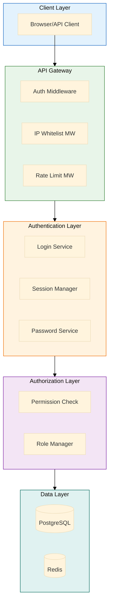

# MxTac - Backend Security Implementation

> **Version**: 2.0
> **Last Updated**: 2026-01-19
> **Status**: Implementation Ready
> **Compliance**: Korean Enterprise Security Audit

---

## Table of Contents

1. [Architecture Overview](#1-architecture-overview)
2. [Database Schema](#2-database-schema)
3. [Authentication System](#3-authentication-system)
4. [Password Management](#4-password-management)
5. [Authorization & RBAC](#5-authorization--rbac)
6. [Session Management](#6-session-management)
7. [Audit Logging](#7-audit-logging)
8. [API Endpoints](#8-api-endpoints)
9. [Background Tasks](#9-background-tasks)
10. [Testing Strategy](#10-testing-strategy)

---

## 1. Architecture Overview

### 1.1 Security Architecture



### 1.2 Technology Stack

| Component | Technology | Version | Purpose |
|-----------|------------|---------|---------|
| **Framework** | FastAPI | 0.109+ | Async REST API |
| **Server** | Uvicorn | 0.27+ | ASGI server |
| **Database** | PostgreSQL | 16+ | Primary data store |
| **Cache** | Redis | 7+ | Session & rate limiting |
| **ORM** | SQLAlchemy | 2.0+ | Database ORM |
| **Password** | passlib[bcrypt] | 1.7+ | Password hashing |
| **JWT** | python-jose | 3.3+ | Token generation |
| **Validation** | Pydantic | 2.5+ | Request/response validation |

---

## 2. Database Schema

### 2.1 Complete Schema

```sql
-- ============================================================================
-- USERS & AUTHENTICATION
-- ============================================================================

CREATE EXTENSION IF NOT EXISTS "uuid-ossp";
CREATE EXTENSION IF NOT EXISTS "pgcrypto";

-- Users table with enhanced security fields
CREATE TABLE users (
    id UUID PRIMARY KEY DEFAULT gen_random_uuid(),
    email VARCHAR(255) UNIQUE NOT NULL,
    email_verified BOOLEAN DEFAULT FALSE,
    full_name VARCHAR(255) NOT NULL,
    employee_id VARCHAR(50) UNIQUE,

    -- Password fields
    password_hash VARCHAR(255) NOT NULL,
    password_changed_at TIMESTAMP DEFAULT NOW(),
    password_expires_at TIMESTAMP DEFAULT NOW() + INTERVAL '90 days',
    must_change_password BOOLEAN DEFAULT TRUE,  -- Force change on first login

    -- Account status
    is_active BOOLEAN DEFAULT TRUE,
    is_locked BOOLEAN DEFAULT FALSE,
    locked_until TIMESTAMP,
    locked_reason VARCHAR(255),
    locked_at TIMESTAMP,

    -- Login tracking
    failed_login_attempts INTEGER DEFAULT 0,
    last_login TIMESTAMP,
    last_login_ip VARCHAR(45),
    last_failed_login TIMESTAMP,

    -- Access control
    role_id UUID REFERENCES roles(id),
    allowed_ip_ranges TEXT[],  -- ['192.168.1.0/24', '10.0.0.5']

    -- Metadata
    created_at TIMESTAMP DEFAULT NOW(),
    created_by UUID REFERENCES users(id),
    updated_at TIMESTAMP DEFAULT NOW(),
    updated_by UUID REFERENCES users(id),
    deleted_at TIMESTAMP,  -- Soft delete

    CONSTRAINT chk_email_format CHECK (email ~* '^[A-Za-z0-9._%+-]+@[A-Za-z0-9.-]+\.[A-Za-z]{2,}$'),
    CONSTRAINT chk_employee_id_format CHECK (employee_id IS NULL OR length(employee_id) >= 3)
);

CREATE INDEX idx_users_email ON users(email) WHERE deleted_at IS NULL;
CREATE INDEX idx_users_employee_id ON users(employee_id) WHERE deleted_at IS NULL;
CREATE INDEX idx_users_role ON users(role_id);
CREATE INDEX idx_users_active ON users(is_active, is_locked) WHERE deleted_at IS NULL;

-- Password history (prevent reuse)
CREATE TABLE password_history (
    id UUID PRIMARY KEY DEFAULT gen_random_uuid(),
    user_id UUID NOT NULL REFERENCES users(id) ON DELETE CASCADE,
    password_hash VARCHAR(255) NOT NULL,
    created_at TIMESTAMP DEFAULT NOW(),

    CONSTRAINT fk_password_history_user FOREIGN KEY (user_id) REFERENCES users(id)
);

CREATE INDEX idx_password_history_user ON password_history(user_id, created_at DESC);

-- ============================================================================
-- ROLE-BASED ACCESS CONTROL (RBAC)
-- ============================================================================

CREATE TABLE roles (
    id UUID PRIMARY KEY DEFAULT gen_random_uuid(),
    name VARCHAR(100) UNIQUE NOT NULL,
    display_name VARCHAR(255) NOT NULL,
    description TEXT,
    is_system BOOLEAN DEFAULT FALSE,  -- System roles cannot be deleted
    created_at TIMESTAMP DEFAULT NOW(),
    updated_at TIMESTAMP DEFAULT NOW(),

    CONSTRAINT chk_role_name CHECK (name ~ '^[a-z][a-z0-9_]*$')
);

CREATE TABLE permissions (
    id UUID PRIMARY KEY DEFAULT gen_random_uuid(),
    resource VARCHAR(100) NOT NULL,  -- alerts, rules, users, etc.
    action VARCHAR(50) NOT NULL,     -- read, write, delete, execute
    description TEXT,

    CONSTRAINT uq_resource_action UNIQUE(resource, action),
    CONSTRAINT chk_resource_format CHECK (resource ~ '^[a-z][a-z0-9_]*$'),
    CONSTRAINT chk_action_format CHECK (action ~ '^[a-z][a-z0-9_]*$')
);

CREATE TABLE role_permissions (
    role_id UUID NOT NULL REFERENCES roles(id) ON DELETE CASCADE,
    permission_id UUID NOT NULL REFERENCES permissions(id) ON DELETE CASCADE,
    granted_at TIMESTAMP DEFAULT NOW(),
    granted_by UUID REFERENCES users(id),

    PRIMARY KEY (role_id, permission_id)
);

CREATE INDEX idx_role_permissions_role ON role_permissions(role_id);
CREATE INDEX idx_role_permissions_permission ON role_permissions(permission_id);

-- ============================================================================
-- AUDIT LOGGING
-- ============================================================================

CREATE TABLE audit_logs (
    id UUID PRIMARY KEY DEFAULT gen_random_uuid(),
    timestamp TIMESTAMP DEFAULT NOW() NOT NULL,

    -- Who
    user_id UUID REFERENCES users(id),
    user_email VARCHAR(255),  -- Denormalized for deleted users

    -- What
    action VARCHAR(100) NOT NULL,
    resource_type VARCHAR(100),
    resource_id UUID,

    -- How
    status VARCHAR(20) NOT NULL,  -- SUCCESS, FAILURE, ERROR
    reason VARCHAR(255),

    -- Where
    ip_address VARCHAR(45),
    user_agent TEXT,
    request_id UUID,

    -- Context
    metadata JSONB,

    -- Indexes for common queries
    CONSTRAINT chk_status CHECK (status IN ('SUCCESS', 'FAILURE', 'ERROR'))
) PARTITION BY RANGE (timestamp);

-- Create partitions for 3-year retention
CREATE TABLE audit_logs_2026 PARTITION OF audit_logs
    FOR VALUES FROM ('2026-01-01') TO ('2027-01-01');

CREATE TABLE audit_logs_2027 PARTITION OF audit_logs
    FOR VALUES FROM ('2027-01-01') TO ('2028-01-01');

CREATE TABLE audit_logs_2028 PARTITION OF audit_logs
    FOR VALUES FROM ('2028-01-01') TO ('2029-01-01');

CREATE INDEX idx_audit_logs_timestamp ON audit_logs(timestamp DESC);
CREATE INDEX idx_audit_logs_user ON audit_logs(user_id, timestamp DESC);
CREATE INDEX idx_audit_logs_action ON audit_logs(action, timestamp DESC);
CREATE INDEX idx_audit_logs_resource ON audit_logs(resource_type, resource_id, timestamp DESC);
CREATE INDEX idx_audit_logs_status ON audit_logs(status, timestamp DESC);

-- ============================================================================
-- HELPER FUNCTIONS
-- ============================================================================

-- Function to automatically update updated_at timestamp
CREATE OR REPLACE FUNCTION update_updated_at_column()
RETURNS TRIGGER AS $$
BEGIN
    NEW.updated_at = NOW();
    RETURN NEW;
END;
$$ LANGUAGE plpgsql;

-- Trigger for users table
CREATE TRIGGER update_users_updated_at BEFORE UPDATE ON users
    FOR EACH ROW EXECUTE FUNCTION update_updated_at_column();

-- Trigger for roles table
CREATE TRIGGER update_roles_updated_at BEFORE UPDATE ON roles
    FOR EACH ROW EXECUTE FUNCTION update_updated_at_column();

-- ============================================================================
-- SEED DATA
-- ============================================================================

-- Insert system roles
INSERT INTO roles (id, name, display_name, description, is_system) VALUES
    (gen_random_uuid(), 'admin', 'Administrator', 'Full system access', true),
    (gen_random_uuid(), 'engineer', 'Detection Engineer', 'Manage rules and connectors', true),
    (gen_random_uuid(), 'hunter', 'Threat Hunter', 'Run queries and hunts', true),
    (gen_random_uuid(), 'analyst', 'SOC Analyst', 'View and manage alerts', true),
    (gen_random_uuid(), 'viewer', 'Viewer', 'Read-only access', true);

-- Insert permissions
INSERT INTO permissions (resource, action, description) VALUES
    -- Alert permissions
    ('alerts', 'read', 'View alerts'),
    ('alerts', 'write', 'Create and update alerts'),
    ('alerts', 'delete', 'Delete alerts'),
    ('alerts', 'assign', 'Assign alerts to users'),

    -- Event permissions
    ('events', 'read', 'View events'),
    ('events', 'search', 'Search events'),
    ('events', 'export', 'Export events'),

    -- Rule permissions
    ('rules', 'read', 'View rules'),
    ('rules', 'write', 'Create and update rules'),
    ('rules', 'delete', 'Delete rules'),
    ('rules', 'execute', 'Execute rules'),

    -- User permissions
    ('users', 'read', 'View users'),
    ('users', 'write', 'Create and update users'),
    ('users', 'delete', 'Delete users'),

    -- Role permissions
    ('roles', 'read', 'View roles'),
    ('roles', 'write', 'Manage roles'),

    -- Connector permissions
    ('connectors', 'read', 'View connectors'),
    ('connectors', 'write', 'Manage connectors'),

    -- Dashboard permissions
    ('dashboards', 'read', 'View dashboards'),
    ('dashboards', 'write', 'Create dashboards'),

    -- Hunt permissions
    ('hunts', 'read', 'View hunts'),
    ('hunts', 'write', 'Create and run hunts'),

    -- Response permissions
    ('response', 'execute', 'Execute response actions'),

    -- Audit permissions
    ('audit', 'read', 'View audit logs');

-- Assign permissions to roles
-- Admin: all permissions
INSERT INTO role_permissions (role_id, permission_id)
SELECT r.id, p.id
FROM roles r
CROSS JOIN permissions p
WHERE r.name = 'admin';

-- Engineer: rules, connectors, alerts, events
INSERT INTO role_permissions (role_id, permission_id)
SELECT r.id, p.id
FROM roles r
CROSS JOIN permissions p
WHERE r.name = 'engineer'
  AND p.resource IN ('rules', 'connectors', 'alerts', 'events', 'dashboards')
  AND p.action != 'delete';

-- Hunter: hunts, events, alerts (read-only on rules)
INSERT INTO role_permissions (role_id, permission_id)
SELECT r.id, p.id
FROM roles r
CROSS JOIN permissions p
WHERE r.name = 'hunter'
  AND ((p.resource IN ('hunts', 'events') AND p.action IN ('read', 'write', 'search', 'export'))
    OR (p.resource = 'alerts' AND p.action IN ('read', 'write'))
    OR (p.resource = 'rules' AND p.action = 'read')
    OR (p.resource = 'dashboards' AND p.action IN ('read', 'write')));

-- Analyst: alerts, events (read), dashboards
INSERT INTO role_permissions (role_id, permission_id)
SELECT r.id, p.id
FROM roles r
CROSS JOIN permissions p
WHERE r.name = 'analyst'
  AND ((p.resource = 'alerts' AND p.action IN ('read', 'write', 'assign'))
    OR (p.resource = 'events' AND p.action IN ('read', 'search'))
    OR (p.resource = 'dashboards' AND p.action = 'read'));

-- Viewer: read-only
INSERT INTO role_permissions (role_id, permission_id)
SELECT r.id, p.id
FROM roles r
CROSS JOIN permissions p
WHERE r.name = 'viewer'
  AND p.action = 'read';
```

### 2.2 Migration Scripts

```python
# backend/alembic/versions/001_security_enhancements.py
"""Add enterprise security requirements

Revision ID: 001_security_enhancements
Revises: base
Create Date: 2026-01-19

"""
from alembic import op
import sqlalchemy as sa
from sqlalchemy.dialects import postgresql

revision = '001_security_enhancements'
down_revision = None
branch_labels = None
depends_on = None

def upgrade():
    # Add new columns to users table
    op.add_column('users', sa.Column('password_changed_at', sa.DateTime(), server_default=sa.func.now()))
    op.add_column('users', sa.Column('password_expires_at', sa.DateTime()))
    op.add_column('users', sa.Column('must_change_password', sa.Boolean(), server_default='true'))
    op.add_column('users', sa.Column('is_locked', sa.Boolean(), server_default='false'))
    op.add_column('users', sa.Column('locked_until', sa.DateTime(), nullable=True))
    op.add_column('users', sa.Column('locked_reason', sa.String(255), nullable=True))
    op.add_column('users', sa.Column('failed_login_attempts', sa.Integer(), server_default='0'))
    op.add_column('users', sa.Column('last_login', sa.DateTime(), nullable=True))
    op.add_column('users', sa.Column('last_login_ip', sa.String(45), nullable=True))
    op.add_column('users', sa.Column('allowed_ip_ranges', postgresql.ARRAY(sa.Text()), nullable=True))

    # Set password_expires_at for existing users
    op.execute("""
        UPDATE users
        SET password_expires_at = password_changed_at + INTERVAL '90 days'
        WHERE password_expires_at IS NULL
    """)

    # Create password_history table
    op.create_table('password_history',
        sa.Column('id', postgresql.UUID(), server_default=sa.text('gen_random_uuid()'), nullable=False),
        sa.Column('user_id', postgresql.UUID(), nullable=False),
        sa.Column('password_hash', sa.String(255), nullable=False),
        sa.Column('created_at', sa.DateTime(), server_default=sa.func.now()),
        sa.ForeignKeyConstraint(['user_id'], ['users.id'], ondelete='CASCADE'),
        sa.PrimaryKeyConstraint('id')
    )
    op.create_index('idx_password_history_user', 'password_history', ['user_id', 'created_at'])

def downgrade():
    op.drop_table('password_history')
    op.drop_column('users', 'allowed_ip_ranges')
    op.drop_column('users', 'last_login_ip')
    op.drop_column('users', 'last_login')
    op.drop_column('users', 'failed_login_attempts')
    op.drop_column('users', 'locked_reason')
    op.drop_column('users', 'locked_until')
    op.drop_column('users', 'is_locked')
    op.drop_column('users', 'must_change_password')
    op.drop_column('users', 'password_expires_at')
    op.drop_column('users', 'password_changed_at')
```

---

## 3. Authentication System

### 3.1 Models

```python
# backend/app/models/user.py
from sqlalchemy import Column, String, Boolean, DateTime, Integer, ARRAY, Text
from sqlalchemy.dialects.postgresql import UUID
from sqlalchemy.orm import relationship
from sqlalchemy.sql import func
from datetime import datetime, timedelta
import uuid

from app.db.base_class import Base

class User(Base):
    __tablename__ = "users"

    id = Column(UUID(as_uuid=True), primary_key=True, default=uuid.uuid4)
    email = Column(String(255), unique=True, nullable=False, index=True)
    email_verified = Column(Boolean, default=False)
    full_name = Column(String(255), nullable=False)
    employee_id = Column(String(50), unique=True, index=True)

    # Password fields
    password_hash = Column(String(255), nullable=False)
    password_changed_at = Column(DateTime, default=datetime.utcnow)
    password_expires_at = Column(DateTime)
    must_change_password = Column(Boolean, default=True)

    # Account status
    is_active = Column(Boolean, default=True)
    is_locked = Column(Boolean, default=False)
    locked_until = Column(DateTime)
    locked_reason = Column(String(255))
    locked_at = Column(DateTime)

    # Login tracking
    failed_login_attempts = Column(Integer, default=0)
    last_login = Column(DateTime)
    last_login_ip = Column(String(45))
    last_failed_login = Column(DateTime)

    # Access control
    role_id = Column(UUID(as_uuid=True), ForeignKey('roles.id'))
    allowed_ip_ranges = Column(ARRAY(Text))

    # Metadata
    created_at = Column(DateTime, default=datetime.utcnow)
    updated_at = Column(DateTime, default=datetime.utcnow, onupdate=datetime.utcnow)
    deleted_at = Column(DateTime)

    # Relationships
    role = relationship("Role", back_populates="users")
    password_history = relationship("PasswordHistory", back_populates="user", cascade="all, delete-orphan")
    audit_logs = relationship("AuditLog", back_populates="user")

    def __repr__(self):
        return f"<User {self.email}>"

    @property
    def is_password_expired(self) -> bool:
        """Check if password has expired"""
        if not self.password_expires_at:
            return False
        return self.password_expires_at < datetime.utcnow()

    @property
    def is_account_locked(self) -> bool:
        """Check if account is locked"""
        if not self.is_locked:
            return False
        if self.locked_until and self.locked_until < datetime.utcnow():
            return False
        return True


class PasswordHistory(Base):
    __tablename__ = "password_history"

    id = Column(UUID(as_uuid=True), primary_key=True, default=uuid.uuid4)
    user_id = Column(UUID(as_uuid=True), ForeignKey('users.id', ondelete='CASCADE'), nullable=False)
    password_hash = Column(String(255), nullable=False)
    created_at = Column(DateTime, default=datetime.utcnow)

    # Relationship
    user = relationship("User", back_populates="password_history")
```

### 3.2 Password Service

```python
# backend/app/core/security/password.py
from passlib.context import CryptContext
from datetime import datetime, timedelta
from sqlalchemy.ext.asyncio import AsyncSession
from sqlalchemy import select
from typing import Tuple
import re

from app.models.user import User, PasswordHistory
from app.core.config import settings

# Use bcrypt with 12 rounds (secure and performant)
pwd_context = CryptContext(
    schemes=["bcrypt"],
    deprecated="auto",
    bcrypt__rounds=12
)

class PasswordPolicy:
    """Enterprise password policy implementation"""

    MIN_LENGTH_3_TYPES = 8
    MIN_LENGTH_2_TYPES = 10
    MAX_CONSECUTIVE_CHARS = 3
    PASSWORD_EXPIRY_DAYS = 90
    PASSWORD_HISTORY_COUNT = 2

    @classmethod
    def validate_password(cls, password: str) -> Tuple[bool, str]:
        """
        Validate password against enterprise policy:
        - 3 char types + 8 chars OR 2 char types + 10 chars
        - No more than 3 consecutive identical characters
        """
        if not password:
            return False, "Password is required"

        # Check character types
        has_lowercase = bool(re.search(r'[a-z]', password))
        has_uppercase = bool(re.search(r'[A-Z]', password))
        has_digit = bool(re.search(r'[0-9]', password))
        has_special = bool(re.search(r'[!@#$%^&*(),.?":{}|<>_\-+=\[\]\\\/;\'`~]', password))

        char_types = sum([has_lowercase, has_uppercase, has_digit, has_special])

        # Rule 1: 3 types + 8 chars
        if char_types >= 3 and len(password) >= cls.MIN_LENGTH_3_TYPES:
            pass
        # Rule 2: 2 types + 10 chars
        elif char_types >= 2 and len(password) >= cls.MIN_LENGTH_2_TYPES:
            pass
        else:
            return False, (
                f"Password must contain either:\n"
                f"- 3 character types (lowercase, uppercase, numbers, special) + {cls.MIN_LENGTH_3_TYPES} characters, OR\n"
                f"- 2 character types + {cls.MIN_LENGTH_2_TYPES} characters"
            )

        # Check for excessive consecutive identical characters
        if re.search(rf'(.)\1{{{cls.MAX_CONSECUTIVE_CHARS},}}', password):
            return False, f"Password cannot have more than {cls.MAX_CONSECUTIVE_CHARS} consecutive identical characters"

        return True, "Password meets requirements"

    @classmethod
    def validate_not_common(cls, password: str) -> Tuple[bool, str]:
        """Check against common passwords list"""
        # In production, load from file or database
        COMMON_PASSWORDS = {
            'password', 'Password1', '12345678', 'qwerty',
            'abc123', 'password123', 'admin123', 'letmein'
        }

        if password.lower() in COMMON_PASSWORDS:
            return False, "Password is too common. Please choose a more unique password."

        return True, "Password is not common"


class PasswordService:
    """Password management service"""

    def __init__(self, db: AsyncSession):
        self.db = db

    def hash_password(self, password: str) -> str:
        """Hash password using bcrypt"""
        return pwd_context.hash(password)

    def verify_password(self, plain_password: str, hashed_password: str) -> bool:
        """Verify password against hash"""
        return pwd_context.verify(plain_password, hashed_password)

    async def validate_password_strength(self, password: str) -> Tuple[bool, str]:
        """Validate password against all policies"""
        # Check complexity
        valid, message = PasswordPolicy.validate_password(password)
        if not valid:
            return False, message

        # Check if common
        valid, message = PasswordPolicy.validate_not_common(password)
        if not valid:
            return False, message

        return True, "Password is valid"

    async def check_password_history(self, user: User, new_password: str) -> Tuple[bool, str]:
        """Check if password was used recently"""
        # Get recent password history
        query = select(PasswordHistory)\
            .where(PasswordHistory.user_id == user.id)\
            .order_by(PasswordHistory.created_at.desc())\
            .limit(PasswordPolicy.PASSWORD_HISTORY_COUNT)

        result = await self.db.execute(query)
        recent_passwords = result.scalars().all()

        # Check against history
        for old_pwd in recent_passwords:
            if self.verify_password(new_password, old_pwd.password_hash):
                return False, f"Cannot reuse last {PasswordPolicy.PASSWORD_HISTORY_COUNT} passwords"

        return True, "Password not in history"

    async def change_password(
        self,
        user: User,
        new_password: str,
        force: bool = False
    ) -> Tuple[bool, str]:
        """
        Change user password with validation

        Args:
            user: User object
            new_password: New password
            force: Skip history check (for admin resets)

        Returns:
            Tuple of (success, message)
        """
        # Validate password strength
        valid, message = await self.validate_password_strength(new_password)
        if not valid:
            return False, message

        # Check password history (unless forced)
        if not force:
            valid, message = await self.check_password_history(user, new_password)
            if not valid:
                return False, message

        # Save current password to history
        if user.password_hash:
            history_entry = PasswordHistory(
                user_id=user.id,
                password_hash=user.password_hash
            )
            self.db.add(history_entry)

        # Update user password
        user.password_hash = self.hash_password(new_password)
        user.password_changed_at = datetime.utcnow()
        user.password_expires_at = datetime.utcnow() + timedelta(
            days=PasswordPolicy.PASSWORD_EXPIRY_DAYS
        )
        user.must_change_password = False

        await self.db.commit()

        return True, "Password changed successfully"

    async def generate_temp_password(self) -> str:
        """Generate secure temporary password"""
        import secrets
        import string

        # Generate 12-char password with all types
        chars = string.ascii_letters + string.digits + "!@#$%^&*"
        password = ''.join(secrets.choice(chars) for _ in range(12))

        # Ensure it meets policy (should always pass)
        valid, _ = PasswordPolicy.validate_password(password)
        if not valid:
            return await self.generate_temp_password()  # Retry

        return password
```

### 3.3 Login Service

```python
# backend/app/services/auth/login.py
from datetime import datetime, timedelta
from fastapi import HTTPException, status
from sqlalchemy.ext.asyncio import AsyncSession
from sqlalchemy import select
from typing import Optional
import uuid

from app.models.user import User
from app.core.security.password import PasswordService
from app.services.audit import AuditService
from app.services.session import SessionManager
from app.core.security.jwt import create_access_token, create_temp_token

class LoginService:
    """Authentication and login service"""

    MAX_FAILED_ATTEMPTS = 5
    LOCKOUT_DURATION_MINUTES = 30

    def __init__(self, db: AsyncSession):
        self.db = db
        self.password_service = PasswordService(db)
        self.audit_service = AuditService(db)
        self.session_manager = SessionManager()

    async def get_user_by_email(self, email: str) -> Optional[User]:
        """Get user by email"""
        query = select(User).where(
            User.email == email,
            User.deleted_at.is_(None)
        )
        result = await self.db.execute(query)
        return result.scalar_one_or_none()

    async def authenticate(
        self,
        email: str,
        password: str,
        ip_address: str,
        user_agent: str,
        request_id: Optional[uuid.UUID] = None
    ) -> User:
        """
        Authenticate user with comprehensive security checks

        Raises:
            HTTPException: If authentication fails

        Returns:
            User object if successful
        """
        user = await self.get_user_by_email(email)

        if not user:
            # Log failed attempt (don't reveal user doesn't exist)
            await self.audit_service.log_login_attempt(
                user_id=None,
                email=email,
                ip_address=ip_address,
                user_agent=user_agent,
                success=False,
                reason="INVALID_CREDENTIALS",
                request_id=request_id
            )
            raise HTTPException(
                status_code=status.HTTP_401_UNAUTHORIZED,
                detail="Invalid credentials"
            )

        # Check if account is active
        if not user.is_active:
            await self.audit_service.log_login_attempt(
                user_id=user.id,
                email=email,
                ip_address=ip_address,
                user_agent=user_agent,
                success=False,
                reason="ACCOUNT_INACTIVE",
                request_id=request_id
            )
            raise HTTPException(
                status_code=status.HTTP_403_FORBIDDEN,
                detail="Account is inactive. Contact administrator."
            )

        # Check if account is locked
        if user.is_account_locked:
            remaining_minutes = 0
            if user.locked_until:
                remaining = (user.locked_until - datetime.utcnow()).total_seconds() / 60
                remaining_minutes = max(0, int(remaining))

            await self.audit_service.log_login_attempt(
                user_id=user.id,
                email=email,
                ip_address=ip_address,
                user_agent=user_agent,
                success=False,
                reason="ACCOUNT_LOCKED",
                request_id=request_id
            )

            raise HTTPException(
                status_code=status.HTTP_403_FORBIDDEN,
                detail=f"Account is locked. Try again in {remaining_minutes} minutes."
            )

        # Verify password
        if not self.password_service.verify_password(password, user.password_hash):
            # Increment failed attempts
            user.failed_login_attempts += 1
            user.last_failed_login = datetime.utcnow()

            if user.failed_login_attempts >= self.MAX_FAILED_ATTEMPTS:
                # Lock account
                user.is_locked = True
                user.locked_until = datetime.utcnow() + timedelta(
                    minutes=self.LOCKOUT_DURATION_MINUTES
                )
                user.locked_reason = "MAX_FAILED_LOGIN_ATTEMPTS"
                user.locked_at = datetime.utcnow()

                await self.db.commit()

                await self.audit_service.log_login_attempt(
                    user_id=user.id,
                    email=email,
                    ip_address=ip_address,
                    user_agent=user_agent,
                    success=False,
                    reason="ACCOUNT_LOCKED_MAX_ATTEMPTS",
                    request_id=request_id,
                    metadata={
                        "failed_attempts": user.failed_login_attempts,
                        "lockout_duration_minutes": self.LOCKOUT_DURATION_MINUTES
                    }
                )

                raise HTTPException(
                    status_code=status.HTTP_403_FORBIDDEN,
                    detail=f"Account locked for {self.LOCKOUT_DURATION_MINUTES} minutes due to {self.MAX_FAILED_ATTEMPTS} failed login attempts"
                )

            await self.db.commit()

            await self.audit_service.log_login_attempt(
                user_id=user.id,
                email=email,
                ip_address=ip_address,
                user_agent=user_agent,
                success=False,
                reason="INVALID_PASSWORD",
                request_id=request_id,
                metadata={
                    "failed_attempts": user.failed_login_attempts,
                    "attempts_remaining": self.MAX_FAILED_ATTEMPTS - user.failed_login_attempts
                }
            )

            raise HTTPException(
                status_code=status.HTTP_401_UNAUTHORIZED,
                detail=f"Invalid credentials ({self.MAX_FAILED_ATTEMPTS - user.failed_login_attempts} attempts remaining)"
            )

        # Password correct - check if password expired
        if user.is_password_expired:
            # Force password change
            user.must_change_password = True
            await self.db.commit()

            # Return temp token that only allows password change
            temp_token = create_temp_token(data={"sub": user.email})

            await self.audit_service.log_login_attempt(
                user_id=user.id,
                email=email,
                ip_address=ip_address,
                user_agent=user_agent,
                success=True,
                reason="PASSWORD_EXPIRED",
                request_id=request_id
            )

            raise HTTPException(
                status_code=status.HTTP_403_FORBIDDEN,
                detail="Password expired. Please change your password.",
                headers={"X-Temp-Token": temp_token}
            )

        # Check if initial password change required
        if user.must_change_password:
            # Return temp token
            temp_token = create_temp_token(data={"sub": user.email})

            await self.audit_service.log_login_attempt(
                user_id=user.id,
                email=email,
                ip_address=ip_address,
                user_agent=user_agent,
                success=True,
                reason="MUST_CHANGE_PASSWORD",
                request_id=request_id
            )

            raise HTTPException(
                status_code=status.HTTP_403_FORBIDDEN,
                detail="Password change required.",
                headers={"X-Temp-Token": temp_token}
            )

        # Successful login - reset failed attempts and update login info
        if user.locked_until and user.locked_until < datetime.utcnow():
            user.is_locked = False
            user.locked_until = None
            user.locked_reason = None

        user.failed_login_attempts = 0
        user.last_login = datetime.utcnow()
        user.last_login_ip = ip_address

        await self.db.commit()

        # Log successful login
        await self.audit_service.log_login_attempt(
            user_id=user.id,
            email=email,
            ip_address=ip_address,
            user_agent=user_agent,
            success=True,
            reason="SUCCESS",
            request_id=request_id
        )

        return user
```

**Continue in next message due to length...**

Would you like me to continue with the remaining sections (Session Management, RBAC, Audit Logging, API Endpoints, Background Tasks, and Testing)?