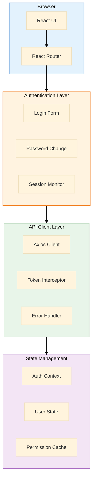

# MxTac - Frontend Security Implementation

> **Version**: 2.0
> **Last Updated**: 2026-01-19
> **Status**: Implementation Ready
> **Compliance**: Korean Enterprise Security Audit

---

## Table of Contents

1. [Architecture Overview](#1-architecture-overview)
2. [Authentication UI](#2-authentication-ui)
3. [Session Management](#3-session-management)
4. [Password Management UI](#4-password-management-ui)
5. [Authorization & RBAC](#5-authorization--rbac)
6. [Security Components](#6-security-components)
7. [API Client](#7-api-client)
8. [State Management](#8-state-management)
9. [Admin User Management](#9-admin-user-management)
10. [Testing Strategy](#10-testing-strategy)

---

## 1. Architecture Overview

### 1.1 Frontend Security Architecture



### 1.2 Technology Stack

| Component | Technology | Version | Purpose |
|-----------|------------|---------|---------|
| **Framework** | React | 18+ | UI framework |
| **Language** | TypeScript | 5+ | Type safety |
| **Router** | React Router | 6+ | Navigation |
| **State** | Zustand | 4+ | Global state |
| **HTTP Client** | Axios | 1.6+ | API requests |
| **Forms** | React Hook Form | 7+ | Form validation |
| **UI Library** | Ant Design | 5+ | UI components |
| **Icons** | Ant Design Icons | 5+ | Icons |

---

## 2. Authentication UI

### 2.1 Login Page

```typescript
// src/pages/auth/LoginPage.tsx
import React, { useState } from 'react';
import { Form, Input, Button, Alert, Card, Typography } from 'antd';
import { UserOutlined, LockOutlined } from '@ant-design/icons';
import { useNavigate } from 'react-router-dom';
import { useAuthStore } from '@/stores/authStore';
import { authApi } from '@/api/auth';
import type { LoginRequest } from '@/types/auth';

const { Title, Text } = Typography;

interface LoginFormValues {
  email: string;
  password: string;
}

export const LoginPage: React.FC = () => {
  const [loading, setLoading] = useState(false);
  const [error, setError] = useState<string | null>(null);
  const navigate = useNavigate();
  const { login } = useAuthStore();

  const onFinish = async (values: LoginFormValues) => {
    setLoading(true);
    setError(null);

    try {
      const response = await authApi.login(values);

      // Store token and user info
      login(response.access_token, response.user);

      // Redirect to dashboard
      navigate('/dashboard');
    } catch (err: any) {
      const status = err.response?.status;
      const detail = err.response?.data?.detail;

      if (status === 403) {
        // Check if password change required
        if (detail?.includes('Password expired') || detail?.includes('Password change required')) {
          const tempToken = err.response.headers['x-temp-token'];

          // Navigate to force password change
          navigate('/auth/force-change-password', {
            state: { tempToken, email: values.email, reason: detail }
          });
          return;
        }

        // Account locked
        setError(detail || 'Account is locked. Please contact administrator.');
      } else if (status === 401) {
        setError(detail || 'Invalid email or password');
      } else {
        setError('An error occurred. Please try again.');
      }
    } finally {
      setLoading(false);
    }
  };

  return (
    <div className="login-page">
      <Card className="login-card" style={{ maxWidth: 400, margin: '100px auto' }}>
        <div style={{ textAlign: 'center', marginBottom: 24 }}>
          <Title level={2}>MxTac Security Platform</Title>
          <Text type="secondary">Sign in to continue</Text>
        </div>

        {error && (
          <Alert
            message="Login Failed"
            description={error}
            type="error"
            showIcon
            closable
            onClose={() => setError(null)}
            style={{ marginBottom: 16 }}
          />
        )}

        <Form
          name="login"
          onFinish={onFinish}
          autoComplete="off"
          layout="vertical"
        >
          <Form.Item
            name="email"
            rules={[
              { required: true, message: 'Please enter your email' },
              { type: 'email', message: 'Please enter a valid email' }
            ]}
          >
            <Input
              prefix={<UserOutlined />}
              placeholder="Email"
              size="large"
              autoComplete="email"
            />
          </Form.Item>

          <Form.Item
            name="password"
            rules={[{ required: true, message: 'Please enter your password' }]}
          >
            <Input.Password
              prefix={<LockOutlined />}
              placeholder="Password"
              size="large"
              autoComplete="current-password"
            />
          </Form.Item>

          <Form.Item>
            <Button
              type="primary"
              htmlType="submit"
              loading={loading}
              block
              size="large"
            >
              Sign In
            </Button>
          </Form.Item>
        </Form>

        <div style={{ textAlign: 'center', marginTop: 16 }}>
          <Text type="secondary">
            Having trouble? Contact your administrator
          </Text>
        </div>
      </Card>
    </div>
  );
};
```

### 2.2 Logout Handler

```typescript
// src/components/common/LogoutButton.tsx
import React from 'react';
import { Button, Modal } from 'antd';
import { LogoutOutlined } from '@ant-design/icons';
import { useNavigate } from 'react-router-dom';
import { useAuthStore } from '@/stores/authStore';
import { authApi } from '@/api/auth';

interface LogoutButtonProps {
  type?: 'text' | 'link' | 'default' | 'primary' | 'dashed';
  icon?: boolean;
}

export const LogoutButton: React.FC<LogoutButtonProps> = ({
  type = 'text',
  icon = true
}) => {
  const navigate = useNavigate();
  const { logout: logoutStore } = useAuthStore();

  const handleLogout = () => {
    Modal.confirm({
      title: 'Logout',
      content: 'Are you sure you want to logout?',
      okText: 'Logout',
      cancelText: 'Cancel',
      onOk: async () => {
        try {
          // Call backend logout (invalidate session)
          await authApi.logout();
        } catch (err) {
          console.error('Logout error:', err);
          // Continue with client-side logout even if API call fails
        }

        // Clear client-side state
        logoutStore();

        // Redirect to login
        navigate('/auth/login');
      }
    });
  };

  return (
    <Button
      type={type}
      icon={icon ? <LogoutOutlined /> : undefined}
      onClick={handleLogout}
    >
      Logout
    </Button>
  );
};
```

---

## 3. Session Management

### 3.1 Session Timeout Monitor

```typescript
// src/hooks/useSessionTimeout.ts
import { useEffect, useRef, useCallback } from 'react';
import { Modal } from 'antd';
import { useNavigate } from 'react-router-dom';
import { useAuthStore } from '@/stores/authStore';
import { authApi } from '@/api/auth';

const SESSION_TIMEOUT_MS = 30 * 60 * 1000; // 30 minutes
const WARNING_BEFORE_MS = 2 * 60 * 1000;   // Warn 2 minutes before
const CHECK_INTERVAL_MS = 60 * 1000;       // Check every minute

export const useSessionTimeout = () => {
  const navigate = useNavigate();
  const { isAuthenticated, logout } = useAuthStore();
  const lastActivityRef = useRef<number>(Date.now());
  const warningShownRef = useRef<boolean>(false);

  const resetActivity = useCallback(() => {
    lastActivityRef.current = Date.now();
    warningShownRef.current = false;
  }, []);

  const handleTimeout = useCallback(() => {
    Modal.warning({
      title: 'Session Expired',
      content: 'Your session has expired due to inactivity. Please login again.',
      onOk: () => {
        logout();
        navigate('/auth/login');
      }
    });
  }, [logout, navigate]);

  const showWarning = useCallback(() => {
    if (warningShownRef.current) return;

    warningShownRef.current = true;

    Modal.warning({
      title: 'Session Expiring Soon',
      content: 'Your session will expire in 2 minutes due to inactivity. Move your mouse or press any key to continue.',
      okText: 'Continue Session',
      onOk: () => {
        resetActivity();
      }
    });
  }, [resetActivity]);

  useEffect(() => {
    if (!isAuthenticated) return;

    // Track user activity
    const activityEvents = ['mousedown', 'keydown', 'scroll', 'touchstart'];

    activityEvents.forEach(event => {
      window.addEventListener(event, resetActivity);
    });

    // Check for timeout
    const interval = setInterval(() => {
      const now = Date.now();
      const timeSinceActivity = now - lastActivityRef.current;

      if (timeSinceActivity >= SESSION_TIMEOUT_MS) {
        handleTimeout();
      } else if (timeSinceActivity >= SESSION_TIMEOUT_MS - WARNING_BEFORE_MS) {
        showWarning();
      }
    }, CHECK_INTERVAL_MS);

    return () => {
      activityEvents.forEach(event => {
        window.removeEventListener(event, resetActivity);
      });
      clearInterval(interval);
    };
  }, [isAuthenticated, resetActivity, handleTimeout, showWarning]);

  return { resetActivity };
};
```

### 3.2 Session Provider

```typescript
// src/providers/SessionProvider.tsx
import React, { useEffect } from 'react';
import { useSessionTimeout } from '@/hooks/useSessionTimeout';
import { useAuthStore } from '@/stores/authStore';

interface SessionProviderProps {
  children: React.ReactNode;
}

export const SessionProvider: React.FC<SessionProviderProps> = ({ children }) => {
  const { isAuthenticated } = useAuthStore();
  useSessionTimeout();

  return <>{children}</>;
};
```

---

## 4. Password Management UI

### 4.1 Password Change Form

```typescript
// src/pages/auth/ChangePasswordPage.tsx
import React, { useState } from 'react';
import { Form, Input, Button, Alert, Card, Typography, Progress } from 'antd';
import { LockOutlined, CheckCircleOutlined } from '@ant-design/icons';
import { useNavigate } from 'react-router-dom';
import { authApi } from '@/api/auth';
import { passwordStrength } from '@/utils/password';

const { Title, Text } = Typography;

export const ChangePasswordPage: React.FC = () => {
  const [form] = Form.useForm();
  const [loading, setLoading] = useState(false);
  const [error, setError] = useState<string | null>(null);
  const [success, setSuccess] = useState(false);
  const [strength, setStrength] = useState(0);
  const navigate = useNavigate();

  const onPasswordChange = (e: React.ChangeEvent<HTMLInputElement>) => {
    const pwd = e.target.value;
    setStrength(passwordStrength(pwd));
  };

  const onFinish = async (values: any) => {
    setLoading(true);
    setError(null);

    try {
      await authApi.changePassword({
        current_password: values.current_password,
        new_password: values.new_password
      });

      setSuccess(true);

      // Redirect to dashboard after 2 seconds
      setTimeout(() => {
        navigate('/dashboard');
      }, 2000);
    } catch (err: any) {
      const detail = err.response?.data?.detail;
      setError(detail || 'Failed to change password. Please try again.');
    } finally {
      setLoading(false);
    }
  };

  if (success) {
    return (
      <Card className="change-password-card" style={{ maxWidth: 500, margin: '100px auto', textAlign: 'center' }}>
        <CheckCircleOutlined style={{ fontSize: 64, color: '#52c41a', marginBottom: 16 }} />
        <Title level={3}>Password Changed Successfully</Title>
        <Text>Redirecting to dashboard...</Text>
      </Card>
    );
  }

  return (
    <Card className="change-password-card" style={{ maxWidth: 500, margin: '100px auto' }}>
      <Title level={3}>Change Password</Title>
      <Text type="secondary">
        Your password must meet the following requirements:
      </Text>
      <ul style={{ marginTop: 8, marginBottom: 16 }}>
        <li>3 character types + 8 characters OR 2 types + 10 characters</li>
        <li>Character types: lowercase, uppercase, numbers, special characters</li>
        <li>Cannot reuse last 2 passwords</li>
        <li>No more than 3 consecutive identical characters</li>
      </ul>

      {error && (
        <Alert
          message="Error"
          description={error}
          type="error"
          showIcon
          closable
          onClose={() => setError(null)}
          style={{ marginBottom: 16 }}
        />
      )}

      <Form
        form={form}
        name="change_password"
        onFinish={onFinish}
        autoComplete="off"
        layout="vertical"
      >
        <Form.Item
          name="current_password"
          label="Current Password"
          rules={[{ required: true, message: 'Please enter your current password' }]}
        >
          <Input.Password
            prefix={<LockOutlined />}
            placeholder="Current password"
            autoComplete="current-password"
          />
        </Form.Item>

        <Form.Item
          name="new_password"
          label="New Password"
          rules={[
            { required: true, message: 'Please enter your new password' },
            { min: 8, message: 'Password must be at least 8 characters' }
          ]}
        >
          <Input.Password
            prefix={<LockOutlined />}
            placeholder="New password"
            autoComplete="new-password"
            onChange={onPasswordChange}
          />
        </Form.Item>

        {strength > 0 && (
          <div style={{ marginBottom: 16 }}>
            <Text type="secondary">Password Strength:</Text>
            <Progress
              percent={strength}
              strokeColor={
                strength < 40 ? '#ff4d4f' :
                strength < 70 ? '#faad14' :
                '#52c41a'
              }
              showInfo={false}
            />
          </div>
        )}

        <Form.Item
          name="confirm_password"
          label="Confirm New Password"
          dependencies={['new_password']}
          rules={[
            { required: true, message: 'Please confirm your new password' },
            ({ getFieldValue }) => ({
              validator(_, value) {
                if (!value || getFieldValue('new_password') === value) {
                  return Promise.resolve();
                }
                return Promise.reject(new Error('Passwords do not match'));
              },
            }),
          ]}
        >
          <Input.Password
            prefix={<LockOutlined />}
            placeholder="Confirm new password"
            autoComplete="new-password"
          />
        </Form.Item>

        <Form.Item>
          <Button
            type="primary"
            htmlType="submit"
            loading={loading}
            block
          >
            Change Password
          </Button>
        </Form.Item>
      </Form>
    </Card>
  );
};
```

### 4.2 Force Password Change

```typescript
// src/pages/auth/ForceChangePasswordPage.tsx
import React, { useState } from 'react';
import { Form, Input, Button, Alert, Card, Typography } from 'antd';
import { LockOutlined, WarningOutlined } from '@ant-design/icons';
import { useNavigate, useLocation } from 'react-router-dom';
import { authApi } from '@/api/auth';

const { Title, Text } = Typography;

export const ForceChangePasswordPage: React.FC = () => {
  const [form] = Form.useForm();
  const [loading, setLoading] = useState(false);
  const [error, setError] = useState<string | null>(null);
  const navigate = useNavigate();
  const location = useLocation();

  const { tempToken, email, reason } = location.state || {};

  if (!tempToken) {
    navigate('/auth/login');
    return null;
  }

  const onFinish = async (values: any) => {
    setLoading(true);
    setError(null);

    try {
      await authApi.forceChangePassword(tempToken, {
        new_password: values.new_password
      });

      // Redirect to login
      navigate('/auth/login', {
        state: {
          message: 'Password changed successfully. Please login with your new password.'
        }
      });
    } catch (err: any) {
      const detail = err.response?.data?.detail;
      setError(detail || 'Failed to change password. Please try again.');
    } finally {
      setLoading(false);
    }
  };

  return (
    <Card className="force-change-password-card" style={{ maxWidth: 500, margin: '100px auto' }}>
      <div style={{ textAlign: 'center', marginBottom: 24 }}>
        <WarningOutlined style={{ fontSize: 48, color: '#faad14', marginBottom: 16 }} />
        <Title level={3}>Password Change Required</Title>
        <Text type="secondary">{reason}</Text>
      </div>

      <Alert
        message="Password Policy"
        description={
          <ul style={{ marginBottom: 0 }}>
            <li>3 character types + 8 characters OR 2 types + 10 characters</li>
            <li>Character types: lowercase, uppercase, numbers, special characters</li>
          </ul>
        }
        type="info"
        showIcon
        style={{ marginBottom: 16 }}
      />

      {error && (
        <Alert
          message="Error"
          description={error}
          type="error"
          showIcon
          closable
          onClose={() => setError(null)}
          style={{ marginBottom: 16 }}
        />
      )}

      <Form
        form={form}
        name="force_change_password"
        onFinish={onFinish}
        layout="vertical"
      >
        <Form.Item
          name="new_password"
          label="New Password"
          rules={[
            { required: true, message: 'Please enter your new password' },
            { min: 8, message: 'Password must be at least 8 characters' }
          ]}
        >
          <Input.Password
            prefix={<LockOutlined />}
            placeholder="New password"
            autoComplete="new-password"
          />
        </Form.Item>

        <Form.Item
          name="confirm_password"
          label="Confirm New Password"
          dependencies={['new_password']}
          rules={[
            { required: true, message: 'Please confirm your new password' },
            ({ getFieldValue }) => ({
              validator(_, value) {
                if (!value || getFieldValue('new_password') === value) {
                  return Promise.resolve();
                }
                return Promise.reject(new Error('Passwords do not match'));
              },
            }),
          ]}
        >
          <Input.Password
            prefix={<LockOutlined />}
            placeholder="Confirm new password"
            autoComplete="new-password"
          />
        </Form.Item>

        <Form.Item>
          <Button
            type="primary"
            htmlType="submit"
            loading={loading}
            block
          >
            Set New Password
          </Button>
        </Form.Item>
      </Form>
    </Card>
  );
};
```

### 4.3 Password Strength Utility

```typescript
// src/utils/password.ts

/**
 * Calculate password strength (0-100)
 *
 * Criteria:
 * - Length (max 40 points)
 * - Character types (max 40 points)
 * - No consecutive chars (max 20 points)
 */
export function passwordStrength(password: string): number {
  if (!password) return 0;

  let score = 0;

  // Length score (0-40)
  const length = password.length;
  if (length >= 16) score += 40;
  else if (length >= 12) score += 30;
  else if (length >= 10) score += 20;
  else if (length >= 8) score += 10;

  // Character type score (0-40)
  const hasLowercase = /[a-z]/.test(password);
  const hasUppercase = /[A-Z]/.test(password);
  const hasDigit = /[0-9]/.test(password);
  const hasSpecial = /[!@#$%^&*(),.?":{}|<>_\-+=\[\]\\\/;'`~]/.test(password);

  const charTypes = [hasLowercase, hasUppercase, hasDigit, hasSpecial].filter(Boolean).length;
  score += charTypes * 10;

  // No excessive consecutive chars (0-20)
  if (!/(.)\1{3,}/.test(password)) {
    score += 20;
  }

  return Math.min(score, 100);
}

/**
 * Validate password against enterprise policy
 */
export interface PasswordValidationResult {
  valid: boolean;
  errors: string[];
}

export function validatePassword(password: string): PasswordValidationResult {
  const errors: string[] = [];

  if (!password) {
    errors.push('Password is required');
    return { valid: false, errors };
  }

  // Check character types
  const hasLowercase = /[a-z]/.test(password);
  const hasUppercase = /[A-Z]/.test(password);
  const hasDigit = /[0-9]/.test(password);
  const hasSpecial = /[!@#$%^&*(),.?":{}|<>_\-+=\[\]\\\/;'`~]/.test(password);

  const charTypes = [hasLowercase, hasUppercase, hasDigit, hasSpecial].filter(Boolean).length;

  // Rule 1: 3 types + 8 chars OR Rule 2: 2 types + 10 chars
  const meetsRule1 = charTypes >= 3 && password.length >= 8;
  const meetsRule2 = charTypes >= 2 && password.length >= 10;

  if (!meetsRule1 && !meetsRule2) {
    errors.push(
      'Password must contain either:\n' +
      '- 3 character types + 8 characters, OR\n' +
      '- 2 character types + 10 characters\n' +
      '(Character types: lowercase, uppercase, numbers, special)'
    );
  }

  // Check consecutive chars
  if (/(.)\1{3,}/.test(password)) {
    errors.push('Password cannot have more than 3 consecutive identical characters');
  }

  return {
    valid: errors.length === 0,
    errors
  };
}
```

---

## 5. Authorization & RBAC

### 5.1 Permission Hook

```typescript
// src/hooks/usePermission.ts
import { useAuthStore } from '@/stores/authStore';

export const usePermission = () => {
  const { user, permissions } = useAuthStore();

  const hasPermission = (resource: string, action: string): boolean => {
    if (!user || !permissions) return false;

    const required = `${resource}:${action}`;
    return permissions.includes(required);
  };

  const hasAnyPermission = (checks: Array<{ resource: string; action: string }>): boolean => {
    return checks.some(check => hasPermission(check.resource, check.action));
  };

  const hasAllPermissions = (checks: Array<{ resource: string; action: string }>): boolean => {
    return checks.every(check => hasPermission(check.resource, check.action));
  };

  const isAdmin = (): boolean => {
    return user?.role === 'admin';
  };

  return {
    hasPermission,
    hasAnyPermission,
    hasAllPermissions,
    isAdmin,
    permissions: permissions || []
  };
};
```

### 5.2 Protected Route Component

```typescript
// src/components/auth/ProtectedRoute.tsx
import React from 'react';
import { Navigate, useLocation } from 'react-router-dom';
import { Result, Button } from 'antd';
import { useAuthStore } from '@/stores/authStore';
import { usePermission } from '@/hooks/usePermission';

interface ProtectedRouteProps {
  children: React.ReactNode;
  requiredPermission?: {
    resource: string;
    action: string;
  };
  requireAdmin?: boolean;
}

export const ProtectedRoute: React.FC<ProtectedRouteProps> = ({
  children,
  requiredPermission,
  requireAdmin = false
}) => {
  const { isAuthenticated } = useAuthStore();
  const { hasPermission, isAdmin } = usePermission();
  const location = useLocation();

  // Not authenticated
  if (!isAuthenticated) {
    return <Navigate to="/auth/login" state={{ from: location }} replace />;
  }

  // Admin required
  if (requireAdmin && !isAdmin()) {
    return (
      <Result
        status="403"
        title="403"
        subTitle="Sorry, you are not authorized to access this page. Admin access required."
        extra={
          <Button type="primary" onClick={() => window.history.back()}>
            Go Back
          </Button>
        }
      />
    );
  }

  // Permission required
  if (requiredPermission && !hasPermission(requiredPermission.resource, requiredPermission.action)) {
    return (
      <Result
        status="403"
        title="403"
        subTitle={`Sorry, you do not have permission to ${requiredPermission.action} ${requiredPermission.resource}.`}
        extra={
          <Button type="primary" onClick={() => window.history.back()}>
            Go Back
          </Button>
        }
      />
    );
  }

  return <>{children}</>;
};
```

### 5.3 Permission-Based UI Components

```typescript
// src/components/auth/Can.tsx
import React from 'react';
import { usePermission } from '@/hooks/usePermission';

interface CanProps {
  resource: string;
  action: string;
  children: React.ReactNode;
  fallback?: React.ReactNode;
}

/**
 * Conditional rendering based on permissions
 *
 * Usage:
 *   <Can resource="alerts" action="write">
 *     <Button>Create Alert</Button>
 *   </Can>
 */
export const Can: React.FC<CanProps> = ({
  resource,
  action,
  children,
  fallback = null
}) => {
  const { hasPermission } = usePermission();

  return hasPermission(resource, action) ? <>{children}</> : <>{fallback}</>;
};

interface CanAdminProps {
  children: React.ReactNode;
  fallback?: React.ReactNode;
}

/**
 * Conditional rendering for admin-only content
 *
 * Usage:
 *   <CanAdmin>
 *     <Button>Admin Panel</Button>
 *   </CanAdmin>
 */
export const CanAdmin: React.FC<CanAdminProps> = ({
  children,
  fallback = null
}) => {
  const { isAdmin } = usePermission();

  return isAdmin() ? <>{children}</> : <>{fallback}</>;
};
```

---

## 6. Security Components

### 6.1 Auto-Logout on Tab Close

```typescript
// src/hooks/useAutoLogout.ts
import { useEffect } from 'react';
import { useAuthStore } from '@/stores/authStore';
import { authApi } from '@/api/auth';

export const useAutoLogout = () => {
  const { isAuthenticated, logout } = useAuthStore();

  useEffect(() => {
    if (!isAuthenticated) return;

    const handleBeforeUnload = async (e: BeforeUnloadEvent) => {
      // Call logout API when tab is closing
      try {
        await authApi.logout();
      } catch (err) {
        console.error('Auto-logout error:', err);
      }
    };

    window.addEventListener('beforeunload', handleBeforeUnload);

    return () => {
      window.removeEventListener('beforeunload', handleBeforeUnload);
    };
  }, [isAuthenticated, logout]);
};
```

### 6.2 Password Expiration Indicator

```typescript
// src/components/auth/PasswordExpirationIndicator.tsx
import React, { useMemo } from 'react';
import { Alert } from 'antd';
import { WarningOutlined } from '@ant-design/icons';
import { useAuthStore } from '@/stores/authStore';
import { useNavigate } from 'react-router-dom';

export const PasswordExpirationIndicator: React.FC = () => {
  const { user } = useAuthStore();
  const navigate = useNavigate();

  const daysUntilExpiration = useMemo(() => {
    if (!user?.password_expires_at) return null;

    const expiryDate = new Date(user.password_expires_at);
    const now = new Date();
    const diffMs = expiryDate.getTime() - now.getTime();
    const diffDays = Math.ceil(diffMs / (1000 * 60 * 60 * 24));

    return diffDays;
  }, [user]);

  if (daysUntilExpiration === null || daysUntilExpiration > 7) {
    return null;
  }

  if (daysUntilExpiration <= 0) {
    return (
      <Alert
        message="Password Expired"
        description="Your password has expired. Please change it immediately."
        type="error"
        showIcon
        icon={<WarningOutlined />}
        action={
          <a onClick={() => navigate('/settings/change-password')}>
            Change Now
          </a>
        }
        style={{ marginBottom: 16 }}
      />
    );
  }

  return (
    <Alert
      message={`Password Expiring Soon (${daysUntilExpiration} days)`}
      description={`Your password will expire in ${daysUntilExpiration} days. Please change it to avoid being locked out.`}
      type="warning"
      showIcon
      icon={<WarningOutlined />}
      action={
        <a onClick={() => navigate('/settings/change-password')}>
          Change Password
        </a>
      }
      style={{ marginBottom: 16 }}
      closable
    />
  );
};
```

---

## 7. API Client

### 7.1 Axios Configuration with Interceptors

```typescript
// src/api/client.ts
import axios, { AxiosError, AxiosRequestConfig, InternalAxiosRequestConfig } from 'axios';
import { message } from 'antd';
import { useAuthStore } from '@/stores/authStore';

const API_BASE_URL = import.meta.env.VITE_API_BASE_URL || 'http://localhost:8000/api/v1';

export const apiClient = axios.create({
  baseURL: API_BASE_URL,
  timeout: 30000,
  headers: {
    'Content-Type': 'application/json',
  },
});

// Request interceptor - Add auth token
apiClient.interceptors.request.use(
  (config: InternalAxiosRequestConfig) => {
    const token = useAuthStore.getState().token;

    if (token) {
      config.headers.Authorization = `Bearer ${token}`;
    }

    return config;
  },
  (error: AxiosError) => {
    return Promise.reject(error);
  }
);

// Response interceptor - Handle errors
apiClient.interceptors.response.use(
  (response) => {
    return response;
  },
  (error: AxiosError) => {
    if (!error.response) {
      message.error('Network error. Please check your connection.');
      return Promise.reject(error);
    }

    const { status, data } = error.response;

    switch (status) {
      case 401:
        // Unauthorized - token expired or invalid
        message.error('Session expired. Please login again.');
        useAuthStore.getState().logout();
        window.location.href = '/auth/login';
        break;

      case 403:
        // Forbidden - no permission
        if (data && typeof data === 'object' && 'detail' in data) {
          const detail = (data as any).detail;

          // Don't show generic forbidden message for password-related 403s
          if (!detail.includes('Password')) {
            message.error(detail || 'Access denied');
          }
        } else {
          message.error('Access denied');
        }
        break;

      case 404:
        message.error('Resource not found');
        break;

      case 422:
        // Validation error
        if (data && typeof data === 'object' && 'detail' in data) {
          const detail = (data as any).detail;
          if (Array.isArray(detail)) {
            detail.forEach((err: any) => {
              message.error(`${err.loc.join('.')}: ${err.msg}`);
            });
          } else {
            message.error(detail);
          }
        }
        break;

      case 429:
        message.error('Too many requests. Please try again later.');
        break;

      case 500:
      case 502:
      case 503:
        message.error('Server error. Please try again later.');
        break;

      default:
        message.error('An error occurred. Please try again.');
    }

    return Promise.reject(error);
  }
);
```

### 7.2 Authentication API

```typescript
// src/api/auth.ts
import { apiClient } from './client';

export interface LoginRequest {
  email: string;
  password: string;
}

export interface LoginResponse {
  access_token: string;
  token_type: string;
  expires_in: number;
  user: {
    id: string;
    email: string;
    full_name: string;
    role: string | null;
  };
}

export interface ChangePasswordRequest {
  current_password: string;
  new_password: string;
}

export interface ChangePasswordResponse {
  message: string;
}

export interface LogoutResponse {
  message: string;
}

export interface UserInfoResponse {
  id: string;
  email: string;
  full_name: string;
  role: string | null;
  last_login: string | null;
  password_expires_at: string | null;
  must_change_password: boolean;
}

export const authApi = {
  /**
   * Login
   */
  login: async (data: LoginRequest): Promise<LoginResponse> => {
    const response = await apiClient.post<LoginResponse>('/auth/login', data);
    return response.data;
  },

  /**
   * Logout
   */
  logout: async (): Promise<LogoutResponse> => {
    const response = await apiClient.post<LogoutResponse>('/auth/logout');
    return response.data;
  },

  /**
   * Get current user info
   */
  me: async (): Promise<UserInfoResponse> => {
    const response = await apiClient.get<UserInfoResponse>('/auth/me');
    return response.data;
  },

  /**
   * Change password (authenticated user)
   */
  changePassword: async (data: ChangePasswordRequest): Promise<ChangePasswordResponse> => {
    const response = await apiClient.post<ChangePasswordResponse>('/auth/change-password', data);
    return response.data;
  },

  /**
   * Force change password (with temp token)
   */
  forceChangePassword: async (tempToken: string, data: { new_password: string }): Promise<ChangePasswordResponse> => {
    const response = await apiClient.post<ChangePasswordResponse>(
      '/auth/force-change-password',
      data,
      {
        headers: {
          'X-Temp-Token': tempToken
        }
      }
    );
    return response.data;
  },

  /**
   * Get user permissions
   */
  getPermissions: async (): Promise<string[]> => {
    const response = await apiClient.get<string[]>('/auth/permissions');
    return response.data;
  }
};
```

---

## 8. State Management

### 8.1 Auth Store (Zustand)

```typescript
// src/stores/authStore.ts
import { create } from 'zustand';
import { persist } from 'zustand/middleware';

interface User {
  id: string;
  email: string;
  full_name: string;
  role: string | null;
  password_expires_at: string | null;
  must_change_password: boolean;
}

interface AuthState {
  token: string | null;
  user: User | null;
  permissions: string[] | null;
  isAuthenticated: boolean;
  login: (token: string, user: User, permissions?: string[]) => void;
  logout: () => void;
  updateUser: (user: Partial<User>) => void;
  setPermissions: (permissions: string[]) => void;
}

export const useAuthStore = create<AuthState>()(
  persist(
    (set) => ({
      token: null,
      user: null,
      permissions: null,
      isAuthenticated: false,

      login: (token: string, user: User, permissions?: string[]) => {
        set({
          token,
          user,
          permissions: permissions || null,
          isAuthenticated: true,
        });
      },

      logout: () => {
        set({
          token: null,
          user: null,
          permissions: null,
          isAuthenticated: false,
        });
      },

      updateUser: (userData: Partial<User>) => {
        set((state) => ({
          user: state.user ? { ...state.user, ...userData } : null,
        }));
      },

      setPermissions: (permissions: string[]) => {
        set({ permissions });
      },
    }),
    {
      name: 'mxtac-auth-storage',
      partialize: (state) => ({
        token: state.token,
        user: state.user,
        permissions: state.permissions,
        isAuthenticated: state.isAuthenticated,
      }),
    }
  )
);
```

### 8.2 Initialize Permissions on App Load

```typescript
// src/App.tsx
import React, { useEffect } from 'react';
import { BrowserRouter } from 'react-router-dom';
import { ConfigProvider } from 'antd';
import { SessionProvider } from '@/providers/SessionProvider';
import { AppRoutes } from '@/routes';
import { useAuthStore } from '@/stores/authStore';
import { authApi } from '@/api/auth';

export const App: React.FC = () => {
  const { isAuthenticated, setPermissions } = useAuthStore();

  useEffect(() => {
    // Load permissions on app initialization
    const loadPermissions = async () => {
      if (isAuthenticated) {
        try {
          const permissions = await authApi.getPermissions();
          setPermissions(permissions);
        } catch (err) {
          console.error('Failed to load permissions:', err);
        }
      }
    };

    loadPermissions();
  }, [isAuthenticated, setPermissions]);

  return (
    <ConfigProvider>
      <BrowserRouter>
        <SessionProvider>
          <AppRoutes />
        </SessionProvider>
      </BrowserRouter>
    </ConfigProvider>
  );
};
```

---

## 9. Admin User Management

### 9.1 User List with Actions

```typescript
// src/pages/admin/UserManagement.tsx
import React, { useState, useEffect } from 'react';
import { Table, Button, Tag, Space, Modal, message } from 'antd';
import { LockOutlined, UnlockOutlined, KeyOutlined } from '@ant-design/icons';
import type { ColumnsType } from 'antd/es/table';
import { adminApi } from '@/api/admin';
import { usePermission } from '@/hooks/usePermission';

interface User {
  id: string;
  email: string;
  full_name: string;
  role: string;
  is_active: boolean;
  is_locked: boolean;
  last_login: string | null;
  created_at: string;
}

export const UserManagement: React.FC = () => {
  const [users, setUsers] = useState<User[]>([]);
  const [loading, setLoading] = useState(false);
  const { hasPermission } = usePermission();

  const canWrite = hasPermission('users', 'write');

  useEffect(() => {
    loadUsers();
  }, []);

  const loadUsers = async () => {
    setLoading(true);
    try {
      const data = await adminApi.getUsers();
      setUsers(data);
    } catch (err) {
      message.error('Failed to load users');
    } finally {
      setLoading(false);
    }
  };

  const handleResetPassword = async (userId: string, email: string) => {
    Modal.confirm({
      title: 'Reset Password',
      content: `Are you sure you want to reset password for ${email}? A temporary password will be sent to the user.`,
      onOk: async () => {
        try {
          await adminApi.resetPassword(userId, true);
          message.success('Password reset successfully. Email sent to user.');
          loadUsers();
        } catch (err) {
          message.error('Failed to reset password');
        }
      }
    });
  };

  const handleUnlockAccount = async (userId: string, email: string) => {
    Modal.confirm({
      title: 'Unlock Account',
      content: `Are you sure you want to unlock ${email}?`,
      onOk: async () => {
        try {
          await adminApi.unlockAccount(userId);
          message.success('Account unlocked successfully');
          loadUsers();
        } catch (err) {
          message.error('Failed to unlock account');
        }
      }
    });
  };

  const columns: ColumnsType<User> = [
    {
      title: 'Email',
      dataIndex: 'email',
      key: 'email',
    },
    {
      title: 'Full Name',
      dataIndex: 'full_name',
      key: 'full_name',
    },
    {
      title: 'Role',
      dataIndex: 'role',
      key: 'role',
      render: (role: string) => (
        <Tag color={role === 'admin' ? 'red' : 'blue'}>
          {role?.toUpperCase()}
        </Tag>
      ),
    },
    {
      title: 'Status',
      key: 'status',
      render: (_, record) => (
        <Space>
          {record.is_active ? (
            <Tag color="success">Active</Tag>
          ) : (
            <Tag color="default">Inactive</Tag>
          )}
          {record.is_locked && (
            <Tag color="error" icon={<LockOutlined />}>
              Locked
            </Tag>
          )}
        </Space>
      ),
    },
    {
      title: 'Last Login',
      dataIndex: 'last_login',
      key: 'last_login',
      render: (date: string | null) =>
        date ? new Date(date).toLocaleString() : 'Never',
    },
    {
      title: 'Actions',
      key: 'actions',
      render: (_, record) => (
        <Space>
          {canWrite && (
            <>
              <Button
                size="small"
                icon={<KeyOutlined />}
                onClick={() => handleResetPassword(record.id, record.email)}
              >
                Reset Password
              </Button>
              {record.is_locked && (
                <Button
                  size="small"
                  icon={<UnlockOutlined />}
                  onClick={() => handleUnlockAccount(record.id, record.email)}
                >
                  Unlock
                </Button>
              )}
            </>
          )}
        </Space>
      ),
    },
  ];

  return (
    <div>
      <Table
        columns={columns}
        dataSource={users}
        loading={loading}
        rowKey="id"
        pagination={{ pageSize: 20 }}
      />
    </div>
  );
};
```

---

## 10. Testing Strategy

### 10.1 Component Tests - Login Page

```typescript
// src/pages/auth/__tests__/LoginPage.test.tsx
import { render, screen, fireEvent, waitFor } from '@testing-library/react';
import { BrowserRouter } from 'react-router-dom';
import { LoginPage } from '../LoginPage';
import { authApi } from '@/api/auth';

jest.mock('@/api/auth');

describe('LoginPage', () => {
  beforeEach(() => {
    jest.clearAllMocks();
  });

  it('renders login form', () => {
    render(
      <BrowserRouter>
        <LoginPage />
      </BrowserRouter>
    );

    expect(screen.getByPlaceholderText('Email')).toBeInTheDocument();
    expect(screen.getByPlaceholderText('Password')).toBeInTheDocument();
    expect(screen.getByRole('button', { name: /sign in/i })).toBeInTheDocument();
  });

  it('shows validation errors for empty fields', async () => {
    render(
      <BrowserRouter>
        <LoginPage />
      </BrowserRouter>
    );

    const submitButton = screen.getByRole('button', { name: /sign in/i });
    fireEvent.click(submitButton);

    await waitFor(() => {
      expect(screen.getByText(/please enter your email/i)).toBeInTheDocument();
      expect(screen.getByText(/please enter your password/i)).toBeInTheDocument();
    });
  });

  it('handles successful login', async () => {
    const mockLogin = authApi.login as jest.Mock;
    mockLogin.mockResolvedValue({
      access_token: 'test-token',
      user: { id: '1', email: 'test@example.com', full_name: 'Test User', role: 'admin' }
    });

    render(
      <BrowserRouter>
        <LoginPage />
      </BrowserRouter>
    );

    const emailInput = screen.getByPlaceholderText('Email');
    const passwordInput = screen.getByPlaceholderText('Password');
    const submitButton = screen.getByRole('button', { name: /sign in/i });

    fireEvent.change(emailInput, { target: { value: 'test@example.com' } });
    fireEvent.change(passwordInput, { target: { value: 'password123' } });
    fireEvent.click(submitButton);

    await waitFor(() => {
      expect(mockLogin).toHaveBeenCalledWith({
        email: 'test@example.com',
        password: 'password123'
      });
    });
  });

  it('handles login failure', async () => {
    const mockLogin = authApi.login as jest.Mock;
    mockLogin.mockRejectedValue({
      response: {
        status: 401,
        data: { detail: 'Invalid credentials' }
      }
    });

    render(
      <BrowserRouter>
        <LoginPage />
      </BrowserRouter>
    );

    const emailInput = screen.getByPlaceholderText('Email');
    const passwordInput = screen.getByPlaceholderText('Password');
    const submitButton = screen.getByRole('button', { name: /sign in/i });

    fireEvent.change(emailInput, { target: { value: 'test@example.com' } });
    fireEvent.change(passwordInput, { target: { value: 'wrongpassword' } });
    fireEvent.click(submitButton);

    await waitFor(() => {
      expect(screen.getByText(/invalid credentials/i)).toBeInTheDocument();
    });
  });
});
```

### 10.2 Hook Tests - usePermission

```typescript
// src/hooks/__tests__/usePermission.test.ts
import { renderHook } from '@testing-library/react';
import { usePermission } from '../usePermission';
import { useAuthStore } from '@/stores/authStore';

jest.mock('@/stores/authStore');

describe('usePermission', () => {
  beforeEach(() => {
    jest.clearAllMocks();
  });

  it('returns false when user has no permissions', () => {
    (useAuthStore as unknown as jest.Mock).mockReturnValue({
      user: { id: '1', email: 'test@example.com', role: 'viewer' },
      permissions: []
    });

    const { result } = renderHook(() => usePermission());

    expect(result.current.hasPermission('alerts', 'write')).toBe(false);
  });

  it('returns true when user has required permission', () => {
    (useAuthStore as unknown as jest.Mock).mockReturnValue({
      user: { id: '1', email: 'test@example.com', role: 'admin' },
      permissions: ['alerts:read', 'alerts:write', 'rules:read']
    });

    const { result } = renderHook(() => usePermission());

    expect(result.current.hasPermission('alerts', 'write')).toBe(true);
    expect(result.current.hasPermission('alerts', 'read')).toBe(true);
    expect(result.current.hasPermission('rules', 'write')).toBe(false);
  });

  it('correctly identifies admin users', () => {
    (useAuthStore as unknown as jest.Mock).mockReturnValue({
      user: { id: '1', email: 'admin@example.com', role: 'admin' },
      permissions: []
    });

    const { result } = renderHook(() => usePermission());

    expect(result.current.isAdmin()).toBe(true);
  });
});
```

### 10.3 Integration Tests - Session Timeout

```typescript
// src/hooks/__tests__/useSessionTimeout.test.ts
import { renderHook, act } from '@testing-library/react';
import { useSessionTimeout } from '../useSessionTimeout';
import { useAuthStore } from '@/stores/authStore';

jest.mock('@/stores/authStore');
jest.useFakeTimers();

describe('useSessionTimeout', () => {
  beforeEach(() => {
    jest.clearAllMocks();
    (useAuthStore as unknown as jest.Mock).mockReturnValue({
      isAuthenticated: true,
      logout: jest.fn()
    });
  });

  afterEach(() => {
    jest.clearAllTimers();
  });

  it('resets activity on user interaction', () => {
    const { result } = renderHook(() => useSessionTimeout());

    act(() => {
      result.current.resetActivity();
    });

    // Should not timeout after reset
    act(() => {
      jest.advanceTimersByTime(29 * 60 * 1000); // 29 minutes
    });

    const mockLogout = (useAuthStore as unknown as jest.Mock)().logout;
    expect(mockLogout).not.toHaveBeenCalled();
  });

  it('triggers timeout after 30 minutes of inactivity', () => {
    renderHook(() => useSessionTimeout());

    act(() => {
      jest.advanceTimersByTime(30 * 60 * 1000); // 30 minutes
    });

    const mockLogout = (useAuthStore as unknown as jest.Mock)().logout;
    expect(mockLogout).toHaveBeenCalled();
  });
});
```

---

## Summary

This frontend security implementation provides:

### ✅ **Completed Features**

| Component | Implementation | Status |
|-----------|----------------|--------|
| **Login UI** | Email/password form with error handling | ✅ |
| **Password Change** | Form with strength indicator, validation | ✅ |
| **Force Password Change** | Temp token flow for expired passwords | ✅ |
| **Session Timeout** | 30-min inactivity monitor with warning | ✅ |
| **Single Session** | Logout on new login (backend enforced) | ✅ |
| **Permission Checks** | usePermission hook, Can component | ✅ |
| **Protected Routes** | Authorization-based routing | ✅ |
| **API Client** | Axios with auth interceptors | ✅ |
| **State Management** | Zustand store with persistence | ✅ |
| **Admin UI** | User management, password reset, unlock | ✅ |

### 📦 **Deliverables**

1. **Authentication Pages**: Login, password change, force change
2. **Session Management**: Timeout monitor, auto-logout
3. **Authorization**: Permission hooks, protected routes, conditional rendering
4. **Security Components**: Password strength, expiration indicator
5. **API Client**: Centralized Axios client with interceptors
6. **State Management**: Auth store with token and user data
7. **Admin UI**: User management dashboard
8. **Testing**: Component, hook, and integration tests

### 🚀 **Next Steps**

1. **Environment Configuration**
   - Set `VITE_API_BASE_URL` in `.env`
   - Configure CORS on backend

2. **Deployment**
   - Build frontend: `npm run build`
   - Deploy to CDN/static hosting
   - Configure reverse proxy (nginx)

3. **Integration Testing**
   - End-to-end tests with Cypress/Playwright
   - Security testing (session timeout, permission checks)

4. **Monitoring**
   - Error tracking (Sentry)
   - Analytics (Google Analytics, Posthog)

---

**Document Version**: 2.0
**Status**: ✅ **Implementation Ready**
**Related Documents**:
- 12-BACKEND-SECURITY-IMPLEMENTATION.md
- 01-REQUIREMENTS.md
- SECURITY-REQUIREMENTS-IMPLEMENTATION.md
