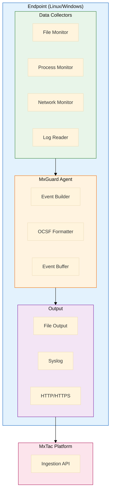
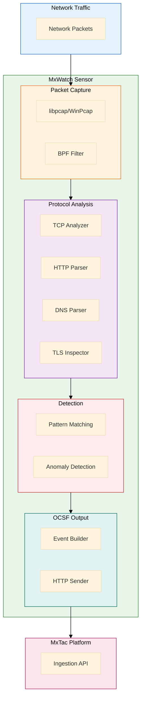
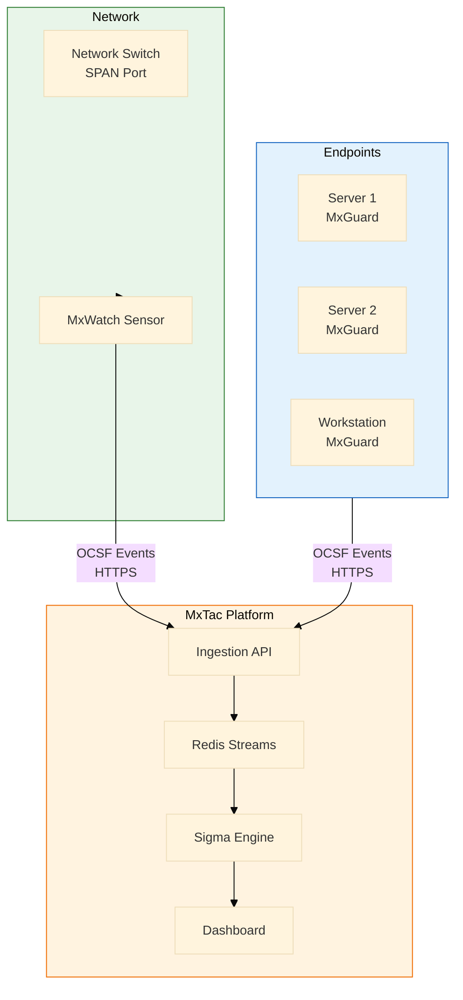

# MxTac - Lightweight EDR & NDR Design

> **Document Type**: Component Specification
> **Version**: 1.0
> **Date**: 2026-01-19
> **Status**: Design Phase
> **Purpose**: Lightweight, MxTac-native endpoint and network detection

---

## Table of Contents

1. [Overview](#1-overview)
2. [MxGuard EDR - Lightweight Endpoint Agent](#2-mxguard-edr---lightweight-endpoint-agent)
3. [MxWatch NDR - Lightweight Network Sensor](#3-mxwatch-ndr---lightweight-network-sensor)
4. [Integration with MxTac Platform](#4-integration-with-mxtac-platform)
5. [Deployment Architecture](#5-deployment-architecture)
6. [Implementation Roadmap](#6-implementation-roadmap)

---

## 1. Overview

### Design Philosophy

**Goal**: Create **minimal, focused** EDR/NDR agents that:
- Are **lightweight** (low resource footprint)
- Output **OCSF natively** (no normalization needed)
- Integrate **seamlessly** with MxTac
- Cover **high-value ATT&CK techniques**
- Are **easy to deploy** (single binary, minimal config)

### Why Build Lightweight Versions?

| Reason | Benefit |
|--------|---------|
| **Native OCSF Output** | No parsing/transformation needed |
| **MxTac-First Design** | Built specifically for the platform |
| **Minimal Dependencies** | Easy deployment, low attack surface |
| **Targeted Coverage** | Focus on high-impact techniques |
| **Low Resource Usage** | Deploy on constrained environments (IoT, edge) |
| **Learning Opportunity** | Understand EDR/NDR internals |

### Comparison with Full Solutions

| Feature | Wazuh (Full EDR) | MxGuard (Lightweight) |
|---------|------------------|----------------------|
| **Size** | ~100 MB | ~10 MB |
| **Memory** | 200-500 MB | 20-50 MB |
| **CPU** | 5-10% | 1-2% |
| **Features** | 100+ | 20-30 (focused) |
| **Output** | Wazuh JSON | OCSF native |
| **Deployment** | Complex (manager + agent) | Simple (single binary) |
| **Coverage** | 60-70% ATT&CK | 30-40% ATT&CK (high-value) |

---

## 2. MxGuard EDR - Lightweight Endpoint Agent

### 2.1 Architecture Overview



### 2.2 Core Capabilities

Focus on **20 high-value detection capabilities** covering 30-40% of ATT&CK:

#### File Integrity Monitoring (FIM)

| Capability | ATT&CK Techniques | OCSF Class |
|------------|-------------------|------------|
| **File Creation/Modification** | T1105, T1547, T1574 | File System Activity (1001) |
| **Suspicious Path Monitoring** | T1036, T1564 | File System Activity (1001) |
| **Executable Monitoring** | T1204, T1559 | File System Activity (1001) |

**Monitored Paths**:
```yaml
# Linux
- /etc/
- /root/.ssh/
- /home/*/.ssh/
- /usr/bin/
- /usr/sbin/
- /tmp/
- /var/tmp/
- /dev/shm/

# Windows
- C:\Windows\System32\
- C:\Windows\SysWOW64\
- C:\ProgramData\Microsoft\Windows\Start Menu\Programs\Startup\
- C:\Users\*\AppData\Roaming\Microsoft\Windows\Start Menu\Programs\Startup\
- HKLM\Software\Microsoft\Windows\CurrentVersion\Run
- HKCU\Software\Microsoft\Windows\CurrentVersion\Run
```

#### Process Monitoring

| Capability | ATT&CK Techniques | OCSF Class |
|------------|-------------------|------------|
| **Process Creation** | T1059, T1106, T1203 | Process Activity (1007) |
| **Process Injection Detection** | T1055 | Process Activity (1007) |
| **Privilege Escalation** | T1548, T1134 | Process Activity (1007) |
| **Credential Dumping** | T1003 | Process Activity (1007) |

**Monitored Events**:
- Process start/stop
- Parent-child relationships
- Command-line arguments
- User context (UID, GID)
- Network connections per process

#### Network Activity

| Capability | ATT&CK Techniques | OCSF Class |
|------------|-------------------|------------|
| **Network Connections** | T1071, T1095, T1572 | Network Activity (4001) |
| **Lateral Movement** | T1021, T1210 | Network Activity (4001) |
| **Exfiltration** | T1041, T1048 | Network Activity (4001) |

**Monitored Events**:
- TCP/UDP connections (new, established, closed)
- Listening ports
- Remote IP addresses
- DNS queries (basic)

#### System Logs

| Capability | ATT&CK Techniques | OCSF Class |
|------------|-------------------|------------|
| **Authentication Events** | T1078, T1110 | Authentication (3002) |
| **Account Management** | T1136, T1098 | Account Change (3001) |
| **Service Events** | T1543, T1569 | System Activity (1001) |

**Monitored Logs**:
- Linux: `/var/log/auth.log`, `/var/log/syslog`, `journalctl`
- Windows: Security Event Log, System Event Log

### 2.3 Technical Design

#### Agent Architecture

```
mxguard/
├── main.go                    # Entry point
├── collectors/                # Data collection modules
│   ├── file_monitor.go       # FIM using inotify/FSEvents
│   ├── process_monitor.go    # Process tracking
│   ├── network_monitor.go    # Network connections
│   └── log_reader.go         # Log parsing
├── ocsf/                      # OCSF formatting
│   ├── builder.go            # OCSF event builder
│   ├── file_activity.go      # File events
│   ├── process_activity.go   # Process events
│   ├── network_activity.go   # Network events
│   └── auth_activity.go      # Auth events
├── output/                    # Output handlers
│   ├── file.go               # File output
│   ├── syslog.go             # Syslog output
│   └── http.go               # HTTP/HTTPS output
├── config/                    # Configuration
│   ├── config.go             # Config parser
│   └── defaults.go           # Default settings
└── utils/                     # Utilities
    ├── buffer.go             # Event buffering
    └── hash.go               # File hashing
```

#### Implementation: File Monitor (Linux)

```go
// collectors/file_monitor.go
package collectors

import (
    "github.com/fsnotify/fsnotify"
    "mxguard/ocsf"
    "path/filepath"
    "time"
)

type FileMonitor struct {
    watcher *fsnotify.Watcher
    paths   []string
    events  chan ocsf.Event
}

func NewFileMonitor(paths []string) (*FileMonitor, error) {
    watcher, err := fsnotify.NewWatcher()
    if err != nil {
        return nil, err
    }

    fm := &FileMonitor{
        watcher: watcher,
        paths:   paths,
        events:  make(chan ocsf.Event, 1000),
    }

    // Watch configured paths
    for _, path := range paths {
        if err := watcher.Add(path); err != nil {
            return nil, err
        }
    }

    go fm.watch()
    return fm, nil
}

func (fm *FileMonitor) watch() {
    for {
        select {
        case event := <-fm.watcher.Events:
            // Build OCSF event
            ocsfEvent := ocsf.FileActivity{
                Metadata: ocsf.Metadata{
                    Version:    "1.1.0",
                    Product: ocsf.Product{
                        Name:    "MxGuard",
                        Vendor:  "MxTac",
                        Version: "1.0.0",
                    },
                },
                Time:      time.Now().Unix(),
                ClassUID:  1001, // File System Activity
                CategoryUID: 1,  // System Activity
                Activity:   fm.mapActivity(event.Op),
                ActivityID: fm.mapActivityID(event.Op),
                SeverityID: 1,   // Informational
                File: ocsf.File{
                    Path: event.Name,
                    Name: filepath.Base(event.Name),
                    Type: "Regular File",
                },
                Actor: ocsf.Actor{
                    Process: fm.getProcessInfo(),
                },
            }

            // Check for suspicious patterns
            if fm.isSuspicious(event.Name, event.Op) {
                ocsfEvent.SeverityID = 4 // High
            }

            fm.events <- ocsfEvent

        case err := <-fm.watcher.Errors:
            // Log error
            continue
        }
    }
}

func (fm *FileMonitor) isSuspicious(path string, op fsnotify.Op) bool {
    // Detect suspicious file operations
    suspicious := []string{
        "/root/.ssh/authorized_keys",
        "/etc/passwd",
        "/etc/shadow",
        "/etc/sudoers",
        ".ssh/id_rsa",
    }

    for _, pattern := range suspicious {
        if matched, _ := filepath.Match(pattern, path); matched {
            return true
        }
    }

    // Check for executable creation in temp dirs
    if op&fsnotify.Create != 0 {
        if filepath.Dir(path) == "/tmp" || filepath.Dir(path) == "/dev/shm" {
            return true
        }
    }

    return false
}

func (fm *FileMonitor) mapActivity(op fsnotify.Op) string {
    switch {
    case op&fsnotify.Create != 0:
        return "Create"
    case op&fsnotify.Write != 0:
        return "Write"
    case op&fsnotify.Remove != 0:
        return "Delete"
    case op&fsnotify.Rename != 0:
        return "Rename"
    default:
        return "Unknown"
    }
}

func (fm *FileMonitor) mapActivityID(op fsnotify.Op) int {
    switch {
    case op&fsnotify.Create != 0:
        return 1 // Create
    case op&fsnotify.Write != 0:
        return 5 // Update
    case op&fsnotify.Remove != 0:
        return 2 // Delete
    case op&fsnotify.Rename != 0:
        return 4 // Rename
    default:
        return 0 // Unknown
    }
}

func (fm *FileMonitor) getProcessInfo() ocsf.Process {
    // Get current process info (simplified)
    return ocsf.Process{
        PID:  os.Getpid(),
        Name: filepath.Base(os.Args[0]),
    }
}

func (fm *FileMonitor) Events() <-chan ocsf.Event {
    return fm.events
}
```

#### Implementation: Process Monitor (Linux)

```go
// collectors/process_monitor.go
package collectors

import (
    "bufio"
    "fmt"
    "mxguard/ocsf"
    "os"
    "strconv"
    "strings"
    "time"
)

type ProcessMonitor struct {
    events    chan ocsf.Event
    tracked   map[int]*ProcessInfo
    interval  time.Duration
}

type ProcessInfo struct {
    PID      int
    Name     string
    Cmdline  string
    ParentPID int
    UID      int
    Started  time.Time
}

func NewProcessMonitor(interval time.Duration) *ProcessMonitor {
    pm := &ProcessMonitor{
        events:   make(chan ocsf.Event, 1000),
        tracked:  make(map[int]*ProcessInfo),
        interval: interval,
    }

    go pm.monitor()
    return pm
}

func (pm *ProcessMonitor) monitor() {
    ticker := time.NewTicker(pm.interval)
    defer ticker.Stop()

    for range ticker.C {
        currentProcs := pm.scanProcesses()

        // Detect new processes
        for pid, proc := range currentProcs {
            if _, exists := pm.tracked[pid]; !exists {
                // New process detected
                event := ocsf.ProcessActivity{
                    Metadata: ocsf.Metadata{
                        Version: "1.1.0",
                        Product: ocsf.Product{
                            Name:    "MxGuard",
                            Vendor:  "MxTac",
                            Version: "1.0.0",
                        },
                    },
                    Time:        time.Now().Unix(),
                    ClassUID:    1007, // Process Activity
                    CategoryUID: 1,    // System Activity
                    Activity:    "Start",
                    ActivityID:  1,
                    SeverityID:  pm.calculateSeverity(proc),
                    Process: ocsf.Process{
                        PID:         proc.PID,
                        Name:        proc.Name,
                        Cmdline:     proc.Cmdline,
                        ParentPID:   proc.ParentPID,
                        UID:         proc.UID,
                        CreatedTime: proc.Started.Unix(),
                    },
                }

                pm.events <- event
            }
        }

        // Update tracked processes
        pm.tracked = currentProcs
    }
}

func (pm *ProcessMonitor) scanProcesses() map[int]*ProcessInfo {
    procs := make(map[int]*ProcessInfo)

    // Read /proc directory
    procDir, err := os.Open("/proc")
    if err != nil {
        return procs
    }
    defer procDir.Close()

    entries, _ := procDir.Readdirnames(-1)
    for _, entry := range entries {
        pid, err := strconv.Atoi(entry)
        if err != nil {
            continue
        }

        proc := pm.getProcessInfo(pid)
        if proc != nil {
            procs[pid] = proc
        }
    }

    return procs
}

func (pm *ProcessMonitor) getProcessInfo(pid int) *ProcessInfo {
    // Read /proc/[pid]/stat
    statPath := fmt.Sprintf("/proc/%d/stat", pid)
    statFile, err := os.Open(statPath)
    if err != nil {
        return nil
    }
    defer statFile.Close()

    scanner := bufio.NewScanner(statFile)
    if !scanner.Scan() {
        return nil
    }

    fields := strings.Fields(scanner.Text())
    if len(fields) < 5 {
        return nil
    }

    ppid, _ := strconv.Atoi(fields[3])

    // Read cmdline
    cmdlinePath := fmt.Sprintf("/proc/%d/cmdline", pid)
    cmdlineBytes, _ := os.ReadFile(cmdlinePath)
    cmdline := strings.ReplaceAll(string(cmdlineBytes), "\x00", " ")

    // Read status for UID
    statusPath := fmt.Sprintf("/proc/%d/status", pid)
    uid := pm.getUID(statusPath)

    return &ProcessInfo{
        PID:       pid,
        Name:      strings.Trim(fields[1], "()"),
        Cmdline:   cmdline,
        ParentPID: ppid,
        UID:       uid,
        Started:   time.Now(), // Simplified
    }
}

func (pm *ProcessMonitor) getUID(statusPath string) int {
    file, err := os.Open(statusPath)
    if err != nil {
        return -1
    }
    defer file.Close()

    scanner := bufio.NewScanner(file)
    for scanner.Scan() {
        line := scanner.Text()
        if strings.HasPrefix(line, "Uid:") {
            fields := strings.Fields(line)
            if len(fields) >= 2 {
                uid, _ := strconv.Atoi(fields[1])
                return uid
            }
        }
    }
    return -1
}

func (pm *ProcessMonitor) calculateSeverity(proc *ProcessInfo) int {
    // High severity for suspicious processes
    suspicious := []string{
        "nc", "ncat", "netcat",           // Network tools
        "mimikatz", "procdump",           // Credential dumping
        "powershell", "cmd.exe",          // Shells
        "python", "perl", "ruby",         // Scripting
    }

    for _, s := range suspicious {
        if strings.Contains(strings.ToLower(proc.Name), s) {
            return 4 // High
        }
    }

    // Medium for root processes
    if proc.UID == 0 {
        return 3 // Medium
    }

    return 1 // Informational
}

func (pm *ProcessMonitor) Events() <-chan ocsf.Event {
    return pm.events
}
```

### 2.4 Configuration

```yaml
# /etc/mxguard/config.yaml

# General settings
agent:
  name: "mxguard-agent"
  version: "1.0.0"
  log_level: "info"

# File monitoring
file_monitor:
  enabled: true
  paths:
    - /etc/
    - /root/.ssh/
    - /home/*/.ssh/
    - /usr/bin/
    - /tmp/
    - /var/tmp/
  exclude_patterns:
    - "*.log"
    - "*.tmp"
  scan_interval: 5s

# Process monitoring
process_monitor:
  enabled: true
  scan_interval: 2s
  track_network: true

# Network monitoring
network_monitor:
  enabled: true
  track_connections: true
  track_dns: false  # Requires root
  suspicious_ports:
    - 4444  # Metasploit
    - 5555  # Android Debug Bridge
    - 6666  # IRC
    - 31337 # Back Orifice

# Log monitoring
log_monitor:
  enabled: true
  sources:
    - /var/log/auth.log
    - /var/log/syslog
  patterns:
    - "Failed password"
    - "sudo:"
    - "COMMAND="

# Output configuration
output:
  # File output
  file:
    enabled: false
    path: "/var/log/mxguard/events.json"
    rotate_size: "100MB"
    rotate_count: 5

  # Syslog output
  syslog:
    enabled: false
    host: "localhost"
    port: 514
    protocol: "udp"

  # HTTP output (to MxTac)
  http:
    enabled: true
    url: "https://mxtac.example.com/api/v1/ingest/ocsf"
    method: "POST"
    headers:
      Authorization: "Bearer ${MXTAC_API_KEY}"
    batch_size: 100
    batch_timeout: 5s
    retry_attempts: 3
```

### 2.5 Deployment

#### Single Binary Installation

```bash
# Linux installation
wget https://github.com/mxtac/mxguard/releases/download/v1.0.0/mxguard-linux-amd64
chmod +x mxguard-linux-amd64
sudo mv mxguard-linux-amd64 /usr/local/bin/mxguard

# Create config
sudo mkdir -p /etc/mxguard
sudo nano /etc/mxguard/config.yaml

# Create systemd service
sudo tee /etc/systemd/system/mxguard.service <<EOF
[Unit]
Description=MxGuard Lightweight EDR Agent
After=network.target

[Service]
Type=simple
User=root
ExecStart=/usr/local/bin/mxguard --config /etc/mxguard/config.yaml
Restart=always
RestartSec=10

[Install]
WantedBy=multi-user.target
EOF

# Start service
sudo systemctl daemon-reload
sudo systemctl enable mxguard
sudo systemctl start mxguard
```

#### Windows Installation

```powershell
# Download and install
Invoke-WebRequest -Uri "https://github.com/mxtac/mxguard/releases/download/v1.0.0/mxguard-windows-amd64.exe" -OutFile "C:\Program Files\MxGuard\mxguard.exe"

# Create config
New-Item -Path "C:\Program Files\MxGuard" -ItemType Directory -Force
notepad "C:\Program Files\MxGuard\config.yaml"

# Install as Windows service
sc.exe create MxGuard binPath= "C:\Program Files\MxGuard\mxguard.exe --config C:\Program Files\MxGuard\config.yaml" start= auto
sc.exe start MxGuard
```

---

## 3. MxWatch NDR - Lightweight Network Sensor

### 3.1 Architecture Overview



### 3.2 Core Capabilities

Focus on **15 high-value network detections**:

#### Network Flow Tracking

| Capability | ATT&CK Techniques | OCSF Class |
|------------|-------------------|------------|
| **Connection Tracking** | T1071, T1090, T1572 | Network Activity (4001) |
| **Port Scanning Detection** | T1046, T1595 | Network Activity (4001) |
| **Data Exfiltration** | T1041, T1048, T1020 | Network Activity (4001) |

#### Protocol Analysis

| Capability | ATT&CK Techniques | OCSF Class |
|------------|-------------------|------------|
| **HTTP Analysis** | T1071.001 (Web Protocols) | HTTP Activity (4002) |
| **DNS Analysis** | T1071.004 (DNS), T1568 | DNS Activity (4003) |
| **TLS Inspection** | T1573 (Encrypted Channel) | Network Activity (4001) |

#### Threat Detection

| Capability | ATT&CK Techniques | OCSF Class |
|------------|-------------------|------------|
| **C2 Beacon Detection** | T1071, T1095, T1573 | Network Activity (4001) |
| **Lateral Movement** | T1021 (RDP, SMB, SSH) | Network Activity (4001) |
| **Suspicious User-Agents** | T1071.001 | HTTP Activity (4002) |

### 3.3 Technical Design

#### Sensor Architecture

```
mxwatch/
├── main.go                    # Entry point
├── capture/                   # Packet capture
│   ├── pcap.go               # libpcap wrapper
│   ├── filter.go             # BPF filter builder
│   └── reassembly.go         # TCP reassembly
├── parsers/                   # Protocol parsers
│   ├── tcp.go                # TCP parser
│   ├── http.go               # HTTP parser
│   ├── dns.go                # DNS parser
│   └── tls.go                # TLS parser
├── detectors/                 # Detection logic
│   ├── c2_beacon.go          # C2 detection
│   ├── port_scan.go          # Port scan detection
│   ├── exfiltration.go       # Data exfil detection
│   └── lateral_movement.go   # Lateral movement
├── ocsf/                      # OCSF formatting
│   ├── network_activity.go   # Network events
│   ├── http_activity.go      # HTTP events
│   └── dns_activity.go       # DNS events
└── output/                    # Output handlers
    └── http.go               # HTTP output
```

#### Implementation: HTTP Parser

```go
// parsers/http.go
package parsers

import (
    "bufio"
    "bytes"
    "mxwatch/ocsf"
    "net/http"
    "time"
)

type HTTPParser struct {
    events chan ocsf.Event
}

func NewHTTPParser() *HTTPParser {
    return &HTTPParser{
        events: make(chan ocsf.Event, 1000),
    }
}

func (hp *HTTPParser) Parse(data []byte, src, dst string, srcPort, dstPort int) {
    reader := bufio.NewReader(bytes.NewReader(data))

    // Try parsing as HTTP request
    req, err := http.ReadRequest(reader)
    if err == nil {
        hp.parseRequest(req, src, dst, srcPort, dstPort)
        return
    }

    // Try parsing as HTTP response
    reader = bufio.NewReader(bytes.NewReader(data))
    resp, err := http.ReadResponse(reader, nil)
    if err == nil {
        hp.parseResponse(resp, src, dst, srcPort, dstPort)
    }
}

func (hp *HTTPParser) parseRequest(req *http.Request, src, dst string, srcPort, dstPort int) {
    event := ocsf.HTTPActivity{
        Metadata: ocsf.Metadata{
            Version: "1.1.0",
            Product: ocsf.Product{
                Name:    "MxWatch",
                Vendor:  "MxTac",
                Version: "1.0.0",
            },
        },
        Time:        time.Now().Unix(),
        ClassUID:    4002, // HTTP Activity
        CategoryUID: 4,    // Network Activity
        Activity:    "HTTP Request",
        ActivityID:  1,
        SeverityID:  hp.calculateSeverity(req),
        HTTP: ocsf.HTTP{
            Method:      req.Method,
            URL:         req.URL.String(),
            Version:     req.Proto,
            UserAgent:   req.UserAgent(),
            Referrer:    req.Referer(),
            Host:        req.Host,
            RequestHeaders: hp.headersToMap(req.Header),
        },
        SrcEndpoint: ocsf.NetworkEndpoint{
            IP:   src,
            Port: srcPort,
        },
        DstEndpoint: ocsf.NetworkEndpoint{
            IP:   dst,
            Port: dstPort,
        },
    }

    hp.events <- event
}

func (hp *HTTPParser) parseResponse(resp *http.Response, src, dst string, srcPort, dstPort int) {
    event := ocsf.HTTPActivity{
        Metadata: ocsf.Metadata{
            Version: "1.1.0",
            Product: ocsf.Product{
                Name:    "MxWatch",
                Vendor:  "MxTac",
                Version: "1.0.0",
            },
        },
        Time:        time.Now().Unix(),
        ClassUID:    4002,
        CategoryUID: 4,
        Activity:    "HTTP Response",
        ActivityID:  2,
        SeverityID:  hp.calculateResponseSeverity(resp),
        HTTP: ocsf.HTTP{
            StatusCode:     resp.StatusCode,
            Version:        resp.Proto,
            ResponseHeaders: hp.headersToMap(resp.Header),
        },
        SrcEndpoint: ocsf.NetworkEndpoint{
            IP:   src,
            Port: srcPort,
        },
        DstEndpoint: ocsf.NetworkEndpoint{
            IP:   dst,
            Port: dstPort,
        },
    }

    hp.events <- event
}

func (hp *HTTPParser) calculateSeverity(req *http.Request) int {
    // Check for suspicious user agents
    suspiciousUA := []string{
        "curl", "wget", "python", "powershell",
        "sqlmap", "nikto", "nmap",
    }

    ua := req.UserAgent()
    for _, sus := range suspiciousUA {
        if strings.Contains(strings.ToLower(ua), sus) {
            return 4 // High
        }
    }

    // Check for suspicious paths
    if strings.Contains(req.URL.Path, "..") ||
       strings.Contains(req.URL.Path, "admin") ||
       strings.Contains(req.URL.Path, "wp-admin") {
        return 3 // Medium
    }

    return 1 // Informational
}

func (hp *HTTPParser) calculateResponseSeverity(resp *http.Response) int {
    // Suspicious status codes
    if resp.StatusCode >= 400 && resp.StatusCode < 500 {
        return 2 // Low (client errors)
    }
    if resp.StatusCode >= 500 {
        return 3 // Medium (server errors)
    }
    return 1 // Informational
}

func (hp *HTTPParser) headersToMap(headers http.Header) map[string]string {
    m := make(map[string]string)
    for k, v := range headers {
        if len(v) > 0 {
            m[k] = v[0]
        }
    }
    return m
}

func (hp *HTTPParser) Events() <-chan ocsf.Event {
    return hp.events
}
```

#### Implementation: C2 Beacon Detector

```go
// detectors/c2_beacon.go
package detectors

import (
    "mxwatch/ocsf"
    "time"
)

type C2BeaconDetector struct {
    connections map[string]*ConnectionTracker
    threshold   int
    timeWindow  time.Duration
    events      chan ocsf.Event
}

type ConnectionTracker struct {
    srcIP       string
    dstIP       string
    dstPort     int
    timestamps  []time.Time
    bytesSent   []int64
    bytesRecv   []int64
}

func NewC2BeaconDetector(threshold int, window time.Duration) *C2BeaconDetector {
    return &C2BeaconDetector{
        connections: make(map[string]*ConnectionTracker),
        threshold:   threshold,
        timeWindow:  window,
        events:      make(chan ocsf.Event, 100),
    }
}

func (c2d *C2BeaconDetector) Track(src, dst string, srcPort, dstPort int, bytesSent, bytesRecv int64) {
    key := fmt.Sprintf("%s:%s:%d", src, dst, dstPort)

    tracker, exists := c2d.connections[key]
    if !exists {
        tracker = &ConnectionTracker{
            srcIP:      src,
            dstIP:      dst,
            dstPort:    dstPort,
            timestamps: make([]time.Time, 0),
            bytesSent:  make([]int64, 0),
            bytesRecv:  make([]int64, 0),
        }
        c2d.connections[key] = tracker
    }

    now := time.Now()
    tracker.timestamps = append(tracker.timestamps, now)
    tracker.bytesSent = append(tracker.bytesSent, bytesSent)
    tracker.bytesRecv = append(tracker.bytesRecv, bytesRecv)

    // Remove old entries outside time window
    cutoff := now.Add(-c2d.timeWindow)
    for i, ts := range tracker.timestamps {
        if ts.After(cutoff) {
            tracker.timestamps = tracker.timestamps[i:]
            tracker.bytesSent = tracker.bytesSent[i:]
            tracker.bytesRecv = tracker.bytesRecv[i:]
            break
        }
    }

    // Check for beaconing pattern
    if c2d.isBeaconing(tracker) {
        c2d.generateAlert(tracker)
    }
}

func (c2d *C2BeaconDetector) isBeaconing(tracker *ConnectionTracker) bool {
    if len(tracker.timestamps) < c2d.threshold {
        return false
    }

    // Calculate time intervals between connections
    intervals := make([]float64, len(tracker.timestamps)-1)
    for i := 1; i < len(tracker.timestamps); i++ {
        intervals[i-1] = tracker.timestamps[i].Sub(tracker.timestamps[i-1]).Seconds()
    }

    // Check for regular intervals (beacon pattern)
    avgInterval := average(intervals)
    stdDev := standardDeviation(intervals, avgInterval)

    // Low standard deviation = regular pattern = beaconing
    if stdDev < avgInterval*0.2 {
        // Also check for consistent byte sizes
        avgBytes := average64(tracker.bytesSent)
        bytesStdDev := standardDeviation64(tracker.bytesSent, avgBytes)

        if bytesStdDev < avgBytes*0.3 {
            return true // High confidence beacon
        }
    }

    return false
}

func (c2d *C2BeaconDetector) generateAlert(tracker *ConnectionTracker) {
    event := ocsf.NetworkActivity{
        Metadata: ocsf.Metadata{
            Version: "1.1.0",
            Product: ocsf.Product{
                Name:    "MxWatch",
                Vendor:  "MxTac",
                Version: "1.0.0",
            },
        },
        Time:        time.Now().Unix(),
        ClassUID:    4001,
        CategoryUID: 4,
        Activity:    "C2 Beacon Detected",
        ActivityID:  99,
        SeverityID:  5, // Critical
        SrcEndpoint: ocsf.NetworkEndpoint{
            IP: tracker.srcIP,
        },
        DstEndpoint: ocsf.NetworkEndpoint{
            IP:   tracker.dstIP,
            Port: tracker.dstPort,
        },
        Connection: ocsf.Connection{
            Direction: "Outbound",
            Protocol:  "TCP",
        },
        ATTACKTechniques: []string{"T1071", "T1573"},
        Message: fmt.Sprintf(
            "Potential C2 beacon detected: %s -> %s:%d (regular intervals, consistent size)",
            tracker.srcIP, tracker.dstIP, tracker.dstPort,
        ),
    }

    c2d.events <- event
}

func average(values []float64) float64 {
    sum := 0.0
    for _, v := range values {
        sum += v
    }
    return sum / float64(len(values))
}

func standardDeviation(values []float64, avg float64) float64 {
    sum := 0.0
    for _, v := range values {
        sum += (v - avg) * (v - avg)
    }
    return math.Sqrt(sum / float64(len(values)))
}

func average64(values []int64) float64 {
    sum := int64(0)
    for _, v := range values {
        sum += v
    }
    return float64(sum) / float64(len(values))
}

func standardDeviation64(values []int64, avg float64) float64 {
    sum := 0.0
    for _, v := range values {
        diff := float64(v) - avg
        sum += diff * diff
    }
    return math.Sqrt(sum / float64(len(values)))
}

func (c2d *C2BeaconDetector) Events() <-chan ocsf.Event {
    return c2d.events
}
```

### 3.4 Configuration

```yaml
# /etc/mxwatch/config.yaml

# General settings
sensor:
  name: "mxwatch-sensor"
  version: "1.0.0"
  log_level: "info"

# Packet capture
capture:
  interface: "eth0"  # Network interface to monitor
  bpf_filter: "tcp or udp"  # Berkeley Packet Filter
  snaplen: 1600  # Packet capture length
  promiscuous: true

# Protocol analyzers
analyzers:
  tcp:
    enabled: true
    reassembly: true

  http:
    enabled: true
    parse_requests: true
    parse_responses: true

  dns:
    enabled: true
    track_queries: true
    track_responses: true

  tls:
    enabled: true
    extract_sni: true  # Server Name Indication
    track_certs: false

# Detectors
detectors:
  c2_beacon:
    enabled: true
    threshold: 5  # Min connections to detect pattern
    time_window: "5m"

  port_scan:
    enabled: true
    threshold: 10  # Ports scanned
    time_window: "1m"

  exfiltration:
    enabled: true
    byte_threshold: 10485760  # 10MB
    time_window: "1m"

# Output
output:
  http:
    enabled: true
    url: "https://mxtac.example.com/api/v1/ingest/ocsf"
    method: "POST"
    headers:
      Authorization: "Bearer ${MXTAC_API_KEY}"
    batch_size: 100
    batch_timeout: 5s
```

### 3.5 Deployment

```bash
# Install on network tap/SPAN port
wget https://github.com/mxtac/mxwatch/releases/download/v1.0.0/mxwatch-linux-amd64
chmod +x mxwatch-linux-amd64
sudo mv mxwatch-linux-amd64 /usr/local/bin/mxwatch

# Install libpcap dependency
sudo apt-get install libpcap-dev  # Debian/Ubuntu
sudo yum install libpcap-devel    # RHEL/CentOS

# Create config
sudo mkdir -p /etc/mxwatch
sudo nano /etc/mxwatch/config.yaml

# Run with elevated privileges (for packet capture)
sudo mxwatch --config /etc/mxwatch/config.yaml
```

---

## 4. Integration with MxTac Platform

### 4.1 Ingestion API Endpoint

```python
# backend/app/api/v1/endpoints/ingest.py
from fastapi import APIRouter, HTTPException, Header
from pydantic import BaseModel
from typing import List, Dict, Any

router = APIRouter(prefix="/ingest", tags=["Ingestion"])

class OCSFEvent(BaseModel):
    """OCSF event schema (simplified)"""
    metadata: Dict[str, Any]
    time: int
    class_uid: int
    category_uid: int
    activity: str
    activity_id: int
    severity_id: int
    # Additional fields based on class

@router.post("/ocsf")
async def ingest_ocsf_events(
    events: List[OCSFEvent],
    authorization: str = Header(...)
):
    """
    Ingest OCSF events from MxGuard/MxWatch agents

    This endpoint receives native OCSF events (no normalization needed)
    """
    # Validate API key
    if not validate_api_key(authorization):
        raise HTTPException(status_code=401, detail="Invalid API key")

    # Events are already in OCSF format - send directly to pipeline
    for event in events:
        # Publish to Redis Streams
        await redis_client.xadd(
            "mxtac:normalized",  # Already normalized!
            {
                "data": event.json(),
                "source": event.metadata.get("product", {}).get("name", "unknown"),
                "timestamp": event.time
            }
        )

    return {"status": "success", "ingested": len(events)}
```

### 4.2 Dashboard Integration

```typescript
// frontend/src/pages/Dashboard.tsx

// MxGuard/MxWatch status widget
const AgentStatus = () => {
  const { data: agents } = useQuery('agents', fetchAgentStatus);

  return (
    <Card>
      <CardHeader>
        <h3>MxTac Agents</h3>
      </CardHeader>
      <CardBody>
        <div className="grid grid-cols-2 gap-4">
          {/* MxGuard EDR Agents */}
          <div>
            <h4>MxGuard (EDR)</h4>
            <p>Active: {agents?.mxguard?.active || 0}</p>
            <p>Events/min: {agents?.mxguard?.eventsPerMin || 0}</p>
          </div>

          {/* MxWatch NDR Sensors */}
          <div>
            <h4>MxWatch (NDR)</h4>
            <p>Active: {agents?.mxwatch?.active || 0}</p>
            <p>Packets/sec: {agents?.mxwatch?.packetsPerSec || 0}</p>
          </div>
        </div>
      </CardBody>
    </Card>
  );
};
```

---

## 5. Deployment Architecture

### 5.1 Typical Deployment



### 5.2 Resource Requirements

#### MxGuard (per endpoint)

| Resource | Minimum | Recommended |
|----------|---------|-------------|
| CPU | 1 core | 2 cores |
| Memory | 50 MB | 100 MB |
| Disk | 100 MB (binary) | 1 GB (logs) |
| Network | 10 Kbps avg | 100 Kbps peak |

#### MxWatch (per sensor)

| Resource | Minimum | Recommended |
|----------|---------|-------------|
| CPU | 2 cores | 4 cores |
| Memory | 512 MB | 1 GB |
| Disk | 100 MB (binary) | 10 GB (pcap buffer) |
| Network | Depends on traffic | Depends on traffic |

---

## 6. Implementation Roadmap

### Phase 1: MxGuard MVP (8 weeks)

| Week | Deliverable |
|------|-------------|
| 1-2 | Core agent framework (Go) |
| 3-4 | File monitor + OCSF formatter |
| 5-6 | Process monitor + output handlers |
| 7-8 | Testing, packaging, deployment scripts |

**Coverage**: ~15-20% ATT&CK (File + Process events)

### Phase 2: MxWatch MVP (8 weeks)

| Week | Deliverable |
|------|-------------|
| 1-2 | Packet capture + TCP reassembly |
| 3-4 | HTTP/DNS parsers |
| 5-6 | C2 beacon detector |
| 7-8 | Testing, packaging, deployment scripts |

**Coverage**: +10-15% ATT&CK (Network events)

### Phase 3: Enhanced Features (12 weeks)

| Week | Deliverable |
|------|-------------|
| 1-3 | MxGuard: Network monitoring, log parsing |
| 4-6 | MxWatch: TLS inspection, anomaly detection |
| 7-9 | Both: Performance optimization |
| 10-12 | Documentation, examples, tutorials |

**Total Coverage**: ~30-40% ATT&CK

---

## Appendix: Technology Choices

### Why Go for Agents?

| Factor | Benefit |
|--------|---------|
| **Single Binary** | Easy deployment (no dependencies) |
| **Low Resource** | Minimal CPU/memory footprint |
| **Cross-Platform** | Compile for Linux, Windows, macOS |
| **Concurrency** | Goroutines for efficient I/O |
| **Performance** | Fast enough for real-time monitoring |
| **libpcap Bindings** | Good packet capture support |

### OCSF Native Output

**Key Advantage**: No normalization layer needed
- MxGuard → OCSF → MxTac (direct)
- Wazuh → Wazuh JSON → OCSF → MxTac (transformation required)

---

*Document Status: Design Phase - Ready for Implementation*
*Next Steps: Create GitHub repos, set up development environment*
