# MxTac - Additional Architecture Diagrams

> **Version**: 1.0
> **Date**: 2026-01-18
> **Purpose**: Visual architecture references for implementation

---

## Table of Contents

1. [Complete System Overview](#1-complete-system-overview)
2. [Data Flow Diagrams](#2-data-flow-diagrams)
3. [Component Interactions](#3-component-interactions)
4. [Deployment Architectures](#4-deployment-architectures)
5. [Sequence Diagrams](#5-sequence-diagrams)

---

## 1. Complete System Overview

### 1.1 High-Level Architecture

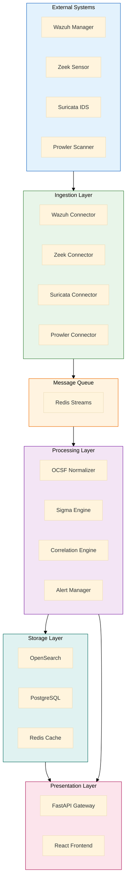

### 1.2 Layered Architecture

```
┌───────────────────────────────────────────────────────────────┐
│                    PRESENTATION LAYER                         │
│  ┌──────────────────┐              ┌──────────────────┐       │
│  │  React Frontend  │◄────────────►│  FastAPI Gateway │       │
│  │  - Dashboard     │   REST/WS    │  - Auth          │       │
│  │  - Alerts        │              │  - Routing       │       │
│  │  - Hunting       │              │  - Rate Limiting │       │
│  └──────────────────┘              └────────┬─────────┘       │
└─────────────────────────────────────────────┼─────────────────┘
                                              │
┌─────────────────────────────────────────────┼─────────────────┐
│                   BUSINESS LOGIC LAYER      │                 │
│  ┌─────────────┐  ┌─────────────┐  ┌───────▼──────┐          │
│  │   Sigma     │  │ Correlation │  │    Alert     │          │
│  │   Engine    │  │   Engine    │  │   Manager    │          │
│  │             │  │             │  │              │          │
│  │ - Matching  │  │ - Sequence  │  │ - Dedupe     │          │
│  │ - Compile   │  │ - Threshold │  │ - Enrich     │          │
│  │ - Index     │  │ - Chain     │  │ - Score      │          │
│  └──────┬──────┘  └──────┬──────┘  └──────┬───────┘          │
└─────────┼────────────────┼────────────────┼──────────────────┘
          │                │                │
┌─────────┼────────────────┼────────────────┼──────────────────┐
│         │   DATA PROCESSING LAYER         │                  │
│         │                │                │                  │
│  ┌──────▼────────────────▼────────────────▼───────┐          │
│  │           OCSF Normalization Engine            │          │
│  │  ┌──────────┐  ┌──────────┐  ┌──────────┐     │          │
│  │  │  Wazuh   │  │   Zeek   │  │ Suricata │     │          │
│  │  │  Parser  │  │  Parser  │  │  Parser  │     │          │
│  │  └────┬─────┘  └────┬─────┘  └────┬─────┘     │          │
│  │       └─────────────┼─────────────┘            │          │
│  │              ┌──────▼───────┐                  │          │
│  │              │ Transformer  │                  │          │
│  │              │ Validator    │                  │          │
│  │              └──────┬───────┘                  │          │
│  └─────────────────────┼──────────────────────────┘          │
└────────────────────────┼─────────────────────────────────────┘
                         │
┌────────────────────────┼─────────────────────────────────────┐
│             MESSAGE QUEUE LAYER       │                      │
│                  ┌─────▼──────────────────┐                  │
│                  │   Redis Streams        │                  │
│                  │  ┌──────────────────┐  │                  │
│                  │  │ mxtac:raw:*      │  │                  │
│                  │  │ mxtac:normalized │  │                  │
│                  │  │ mxtac:alerts     │  │                  │
│                  │  └──────────────────┘  │                  │
│                  └────────────────────────┘                  │
└──────────────────────────────────────────────────────────────┘
                         │
┌────────────────────────┼─────────────────────────────────────┐
│                STORAGE LAYER          │                      │
│  ┌────────────────┐  ┌────────────────┐  ┌────────────────┐ │
│  │  OpenSearch    │  │  PostgreSQL    │  │  Redis Cache   │ │
│  │                │  │                │  │                │ │
│  │  - Events      │  │  - Users       │  │  - Sessions    │ │
│  │  - Alerts      │  │  - Rules       │  │  - Metrics     │ │
│  │  - Logs        │  │  - Config      │  │  - Rule Cache  │ │
│  └────────────────┘  └────────────────┘  └────────────────┘ │
└──────────────────────────────────────────────────────────────┘
```

---

## 2. Data Flow Diagrams

### 2.1 Event Ingestion to Alert Flow

```mermaid
%%{init: {'theme': 'base', 'themeVariables': { 'fontSize': '14px' }, 'flowchart': { 'useMaxWidth': true }}}%%
flowchart LR
    subgraph Source["Source"]
        style Source fill:#e3f2fd,stroke:#1565c0
        W[Wazuh Alert]
    end

    subgraph Conn["Connector"]
        style Conn fill:#e8f5e9,stroke:#2e7d32
        WC[Wazuh Connector<br/>Pull API]
    end

    subgraph Q1["Raw Queue"]
        style Q1 fill:#fff3e0,stroke:#ef6c00
        RAW[mxtac:raw:wazuh]
    end

    subgraph Norm["Normalize"]
        style Norm fill:#f3e5f5,stroke:#7b1fa2
        PARSE[Parse Wazuh]
        TRANS[Transform OCSF]
        VALID[Validate Schema]
    end

    subgraph Q2["Normalized Queue"]
        style Q2 fill:#fff3e0,stroke:#ef6c00
        NORM_Q[mxtac:normalized]
    end

    subgraph Detect["Detection"]
        style Detect fill:#ffebee,stroke:#c62828
        ROUTE[Route by Class]
        MATCH[Match Rules]
        GEN[Generate Alert]
    end

    subgraph Q3["Alert Queue"]
        style Q3 fill:#fff3e0,stroke:#ef6c00
        ALERT_Q[mxtac:alerts]
    end

    subgraph Store["Storage"]
        style Store fill:#e0f2f1,stroke:#00695c
        OS[OpenSearch]
        PG[PostgreSQL]
    end

    Source --> Conn --> Q1
    Q1 --> Norm
    Norm --> Q2
    Q2 --> Detect
    Q2 --> Store
    Detect --> Q3
    Q3 --> Store
```

### 2.2 Correlation Flow

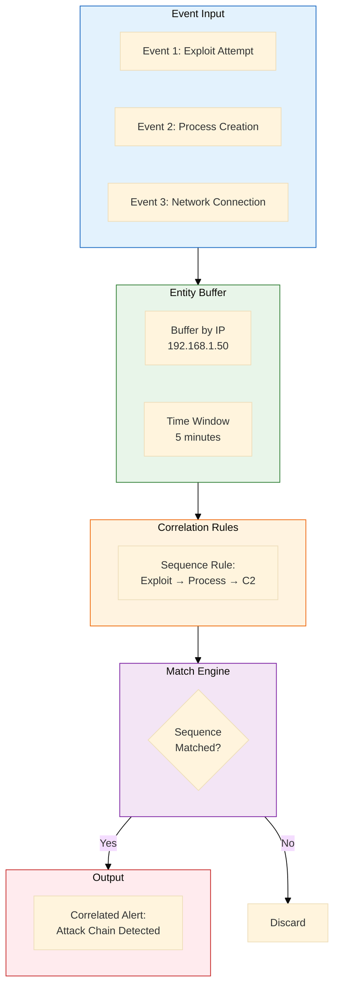

---

## 3. Component Interactions

### 3.1 Sigma Engine Architecture

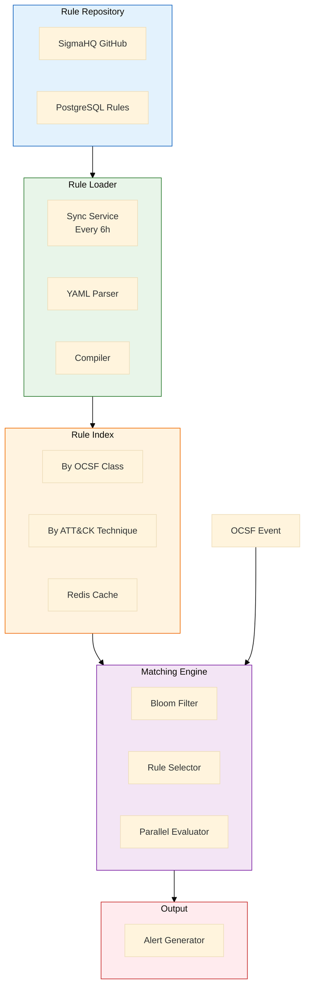

### 3.2 API Gateway Flow

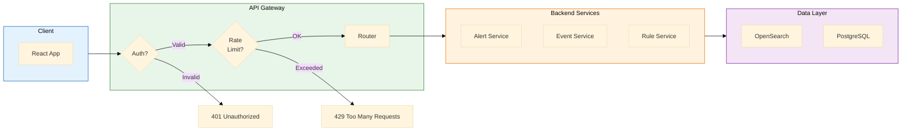

---

## 4. Deployment Architectures

### 4.1 Development Environment

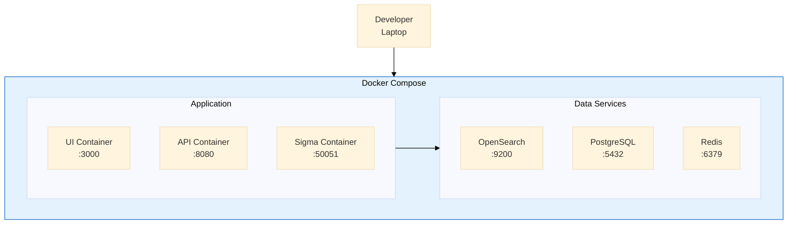

### 4.2 Production Kubernetes

```mermaid
%%{init: {'theme': 'base', 'themeVariables': { 'fontSize': '14px' }, 'flowchart': { 'useMaxWidth': true }}}%%
flowchart TB
    subgraph Internet["Internet"]
        style Internet fill:#e3f2fd,stroke:#1565c0
        USER[Users]
    end

    subgraph K8s["Kubernetes Cluster"]
        style K8s fill:#e8f5e9,stroke:#2e7d32

        subgraph Ingress["Ingress"]
            LB[Cloud LB]
            NGINX[Nginx Ingress]
        end

        subgraph UI_NS["ui namespace"]
            UI1[ui-pod-1]
            UI2[ui-pod-2]
            UI3[ui-pod-3]
        end

        subgraph API_NS["api namespace"]
            API1[api-pod-1]
            API2[api-pod-2]
            API3[api-pod-3]
        end

        subgraph Engine_NS["engine namespace"]
            SIG1[sigma-pod-1]
            SIG2[sigma-pod-2]
            SIG3[sigma-pod-3]
            CORR1[corr-pod-1]
            NORM1[norm-pod-1]
        end

        subgraph Data_NS["data namespace"]
            OS1[opensearch-1]
            OS2[opensearch-2]
            OS3[opensearch-3]
            PG1[postgres-primary]
            PG2[postgres-replica]
            RD1[redis-master]
            RD2[redis-replica]
        end

        subgraph Storage["Persistent Storage"]
            PV1[PV: opensearch-data]
            PV2[PV: postgres-data]
        end
    end

    USER --> LB
    LB --> NGINX
    NGINX --> UI_NS
    UI_NS --> API_NS
    API_NS --> Engine_NS
    Engine_NS --> Data_NS
    Data_NS --> Storage
```

### 4.3 Multi-Region Deployment

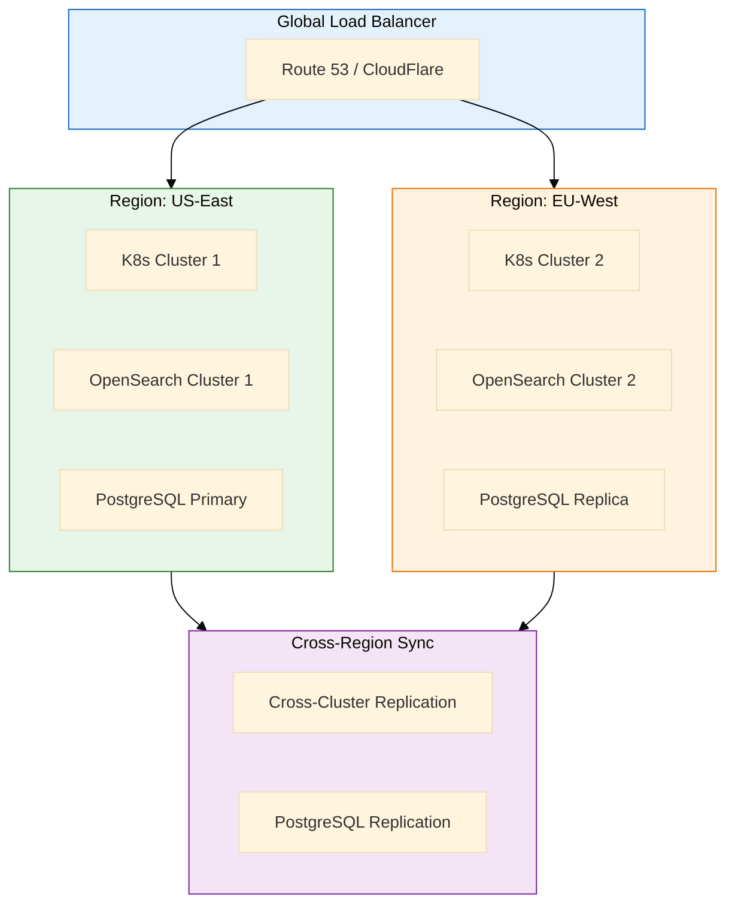

---

## 5. Sequence Diagrams

### 5.1 Alert Detection Sequence

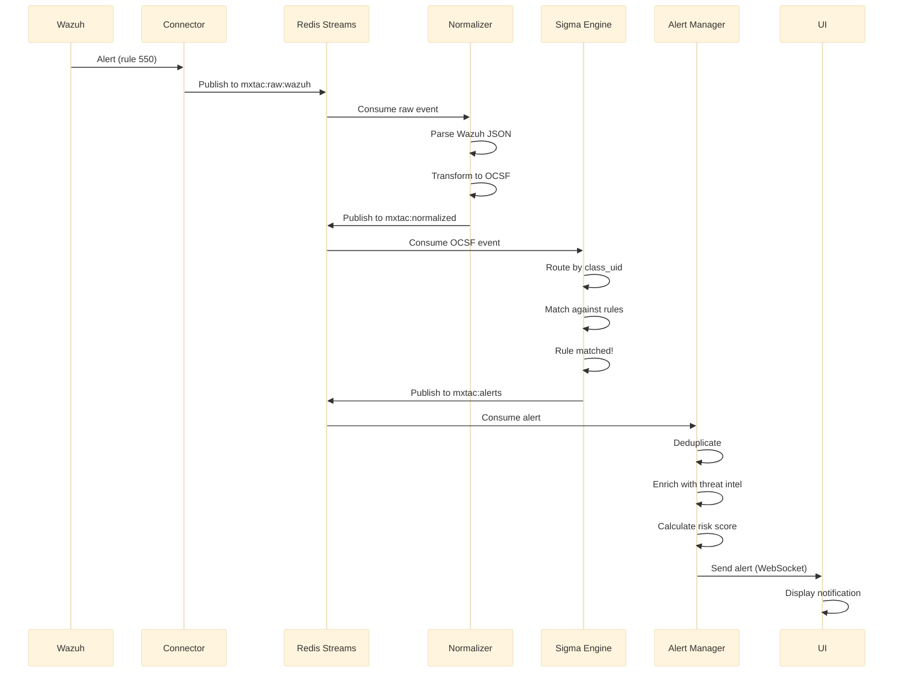

### 5.2 User Search Sequence

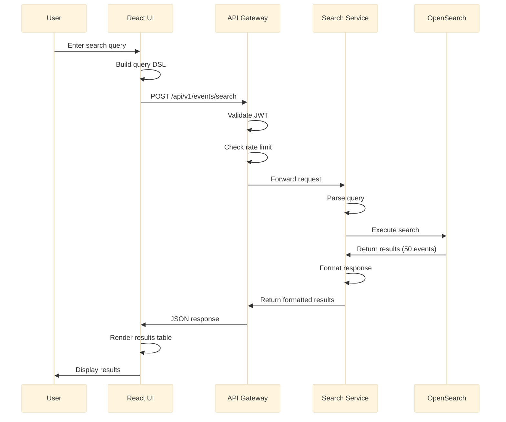

### 5.3 Rule Deployment Sequence

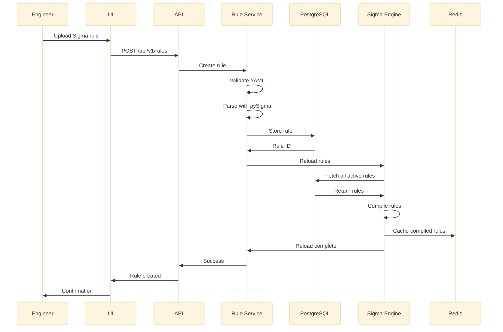

### 5.4 Correlation Detection Sequence

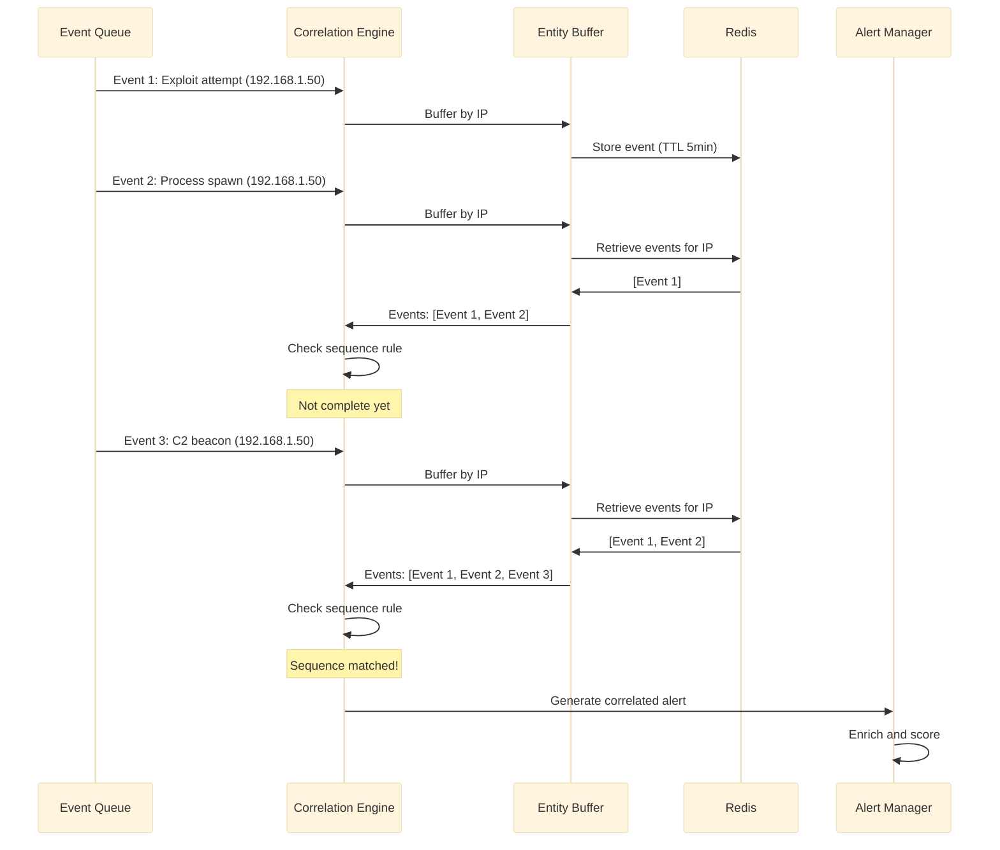

---

## Implementation Notes

### Component Communication

| From | To | Protocol | Port |
|------|-----|----------|------|
| React UI | API Gateway | HTTPS | 443 |
| API Gateway | Backend Services | gRPC | 50051 |
| Backend Services | Redis Streams | TCP | 6379 |
| Backend Services | OpenSearch | HTTPS | 9200 |
| Backend Services | PostgreSQL | TCP | 5432 |

### Service Discovery (Kubernetes)

```yaml
apiVersion: v1
kind: Service
metadata:
  name: sigma-engine
spec:
  selector:
    app: sigma-engine
  ports:
    - name: grpc
      port: 50051
      targetPort: 50051
    - name: http
      port: 8080
      targetPort: 8080
  type: ClusterIP
```

### Health Checks

All services expose:
- `GET /health/live` - Liveness probe (service is running)
- `GET /health/ready` - Readiness probe (service is ready to handle requests)
- `GET /metrics` - Prometheus metrics

---

*Architecture diagrams by Claude (Senior AI Research Scientist)*
*Date: 2026-01-18*
