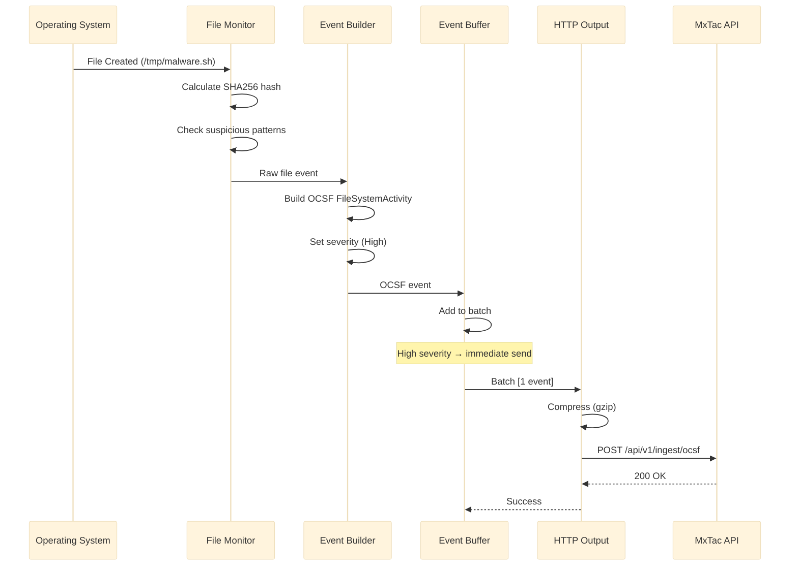

# MxGuard - Architecture Overview

> **Version**: 1.0
> **Date**: 2026-01-19
> **Status**: Design Phase

---

## Table of Contents

1. [System Architecture](#1-system-architecture)
2. [Component Design](#2-component-design)
3. [Data Flow](#3-data-flow)
4. [OCSF Event Generation](#4-ocsf-event-generation)
5. [Performance Considerations](#5-performance-considerations)
6. [Security Design](#6-security-design)

---

## 1. System Architecture

### 1.1 High-Level Architecture

```mermaid
%%{init: {'theme': 'base', 'themeVariables': { 'fontSize': '14px' }, 'flowchart': { 'useMaxWidth': true }}}%%
flowchart TB
    subgraph OS["Operating System"]
        style OS fill:#e3f2fd,stroke:#1565c0
        FS[File System Events]
        PROC[Process Events]
        NET[Network Events]
        LOG[System Logs]
    end

    subgraph Agent["MxGuard Agent"]
        style Agent fill:#e8f5e9,stroke:#2e7d32

        subgraph Collectors["Collectors"]
            style Collectors fill:#fff3e0,stroke:#ef6c00
            FC[File Collector]
            PC[Process Collector]
            NC[Network Collector]
            LC[Log Collector]
        end

        subgraph Core["Core Engine"]
            style Core fill:#f3e5f5,stroke:#7b1fa2
            EB[Event Builder]
            OCSF_FMT[OCSF Formatter]
            FILTER[Event Filter]
            ENRICH[Enrichment]
        end

        subgraph Buffer["Event Buffer"]
            style Buffer fill:#e0f2f1,stroke:#00695c
            QUEUE[In-Memory Queue]
            BATCH[Batch Processor]
        end

        subgraph Output["Output Handler"]
            style Output fill:#fce4ec,stroke:#ad1457
            HTTP[HTTP Sender]
            FILE[File Writer]
            SYSLOG[Syslog Sender]
        end
    end

    subgraph Platform["MxTac Platform"]
        style Platform fill:#fff3e0,stroke:#ef6c00
        API[Ingestion API]
    end

    OS --> Collectors
    Collectors --> Core
    Core --> Buffer
    Buffer --> Output
    Output --> Platform
```



### 1.2 Component Layers

| Layer | Components | Responsibility |
|-------|------------|----------------|
| **Collection** | File, Process, Network, Log Monitors | Gather raw events from OS |
| **Processing** | Event Builder, OCSF Formatter, Filter | Transform to OCSF format |
| **Buffering** | Queue, Batch Processor | Optimize output performance |
| **Output** | HTTP, File, Syslog Senders | Deliver events to MxTac |

---

## 2. Component Design

### 2.1 File Monitor

**Technology**: inotify (Linux), FSEvents (macOS), ReadDirectoryChangesW (Windows)

**Monitored Events**:
- File creation
- File modification
- File deletion
- File rename/move
- Permission changes

**Key Features**:
- Recursive directory watching
- Pattern-based filtering
- SHA256 hash calculation for suspicious files
- Suspicious path detection

**Implementation**:
```go
type FileMonitor struct {
    watcher     *fsnotify.Watcher
    paths       []string
    patterns    []string
    events      chan Event
    hashFiles   bool
}

func (fm *FileMonitor) Watch() {
    for {
        select {
        case event := <-fm.watcher.Events:
            ocsfEvent := fm.buildOCSFEvent(event)
            fm.events <- ocsfEvent
        case err := <-fm.watcher.Errors:
            log.Error("File watcher error:", err)
        }
    }
}
```

### 2.2 Process Monitor

**Technology**: /proc filesystem (Linux), WMI (Windows), kqueue (macOS)

**Monitored Events**:
- Process creation
- Process termination
- Parent-child relationships
- Command-line arguments
- User context (UID/GID)

**Key Features**:
- Process tree tracking
- Suspicious process detection (mimikatz, nc, etc.)
- Privilege escalation detection
- Process injection detection (future)

**Implementation**:
```go
type ProcessMonitor struct {
    interval    time.Duration
    tracked     map[int]*ProcessInfo
    events      chan Event
}

func (pm *ProcessMonitor) Monitor() {
    ticker := time.NewTicker(pm.interval)
    for range ticker.C {
        currentProcs := pm.scanProcesses()
        newProcs := pm.detectNewProcesses(currentProcs)

        for _, proc := range newProcs {
            ocsfEvent := pm.buildOCSFEvent(proc)
            pm.events <- ocsfEvent
        }

        pm.tracked = currentProcs
    }
}
```

### 2.3 Network Monitor

**Technology**: netstat parsing (simple), eBPF (advanced)

**Monitored Events**:
- TCP connections (new, established, closed)
- UDP connections
- Listening ports
- Remote IP addresses
- Process-to-connection mapping

**Key Features**:
- Connection state tracking
- Suspicious port detection
- Lateral movement detection
- Exfiltration detection (future)

**Implementation**:
```go
type NetworkMonitor struct {
    interval     time.Duration
    connections  map[string]*ConnectionInfo
    events       chan Event
}

func (nm *NetworkMonitor) Monitor() {
    ticker := time.NewTicker(nm.interval)
    for range ticker.C {
        conns := nm.getActiveConnections()

        for _, conn := range conns {
            if nm.isNewConnection(conn) {
                ocsfEvent := nm.buildOCSFEvent(conn)
                nm.events <- ocsfEvent
            }
        }
    }
}
```

### 2.4 Log Monitor

**Technology**: File tailing, journalctl API (Linux)

**Monitored Logs**:
- `/var/log/auth.log` - Authentication events
- `/var/log/syslog` - System events
- `journalctl` - Systemd journal
- Windows Event Log (Windows Security, System)

**Key Features**:
- Real-time log tailing
- Pattern matching
- Multi-line log support
- Log rotation handling

**Implementation**:
```go
type LogMonitor struct {
    sources     []LogSource
    patterns    []*regexp.Regexp
    tailers     []*tail.Tail
    events      chan Event
}

func (lm *LogMonitor) Monitor() {
    for _, tailer := range lm.tailers {
        go lm.tailLog(tailer)
    }
}

func (lm *LogMonitor) tailLog(t *tail.Tail) {
    for line := range t.Lines {
        if lm.matchesPattern(line.Text) {
            ocsfEvent := lm.buildOCSFEvent(line)
            lm.events <- ocsfEvent
        }
    }
}
```

### 2.5 OCSF Event Builder

**Responsibility**: Transform raw events into OCSF 1.1.0 format

**OCSF Classes Used**:
- `1001` - File System Activity
- `1007` - Process Activity
- `4001` - Network Activity
- `3002` - Authentication

**Implementation**:
```go
type OCSFBuilder struct {
    productName    string
    productVersion string
    hostname       string
}

func (ob *OCSFBuilder) BuildFileEvent(
    activity string,
    activityID int,
    file FileInfo,
) *FileSystemActivity {
    return &FileSystemActivity{
        Metadata: Metadata{
            Version: "1.1.0",
            Product: Product{
                Name:    ob.productName,
                Vendor:  "MxTac",
                Version: ob.productVersion,
            },
        },
        Time:        time.Now().Unix(),
        ClassUID:    1001,
        CategoryUID: 1,
        Activity:    activity,
        ActivityID:  activityID,
        SeverityID:  ob.calculateSeverity(file),
        File:        file,
        Actor:       ob.getActor(),
        Device:      ob.getDevice(),
    }
}
```

### 2.6 Event Buffer

**Responsibility**: Buffer and batch events for efficient transmission

**Key Features**:
- In-memory ring buffer
- Configurable batch size and timeout
- Backpressure handling
- Event prioritization (Critical events sent immediately)

**Implementation**:
```go
type EventBuffer struct {
    queue       chan Event
    batchSize   int
    batchTime   time.Duration
    output      OutputHandler
}

func (eb *EventBuffer) Start() {
    batch := make([]Event, 0, eb.batchSize)
    ticker := time.NewTicker(eb.batchTime)

    for {
        select {
        case event := <-eb.queue:
            batch = append(batch, event)

            // Send immediately if critical or batch full
            if event.SeverityID >= 5 || len(batch) >= eb.batchSize {
                eb.flush(batch)
                batch = batch[:0]
            }

        case <-ticker.C:
            if len(batch) > 0 {
                eb.flush(batch)
                batch = batch[:0]
            }
        }
    }
}
```

### 2.7 HTTP Output Handler

**Responsibility**: Send OCSF events to MxTac platform

**Key Features**:
- HTTPS with TLS 1.2+
- Bearer token authentication
- Retry with exponential backoff
- Connection pooling
- Compression (gzip)

**Implementation**:
```go
type HTTPOutput struct {
    client      *http.Client
    url         string
    apiKey      string
    retries     int
    backoff     time.Duration
}

func (ho *HTTPOutput) Send(events []Event) error {
    payload, err := json.Marshal(events)
    if err != nil {
        return err
    }

    // Compress
    var buf bytes.Buffer
    gz := gzip.NewWriter(&buf)
    gz.Write(payload)
    gz.Close()

    // Build request
    req, _ := http.NewRequest("POST", ho.url, &buf)
    req.Header.Set("Content-Type", "application/json")
    req.Header.Set("Content-Encoding", "gzip")
    req.Header.Set("Authorization", "Bearer "+ho.apiKey)

    // Send with retry
    return ho.sendWithRetry(req)
}
```

---

## 3. Data Flow

### 3.1 Event Flow Diagram



### 3.2 Event Processing Pipeline

```
┌──────────────┐
│ OS Event     │
│ (inotify)    │
└──────┬───────┘
       │
       ▼
┌──────────────┐
│ Collector    │
│ (File Mon.)  │
└──────┬───────┘
       │
       ▼
┌──────────────┐
│ Enrichment   │
│ (Hash, Path) │
└──────┬───────┘
       │
       ▼
┌──────────────┐
│ Filter       │
│ (Severity)   │
└──────┬───────┘
       │
       ▼
┌──────────────┐
│ OCSF Builder │
│ (Format)     │
└──────┬───────┘
       │
       ▼
┌──────────────┐
│ Buffer       │
│ (Batch)      │
└──────┬───────┘
       │
       ▼
┌──────────────┐
│ Output       │
│ (HTTP/File)  │
└──────────────┘
```

---

## 4. OCSF Event Generation

### 4.1 OCSF Event Structure

```json
{
  "metadata": {
    "version": "1.1.0",
    "product": {
      "name": "MxGuard",
      "vendor": "MxTac",
      "version": "1.0.0"
    }
  },
  "time": 1705660800,
  "class_uid": 1001,
  "category_uid": 1,
  "activity": "Create",
  "activity_id": 1,
  "severity_id": 4,
  "file": {
    "path": "/tmp/malware.sh",
    "name": "malware.sh",
    "type": "Regular File",
    "size": 4096,
    "hashes": [
      {
        "algorithm": "SHA-256",
        "value": "e3b0c44298fc1c149afbf4c8996fb92427ae41e4649b934ca495991b7852b855"
      }
    ]
  },
  "actor": {
    "process": {
      "pid": 1234,
      "name": "bash",
      "cmdline": "/bin/bash -c 'touch /tmp/malware.sh'",
      "uid": 1000,
      "user": "ubuntu"
    }
  },
  "device": {
    "hostname": "web-server-01",
    "os": {
      "name": "Linux",
      "version": "5.15.0-89-generic"
    },
    "ip": "192.168.1.100"
  }
}
```

### 4.2 Event Class Mapping

| OS Event | OCSF Class | Activity ID | Example |
|----------|------------|-------------|---------|
| File created | File System Activity (1001) | 1 (Create) | Touch file |
| File modified | File System Activity (1001) | 5 (Update) | Edit config |
| File deleted | File System Activity (1001) | 2 (Delete) | Remove file |
| Process start | Process Activity (1007) | 1 (Start) | Execute binary |
| Process stop | Process Activity (1007) | 2 (Terminate) | Kill process |
| Network connect | Network Activity (4001) | 1 (Connect) | TCP connection |
| Auth success | Authentication (3002) | 1 (Logon) | SSH login |
| Auth failure | Authentication (3002) | 2 (Logoff) | Failed su |

---

## 5. Performance Considerations

### 5.1 Resource Optimization

| Technique | Benefit | Implementation |
|-----------|---------|----------------|
| **Event Sampling** | Reduce noise | Sample high-frequency events |
| **Batching** | Reduce network calls | Batch up to 100 events |
| **Compression** | Reduce bandwidth | Gzip compression |
| **Connection Pooling** | Reuse connections | HTTP keep-alive |
| **Bloom Filters** | Fast pre-check | Filter known-good files |
| **Lazy Hashing** | Save CPU | Hash only suspicious files |

### 5.2 Memory Management

```go
// Use object pools for frequent allocations
var eventPool = sync.Pool{
    New: func() interface{} {
        return &Event{}
    },
}

func getEvent() *Event {
    return eventPool.Get().(*Event)
}

func putEvent(e *Event) {
    // Reset event
    *e = Event{}
    eventPool.Put(e)
}
```

### 5.3 Goroutine Model

```
Main Goroutine
├── File Monitor Goroutine
├── Process Monitor Goroutine (ticker)
├── Network Monitor Goroutine (ticker)
├── Log Monitor Goroutines (N tailers)
├── Event Builder Goroutine (worker pool)
├── Buffer Manager Goroutine
└── Output Handler Goroutines (M workers)
```

---

## 6. Security Design

### 6.1 Agent Security

| Aspect | Implementation |
|--------|----------------|
| **Authentication** | Bearer token in config, TLS client certs (optional) |
| **Encryption** | TLS 1.2+ for all HTTP communication |
| **Credential Storage** | Encrypted config file, OS keyring integration |
| **Code Signing** | Sign binaries with GPG/CodeSign |
| **Privilege** | Drop privileges after startup (if possible) |
| **Tampering Protection** | Self-integrity check on startup |

### 6.2 Configuration Security

```yaml
# Sensitive fields encrypted
output:
  http:
    url: "https://mxtac.example.com/api/v1/ingest/ocsf"
    api_key: "${MXGUARD_API_KEY}"  # From environment variable
    tls:
      verify: true
      ca_cert: "/etc/mxguard/ca.pem"
      client_cert: "/etc/mxguard/client.pem"
      client_key: "/etc/mxguard/client.key"
```

### 6.3 Defense Against Tampering

```go
func (a *Agent) VerifyIntegrity() error {
    // Calculate binary hash
    binPath, _ := os.Executable()
    binHash := calculateSHA256(binPath)

    // Compare with embedded hash (set at build time)
    if binHash != embeddedHash {
        return errors.New("binary integrity check failed")
    }

    return nil
}
```

---

## Appendix: Platform-Specific Details

### A. Linux Implementation

**File Monitoring**: inotify API
**Process Monitoring**: /proc filesystem
**Network Monitoring**: /proc/net/tcp, netlink sockets
**Logging**: /var/log/*, journalctl API

### B. Windows Implementation

**File Monitoring**: ReadDirectoryChangesW API
**Process Monitoring**: WMI (Win32_Process)
**Network Monitoring**: GetExtendedTcpTable API
**Logging**: Windows Event Log API

### C. macOS Implementation

**File Monitoring**: FSEvents API
**Process Monitoring**: kqueue, sysctl
**Network Monitoring**: lsof parsing
**Logging**: Unified Logging System (OSLog)

---

*Architecture designed for production deployment*
*Next: See 02-PROJECT-STRUCTURE.md for code organization*
