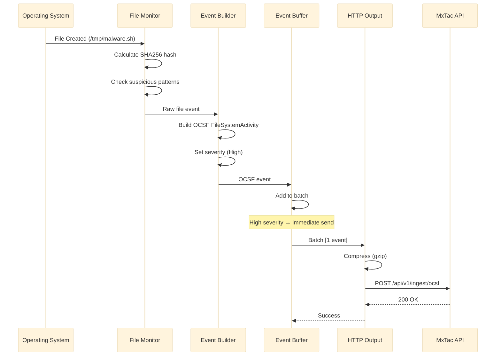

# MxGuard - Architecture Overview

> **Version**: 1.0
> **Date**: 2026-01-19
> **Status**: Design Phase

---

## Table of Contents

1. [System Architecture](#1-system-architecture)
2. [Component Design](#2-component-design)
3. [Data Flow](#3-data-flow)
4. [OCSF Event Generation](#4-ocsf-event-generation)
5. [Performance Considerations](#5-performance-considerations)
6. [Security Design](#6-security-design)

---

## 1. System Architecture

### 1.1 High-Level Architecture

```mermaid
%%{init: {'theme': 'base', 'themeVariables': { 'fontSize': '14px' }, 'flowchart': { 'useMaxWidth': true }}}%%
flowchart TB
    subgraph OS["Operating System"]
        style OS fill:#e3f2fd,stroke:#1565c0
        FS[File System Events]
        PROC[Process Events]
        NET[Network Events]
        LOG[System Logs]
    end

    subgraph Agent["MxGuard Agent"]
        style Agent fill:#e8f5e9,stroke:#2e7d32

        subgraph Collectors["Collectors"]
            style Collectors fill:#fff3e0,stroke:#ef6c00
            FC[File Collector]
            PC[Process Collector]
            NC[Network Collector]
            LC[Log Collector]
        end

        subgraph Core["Core Engine"]
            style Core fill:#f3e5f5,stroke:#7b1fa2
            EB[Event Builder]
            OCSF_FMT[OCSF Formatter]
            FILTER[Event Filter]
            ENRICH[Enrichment]
        end

        subgraph Buffer["Event Buffer"]
            style Buffer fill:#e0f2f1,stroke:#00695c
            QUEUE[In-Memory Queue]
            BATCH[Batch Processor]
        end

        subgraph Output["Output Handler"]
            style Output fill:#fce4ec,stroke:#ad1457
            HTTP[HTTP Sender]
            FILE[File Writer]
            SYSLOG[Syslog Sender]
        end
    end

    subgraph Platform["MxTac Platform"]
        style Platform fill:#fff3e0,stroke:#ef6c00
        API[Ingestion API]
    end

    OS --> Collectors
    Collectors --> Core
    Core --> Buffer
    Buffer --> Output
    Output --> Platform
```



### 1.2 Component Layers

| Layer | Components | Responsibility |
|-------|------------|----------------|
| **Collection** | File, Process, Network, Log Monitors | Gather raw events from OS |
| **Processing** | Event Builder, OCSF Formatter, Filter | Transform to OCSF format |
| **Buffering** | Queue, Batch Processor | Optimize output performance |
| **Output** | HTTP, File, Syslog Senders | Deliver events to MxTac |

---

## 2. Component Design

### 2.1 File Monitor

**Technology**: inotify (Linux), FSEvents (macOS), ReadDirectoryChangesW (Windows)

**Monitored Events**:
- File creation
- File modification
- File deletion
- File rename/move
- Permission changes

**Key Features**:
- Recursive directory watching
- Pattern-based filtering
- SHA256 hash calculation for suspicious files
- Suspicious path detection

**Implementation**:
```go
type FileMonitor struct {
    watcher     *fsnotify.Watcher
    paths       []string
    patterns    []string
    events      chan Event
    hashFiles   bool
}

func (fm *FileMonitor) Watch() {
    for {
        select {
        case event := <-fm.watcher.Events:
            ocsfEvent := fm.buildOCSFEvent(event)
            fm.events <- ocsfEvent
        case err := <-fm.watcher.Errors:
            log.Error("File watcher error:", err)
        }
    }
}
```

### 2.2 Process Monitor

**Technology**: /proc filesystem (Linux), WMI (Windows), kqueue (macOS)

**Monitored Events**:
- Process creation
- Process termination
- Parent-child relationships
- Command-line arguments
- User context (UID/GID)

**Key Features**:
- Process tree tracking
- Suspicious process detection (mimikatz, nc, etc.)
- Privilege escalation detection
- Process injection detection (future)

**Implementation**:
```go
type ProcessMonitor struct {
    interval    time.Duration
    tracked     map[int]*ProcessInfo
    events      chan Event
}

func (pm *ProcessMonitor) Monitor() {
    ticker := time.NewTicker(pm.interval)
    for range ticker.C {
        currentProcs := pm.scanProcesses()
        newProcs := pm.detectNewProcesses(currentProcs)

        for _, proc := range newProcs {
            ocsfEvent := pm.buildOCSFEvent(proc)
            pm.events <- ocsfEvent
        }

        pm.tracked = currentProcs
    }
}
```

### 2.3 Network Monitor

**Technology**: netstat parsing (simple), eBPF (advanced)

**Monitored Events**:
- TCP connections (new, established, closed)
- UDP connections
- Listening ports
- Remote IP addresses
- Process-to-connection mapping

**Key Features**:
- Connection state tracking
- Suspicious port detection
- Lateral movement detection
- Exfiltration detection (future)

**Implementation**:
```go
type NetworkMonitor struct {
    interval     time.Duration
    connections  map[string]*ConnectionInfo
    events       chan Event
}

func (nm *NetworkMonitor) Monitor() {
    ticker := time.NewTicker(nm.interval)
    for range ticker.C {
        conns := nm.getActiveConnections()

        for _, conn := range conns {
            if nm.isNewConnection(conn) {
                ocsfEvent := nm.buildOCSFEvent(conn)
                nm.events <- ocsfEvent
            }
        }
    }
}
```

### 2.4 Log Monitor

**Technology**: File tailing, journalctl API (Linux)

**Monitored Logs**:
- `/var/log/auth.log` - Authentication events
- `/var/log/syslog` - System events
- `journalctl` - Systemd journal
- Windows Event Log (Windows Security, System)

**Key Features**:
- Real-time log tailing
- Pattern matching
- Multi-line log support
- Log rotation handling

**Implementation**:
```go
type LogMonitor struct {
    sources     []LogSource
    patterns    []*regexp.Regexp
    tailers     []*tail.Tail
    events      chan Event
}

func (lm *LogMonitor) Monitor() {
    for _, tailer := range lm.tailers {
        go lm.tailLog(tailer)
    }
}

func (lm *LogMonitor) tailLog(t *tail.Tail) {
    for line := range t.Lines {
        if lm.matchesPattern(line.Text) {
            ocsfEvent := lm.buildOCSFEvent(line)
            lm.events <- ocsfEvent
        }
    }
}
```

### 2.5 OCSF Event Builder

**Responsibility**: Transform raw events into OCSF 1.1.0 format

**OCSF Classes Used**:
- `1001` - File System Activity
- `1007` - Process Activity
- `4001` - Network Activity
- `3002` - Authentication

**Implementation**:
```go
type OCSFBuilder struct {
    productName    string
    productVersion string
    hostname       string
}

func (ob *OCSFBuilder) BuildFileEvent(
    activity string,
    activityID int,
    file FileInfo,
) *FileSystemActivity {
    return &FileSystemActivity{
        Metadata: Metadata{
            Version: "1.1.0",
            Product: Product{
                Name:    ob.productName,
                Vendor:  "MxTac",
                Version: ob.productVersion,
            },
        },
        Time:        time.Now().Unix(),
        ClassUID:    1001,
        CategoryUID: 1,
        Activity:    activity,
        ActivityID:  activityID,
        SeverityID:  ob.calculateSeverity(file),
        File:        file,
        Actor:       ob.getActor(),
        Device:      ob.getDevice(),
    }
}
```

### 2.6 Event Buffer

**Responsibility**: Buffer and batch events for efficient transmission

**Key Features**:
- In-memory ring buffer
- Configurable batch size and timeout
- Backpressure handling
- Event prioritization (Critical events sent immediately)

**Implementation**:
```go
type EventBuffer struct {
    queue       chan Event
    batchSize   int
    batchTime   time.Duration
    output      OutputHandler
}

func (eb *EventBuffer) Start() {
    batch := make([]Event, 0, eb.batchSize)
    ticker := time.NewTicker(eb.batchTime)

    for {
        select {
        case event := <-eb.queue:
            batch = append(batch, event)

            // Send immediately if critical or batch full
            if event.SeverityID >= 5 || len(batch) >= eb.batchSize {
                eb.flush(batch)
                batch = batch[:0]
            }

        case <-ticker.C:
            if len(batch) > 0 {
                eb.flush(batch)
                batch = batch[:0]
            }
        }
    }
}
```

### 2.7 HTTP Output Handler

**Responsibility**: Send OCSF events to MxTac platform

**Key Features**:
- HTTPS with TLS 1.2+
- Bearer token authentication
- Retry with exponential backoff
- Connection pooling
- Compression (gzip)

**Implementation**:
```go
type HTTPOutput struct {
    client      *http.Client
    url         string
    apiKey      string
    retries     int
    backoff     time.Duration
}

func (ho *HTTPOutput) Send(events []Event) error {
    payload, err := json.Marshal(events)
    if err != nil {
        return err
    }

    // Compress
    var buf bytes.Buffer
    gz := gzip.NewWriter(&buf)
    gz.Write(payload)
    gz.Close()

    // Build request
    req, _ := http.NewRequest("POST", ho.url, &buf)
    req.Header.Set("Content-Type", "application/json")
    req.Header.Set("Content-Encoding", "gzip")
    req.Header.Set("Authorization", "Bearer "+ho.apiKey)

    // Send with retry
    return ho.sendWithRetry(req)
}
```

---

## 3. Data Flow

### 3.1 Event Flow Diagram



### 3.2 Event Processing Pipeline

```
┌──────────────┐
│ OS Event     │
│ (inotify)    │
└──────┬───────┘
       │
       ▼
┌──────────────┐
│ Collector    │
│ (File Mon.)  │
└──────┬───────┘
       │
       ▼
┌──────────────┐
│ Enrichment   │
│ (Hash, Path) │
└──────┬───────┘
       │
       ▼
┌──────────────┐
│ Filter       │
│ (Severity)   │
└──────┬───────┘
       │
       ▼
┌──────────────┐
│ OCSF Builder │
│ (Format)     │
└──────┬───────┘
       │
       ▼
┌──────────────┐
│ Buffer       │
│ (Batch)      │
└──────┬───────┘
       │
       ▼
┌──────────────┐
│ Output       │
│ (HTTP/File)  │
└──────────────┘
```

---

## 4. OCSF Event Generation

### 4.1 Event Priority Framework

**Priority Levels**:
- **P0 (Critical)**: Immediate threat, potential breach, requires urgent response
- **P1 (High)**: Suspicious activity, high-value detection, potential attack vector
- **P2 (Medium)**: Notable activity, policy violation, monitoring worthy
- **P3 (Low)**: Informational, baseline activity, audit trail

**Priority Mapping**:
| Priority | OCSF Severity | Use Cases | Response Time |
|----------|---------------|-----------|---------------|
| **P0** | 5 (Critical) | Active exploit, rootkit, C&C | Immediate |
| **P1** | 4 (High) | Malware execution, lateral movement | < 15 min |
| **P2** | 3 (Medium) | Suspicious files, failed auth | < 1 hour |
| **P3** | 2 (Low), 1 (Info) | Normal operations, audit logs | Best effort |

---

### 4.2 OCSF Class 1001: File System Activity

**Priority**: P0-P2 (depends on context)

**Activity IDs**:
| ID | Activity | Priority | Description |
|----|----------|----------|-------------|
| 1 | Create | P1 | File created (suspicious locations → P0) |
| 2 | Delete | P2 | File deleted |
| 3 | Read | P3 | File read |
| 4 | Write | P1 | File modified (configs → P0) |
| 5 | Rename | P2 | File renamed/moved |
| 6 | Set Attributes | P2 | Permissions/ownership changed |
| 99 | Other | P3 | Other file activity |

**Complete Event Schema**:
```json
{
  "metadata": {
    "version": "1.1.0",
    "product": {
      "name": "MxGuard",
      "vendor": "MxTac",
      "version": "1.0.0"
    },
    "uid": "550e8400-e29b-41d4-a716-446655440000",
    "event_code": "file_create_suspicious",
    "labels": ["malware", "persistence"]
  },
  "time": 1705660800000,
  "start_time": 1705660800000,
  "end_time": 1705660800000,
  "class_uid": 1001,
  "class_name": "File System Activity",
  "category_uid": 1,
  "category_name": "System Activity",
  "activity": "Create",
  "activity_id": 1,
  "activity_name": "Create",
  "type_uid": 100101,
  "type_name": "File System Activity: Create",

  "severity": "High",
  "severity_id": 4,
  "priority": "P1",

  "message": "Suspicious file created in /tmp by bash",
  "status": "Success",
  "status_id": 1,

  "file": {
    "name": "malware.sh",
    "path": "/tmp/malware.sh",
    "type": "Regular File",
    "type_id": 1,
    "size": 4096,
    "uid": "root",
    "gid": "root",
    "mode": "0755",
    "is_system": false,
    "created_time": 1705660800000,
    "modified_time": 1705660800000,
    "accessed_time": 1705660800000,
    "hashes": [
      {
        "algorithm": "SHA-256",
        "algorithm_id": 3,
        "value": "e3b0c44298fc1c149afbf4c8996fb92427ae41e4649b934ca495991b7852b855"
      },
      {
        "algorithm": "MD5",
        "algorithm_id": 1,
        "value": "d41d8cd98f00b204e9800998ecf8427e"
      }
    ],
    "security_descriptor": "rw-r--r--",
    "xattributes": {
      "executable": true,
      "suspicious_extension": true
    }
  },

  "actor": {
    "process": {
      "pid": 1234,
      "uid": "1000",
      "name": "bash",
      "file": {
        "path": "/bin/bash",
        "name": "bash"
      },
      "cmdline": "/bin/bash -c 'touch /tmp/malware.sh'",
      "created_time": 1705660700000,
      "parent_process": {
        "pid": 1000,
        "name": "sshd",
        "cmdline": "sshd: ubuntu@pts/0",
        "uid": "0"
      },
      "user": {
        "uid": "1000",
        "name": "ubuntu",
        "type": "User",
        "type_id": 1,
        "domain": "localhost"
      },
      "session": {
        "uid": "12345",
        "created_time": 1705660500000,
        "is_remote": true
      }
    },
    "user": {
      "uid": "1000",
      "name": "ubuntu",
      "type": "User",
      "type_id": 1
    }
  },

  "device": {
    "hostname": "web-server-01",
    "name": "web-server-01",
    "type": "Server",
    "type_id": 1,
    "ip": "192.168.1.100",
    "mac": "00:0c:29:12:34:56",
    "os": {
      "name": "Linux",
      "type": "Linux",
      "type_id": 100,
      "version": "5.15.0-89-generic",
      "build": "Ubuntu 22.04.3 LTS"
    },
    "region": "us-east-1",
    "instance_uid": "i-1234567890abcdef0",
    "interface_uid": "eth0",
    "network_interfaces": [
      {
        "name": "eth0",
        "type": "Wired",
        "ip": "192.168.1.100",
        "mac": "00:0c:29:12:34:56"
      }
    ]
  },

  "enrichments": [
    {
      "name": "threat_intelligence",
      "type": "IOC Match",
      "value": "File hash matches known malware signature",
      "data": {
        "ioc_type": "file_hash",
        "threat_name": "Mimikatz",
        "confidence": 95
      }
    }
  ],

  "observables": [
    {
      "name": "file.hash.sha256",
      "type": "File Hash",
      "type_id": 8,
      "value": "e3b0c44298fc1c149afbf4c8996fb92427ae41e4649b934ca495991b7852b855"
    },
    {
      "name": "file.path",
      "type": "File Path",
      "type_id": 7,
      "value": "/tmp/malware.sh"
    }
  ],

  "unmapped": {
    "mitre_attack": ["T1105", "T1036"],
    "detection_rule": "suspicious_file_tmp_executable",
    "confidence_score": 85
  }
}
```

**Priority Examples**:
```rust
// P0 - Critical system file modification
if file.path.starts_with("/etc/") ||
   file.path.contains("/boot/") ||
   file.path == "/bin/bash" {
    severity = 5; // Critical
    priority = "P0";
}

// P1 - Suspicious location or name
if file.path.starts_with("/tmp/") ||
   file.name.contains("mimikatz") ||
   file.name.ends_with(".exe") {
    severity = 4; // High
    priority = "P1";
}

// P2 - Notable activity
if file.path.starts_with("/var/www/") {
    severity = 3; // Medium
    priority = "P2";
}

// P3 - Normal operations
severity = 2; // Low
priority = "P3";
```

---

### 4.3 OCSF Class 1007: Process Activity

**Priority**: P0-P3 (depends on process)

**Activity IDs**:
| ID | Activity | Priority | Description |
|----|----------|----------|-------------|
| 1 | Launch | P1 | Process started (malware → P0) |
| 2 | Terminate | P2 | Process terminated |
| 3 | Open | P2 | Process opened |
| 4 | Inject | P0 | Code injection detected |
| 5 | Set User ID | P1 | Privilege escalation |
| 99 | Other | P3 | Other process activity |

**Complete Event Schema**:
```json
{
  "metadata": {
    "version": "1.1.0",
    "product": {
      "name": "MxGuard",
      "vendor": "MxTac",
      "version": "1.0.0"
    },
    "uid": "660e8400-e29b-41d4-a716-446655440001",
    "event_code": "process_launch_suspicious"
  },
  "time": 1705660800000,
  "class_uid": 1007,
  "class_name": "Process Activity",
  "category_uid": 1,
  "category_name": "System Activity",
  "activity": "Launch",
  "activity_id": 1,
  "type_uid": 100701,

  "severity": "Critical",
  "severity_id": 5,
  "priority": "P0",

  "message": "Suspicious process mimikatz.exe launched with SYSTEM privileges",
  "status": "Success",
  "status_id": 1,

  "process": {
    "pid": 5678,
    "uid": "0",
    "name": "mimikatz.exe",
    "file": {
      "path": "/tmp/mimikatz.exe",
      "name": "mimikatz.exe",
      "size": 1048576,
      "hashes": [
        {
          "algorithm": "SHA-256",
          "algorithm_id": 3,
          "value": "abc123def456789..."
        }
      ],
      "signature": {
        "algorithm": "RSA",
        "value": "Invalid",
        "is_verified": false
      }
    },
    "cmdline": "/tmp/mimikatz.exe sekurlsa::logonpasswords",
    "created_time": 1705660800000,
    "terminated_time": null,
    "integrity": "System",
    "integrity_id": 4,
    "lineage": [
      "systemd (1)",
      "sshd (1000)",
      "bash (1234)",
      "mimikatz.exe (5678)"
    ],

    "parent_process": {
      "pid": 1234,
      "name": "bash",
      "cmdline": "/bin/bash",
      "uid": "1000",
      "created_time": 1705660700000
    },

    "user": {
      "uid": "0",
      "name": "root",
      "type": "Admin",
      "type_id": 2,
      "groups": [
        {"uid": "0", "name": "root"}
      ]
    },

    "session": {
      "uid": "12345",
      "created_time": 1705660500000,
      "is_remote": true,
      "terminal": "pts/0"
    },

    "loaded_modules": [
      {
        "path": "/lib/x86_64-linux-gnu/libc.so.6",
        "name": "libc.so.6",
        "size": 2029592
      }
    ],

    "network_connections": [
      {
        "src_ip": "192.168.1.100",
        "src_port": 54321,
        "dst_ip": "10.0.0.50",
        "dst_port": 4444,
        "protocol": "TCP"
      }
    ]
  },

  "actor": {
    "process": {
      "pid": 1234,
      "name": "bash",
      "uid": "1000"
    },
    "user": {
      "uid": "1000",
      "name": "ubuntu"
    }
  },

  "device": {
    "hostname": "web-server-01",
    "ip": "192.168.1.100",
    "os": {
      "name": "Linux",
      "version": "5.15.0-89-generic"
    }
  },

  "enrichments": [
    {
      "name": "malware_detection",
      "type": "Threat Intelligence",
      "value": "Known credential dumping tool",
      "data": {
        "malware_family": "Mimikatz",
        "threat_score": 100,
        "first_seen": "2015-01-01"
      }
    }
  ],

  "observables": [
    {
      "name": "process.name",
      "type": "Process Name",
      "type_id": 9,
      "value": "mimikatz.exe"
    },
    {
      "name": "process.file.hash.sha256",
      "type": "File Hash",
      "type_id": 8,
      "value": "abc123def456789..."
    }
  ],

  "unmapped": {
    "mitre_attack": ["T1003.001", "T1059"],
    "kill_chain_phase": "Credential Access",
    "confidence_score": 100
  }
}
```

**Priority Examples**:
```rust
// P0 - Known malware or credential dumping
if process.name.contains("mimikatz") ||
   process.name.contains("procdump") ||
   process.cmdline.contains("sekurlsa") {
    severity = 5;
    priority = "P0";
}

// P0 - Privilege escalation
if process.user.uid == "0" &&
   process.parent_process.user.uid != "0" {
    severity = 5;
    priority = "P0";
}

// P1 - Suspicious process or location
if process.file.path.starts_with("/tmp/") ||
   process.name.ends_with(".exe") ||
   !process.file.signature.is_verified {
    severity = 4;
    priority = "P1";
}

// P2 - Process termination
if activity_id == 2 {
    severity = 3;
    priority = "P2";
}
```

---

### 4.4 OCSF Class 4001: Network Activity

**Priority**: P1-P3 (network connections always notable)

**Activity IDs**:
| ID | Activity | Priority | Description |
|----|----------|----------|-------------|
| 1 | Open | P1 | Connection opened (suspicious → P0) |
| 2 | Close | P3 | Connection closed |
| 3 | Listen | P2 | Port listening |
| 4 | Refuse | P2 | Connection refused |
| 5 | Traffic | P2 | Network traffic |
| 6 | Transmit | P2 | Data transmitted |
| 7 | Receive | P3 | Data received |
| 99 | Other | P3 | Other network activity |

**Complete Event Schema**:
```json
{
  "metadata": {
    "version": "1.1.0",
    "product": {
      "name": "MxGuard",
      "vendor": "MxTac",
      "version": "1.0.0"
    },
    "uid": "770e8400-e29b-41d4-a716-446655440002"
  },
  "time": 1705660800000,
  "class_uid": 4001,
  "class_name": "Network Activity",
  "category_uid": 4,
  "category_name": "Network Activity",
  "activity": "Open",
  "activity_id": 1,
  "type_uid": 400101,

  "severity": "High",
  "severity_id": 4,
  "priority": "P1",

  "message": "Suspicious outbound connection to known C2 IP on port 4444",
  "status": "Success",
  "status_id": 1,

  "connection_info": {
    "uid": "conn-12345",
    "direction": "Outbound",
    "direction_id": 2,
    "protocol_name": "TCP",
    "protocol_num": 6,
    "protocol_ver": "IPv4",
    "protocol_ver_id": 4,
    "boundary": "External",
    "boundary_id": 2,
    "tcp_flags": 2,
    "state": "Established",
    "packets": 150,
    "bytes": 45000
  },

  "src_endpoint": {
    "ip": "192.168.1.100",
    "port": 54321,
    "hostname": "web-server-01",
    "mac": "00:0c:29:12:34:56",
    "interface_uid": "eth0",
    "location": {
      "city": "New York",
      "country": "US",
      "coordinates": [40.7128, -74.0060]
    }
  },

  "dst_endpoint": {
    "ip": "10.0.0.50",
    "port": 4444,
    "hostname": "malicious-c2.example.com",
    "location": {
      "city": "Unknown",
      "country": "Unknown",
      "is_proxy": true
    },
    "reputation": {
      "score": 10,
      "threat_level": "High",
      "categories": ["C2", "Malware"]
    }
  },

  "process": {
    "pid": 5678,
    "name": "nc",
    "cmdline": "nc 10.0.0.50 4444",
    "uid": "1000",
    "file": {
      "path": "/bin/nc"
    }
  },

  "actor": {
    "process": {
      "pid": 5678,
      "name": "nc"
    },
    "user": {
      "uid": "1000",
      "name": "ubuntu"
    }
  },

  "device": {
    "hostname": "web-server-01",
    "ip": "192.168.1.100",
    "os": {
      "name": "Linux",
      "version": "5.15.0-89-generic"
    }
  },

  "traffic": {
    "bytes_in": 15000,
    "bytes_out": 30000,
    "packets_in": 50,
    "packets_out": 100
  },

  "enrichments": [
    {
      "name": "threat_intelligence",
      "type": "IP Reputation",
      "value": "Known C2 server",
      "data": {
        "threat_type": "Command and Control",
        "first_seen": "2023-01-15",
        "last_seen": "2024-01-19",
        "confidence": 95
      }
    }
  ],

  "observables": [
    {
      "name": "dst_endpoint.ip",
      "type": "IP Address",
      "type_id": 2,
      "value": "10.0.0.50"
    },
    {
      "name": "dst_endpoint.port",
      "type": "Port",
      "type_id": 10,
      "value": "4444"
    }
  ],

  "unmapped": {
    "mitre_attack": ["T1071.001", "T1095"],
    "connection_duration": 3600,
    "is_encrypted": false
  }
}
```

**Priority Examples**:
```rust
// P0 - Known C2 communication
if dst_endpoint.reputation.threat_level == "High" ||
   dst_endpoint.port == 4444 ||  // Metasploit default
   dst_endpoint.port == 5555 {   // Common backdoor
    severity = 5;
    priority = "P0";
}

// P1 - Suspicious port or external connection
if dst_endpoint.port < 1024 ||
   connection_info.boundary == "External" {
    severity = 4;
    priority = "P1";
}

// P2 - New connection
if activity_id == 1 {
    severity = 3;
    priority = "P2";
}

// P3 - Connection closed
if activity_id == 2 {
    severity = 2;
    priority = "P3";
}
```

---

### 4.5 OCSF Class 3002: Authentication

**Priority**: P1-P3 (failed auth → higher priority)

**Activity IDs**:
| ID | Activity | Priority | Description |
|----|----------|----------|-------------|
| 1 | Logon | P2 | Successful authentication |
| 2 | Logoff | P3 | User logged off |
| 3 | Authentication Ticket | P2 | Ticket granted (Kerberos) |
| 4 | Service Ticket Request | P2 | Service ticket requested |
| 99 | Other | P3 | Other authentication activity |

**Additional Status for Failed Auth**:
- Status: "Failure" → **P1 priority** (potential brute force)

**Complete Event Schema**:
```json
{
  "metadata": {
    "version": "1.1.0",
    "product": {
      "name": "MxGuard",
      "vendor": "MxTac",
      "version": "1.0.0"
    },
    "uid": "880e8400-e29b-41d4-a716-446655440003"
  },
  "time": 1705660800000,
  "class_uid": 3002,
  "class_name": "Authentication",
  "category_uid": 3,
  "category_name": "Identity & Access Management",
  "activity": "Logon",
  "activity_id": 1,
  "type_uid": 300201,

  "severity": "Medium",
  "severity_id": 3,
  "priority": "P2",

  "message": "Successful SSH login for user ubuntu from 203.0.113.10",
  "status": "Success",
  "status_id": 1,
  "status_detail": "Password authentication succeeded",

  "auth_protocol": "SSH",
  "auth_protocol_id": 23,

  "logon_type": "Network",
  "logon_type_id": 3,

  "is_cleartext": false,
  "is_mfa": false,
  "is_new_logon": true,

  "user": {
    "uid": "1000",
    "name": "ubuntu",
    "type": "User",
    "type_id": 1,
    "domain": "localhost",
    "email_addr": "ubuntu@example.com",
    "groups": [
      {"uid": "1000", "name": "ubuntu"},
      {"uid": "27", "name": "sudo"}
    ],
    "credential_uid": "password-hash-12345"
  },

  "session": {
    "uid": "12345",
    "created_time": 1705660800000,
    "expiration_time": 1705674800000,
    "is_remote": true,
    "issuer": "sshd",
    "terminal": "pts/0"
  },

  "src_endpoint": {
    "ip": "203.0.113.10",
    "port": 45678,
    "hostname": "attacker.example.com",
    "location": {
      "city": "Unknown",
      "country": "RU",
      "is_proxy": false
    }
  },

  "dst_endpoint": {
    "ip": "192.168.1.100",
    "port": 22,
    "hostname": "web-server-01",
    "svc_name": "sshd"
  },

  "process": {
    "pid": 9999,
    "name": "sshd",
    "file": {
      "path": "/usr/sbin/sshd"
    },
    "cmdline": "sshd: ubuntu@pts/0"
  },

  "device": {
    "hostname": "web-server-01",
    "ip": "192.168.1.100",
    "os": {
      "name": "Linux",
      "version": "5.15.0-89-generic"
    }
  },

  "enrichments": [
    {
      "name": "geo_location",
      "type": "Geolocation",
      "value": "Login from Russia",
      "data": {
        "country": "Russia",
        "is_unexpected_location": true,
        "distance_from_usual": 8000
      }
    }
  ],

  "observables": [
    {
      "name": "user.name",
      "type": "User Name",
      "type_id": 4,
      "value": "ubuntu"
    },
    {
      "name": "src_endpoint.ip",
      "type": "IP Address",
      "type_id": 2,
      "value": "203.0.113.10"
    }
  ],

  "unmapped": {
    "mitre_attack": ["T1078", "T1021.004"],
    "login_count": 1,
    "failed_attempts_before": 0
  }
}
```

**Failed Authentication Example**:
```json
{
  "activity": "Logon",
  "activity_id": 1,
  "status": "Failure",
  "status_id": 2,
  "status_detail": "Invalid password",

  "severity": "High",
  "severity_id": 4,
  "priority": "P1",

  "message": "Failed SSH login attempt for user root from 203.0.113.10 (5 attempts in 60 seconds)",

  "auth_protocol": "SSH",
  "logon_type": "Network",

  "user": {
    "name": "root",
    "uid": "0"
  },

  "unmapped": {
    "mitre_attack": ["T1110.001"],
    "brute_force_detected": true,
    "failed_attempt_count": 5,
    "time_window_seconds": 60
  }
}
```

**Priority Examples**:
```rust
// P0 - Brute force attack detected
if status == "Failure" &&
   failed_attempt_count >= 5 &&
   time_window_seconds <= 60 {
    severity = 5;
    priority = "P0";
}

// P1 - Failed authentication or suspicious login
if status == "Failure" ||
   src_endpoint.location.country == "RU" ||
   user.name == "root" {
    severity = 4;
    priority = "P1";
}

// P2 - Successful authentication
if status == "Success" && is_new_logon {
    severity = 3;
    priority = "P2";
}

// P3 - Logoff
if activity_id == 2 {
    severity = 2;
    priority = "P3";
}
```

---

### 4.6 Priority Decision Tree

```rust
impl OCSFBuilder {
    fn calculate_priority(&self, event: &Event) -> (u8, &str) {
        // P0 - Critical threats
        if self.is_known_malware(event) ||
           self.is_c2_communication(event) ||
           self.is_privilege_escalation(event) ||
           self.is_brute_force(event) {
            return (5, "P0");
        }

        // P1 - High-value detections
        if self.is_suspicious_process(event) ||
           self.is_suspicious_file(event) ||
           self.is_external_connection(event) ||
           self.is_failed_auth(event) {
            return (4, "P1");
        }

        // P2 - Notable activity
        if self.is_policy_violation(event) ||
           self.is_new_connection(event) ||
           self.is_successful_auth(event) {
            return (3, "P2");
        }

        // P3 - Informational
        (2, "P3")
    }
}
```

---

### 4.7 Event Class Summary

| OCSF Class | Category | Priority Range | Event Volume | Retention |
|------------|----------|----------------|--------------|-----------|
| **1001** File System Activity | System | P0-P3 | High (1000s/sec) | 90 days |
| **1007** Process Activity | System | P0-P3 | Medium (100s/sec) | 90 days |
| **4001** Network Activity | Network | P1-P3 | High (1000s/sec) | 30 days |
| **3002** Authentication | IAM | P0-P3 | Low (10s/sec) | 365 days |

**Event Rate Estimates** (per agent):
- File events: 100-1000/sec (filtered to 10-50/sec suspicious)
- Process events: 10-100/sec (filtered to 1-10/sec suspicious)
- Network events: 50-500/sec (filtered to 5-50/sec suspicious)
- Auth events: 1-10/sec (all retained)

---

## 5. Performance Considerations

### 5.1 Resource Optimization

| Technique | Benefit | Implementation |
|-----------|---------|----------------|
| **Event Sampling** | Reduce noise | Sample high-frequency events |
| **Batching** | Reduce network calls | Batch up to 100 events |
| **Compression** | Reduce bandwidth | Gzip compression |
| **Connection Pooling** | Reuse connections | HTTP keep-alive |
| **Bloom Filters** | Fast pre-check | Filter known-good files |
| **Lazy Hashing** | Save CPU | Hash only suspicious files |

### 5.2 Memory Management

```rust
// Use object pools for frequent allocations
use std::sync::Arc;
use crossbeam::queue::ArrayQueue;

lazy_static! {
    static ref EVENT_POOL: ArrayQueue<Box<Event>> = ArrayQueue::new(1000);
}

fn get_event() -> Box<Event> {
    EVENT_POOL.pop().unwrap_or_else(|| Box::new(Event::default()))
}

fn return_event(mut event: Box<Event>) {
    // Reset event
    event.reset();
    let _ = EVENT_POOL.push(event);
}

// Or use arena allocation for batch processing
use bumpalo::Bump;

fn process_batch(events: &[RawEvent]) {
    let arena = Bump::new();

    for raw_event in events {
        let ocsf_event = arena.alloc(build_ocsf_event(raw_event));
        send_event(ocsf_event);
    }
    // All allocations freed when arena dropped
}
```

### 5.3 Goroutine Model

```
Main Goroutine
├── File Monitor Goroutine
├── Process Monitor Goroutine (ticker)
├── Network Monitor Goroutine (ticker)
├── Log Monitor Goroutines (N tailers)
├── Event Builder Goroutine (worker pool)
├── Buffer Manager Goroutine
└── Output Handler Goroutines (M workers)
```

---

## 6. Security Design

### 6.1 Agent Security

| Aspect | Implementation |
|--------|----------------|
| **Authentication** | Bearer token in config, TLS client certs (optional) |
| **Encryption** | TLS 1.2+ for all HTTP communication |
| **Credential Storage** | Encrypted config file, OS keyring integration |
| **Code Signing** | Sign binaries with GPG/CodeSign |
| **Privilege** | Drop privileges after startup (if possible) |
| **Tampering Protection** | Self-integrity check on startup |

### 6.2 Configuration Security

```yaml
# Sensitive fields encrypted
output:
  http:
    url: "https://mxtac.example.com/api/v1/ingest/ocsf"
    api_key: "${MXGUARD_API_KEY}"  # From environment variable
    tls:
      verify: true
      ca_cert: "/etc/mxguard/ca.pem"
      client_cert: "/etc/mxguard/client.pem"
      client_key: "/etc/mxguard/client.key"
```

### 6.3 Defense Against Tampering

```go
func (a *Agent) VerifyIntegrity() error {
    // Calculate binary hash
    binPath, _ := os.Executable()
    binHash := calculateSHA256(binPath)

    // Compare with embedded hash (set at build time)
    if binHash != embeddedHash {
        return errors.New("binary integrity check failed")
    }

    return nil
}
```

---

## Appendix: Platform-Specific Details

### A. Linux Implementation

**File Monitoring**: inotify API
**Process Monitoring**: /proc filesystem
**Network Monitoring**: /proc/net/tcp, netlink sockets
**Logging**: /var/log/*, journalctl API

### B. Windows Implementation

**File Monitoring**: ReadDirectoryChangesW API
**Process Monitoring**: WMI (Win32_Process)
**Network Monitoring**: GetExtendedTcpTable API
**Logging**: Windows Event Log API

### C. macOS Implementation

**File Monitoring**: FSEvents API
**Process Monitoring**: kqueue, sysctl
**Network Monitoring**: lsof parsing
**Logging**: Unified Logging System (OSLog)

---

*Architecture designed for production deployment*
*Next: See 02-PROJECT-STRUCTURE.md for code organization*
