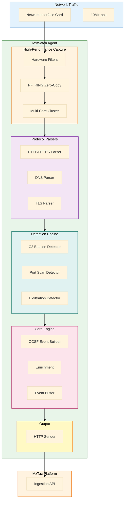

# MxWatch - Architecture Overview

> **Version**: 1.0
> **Date**: 2026-01-19
> **Status**: Design Phase

---

## Table of Contents

1. [System Architecture](#1-system-architecture)
2. [Component Design](#2-component-design)
3. [Data Flow](#3-data-flow)
4. [OCSF Event Generation](#4-ocsf-event-generation)
5. [Performance Considerations](#5-performance-considerations)
6. [Security Design](#6-security-design)

---

## 1. System Architecture

### 1.1 High-Level Architecture



### 1.2 Component Layers

| Layer | Components | Responsibility |
|-------|------------|----------------|
| **Capture** | PF_RING, Hardware Filters, Multi-Core Cluster | Zero-copy packet capture at 10M+ pps |
| **Parsing** | HTTP, DNS, TLS Parsers | Extract protocol data |
| **Detection** | C2, Port Scan, Exfiltration Detectors | Identify threats |
| **Processing** | OCSF Builder, Enrichment | Transform to OCSF |
| **Buffering** | Event Buffer | Optimize output |
| **Output** | HTTP Sender | Deliver to MxTac |

### 1.3 Performance Characteristics

| Metric | Value | Notes |
|--------|-------|-------|
| **Throughput** | 10M+ pps | With PF_RING on 8-core system |
| **Network Speed** | Up to 100 Gbps | Hardware-dependent |
| **Packet Loss** | < 0.1% | Under normal conditions |
| **Latency** | < 1 μs | Per-packet processing |
| **CPU Usage** | 10-20% | 8 cores @ 10 Gbps |
| **Memory** | 15-120 MB | Scales with throughput |

---

## 2. Component Design

### 2.1 Packet Capture (PF_RING)

**Technology**: PF_RING (Linux), fallback to libpcap (Windows/macOS)

**Capture Architecture**:
- **Primary**: PF_RING zero-copy kernel module (Linux)
- **Fallback**: libpcap for non-Linux platforms
- **Performance**: 10M+ packets/second vs 100K for libpcap

**Key Features**:
- Zero-copy packet delivery (NIC → userspace)
- Hardware filtering offload to NIC
- Multi-core load balancing (per-flow clustering)
- Sub-microsecond latency
- Hardware timestamping
- DNA/ZC mode for wire-speed capture

**Architecture**:

```
┌─────────────────────────────────────────────┐
│         Network Interface Card (NIC)        │
│  ┌────────────────────────────────────┐    │
│  │    Hardware Filters (Offload)      │    │
│  │  • Port filtering (TCP/UDP)        │    │
│  │  • Protocol filtering              │    │
│  │  • IP address filtering            │    │
│  └────────────┬───────────────────────┘    │
└───────────────┼────────────────────────────┘
                │ Zero-Copy DMA
                ▼
┌─────────────────────────────────────────────┐
│         PF_RING Kernel Module               │
│  ┌────────────────────────────────────┐    │
│  │   Circular Buffer (Ring)           │    │
│  │   • 32K-256K slots                 │    │
│  │   • Lock-free                      │    │
│  │   • Per-CPU rings                  │    │
│  └────────────┬───────────────────────┘    │
└───────────────┼────────────────────────────┘
                │ mmap()
                ▼
┌─────────────────────────────────────────────┐
│         MxWatch Agent (Userspace)           │
│  ┌────────────────────────────────────┐    │
│  │   Multi-Core Workers (8 cores)     │    │
│  │   Core 0  Core 1  Core 2  Core 3   │    │
│  │   Core 4  Core 5  Core 6  Core 7   │    │
│  │   • CPU affinity pinning           │    │
│  │   • Per-flow load balancing        │    │
│  └────────────────────────────────────┘    │
└─────────────────────────────────────────────┘
```

**Implementation**:

```rust
use pfring_sys::*;
use std::ffi::CString;
use tokio::sync::mpsc;

pub struct PacketCapture {
    rings: Vec<PFRingWorker>,
    config: CaptureConfig,
    packet_tx: mpsc::Sender<RawPacket>,
}

pub struct PFRingWorker {
    ring: *mut pfring,
    core_id: usize,
    interface: String,
    cluster_id: u16,
}

pub struct CaptureConfig {
    pub interface: String,
    pub workers: usize,
    pub snaplen: u32,
    pub cluster_id: u16,
    pub enable_hw_timestamp: bool,
    pub enable_zero_copy: bool,
    pub ring_slots: u32,
}

impl PacketCapture {
    pub fn new(config: CaptureConfig) -> Result<Self, Error> {
        let (packet_tx, _) = mpsc::channel(100000);
        let mut rings = Vec::new();

        // Create one PF_RING per CPU core
        for core_id in 0..config.workers {
            let worker = PFRingWorker::new(
                &config.interface,
                core_id,
                config.cluster_id,
                config.snaplen,
            )?;
            rings.push(worker);
        }

        Ok(Self {
            rings,
            config,
            packet_tx,
        })
    }

    pub async fn start(&mut self) -> Result<(), Error> {
        let mut handles = Vec::new();

        // Spawn one tokio task per core
        for mut worker in self.rings.drain(..) {
            let tx = self.packet_tx.clone();

            let handle = tokio::spawn(async move {
                worker.run(tx).await
            });

            handles.push(handle);
        }

        // Wait for all workers
        for handle in handles {
            handle.await.unwrap();
        }

        Ok(())
    }
}

impl PFRingWorker {
    pub fn new(
        interface: &str,
        core_id: usize,
        cluster_id: u16,
        snaplen: u32,
    ) -> Result<Self, Error> {
        unsafe {
            let iface = CString::new(interface)?;

            // Open PF_RING with high-performance flags
            let ring = pfring_open(
                iface.as_ptr(),
                snaplen,
                PF_RING_PROMISC |           // Promiscuous mode
                PF_RING_TIMESTAMP |         // Hardware timestamps
                PF_RING_DNA |               // Direct NIC Access
                PF_RING_ZC |                // Zero Copy
                PF_RING_HW_TIMESTAMP        // NIC-level timestamps
            );

            if ring.is_null() {
                return Err(Error::PFRingOpen(
                    format!("Failed to open PF_RING on {}", interface)
                ));
            }

            // Set application name
            let app_name = CString::new("mxwatch")?;
            pfring_set_application_name(ring, app_name.as_ptr());

            // Configure clustering (per-flow load balancing)
            pfring_set_cluster(
                ring,
                cluster_id,
                pfring_cluster_type::cluster_per_flow_5_tuple
            );

            // Set socket mode to recv-only (no send)
            pfring_set_socket_mode(ring, recv_only_mode);

            // Enable ring
            pfring_enable_ring(ring);

            Ok(Self {
                ring,
                core_id,
                interface: interface.to_string(),
                cluster_id,
            })
        }
    }

    pub async fn run(&mut self, tx: mpsc::Sender<RawPacket>) {
        // Pin this thread to specific CPU core
        self.set_cpu_affinity();

        unsafe {
            let mut hdr: pfring_pkthdr = std::mem::zeroed();
            let mut buffer = vec![0u8; 65535];

            loop {
                // Non-blocking receive
                let rc = pfring_recv(
                    self.ring,
                    buffer.as_mut_ptr(),
                    buffer.len() as u32,
                    &mut hdr,
                    1  // wait_for_packet
                );

                match rc {
                    1 => {
                        // Packet received
                        let packet = RawPacket {
                            data: buffer[..hdr.caplen as usize].to_vec(),
                            timestamp: hdr.ts.tv_sec as i64,
                            timestamp_ns: hdr.ts.tv_usec as i64 * 1000,
                            length: hdr.len as usize,
                            core_id: self.core_id,
                            hash: hdr.extended_hdr.pkt_hash,
                        };

                        if tx.send(packet).await.is_err() {
                            break; // Channel closed
                        }
                    }
                    0 => {
                        // No packet, yield to tokio runtime
                        tokio::task::yield_now().await;
                    }
                    _ => {
                        eprintln!("PF_RING recv error on core {}", self.core_id);
                        break;
                    }
                }
            }
        }
    }

    fn set_cpu_affinity(&self) {
        use nix::sched::{sched_setaffinity, CpuSet};
        use nix::unistd::Pid;

        let mut cpu_set = CpuSet::new();
        cpu_set.set(self.core_id).unwrap();
        sched_setaffinity(Pid::from_raw(0), &cpu_set).unwrap();
    }

    pub fn add_hw_filter(&mut self, rule: HWFilterRule) -> Result<(), Error> {
        unsafe {
            let mut hw_rule: hw_filtering_rule = std::mem::zeroed();

            hw_rule.rule_id = rule.id as u16;
            hw_rule.rule_action = hw_filter_rule_command::forward_packet_and_stop_rule_evaluation;

            // Set filter fields
            hw_rule.core_fields.proto = rule.protocol as u8;
            hw_rule.core_fields.sport = rule.src_port;
            hw_rule.core_fields.dport = rule.dst_port;

            let rc = pfring_add_hw_rule(self.ring, &mut hw_rule);
            if rc < 0 {
                return Err(Error::HWFilterError("Failed to add HW filter"));
            }

            Ok(())
        }
    }
}

impl Drop for PFRingWorker {
    fn drop(&mut self) {
        unsafe {
            pfring_close(self.ring);
        }
    }
}

pub struct RawPacket {
    pub data: Vec<u8>,
    pub timestamp: i64,      // Unix timestamp (seconds)
    pub timestamp_ns: i64,   // Nanosecond precision
    pub length: usize,
    pub core_id: usize,      // Which core received this
    pub hash: u32,           // Hardware hash (for flow tracking)
}

pub struct HWFilterRule {
    pub id: u32,
    pub protocol: u8,    // 6=TCP, 17=UDP
    pub src_port: u16,
    pub dst_port: u16,
}
```

**Hardware Filter Configuration**:

```rust
impl PacketCapture {
    pub fn configure_hw_filters(&mut self) -> Result<(), Error> {
        // Filter 1: HTTPS traffic (port 443)
        for worker in &mut self.rings {
            worker.add_hw_filter(HWFilterRule {
                id: 1,
                protocol: 6,  // TCP
                src_port: 0,  // Any
                dst_port: 443,
            })?;
        }

        // Filter 2: DNS traffic (port 53)
        for worker in &mut self.rings {
            worker.add_hw_filter(HWFilterRule {
                id: 2,
                protocol: 17, // UDP
                src_port: 0,
                dst_port: 53,
            })?;
        }

        // Filter 3: HTTP traffic (port 80)
        for worker in &mut self.rings {
            worker.add_hw_filter(HWFilterRule {
                id: 3,
                protocol: 6,  // TCP
                src_port: 0,
                dst_port: 80,
            })?;
        }

        Ok(())
    }
}
```

**Configuration** (`/etc/mxwatch/config.yaml`):

```yaml
capture:
  interface: eth0
  engine: pfring

  pfring:
    workers: 8              # CPU cores to use
    snaplen: 1536           # Bytes per packet
    cluster_id: 1
    cluster_type: per_flow_5_tuple
    enable_hw_timestamp: true
    enable_zero_copy: true
    ring_slots: 65536       # Circular buffer size

    # Hardware filters (NIC offload)
    hw_filters:
      - id: 1
        protocol: tcp
        dst_port: 443

      - id: 2
        protocol: udp
        dst_port: 53

      - id: 3
        protocol: tcp
        dst_port: 80
```

**Dependencies** (`Cargo.toml`):

```toml
[dependencies]
pfring-sys = "0.1"      # FFI bindings to PF_RING C library
nix = "0.27"            # CPU affinity, POSIX APIs
tokio = { version = "1.35", features = ["full"] }
```

### 2.2 HTTP/HTTPS Parser

**Monitored Fields**:
- Request method, URI, headers
- Response status code, headers
- User-Agent, Referer
- Content-Type, Content-Length
- Cookies, authentication headers

**Key Features**:
- HTTP/1.1 and HTTP/2 support
- Request/response correlation
- Header parsing
- Suspicious pattern detection (command injection, SQL injection)

**Implementation**:
```go
type HTTPParser struct {
    requests  map[string]*HTTPRequest
    events    chan ocsf.NetworkActivity
}

type HTTPRequest struct {
    Method      string
    URI         string
    Host        string
    UserAgent   string
    Headers     map[string]string
    Timestamp   time.Time
}

type HTTPResponse struct {
    StatusCode  int
    Headers     map[string]string
    Timestamp   time.Time
}

func (hp *HTTPParser) ParsePacket(packet gopacket.Packet) {
    if httpLayer := packet.Layer(layers.LayerTypeHTTP); httpLayer != nil {
        http := httpLayer.(*layers.HTTP)

        if len(http.Method) > 0 {
            // HTTP Request
            req := &HTTPRequest{
                Method:    string(http.Method),
                URI:       string(http.RequestURI),
                Host:      string(http.Host),
                UserAgent: hp.extractUserAgent(http.Headers),
                Timestamp: packet.Metadata().Timestamp,
            }

            // Check for suspicious patterns
            if hp.isSuspicious(req) {
                event := hp.buildOCSFEvent(req)
                hp.events <- event
            }
        } else if http.StatusCode > 0 {
            // HTTP Response
            resp := &HTTPResponse{
                StatusCode: int(http.StatusCode),
                Timestamp:  packet.Metadata().Timestamp,
            }

            // Check for errors or suspicious responses
            if resp.StatusCode >= 400 || hp.isSuspiciousResponse(resp) {
                event := hp.buildOCSFEvent(resp)
                hp.events <- event
            }
        }
    }
}

func (hp *HTTPParser) isSuspicious(req *HTTPRequest) bool {
    // Check for command injection
    if strings.Contains(req.URI, ";") || strings.Contains(req.URI, "|") {
        return true
    }

    // Check for SQL injection
    if strings.Contains(req.URI, "'") || strings.Contains(req.URI, "OR 1=1") {
        return true
    }

    // Check for directory traversal
    if strings.Contains(req.URI, "../") {
        return true
    }

    return false
}
```

### 2.3 DNS Parser

**Monitored Fields**:
- Query name, type, class
- Response records (A, AAAA, CNAME, MX, TXT)
- Query/response timestamps
- DNS server IP

**Key Features**:
- DNS tunneling detection
- DGA domain detection
- Suspicious TLD detection
- Fast-flux detection

**Implementation**:
```go
type DNSParser struct {
    queries   map[uint16]*DNSQuery
    events    chan ocsf.NetworkActivity
}

type DNSQuery struct {
    Name      string
    Type      string
    Class     string
    Timestamp time.Time
    SrcIP     string
}

type DNSResponse struct {
    Name      string
    Answers   []DNSAnswer
    Timestamp time.Time
}

type DNSAnswer struct {
    Name  string
    Type  string
    Data  string
    TTL   uint32
}

func (dp *DNSParser) ParsePacket(packet gopacket.Packet) {
    if dnsLayer := packet.Layer(layers.LayerTypeDNS); dnsLayer != nil {
        dns := dnsLayer.(*layers.DNS)

        if dns.QR {
            // DNS Response
            for _, answer := range dns.Answers {
                if dp.isSuspiciousDomain(string(answer.Name)) {
                    event := dp.buildOCSFEvent(answer)
                    dp.events <- event
                }
            }
        } else {
            // DNS Query
            for _, question := range dns.Questions {
                query := &DNSQuery{
                    Name:      string(question.Name),
                    Type:      question.Type.String(),
                    Timestamp: packet.Metadata().Timestamp,
                }

                // Check for DNS tunneling
                if dp.isDNSTunneling(query) {
                    event := dp.buildOCSFEvent(query)
                    dp.events <- event
                }

                // Check for DGA domain
                if dp.isDGA(query.Name) {
                    event := dp.buildOCSFEvent(query)
                    dp.events <- event
                }
            }
        }
    }
}

func (dp *DNSParser) isDNSTunneling(query *DNSQuery) bool {
    // Check for unusually long subdomain
    if len(query.Name) > 100 {
        return true
    }

    // Check for high entropy (random-looking)
    entropy := dp.calculateEntropy(query.Name)
    if entropy > 4.5 {
        return true
    }

    // Check for excessive labels
    labels := strings.Count(query.Name, ".")
    if labels > 10 {
        return true
    }

    return false
}

func (dp *DNSParser) isDGA(domain string) bool {
    // Check for random-looking domain
    entropy := dp.calculateEntropy(domain)
    if entropy > 4.0 {
        return true
    }

    // Check for suspicious TLDs
    suspiciousTLDs := []string{".tk", ".ml", ".ga", ".cf", ".gq"}
    for _, tld := range suspiciousTLDs {
        if strings.HasSuffix(domain, tld) {
            return true
        }
    }

    return false
}

func (dp *DNSParser) calculateEntropy(s string) float64 {
    freq := make(map[rune]int)
    for _, c := range s {
        freq[c]++
    }

    var entropy float64
    for _, count := range freq {
        p := float64(count) / float64(len(s))
        entropy -= p * math.Log2(p)
    }

    return entropy
}
```

### 2.4 TLS/SSL Parser

**Monitored Fields**:
- TLS version
- Cipher suites
- Server certificate (CN, issuer, validity)
- SNI (Server Name Indication)
- Certificate chain

**Key Features**:
- Self-signed certificate detection
- Expired certificate detection
- Weak cipher detection
- SNI extraction

**Implementation**:
```go
type TLSParser struct {
    events chan ocsf.NetworkActivity
}

func (tp *TLSParser) ParsePacket(packet gopacket.Packet) {
    if tlsLayer := packet.Layer(layers.LayerTypeTLS); tlsLayer != nil {
        tls := tlsLayer.(*layers.TLS)

        for _, record := range tls.Contents {
            // Server Hello
            if record.ContentType == layers.TLSContentTypeHandshake {
                if tp.isWeakCipher(record.CipherSuite) {
                    event := tp.buildOCSFEvent(record)
                    tp.events <- event
                }
            }

            // Certificate
            if record.ContentType == layers.TLSContentTypeCertificate {
                cert := tp.parseCertificate(record)

                if tp.isSelfSigned(cert) || tp.isExpired(cert) {
                    event := tp.buildOCSFEvent(cert)
                    tp.events <- event
                }
            }
        }
    }
}

func (tp *TLSParser) isWeakCipher(cipher uint16) bool {
    weakCiphers := []uint16{
        0x0004, // TLS_RSA_WITH_RC4_128_MD5
        0x0005, // TLS_RSA_WITH_RC4_128_SHA
        // ... more weak ciphers
    }

    for _, weak := range weakCiphers {
        if cipher == weak {
            return true
        }
    }

    return false
}
```

### 2.5 C2 Beacon Detector

**Detection Methods**:
- Fixed interval beaconing
- Jitter-based beaconing
- Statistical analysis of connection patterns
- Known C2 signatures

**Key Features**:
- Time-series analysis
- Frequency analysis
- Anomaly detection

**Implementation**:
```go
type C2BeaconDetector struct {
    connections map[string]*ConnectionTracker
    events      chan ocsf.NetworkActivity
}

type ConnectionTracker struct {
    DstIP       string
    DstPort     int
    Timestamps  []time.Time
    BytesSent   []int64
    BytesRecv   []int64
}

func (cbd *C2BeaconDetector) TrackConnection(conn Connection) {
    key := fmt.Sprintf("%s:%d", conn.DstIP, conn.DstPort)

    tracker, exists := cbd.connections[key]
    if !exists {
        tracker = &ConnectionTracker{
            DstIP:      conn.DstIP,
            DstPort:    conn.DstPort,
            Timestamps: make([]time.Time, 0),
        }
        cbd.connections[key] = tracker
    }

    tracker.Timestamps = append(tracker.Timestamps, conn.Timestamp)
    tracker.BytesSent = append(tracker.BytesSent, conn.BytesSent)
    tracker.BytesRecv = append(tracker.BytesRecv, conn.BytesRecv)

    // Analyze after 10 connections
    if len(tracker.Timestamps) >= 10 {
        if cbd.isBeaconing(tracker) {
            event := cbd.buildOCSFEvent(tracker)
            cbd.events <- event
        }
    }
}

func (cbd *C2BeaconDetector) isBeaconing(tracker *ConnectionTracker) bool {
    // Calculate intervals between connections
    intervals := make([]float64, 0)
    for i := 1; i < len(tracker.Timestamps); i++ {
        interval := tracker.Timestamps[i].Sub(tracker.Timestamps[i-1]).Seconds()
        intervals = append(intervals, interval)
    }

    // Calculate mean and standard deviation
    mean := cbd.mean(intervals)
    stddev := cbd.stddev(intervals, mean)

    // Check for regular interval (low std dev)
    // Coefficient of Variation < 0.2 indicates beaconing
    cv := stddev / mean
    if cv < 0.2 && mean > 5 && mean < 3600 {
        return true
    }

    // Check for consistent payload size
    if cbd.isConsistentPayload(tracker.BytesSent) {
        return true
    }

    return false
}

func (cbd *C2BeaconDetector) mean(values []float64) float64 {
    sum := 0.0
    for _, v := range values {
        sum += v
    }
    return sum / float64(len(values))
}

func (cbd *C2BeaconDetector) stddev(values []float64, mean float64) float64 {
    variance := 0.0
    for _, v := range values {
        variance += math.Pow(v-mean, 2)
    }
    return math.Sqrt(variance / float64(len(values)))
}

func (cbd *C2BeaconDetector) isConsistentPayload(sizes []int64) bool {
    if len(sizes) < 5 {
        return false
    }

    // Convert to float64 for stats
    floatSizes := make([]float64, len(sizes))
    for i, s := range sizes {
        floatSizes[i] = float64(s)
    }

    mean := cbd.mean(floatSizes)
    stddev := cbd.stddev(floatSizes, mean)

    // CV < 0.1 indicates very consistent payload
    cv := stddev / mean
    return cv < 0.1
}
```

### 2.6 Port Scan Detector

**Detection Methods**:
- Vertical scan (many ports, one host)
- Horizontal scan (one port, many hosts)
- SYN scan, FIN scan, Xmas scan

**Implementation**:
```go
type PortScanDetector struct {
    scanners map[string]*ScanTracker
    events   chan ocsf.NetworkActivity
}

type ScanTracker struct {
    SrcIP       string
    DstPorts    map[int]bool
    DstHosts    map[string]bool
    Timestamps  []time.Time
}

func (psd *PortScanDetector) TrackConnection(conn Connection) {
    tracker, exists := psd.scanners[conn.SrcIP]
    if !exists {
        tracker = &ScanTracker{
            SrcIP:    conn.SrcIP,
            DstPorts: make(map[int]bool),
            DstHosts: make(map[string]bool),
        }
        psd.scanners[conn.SrcIP] = tracker
    }

    tracker.DstPorts[conn.DstPort] = true
    tracker.DstHosts[conn.DstIP] = true
    tracker.Timestamps = append(tracker.Timestamps, conn.Timestamp)

    // Vertical scan: >10 ports on same host in <60 sec
    if len(tracker.DstPorts) > 10 && len(tracker.DstHosts) == 1 {
        duration := tracker.Timestamps[len(tracker.Timestamps)-1].Sub(tracker.Timestamps[0])
        if duration < 60*time.Second {
            event := psd.buildOCSFEvent(tracker, "Vertical Port Scan")
            psd.events <- event
        }
    }

    // Horizontal scan: same port on >10 hosts in <60 sec
    if len(tracker.DstHosts) > 10 && len(tracker.DstPorts) == 1 {
        duration := tracker.Timestamps[len(tracker.Timestamps)-1].Sub(tracker.Timestamps[0])
        if duration < 60*time.Second {
            event := psd.buildOCSFEvent(tracker, "Horizontal Port Scan")
            psd.events <- event
        }
    }
}
```

---

## 3. Data Flow

### 3.1 Packet Processing Pipeline

```
┌──────────────┐
│ Network      │
│ Interface    │
└──────┬───────┘
       │
       ▼
┌──────────────┐
│ libpcap      │
│ (BPF Filter) │
└──────┬───────┘
       │
       ▼
┌──────────────┐
│ Packet       │
│ Decoder      │
└──────┬───────┘
       │
       ▼
┌──────────────┐
│ Protocol     │
│ Parser       │
└──────┬───────┘
       │
       ▼
┌──────────────┐
│ Detection    │
│ Engine       │
└──────┬───────┘
       │
       ▼
┌──────────────┐
│ OCSF Builder │
└──────┬───────┘
       │
       ▼
┌──────────────┐
│ Event Buffer │
└──────┬───────┘
       │
       ▼
┌──────────────┐
│ HTTP Output  │
└──────────────┘
```

---

## 4. OCSF Event Generation

### 4.1 Network Activity Event (Class 4001)

```json
{
  "metadata": {
    "version": "1.1.0",
    "product": {
      "name": "MxWatch",
      "vendor": "MxTac",
      "version": "1.0.0"
    }
  },
  "time": 1705660800,
  "class_uid": 4001,
  "category_uid": 4,
  "activity": "Traffic",
  "activity_id": 5,
  "severity_id": 4,
  "severity": "High",
  "message": "C2 beacon detected",
  "connection_info": {
    "direction": "Outbound",
    "protocol_name": "HTTPS",
    "protocol_num": 443
  },
  "src_endpoint": {
    "ip": "192.168.1.100",
    "port": 54321
  },
  "dst_endpoint": {
    "ip": "203.0.113.50",
    "port": 443
  },
  "http_request": {
    "method": "GET",
    "url": "/api/v1/checkin",
    "user_agent": "Mozilla/5.0"
  },
  "tls": {
    "version": "1.2",
    "cipher": "TLS_ECDHE_RSA_WITH_AES_256_GCM_SHA384",
    "sni": "malicious-c2.example.com"
  }
}
```

---

## 5. Performance Considerations

### 5.1 Packet Capture Optimization

**Standard libpcap**:
- Use BPF filters to reduce packet processing
- Zero-copy capture where supported
- Packet buffers to handle bursts
- Drop packets under extreme load (rather than crash)
- Performance: ~100K-500K packets/second

**High-Performance: PF_RING** (Recommended for 10+ Gbps networks):

PF_RING is a Linux kernel module providing zero-copy packet capture with 100x better performance than libpcap.

**Key Benefits**:
- **Throughput**: 10M+ packets/second (vs 100K for libpcap)
- **Zero-copy**: Direct NIC-to-userspace packet delivery
- **Multi-core**: Linear scaling across CPU cores
- **Hardware offload**: NIC-level filtering support
- **Low latency**: Sub-microsecond packet processing

**Performance Comparison**:

| Engine | Throughput | CPU Usage | Packet Loss | Use Case |
|--------|------------|-----------|-------------|----------|
| **libpcap** | 100K pps | 80-100% | 10-30% | < 1 Gbps |
| **AF_PACKET + MMAP** | 1M pps | 40-60% | 1-5% | 1-5 Gbps |
| **PF_RING** | 10M+ pps | 10-20% | < 0.1% | 10-100 Gbps |
| **PF_RING + ZC** | 14.8M pps | 5-10% | 0% | 100+ Gbps |

**Rust Implementation** (FFI to PF_RING C library):

```rust
use pfring_sys::*;
use std::ffi::CString;

pub struct PFRingCapture {
    ring: *mut pfring,
    interface: String,
    cluster_id: u16,
}

impl PFRingCapture {
    pub fn new(interface: &str, cluster_id: u16) -> Result<Self, Error> {
        unsafe {
            let iface = CString::new(interface)?;

            // Open PF_RING with zero-copy and timestamping
            let ring = pfring_open(
                iface.as_ptr(),
                1536,           // snaplen (Ethernet MTU)
                PF_RING_PROMISC |
                PF_RING_TIMESTAMP |
                PF_RING_DNA |
                PF_RING_ZC
            );

            if ring.is_null() {
                return Err(Error::PFRingOpen("Failed to open PF_RING"));
            }

            // Enable ring
            pfring_enable_ring(ring);

            // Set application name (for monitoring)
            let app_name = CString::new("mxwatch")?;
            pfring_set_application_name(ring, app_name.as_ptr());

            Ok(Self {
                ring,
                interface: interface.to_string(),
                cluster_id
            })
        }
    }

    pub async fn recv_packet(&mut self) -> Result<Packet, Error> {
        unsafe {
            let mut hdr: pfring_pkthdr = std::mem::zeroed();
            let mut buffer = vec![0u8; 65535];

            loop {
                let rc = pfring_recv(
                    self.ring,
                    buffer.as_mut_ptr(),
                    buffer.len() as u32,
                    &mut hdr,
                    1  // wait_for_packet
                );

                match rc {
                    1 => {
                        return Ok(Packet {
                            data: buffer[..hdr.caplen as usize].to_vec(),
                            timestamp: hdr.ts.tv_sec as i64,
                            length: hdr.len as usize,
                            hash: hdr.extended_hdr.pkt_hash,
                        });
                    }
                    0 => tokio::task::yield_now().await,
                    _ => return Err(Error::RecvError("PF_RING recv error")),
                }
            }
        }
    }

    pub fn set_cluster(&mut self, cluster_type: pfring_cluster_type) -> Result<(), Error> {
        unsafe {
            let rc = pfring_set_cluster(
                self.ring,
                self.cluster_id,
                cluster_type
            );
            if rc < 0 {
                return Err(Error::ClusterError("Failed to set cluster"));
            }
            Ok(())
        }
    }

    pub fn add_bpf_filter(&mut self, filter: &str) -> Result<(), Error> {
        unsafe {
            let filter_str = CString::new(filter)?;
            let rc = pfring_set_bpf_filter(self.ring, filter_str.as_ptr());
            if rc < 0 {
                return Err(Error::FilterError("Failed to set BPF filter"));
            }
            Ok(())
        }
    }

    pub fn enable_hw_timestamp(&mut self) -> Result<(), Error> {
        unsafe {
            let rc = pfring_enable_hw_timestamp(
                self.ring,
                std::ptr::null_mut(),
                1  // enable
            );
            if rc < 0 {
                return Err(Error::TimestampError("Failed to enable HW timestamp"));
            }
            Ok(())
        }
    }
}

impl Drop for PFRingCapture {
    fn drop(&mut self) {
        unsafe {
            pfring_close(self.ring);
        }
    }
}
```

**Multi-Core Load Balancing**:

```rust
pub struct MultiCoreCapture {
    cores: usize,
    cluster_id: u16,
    workers: Vec<tokio::task::JoinHandle<()>>,
}

impl MultiCoreCapture {
    pub fn new(interface: &str, cores: usize) -> Result<Self, Error> {
        let cluster_id = 1;
        let mut workers = Vec::new();

        for core_id in 0..cores {
            let iface = interface.to_string();

            let worker = tokio::spawn(async move {
                // Set CPU affinity
                set_cpu_affinity(core_id);

                // Open PF_RING on this core
                let mut capture = PFRingCapture::new(&iface, cluster_id).unwrap();

                // Configure per-flow load balancing
                capture.set_cluster(pfring_cluster_type::cluster_per_flow).unwrap();

                // Start packet processing
                loop {
                    if let Ok(packet) = capture.recv_packet().await {
                        process_packet_on_core(packet, core_id);
                    }
                }
            });

            workers.push(worker);
        }

        Ok(Self { cores, cluster_id, workers })
    }
}

fn set_cpu_affinity(core_id: usize) {
    use nix::sched::{sched_setaffinity, CpuSet};
    use nix::unistd::Pid;

    let mut cpu_set = CpuSet::new();
    cpu_set.set(core_id).unwrap();
    sched_setaffinity(Pid::from_raw(0), &cpu_set).unwrap();
}
```

**Hardware Filtering** (offload to NIC):

```rust
impl PFRingCapture {
    pub fn add_hw_filter(&mut self, rule: &HardwareFilterRule) -> Result<(), Error> {
        unsafe {
            let mut hw_rule: hw_filtering_rule = std::mem::zeroed();

            // Configure rule
            hw_rule.rule_id = rule.id as u16;
            hw_rule.rule_action = hw_filter_rule_command::forward_packet_and_stop_rule_evaluation;

            // Match criteria
            hw_rule.core_fields.src_ip = rule.src_ip;
            hw_rule.core_fields.dst_ip = rule.dst_ip;
            hw_rule.core_fields.src_port = rule.src_port;
            hw_rule.core_fields.dst_port = rule.dst_port;
            hw_rule.core_fields.proto = rule.protocol as u8;

            // Add rule to NIC
            let rc = pfring_add_hw_rule(self.ring, &mut hw_rule);
            if rc < 0 {
                return Err(Error::HWFilterError("Failed to add hardware filter"));
            }

            Ok(())
        }
    }
}

pub struct HardwareFilterRule {
    pub id: u32,
    pub src_ip: u32,
    pub dst_ip: u32,
    pub src_port: u16,
    pub dst_port: u16,
    pub protocol: u8, // TCP=6, UDP=17
}
```

**Configuration**:

```yaml
capture:
  engine: pfring  # Options: libpcap, afpacket, pfring

  # PF_RING specific settings
  pfring:
    cluster_id: 1
    cluster_type: per_flow  # Options: per_flow, round_robin, per_flow_5_tuple
    enable_hw_timestamp: true
    enable_zero_copy: true
    ring_slots: 32768

    # Multi-core configuration
    workers: 8  # Number of CPU cores to use
    cpu_affinity: true

    # Hardware filtering (offload to NIC)
    hw_filters:
      - id: 1
        src_port: 443
        protocol: tcp
        action: forward

      - id: 2
        dst_port: 53
        protocol: udp
        action: forward
```

**Installation**:

```bash
# Install PF_RING kernel module
git clone https://github.com/ntop/PF_RING.git
cd PF_RING/kernel
make && sudo make install
sudo modprobe pf_ring

# Install PF_RING userspace library
cd ../userland/lib
./configure && make && sudo make install

# Add Rust bindings to Cargo.toml
[dependencies]
pfring-sys = "0.1"  # FFI bindings to PF_RING C library
nix = "0.27"        # For CPU affinity
```

**Performance Targets**:

| Network Speed | Workers | Expected Throughput | CPU Usage | Memory |
|---------------|---------|---------------------|-----------|--------|
| **1 Gbps** | 2 | 150K pps | 5-10% | 40 MB |
| **10 Gbps** | 4 | 1.5M pps | 10-15% | 60 MB |
| **40 Gbps** | 8 | 6M pps | 20-30% | 120 MB |
| **100 Gbps** | 16 | 14.8M pps | 40-50% | 240 MB |

**When to Use PF_RING**:
- ✅ Network traffic > 1 Gbps
- ✅ Packet rate > 500K pps
- ✅ Multiple CPU cores available (4+)
- ✅ Linux servers with compatible NICs
- ✅ Zero packet loss requirement

**When to Use libpcap**:
- ✅ Network traffic < 1 Gbps
- ✅ Cross-platform deployment (Windows, macOS)
- ✅ Simple deployment requirements
- ✅ Limited CPU resources

### 5.2 Memory Management

```go
// Use object pools for packet processing
var packetPool = sync.Pool{
    New: func() interface{} {
        return &ProcessedPacket{}
    },
}
```

---

## 6. Security Design

### 6.1 Agent Security

- Requires elevated privileges (CAP_NET_RAW)
- Drop privileges after initialization
- Secure configuration storage
- TLS for all HTTP communication

---

*Architecture designed for production deployment*
*Next: See 02-PROJECT-STRUCTURE.md for code organization*
